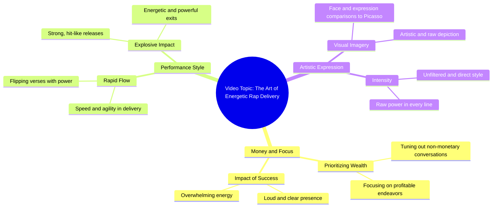

# Denim Pants Recommendation for Style and Fit

> 🌐 **Read this in:** **English** · [中文](../../zh-CN/2026-06/tiktok-transcript-foryou-fyp-pants-pantsrecommendation-denimpants-1fa7.md)

> **Creator:** [@milesmrls2](https://www.tiktok.com/@milesmrls2) · **Views:** 608.6K · **Posted:** 2026-06-20 · **Niche:** other
>
> **TL;DR:** The hook uses a conditional statement about money to immediately grab attention and set a confident, dismissive tone.

[Watch original video →](https://www.tiktok.com/@milesmrls2/video/7650604969803943188)

## Why This Went Viral

## Hook (first 3 seconds)
- **Verbatim opening line:** "Yeah, pag hindi to ko sa pera, yung usapang ba'y di ko marinig"
- **Hook pattern:** Contrast / Bold Claim — "If it's not about money, I can't hear the conversation"
- **Why it stops scrolling:** Instantly signals a high-stakes, money-focused mindset. The raw, confident delivery and Taglish code-switching create authenticity and relatability for a Filipino audience, making them curious about the speaker's success story.

## Emotional Rhythm
- **Beat 1 – Curiosity:** Opening line sparks "What's this about money?" intrigue.
- **Beat 2 – Tension:** "Kumikita na sa para, ang sagaran yung lakas ka mabingi" — builds intensity with loud, aggressive energy.
- **Beat 3 – Escalation:** "May dating malakas magtrip, paglabas pumotok naghit" — introduces explosive success imagery.
- **Beat 4 – Surprise/Twist:** "Mabugas sa mukha, kulat kano, malapaglo Picasso" — unexpected art reference (Picasso) elevates the boast from street-level to creative genius.
- **Climax:** "Panitok sinig lang kung magano" — final punchline lands with a mix of power and nonchalance, leaving viewers impressed or amused.

## Keyword Density
1. **"pera" (money)** – Algorithmic reach (high-search volume, financial ambition)
2. **"lakas" (strength/power)** – Emotional pull (confidence, dominance)
3. **"magtrip" / "trip"** – Emotional pull (playful, unpredictable energy)
4. **"pumotok" (explode)** – Emotional pull (viral sensation metaphor)
5. **"Picasso"** – Algorithmic reach (cultural reference, searchable name)
6. **"mabingi" (deafen)** – Emotional pull (sensory intensity, exaggeration)
7. **"ganito" (like this)** – Emotional pull (demonstrative, invites imitation)

*"Pera" and "Picasso" drive discoverability; "lakas," "pumotok," and "mabingi" fuel emotional engagement.*

## Why It Spreads
1. **Relatable hustle culture:** "Pag hindi to ko sa pera, yung usapang ba'y di ko marinig" — taps into the universal Filipino desire for financial success, making viewers feel seen.
2. **Unexpected sophistication:** The Picasso reference ("Mabugas sa mukha, kulat kano, malapaglo Picasso") elevates a street boast into an art metaphor, surprising viewers and making it shareable as "smart flex."
3. **High-energy delivery:** The rapid-fire, almost musical cadence ("May dating malakas magtrip, paglabas pumotok naghit") mimics a viral rap or beat, encouraging re-watches and remixes.
4. **Exaggerated sensory language:** "Lakas ka mabingi" and "pumotok naghit" create vivid, meme-able imagery that viewers can easily quote or remix.
5. **Cultural specificity:** Taglish + street slang + Picasso = a unique blend that feels both local and global, appealing to Filipino diaspora and hip-hop fans alike.

## What You Can Steal
1. **Start with a bold, money-related claim** — "If it's not about money, I can't hear you" instantly hooks viewers who want financial success. Use a direct, confident statement in your native language for authenticity.
2. **Mix street slang with an unexpected highbrow reference** — Drop a name like "Picasso" or "Einstein" in the middle of a boast to create surprise and intellectual appeal. It makes the content feel smarter and more shareable.
3. **Use explosive, sensory verbs** — Words like "pumotok" (explode), "mabingi" (deafen), and "naghit" (hit) create vivid mental images. Replace generic verbs ("I made money") with action-packed, almost violent ones ("I exploded the game").

## Mind Map

## Full Transcript (Generated by [the tool we used to generate this](https://toktranscript.com/?utm_source=github&utm_medium=breakdown&utm_campaign=tool_attribution))

> 📝 Transcripts on this page are auto-generated and show the first 60%. Want to transcribe any TikTok in 30 seconds and get the full version? [Try TokTranscript free →](https://toktranscript.com/?utm_source=github&utm_medium=breakdown&utm_campaign=transcript_cta)

Yeah, pag hindi to ko sa pera, yung usapang ba'y di ko marinig Kumikita na sa para, ang sagaran yung lakas ka mabingi Yeah, pag hindi to ko sa pera, yung usapang ba'y di ko marinig Yung puto maboy pagspeed, ganito pa

*[Read the full transcript on TokTranscript →](https://toktranscript.com/plaza/tiktok-transcript-foryou-fyp-pants-pantsrecommendation-denimpants-1fa7?utm_source=github&utm_medium=breakdown&utm_campaign=transcript_full)*

## Browse More

- All [other](../../by-niche/en/other.md) breakdowns
- All [conditional attention grabber](../../by-pattern/en/hook-conditional-attention-grabber.md) examples

## Video Info

| | |
|---|---|
| Creator | [@milesmrls2](https://www.tiktok.com/@milesmrls2) |
| Original video | [https://www.tiktok.com/@milesmrls2/video/7650604969803943188](https://www.tiktok.com/@milesmrls2/video/7650604969803943188) |
| Original title | #foryou #fypシ #pants #pantsrecommendation #denimpants  |
| Views | 608.6K (608600) |
| Posted | 2026-06-20 |
| Duration | 0s |
| Niche | `other` |
| Hook pattern | `conditional attention grabber` |
| Original language | `en` |
| Available languages | en, zh-CN |
| Generated | 2026-06-22 by [TokTranscript](https://toktranscript.com/) |

---

*This breakdown is for educational analysis under fair use. Original video © [@milesmrls2](https://www.tiktok.com/@milesmrls2). All transcripts are auto-generated and may contain errors.*

*Want to analyze your own TikToks like this? [free TikTok transcript generator →](https://toktranscript.com/viral-breakdown?utm_source=github&utm_medium=breakdown&utm_campaign=footer_cta)*