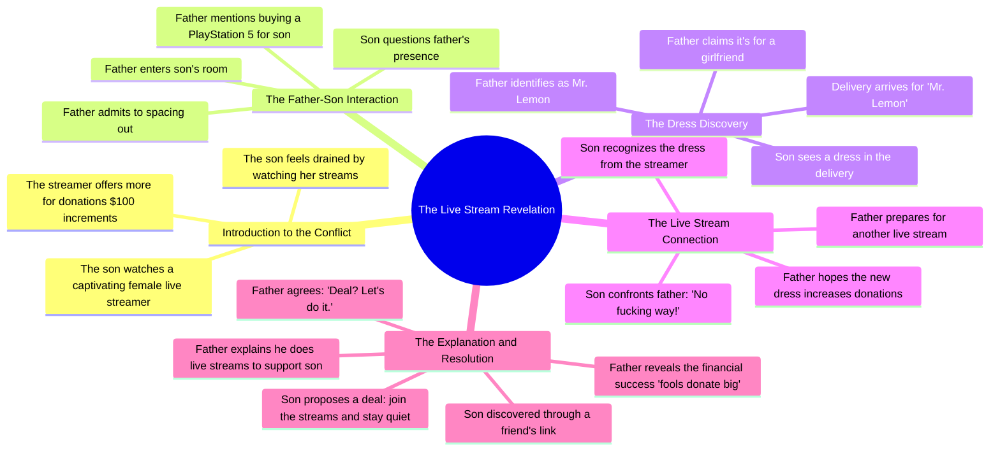

# Fruit Seller's Emotional AI Story

> 🌐 **Read this in:** **English** · [中文](../../zh-CN/2026-06/tiktok-transcript-fruits-fruit-ai-aistory-emotional-emotionalstory-56ca.md)

> **Creator:** [@newsusaword](https://www.tiktok.com/@newsusaword) · **Views:** 7.3M · **Posted:** 2026-06-25 · **Niche:** entertainment
>
> **TL;DR:** The promise of revealing more for donations hooks viewers with curiosity and a transactional tease.

[Watch original video →](https://www.tiktok.com/@newsusaword/video/7653120518261886240?is_from_webapp=1&sender_device=pc)

## Why This Went Viral

## Hook (first 3 seconds)
- **Verbatim opening line:** "Wow, that gorgeous girl drives me crazy."
- **Hook pattern:** Scene + emotional reaction (voyeuristic intrigue)
- **Why it stops scroll:** The line is ambiguous — is this a guy thirsting over a girl? It immediately creates a "what am I watching?" tension that demands context. The raw, confessional tone feels like eavesdropping on a private moment.

## Emotional Rhythm
- **Beat 1 — Curiosity / Tension:** Son watches a live stream of a "gorgeous girl" and admits addiction. Viewer thinks: *Is this a simp story?*
- **Beat 2 — Confusion / Suspense:** Dad walks in, son hides phone. Dad says he spaced out. Viewer senses something is off.
- **Beat 3 — Relief / Warmth:** Dad offers PS5 money. Son is thrilled. Tension drops.
- **Beat 4 — Twist / Shock:** Son sees the dress. Realizes "gorgeous girl" is his dad. Viewer's mental model shatters.
- **Beat 5 — Dark Comedy / Resonance:** Dad explains he does it to support son. Son says "fools donate big." They decide to team up. Climax: the reveal + the mutual corruption.
- **Climax moment:** "Wait, I know that dress, dad! No fucking way!" — the exact second the viewer's assumption flips.

## Keyword Density
- **"Live / live stream"** (6x) — algorithmic hook; platforms boost live content tags.
- **"Donations / donate"** (4x) — financial tension drives emotional pull; signals "money drama."
- **"Dad / father"** (5x) — core relationship anchor; drives family + betrayal resonance.
- **"Gorgeous girl / hottie"** (3x) — bait for initial attraction; creates the false premise.
- **"Support you / support"** (2x) — emotional payoff; reframes the dad's actions as sacrifice.
- **"Fools"** (1x) — cynical punch; makes the viewer feel smart for "getting" the scam.

**Algorithmic reach drivers:** "live stream," "donations."  
**Emotional pull drivers:** "dad," "support you," "fools."

## Why It Spreads
1. **The "Wait, what?" Twist** — The dress reveal flips the entire premise. Viewers rewatch to catch clues (the dad's "spaced out" line, the PS5 bribe). Shareability comes from the shock value. *Concrete line: "Wait, I know that dress, dad!"*
2. **Family Betrayal + Redemption Arc** — The son shames the dad, then immediately joins the scam. This creates a "forbidden bonding" moment that feels both wrong and wholesome. *Concrete line: "Let me join and I stay quiet. Deal?"*
3. **Cringe-Comedy of Male Vanity** — The dad dressing up as a "gorgeous girl" to scam lonely men is absurd. It triggers the "I can't believe this is real" reaction that drives comments and shares. *Concrete line: "I hope this new dress brings in more donations."*
4. **Open Loop for Sequel** — The son joining the scam sets up a "they're in it together" dynamic. Viewers want to see the next live stream. *Concrete line: "Let's do it."*
5. **Algorithmic Goldmine** — High retention (twist at ~60% of video), high emotional intensity (laughter + shock), and a clear "reaction bait" structure. *Concrete line: "Damn, that hottie is live again tonight."*

## What You Can Steal
1. **The "False Premise" Hook** — Start with a strong, relatable emotion (lust, frustration, addiction) that viewers assume is one thing, then reveal it's something completely different. Works for any niche — just swap "gorgeous girl" for your audience's surface-level desire.
2. **The "Double Twist" Structure** — First twist: the dad is the streamer. Second twist: the son joins. This creates two shareable "aha" moments. Map your video so the first twist lands at 30% and the second at 70%.
3. **The "Corruption as Bonding" Payoff** — End with a morally ambiguous resolution that feels satisfying but wrong. Viewers love sharing content that makes them feel like they're "in on the joke." Use a line like "Deal? Let's do it" to close the loop and invite a sequel.

## Mind Map

## Full Transcript (Generated by [TokTranscript](https://toktranscript.com/?utm_source=github&utm_medium=breakdown&utm_campaign=tool_attribution))

> 📝 Transcripts on this page are auto-generated and show the first 60%. Want to transcribe any TikTok in 30 seconds and get the full version? [Try TokTranscript free →](https://toktranscript.com/?utm_source=github&utm_medium=breakdown&utm_campaign=transcript_cta)

Wow, that gorgeous girl drives me crazy. For every $100 in donations, I'll show a little more. My loves. Damn, I need to stop watching her live streams. She completely wears me out. I can't do these live streams anymore. The important thing is they're making a lot of money. What are you doing here, son? I live here, dad, are you losing your mind? Haha, I just spaced out for a second. Son, I got the money to buy the PlayStation 5 you asked for. Son. Damn, dad, you're the best! Haha, can you get the door for me? Someone's there. Delivery for Mr. Lemon. Yes, he's my father. Dad, whose dress is that? It's for a girl I've been seeing.

*[Read the full transcript on TokTranscript →](https://toktranscript.com/plaza/tiktok-transcript-fruits-fruit-ai-aistory-emotional-emotionalstory-56ca?utm_source=github&utm_medium=breakdown&utm_campaign=transcript_full)*

## Browse More

- All [entertainment](../../by-niche/en/entertainment.md) breakdowns
- All [Curiosity gap + Incentive](../../by-pattern/en/hook-curiosity-gap-incentive.md) examples

## Video Info

| | |
|---|---|
| Creator | [@newsusaword](https://www.tiktok.com/@newsusaword) |
| Original video | [https://www.tiktok.com/@newsusaword/video/7653120518261886240?is_from_webapp=1&sender_device=pc](https://www.tiktok.com/@newsusaword/video/7653120518261886240?is_from_webapp=1&sender_device=pc) |
| Original title | #fruits #fruit #ai #aistory #emotional #emotionalstory  |
| Views | 7.3M (7300000) |
| Posted | 2026-06-25 |
| Duration | 0s |
| Niche | `entertainment` |
| Hook pattern | `Curiosity gap + Incentive` |
| Original language | `en` |
| Available languages | en, zh-CN |
| Generated | 2026-06-26 by [TokTranscript](https://toktranscript.com/) |

---

*This breakdown is for educational analysis under fair use. Original video © [@newsusaword](https://www.tiktok.com/@newsusaword). All transcripts are auto-generated and may contain errors.*

*Want to analyze your own TikToks like this? [try this transcription tool →](https://toktranscript.com/viral-breakdown?utm_source=github&utm_medium=breakdown&utm_campaign=footer_cta)*