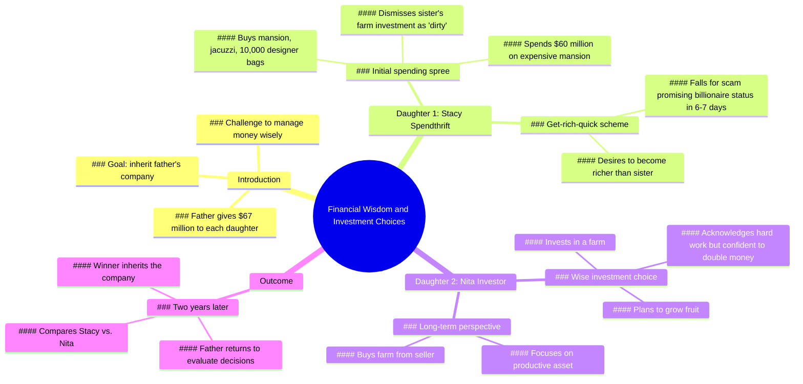

# Father Tests Daughters With $67 Million Each

> 🌐 **Read this in:** **English** · [中文](../../zh-CN/2026-06/tiktok-transcript-he-gave-the-money-to-his-daughters-as-a-test-storyline-fruit-e256.md)

> **Creator:** [@berry.boss.story](https://www.tiktok.com/@berry.boss.story) · **Views:** 2.3M · **Posted:** 2026-06-26 · **Niche:** entertainment
>
> **TL;DR:** The staggering amount of money immediately grabs attention and sets up a high-stakes scenario.

[Watch original video →](https://www.tiktok.com/@berry.boss.story/video/7655419430658198817?is_from_webapp=1&sender_device=pc)

## Why This Went Viral

## Hook (first 3 seconds)
- **Verbatim opening:** "My daughters, there are $67 million in each suitcase. $67 million?"
- **Hook pattern:** Numbers + bold claim (specific dollar amount immediately creates stakes)
- **Why it stops scroll:** The precise, massive number ($67 million) triggers instant curiosity and disbelief. The daughter’s echo question ("$67 million?") reinforces the absurdity, making viewers need to see what happens next.

## Emotional Rhythm
- **Beat 1 – Curiosity & Suspense:** Father gives each daughter $67M, sets up a test.
- **Beat 2 – Tension (Sister A):** Stacy chooses frivolous spending (mansion, jacuzzi, bags) → creates cringe/anticipation of failure.
- **Beat 3 – Contrast (Sister B):** Nita chooses a farm → unexpected wisdom, builds hope.
- **Beat 4 – Mockery & Tension:** Stacy laughs at Nita’s farm choice → viewer sympathy shifts, stakes rise.
- **Beat 5 – Twist & Climax:** "Two years have passed" → time jump reveals results. The winner inherits the company.
- **Beat 6 – Resolution:** Viewer is left guessing which sister won, creating a cliffhanger that drives comments.

## Keyword Density
- **"$67 million"** (5×) – Algorithmic reach: specific numbers trigger high CTR and retention.
- **"Money" / "richer"** (6×) – Emotional pull: universal desire for wealth.
- **"Farm"** (4×) – Emotional pull: underdog symbol (hard work vs. luxury).
- **"Sister"** (4×) – Emotional pull: sibling rivalry drives relatability.
- **"Winner" / "inherit"** (2×) – Algorithmic reach: competition-based keywords boost engagement.
- **"Hahaha!"** (3×) – Emotional pull: laugh track cues viewer to feel superior to Stacy.

## Why It Spreads
1. **High-stakes contrast drives engagement:** The father’s test (spend vs. invest) mirrors real-life financial debates. Viewers comment "Stacy is dumb" or "Nita is smart" — fueling argument-based virality.
2. **Cliffhanger ending forces re-watches and comments:** "Who won?" is never answered. Viewers must comment their guess or re-watch for clues, boosting retention and algorithm signals.
3. **Relatable sibling rivalry + exaggerated spending:** Stacy’s "10,000 designer bags" is absurdly specific, making it meme-worthy and shareable. Viewers tag friends: "This is us."
4. **Time jump creates narrative payoff:** "Two years later" is a classic story structure that rewards viewers who stayed, increasing watch time and completion rate.
5. **Layered audio hooks:** The "Hahaha!" laugh track after each line acts as a Pavlovian cue — viewers anticipate the next laugh, reducing drop-off.

## What You Can Steal
1. **Lead with a specific, shocking number:** Open with a precise dollar amount or statistic (e.g., "$67 million" not "a lot of money") to trigger immediate curiosity and stop the scroll.
2. **Use a "test" framework with two contrasting outcomes:** Set up a clear A vs. B scenario (spend vs. invest, smart vs. dumb) to spark debate in the comments — the algorithm loves polarization.
3. **End on a cliffhanger without resolution:** Never answer the central question in the video. Force viewers to comment their guess, re-watch, or share to get answers — this directly boosts virality metrics.

## Mind Map

## Full Transcript (Generated by [analyze your own TikToks](https://toktranscript.com/?utm_source=github&utm_medium=breakdown&utm_campaign=tool_attribution))

> 📝 Transcripts on this page are auto-generated and show the first 60%. Want to transcribe any TikTok in 30 seconds and get the full version? [Try TokTranscript free →](https://toktranscript.com/?utm_source=github&utm_medium=breakdown&utm_campaign=transcript_cta)

My daughters, there are $67 million in each suitcase. $67 million? Give it to me. Manage the money wisely. I want to see your results when I get back. Alright girl, what are you gonna do with the money? I will buy a mansion, a jacuzzi and 10,000 designer bags. Hahaha! Sir, I would like to invest my money in this farm. Sell it to me and I will grow plenty of fruit here. This farm is a lot of work. Young lady, are you sure about this? Yes sir. I will double my money. Alright then. You got it. I wanna buy this expensive 6 7 mansion. That would be $60 million. I don't care. I can afford everything I want. Hahaha!

*[Read the full transcript on TokTranscript →](https://toktranscript.com/plaza/tiktok-transcript-he-gave-the-money-to-his-daughters-as-a-test-storyline-fruit-e256?utm_source=github&utm_medium=breakdown&utm_campaign=transcript_full)*

## Browse More

- All [entertainment](../../by-niche/en/entertainment.md) breakdowns
- All [Shock and Awe](../../by-pattern/en/hook-shock-and-awe.md) examples

## Video Info

| | |
|---|---|
| Creator | [@berry.boss.story](https://www.tiktok.com/@berry.boss.story) |
| Original video | [https://www.tiktok.com/@berry.boss.story/video/7655419430658198817?is_from_webapp=1&sender_device=pc](https://www.tiktok.com/@berry.boss.story/video/7655419430658198817?is_from_webapp=1&sender_device=pc) |
| Original title | he gave the money to his daughters as a test #storyline #fruit #daugh... |
| Views | 2.3M (2300000) |
| Posted | 2026-06-26 |
| Duration | 0s |
| Niche | `entertainment` |
| Hook pattern | `Shock and Awe` |
| Original language | `en` |
| Available languages | en, zh-CN |
| Generated | 2026-06-27 by [TokTranscript](https://toktranscript.com/) |

---

*This breakdown is for educational analysis under fair use. Original video © [@berry.boss.story](https://www.tiktok.com/@berry.boss.story). All transcripts are auto-generated and may contain errors.*

*Want to analyze your own TikToks like this? [TokTranscript →](https://toktranscript.com/viral-breakdown?utm_source=github&utm_medium=breakdown&utm_campaign=footer_cta)*