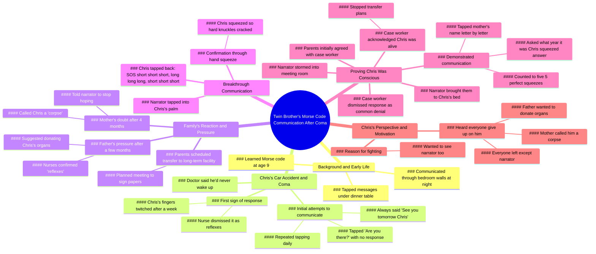

# He Tapped Back: Morse Code With Twin Brother After Accident

> 🌐 **Read this in:** **English** · [中文](../../zh-CN/2026-06/tiktok-transcript-he-tapped-back-3danimation-animationart-digitalart-ed-2eee.md)

> **Creator:** [@hisytstory](https://www.tiktok.com/@hisytstory) · **Views:** 50.6M · **Posted:** 2026-06-08 · **Niche:** entertainment
>
> **TL;DR:** Establishes an intimate, secret bond that becomes the emotional anchor for the entire story.

[Watch original video →](https://www.tiktok.com/@hisytstory/video/7628001000472775949)

## Why This Went Viral

## Hook (first 3 seconds)
- **Verbatim opening line:** "my twin brother Chris and I were 9 when we Learned Morse code"
- **Hook pattern:** Scene-setting + curiosity gap (Morse code as childhood secret)
- **Why it stops scrolling:** The word "twin" creates instant intrigue, and "Morse code" promises a unique, intimate story. The hook frames a shared secret language, making viewers lean in to see where it leads.

## Emotional Rhythm
1. **Nostalgia / warmth** (childhood Morse code games under the table)
2. **Dread / tension** (car accident, doctor says he'll never wake up)
3. **Desperation / hope** (tapping "are you there" → silence)
4. **Resilience** (daily taps, "see you tomorrow" ritual)
5. **False hope / gaslighting** (nurse, mom, dad dismiss reflexes as "corpse")
6. **Climax / relief** (SOS tap back → knuckle-cracking squeeze)
7. **Vindication** (storming meeting, proving Chris is alive)
8. **Emotional payoff** (Chris reveals he heard everyone give up except the narrator)
- **Climax moment:** "short short short long long long short short short SOS" — the first real response after weeks of doubt.

## Keyword Density
- **"tapped"** (12+ times) — drives algorithm: action verb, rhythmic, easy to caption.
- **"Chris"** (10+ times) — personal anchor, emotional pull.
- **"Morse code"** (6 times) — unique, searchable, curiosity-driving.
- **"reflexes"** (4 times) — creates tension, contrast with real response.
- **"corpse"** (2 times) — shocking, high-emotion word that triggers shareability.
- **"squeeze"** (4 times) — tactile, visceral, reinforces connection.
- **"donate"** (3 times) — stakes, moral dilemma, keeps viewers hooked.

**Algorithmic reach drivers:** "Morse code," "twin," "SOS," "car accident" — all searchable, high-CTR keywords.  
**Emotional pull drivers:** "corpse," "reflexes," "squeeze," "see you tomorrow" — create visceral, share-worthy moments.

## Why It Spreads
1. **Impossible odds + emotional payoff:** The doctor, nurses, parents all say "reflexes" — viewer is primed to root against authority. When Chris taps SOS, the relief is cathartic. *Transcript line: "short short short long long long short short short SOS"*  
2. **Underdog narrative with high stakes:** A 9-year-old boy vs. the entire medical system + his own family. *Line: "you're not donating my brother's organs"* — shows defiance that viewers love.  
3. **Cliffhanger structure:** Each paragraph ends with a mini-hook ("nothing," "reflexes," "corpse") that forces viewers to keep watching. *Line: "I don't care what the nurses say"* — builds tension.  
4. **Emotional twist at the end:** Chris reveals he heard everyone give up except the narrator — this reframes the entire story as a love story of loyalty. *Line: "heard all of them leave except you"* — triggers tears and shares.  
5. **Relatable secret language:** Morse code is a universal symbol of hidden connection. Viewers share because it makes them feel like they're in on a special bond. *Line: "tapped messages under the dinner table"* — nostalgic, aspirational.

## What You Can Steal
1. **Open with a "secret language" hook:** Start your video with a unique, intimate detail (a code, a ritual, a shared joke) that instantly makes viewers feel like insiders.  
2. **Use "they said" to build tension:** Repeat a dismissive phrase from authority figures ("reflexes," "corpse") to make the eventual victory sweeter. Each repetition raises stakes.  
3. **End with a character's emotional reveal:** Have the "victim" speak after the climax — Chris's final lines reframe the whole story as a testament to loyalty. This creates a shareable, tear-jerking punchline.

## Mind Map

## Full Transcript (Generated by [TokTranscript](https://toktranscript.com/?utm_source=github&utm_medium=breakdown&utm_campaign=tool_attribution))

> 📝 Transcripts on this page are auto-generated and show the first 60%. Want to transcribe any TikTok in 30 seconds and get the full version? [Try TokTranscript free →](https://toktranscript.com/?utm_source=github&utm_medium=breakdown&utm_campaign=transcript_cta)

my twin brother Chris and I were 9 when we Learned Morse code we tapped messages under the dinner table when mom told us to stop talking and tapped through the wall between our bedrooms every night when Chris got into a car accident and the doctor said he'd never wake up I pulled up a chair next to his bed took his hand and tapped are you there nothing but I came back the next afternoon and tapped again before I left I always said the same thing see you tomorrow Chris a week later Chris's fingers twitched against mine and I almost fell out of my chair I grabbed a nurse and she barely looked up their reflexes it doesn't mean anything I bought a notebook the next day and started writing down every single one 4 months in mom watched me scribbling and said how long are you gonna keep doing this until he taps back he's not gonna tap back you're talking to a corpse dad lasted a few more months before he pulled me into the hallway we need to talk about donating your brother's organs his fingers move every time I hold his hand dad the nurses said those are reflexes stop getting your hopes up son I don't care what the nurses say you're not donating my brother's organs but a week later my parents called to have Chris transferred to a long term facility to die and scheduled a meeting to sign the papers the afternoon before the meeting I tapped into his palm like always but this time 

*[Read the full transcript on TokTranscript →](https://toktranscript.com/plaza/tiktok-transcript-he-tapped-back-3danimation-animationart-digitalart-ed-2eee?utm_source=github&utm_medium=breakdown&utm_campaign=transcript_full)*

## Browse More

- All [entertainment](../../by-niche/en/entertainment.md) breakdowns
- All [Childhood secret code setup](../../by-pattern/en/hook-childhood-secret-code-setup.md) examples

## Video Info

| | |
|---|---|
| Creator | [@hisytstory](https://www.tiktok.com/@hisytstory) |
| Original video | [https://www.tiktok.com/@hisytstory/video/7628001000472775949](https://www.tiktok.com/@hisytstory/video/7628001000472775949) |
| Original title | He Tapped Back 💔 . 
 
 #3danimation, #animationart,
 #digitalart, #ed... |
| Views | 50.6M (50600000) |
| Posted | 2026-06-08 |
| Duration | 0s |
| Niche | `entertainment` |
| Hook pattern | `Childhood secret code setup` |
| Original language | `en` |
| Available languages | en, zh-CN |
| Generated | 2026-06-09 by [TokTranscript](https://toktranscript.com/) |

---

*This breakdown is for educational analysis under fair use. Original video © [@hisytstory](https://www.tiktok.com/@hisytstory). All transcripts are auto-generated and may contain errors.*

*Want to analyze your own TikToks like this? [try this transcription tool →](https://toktranscript.com/viral-breakdown?utm_source=github&utm_medium=breakdown&utm_campaign=footer_cta)*