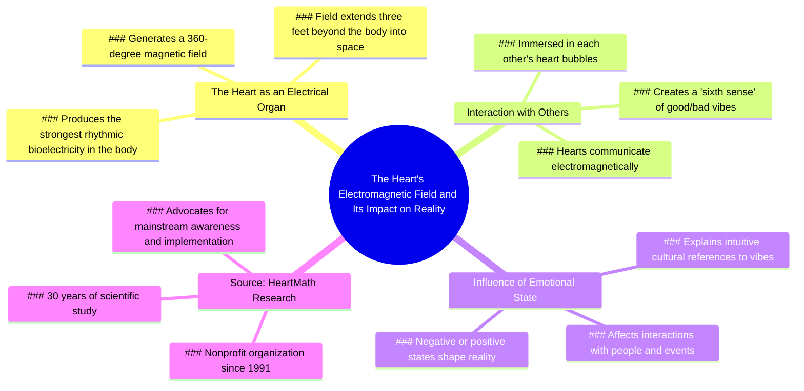

# Heart's Electrical Energy Explained

> 🌐 **Read this in:** **English** · [中文](../../zh-CN/2026-06/tiktok-transcript-heart-heartmath-fyp-mindblown-energy-loveislove-greenscreenv-cfb4.md)

> **Creator:** [@citizenscientist](https://www.tiktok.com/@citizenscientist) · **Views:** 7.7M · **Posted:** 2026-06-29 · **Niche:** other
>
> **TL;DR:** Opens with disbelief and repeated amazement to create an irresistible curiosity gap.

[Watch original video →](https://vm.tiktok.com/ZNRwm9e2c/)

## Why This Went Viral

## Hook (first 3 seconds)
- **Verbatim opening line:** "I literally do not understand how this is not mainstream household information."
- **Hook pattern:** Bold claim + emotional disbelief ("I literally do not understand")
- **Why it stops scrolling:** The line signals that the speaker has stumbled upon something *obviously* important that everyone else is missing. It triggers FOMO (fear of missing out) and intellectual curiosity — the viewer thinks, "What don't I know that I should?"

## Emotional Rhythm
- **Beat 1 – Curiosity + Disbelief:** "I literally do not understand…" — viewer is pulled in by the speaker's frustration and urgency.
- **Beat 2 – Setup + Tension:** "Just watch. Here's another interesting scientific fact." — promise of a reveal.
- **Beat 3 – Awe + Wonder:** "Your heart produces enough electrical energy to create a magnetic field… extending beyond the skin out into space." — the core "wow" moment.
- **Beat 4 – Resonance + Relatability:** "This is why our culture… refers to having good vibes and bad vibes." — bridges science to everyday language, creating cognitive ease.
- **Beat 5 – Connection + Belonging:** "We are immersed in a 360 spherical bubble in each other's heart bubbles." — evokes intimacy and shared experience.
- **Beat 6 – Urgency + Call to Action:** "We need it now more than ever." — emotional climax that frames the information as life-changing.
- **Climax moment:** The magnetic field extending "out into space" — a single, visceral image that rewires the viewer's sense of self.

## Keyword Density
| Word/Phrase | Frequency | Role |
|---|---|---|
| Heart | 5 | Emotional pull — taps into universal symbol of love, life, connection |
| Energy / electrical / magnetic / bioelectricity | 6 | Algorithmic reach — high-search science keywords (HeartMath, bioelectricity) |
| 360 degrees / sphere / bubble | 3 | Visual anchor — creates a memorable mental image |
| Good vibes / bad vibes | 2 | Emotional pull — everyday language that makes the science relatable |
| Radiates / extending / out into space | 3 | Algorithmic + emotional — "space" triggers curiosity; "radiates" feels poetic |
| HeartMath | 2 | Algorithmic reach — brand name drives search and credibility |
| We / our / each other | 5 | Emotional pull — pronouns create inclusion and community |

**Algorithmic drivers:** "heart," "energy," "magnetic," "HeartMath" — all are high-volume search terms that boost discoverability.  
**Emotional drivers:** "good vibes," "bad vibes," "we," "bubble" — these make the science feel personal and shareable.

## Why It Spreads
1. **The "Mind-Blown" Frame** — The speaker opens with "my mind is just blown over and over again," which primes the viewer for a dopamine hit. The promise of a revelation that *the speaker themselves* finds astonishing makes the content feel exclusive and urgent.  
   *Transcript line:* "Like, every time I review this information, like, my mind is just blown over and over again."

2. **The "Hidden Knowledge" Narrative** — By framing the science as "not mainstream household information," the video creates an in-group vs. out-group dynamic. Viewers who share it feel like they're delivering secret, valuable wisdom.  
   *Transcript line:* "I literally do not understand how this is not mainstream household information."

3. **The "Science Meets Spirituality" Bridge** — The video connects hard science (electrical organ, magnetic field) with everyday intuition ("good vibes," "sixth sense"). This appeals to both logic-driven and emotion-driven audiences, widening the potential share circle.  
   *Transcript line:* "We already can feel the sixth sense. Like literally electromagnetically, all our hearts are talking to one another."

4. **The "You Are Not Alone" Effect** — The visual of "360 spherical bubble" and "immersed in each other's heart bubbles" creates a sense of collective connection. In an era of loneliness, this message is deeply shareable — it offers belonging.  
   *Transcript line:* "We are immersed in a 360 spherical bubble in each other's heart bubbles all the time."

5. **The Credibility Anchor** — Mentioning "HeartMath," a nonprofit with 30 years of research, adds a layer of authority. This reduces skepticism and makes viewers more likely to share without fact-checking.  
   *Transcript line:* "This is work done by HeartMath. They are a nonprofit that has been doing this since 1991 for 30 years."

## What You Can Steal
1. **Open with a "This Should Be Obvious" Claim** — Start your video by expressing disbelief that something isn't common knowledge. This instantly creates curiosity and positions you as a revealer of hidden truths.  
   *Example:* "I genuinely don't understand why nobody talks about this — watch."

2. **Bridge Abstract Science to Everyday Language** — Take a complex concept (e.g., bioelectricity) and immediately translate it into a phrase your audience already uses ("good vibes"). This lowers the barrier to understanding and makes the content feel intuitive.  
   *Example:* "Your brain produces electrical signals — that's why we say someone has 'good energy.'"

3. **End with a Collective "We" Call to Action** — Instead of a generic "like and subscribe," frame your conclusion as a shared mission: "We need this now more than ever." This turns a passive viewer into an active believer who wants to spread the message.  
   *Example:* "This changes how we see each other — and we need that more than ever right now."

## Mind Map

## Full Transcript (Generated by [free TikTok transcript generator](https://toktranscript.com/?utm_source=github&utm_medium=breakdown&utm_campaign=tool_attribution))

> 📝 Transcripts on this page are auto-generated and show the first 60%. Want to transcribe any TikTok in 30 seconds and get the full version? [Try TokTranscript free →](https://toktranscript.com/?utm_source=github&utm_medium=breakdown&utm_campaign=transcript_cta)

I literally do not understand how this is not mainstream household information. Like, every time I review this information, like, my mind is just blown over and over again. Just watch. Here's another interesting scientific fact. The heart is an electrical organ, producing by far the strongest source of rhythmic bioelectricity. This energy goes to every cell in your body. Your heart produces enough electrical energy to create a magnetic field surrounding your body in 360 degrees, extending beyond the skin out into space. Measurable about three feet outside your body. So the moral of the story is our heart radiates out. Like this is why our culture constantly, naturally, intuitively refers to having good vibes and bad vibes. We already can feel the sixth sense.

*[Read the full transcript on TokTranscript →](https://toktranscript.com/plaza/tiktok-transcript-heart-heartmath-fyp-mindblown-energy-loveislove-greenscreenv-cfb4?utm_source=github&utm_medium=breakdown&utm_campaign=transcript_full)*

## Browse More

- All [other](../../by-niche/en/other.md) breakdowns
- All [Curiosity gap + personal astonishment](../../by-pattern/en/hook-curiosity-gap-personal-astonishment.md) examples

## Video Info

| | |
|---|---|
| Creator | [@citizenscientist](https://www.tiktok.com/@citizenscientist) |
| Original video | [https://vm.tiktok.com/ZNRwm9e2c/](https://vm.tiktok.com/ZNRwm9e2c/) |
| Original title | #Heart #Heartmath #fyp #mindblown #energy #loveislove #greenscreenvid... |
| Views | 7.7M (7700000) |
| Posted | 2026-06-29 |
| Duration | 0s |
| Niche | `other` |
| Hook pattern | `Curiosity gap + personal astonishment` |
| Original language | `en` |
| Available languages | en, zh-CN |
| Generated | 2026-06-30 by [TokTranscript](https://toktranscript.com/) |

---

*This breakdown is for educational analysis under fair use. Original video © [@citizenscientist](https://www.tiktok.com/@citizenscientist). All transcripts are auto-generated and may contain errors.*

*Want to analyze your own TikToks like this? [TokTranscript.com →](https://toktranscript.com/viral-breakdown?utm_source=github&utm_medium=breakdown&utm_campaign=footer_cta)*