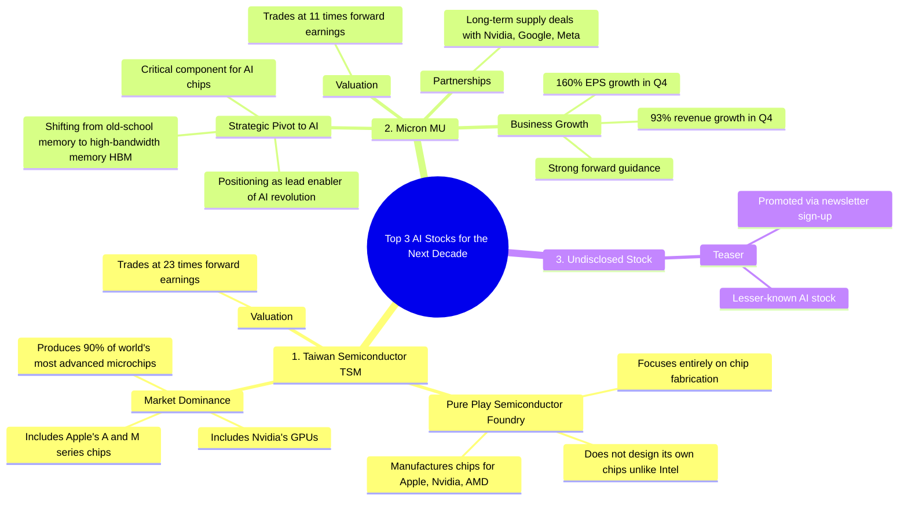

# Top 3 AI Stocks to Buy for the Next Decade

> 🌐 **Read this in:** **English** · [中文](../../zh-CN/2026-06/tiktok-transcript-here-are-the-top-3-a-i-stocks-to-buy-for-the-next-decade-acc-cbda.md)

> **Creator:** [@capital.growth](https://www.tiktok.com/@capital.growth) · **Views:** 1.5M · **Posted:** 2026-06-12 · **Niche:** finance
>
> **TL;DR:** The hook leverages authority and scarcity to promise exclusive, high-value stock picks.

[Watch original video →](https://www.tiktok.com/@capital.growth/video/7450979443658525958)

## Why This Went Viral

## Hook (first 3 seconds)
- "Here are the top three AI stocks to buy for the next decade according to Famous AI Stock Researcher, ticker symbol you."
- **Pattern:** Bold claim + name-drop authority + direct address ("ticker symbol you")
- **Why it stops scrolling:** The promise of exclusive, expert-backed picks for a massive time horizon ("next decade") creates high perceived value. The "ticker symbol you" twist personalizes it instantly, making viewers feel like they're being let in on a secret.

## Emotional Rhythm
1. **Curiosity (0-5s):** "Top three AI stocks... next decade" – opens with a high-stakes, time-sensitive promise.
2. **Trust/Authority (5-10s):** "Famous AI Stock Researcher" – names a credible source to lower skepticism.
3. **Relief/Exclusivity (10-15s):** "Stocks that haven't gotten as much attention as Nvidia" – hints at hidden gems, not obvious picks.
4. **Tension (15-30s):** Data dump on TSMC and Micron – fast facts, numbers, and competitive advantages build urgency.
5. **Suspense/Climax (30-35s):** "Finally, for the last stock, it's one that you've probably never heard of. So follow me and comment newsletter to find out what it is." – **cliffhanger** forces engagement.
- **Climax moment:** The final reveal is withheld, turning the video into a lead magnet.

## Keyword Density
- **AI** (8x) – algorithmic reach (trending topic)
- **Stocks** (5x) – financial intent keyword
- **Nvidia** (4x) – high-volume brand name for search
- **Chips** (3x) – technical term for authority
- **Forward earnings** (2x) – value signal for savvy investors
- **Revenue growth / EPS growth** (2x) – performance metrics
- **Follow me / comment newsletter** (2x) – direct calls to action for engagement

**Algorithmic drivers:** AI, stocks, Nvidia, chips (trending + high search volume)
**Emotional pull:** "you've probably never heard of," "best part," "remarkable comeback" (exclusivity, hope, turnaround story)

## Why It Spreads
1. **Cliffhanger with a clear CTA:** The final stock is hidden behind "follow me and comment newsletter." This forces viewers to engage (follow, comment) to unlock value, directly boosting algorithmic signals.
   - *Transcript line:* "So follow me and comment newsletter to find out what it is."
2. **Authority-by-association:** Name-dropping "Famous AI Stock Researcher" and "Nvidia" instantly builds credibility without needing to prove it.
   - *Transcript line:* "according to Famous AI Stock Researcher, ticker symbol you."
3. **Data density in short format:** Packs 3 stock pitches with concrete metrics (90% market share, 23x earnings, 93% revenue growth) into 35 seconds. This feels high-value and shareable to finance audiences.
   - *Transcript line:* "The company produces 90% of the world's most advanced microchips... trades at a valuation of 23 times forward earnings."
4. **Exclusivity loop:** "Stocks that haven't gotten as much attention" creates FOMO. Viewers share to be seen as early adopters.
   - *Transcript line:* "these stocks will be more so focused on the future of AI with stocks that haven't gotten as much attention as Nvidia."
5. **Pattern interrupt:** The "ticker symbol you" twist in the first 3 seconds is unexpected and personal, making viewers re-engage.
   - *Transcript line:* "ticker symbol you."

## What You Can Steal
1. **Open with a personal twist on a bold claim:** Instead of "Top 3 AI stocks," say "Top 3 AI stocks... for *you*." This turns a generic list into a direct address, increasing retention.
2. **Hide the best value behind a CTA:** Tease the most valuable piece (e.g., "the last one you've never heard of") and gate it behind a follow/comment. This turns a one-off view into a subscriber.
3. **Use a "data sandwich" structure:** Start with a hook, then 2-3 fast facts per item (market share, growth %, valuation), then end with a cliffhanger. No fluff, no transitions – just density. Viewers perceive high value and are more likely to save/share.

## Mind Map

## Full Transcript (Generated by [try this transcription tool](https://toktranscript.com/?utm_source=github&utm_medium=breakdown&utm_campaign=tool_attribution))

> 📝 Transcripts on this page are auto-generated and show the first 60%. Want to transcribe any TikTok in 30 seconds and get the full version? [Try TokTranscript free →](https://toktranscript.com/?utm_source=github&utm_medium=breakdown&utm_campaign=transcript_cta)

Here are the top three a I stocks to buy for the next decade according to Famous a I Stock Researcher, ticker symbol you. Although Nvidia is frequently talked about by his team, these stocks will be more so focused on the future of a I with stocks that haven't gotten as much attention as Nvidia. So at No. 1 we have Taiwan Semiconductor, ticker symbol TSM. TSMC is a pure play semiconductor foundry that manufactures chips for companies like Apple, Nvidia and AMD. And unlike Intel, it does not design its own chips which allows it to focus entirely on chip fabrication and serve multiple clients without competing with them. The company produces 90% of the world's most advanced microchips including Apple's a series and m series chips and Nvidia's GPUs. And the best part is that the stock trades at a valuation of 23 times forward earnings. The next stock on this list is Micron, ticker symbol MU.

*[Read the full transcript on TokTranscript →](https://toktranscript.com/plaza/tiktok-transcript-here-are-the-top-3-a-i-stocks-to-buy-for-the-next-decade-acc-cbda?utm_source=github&utm_medium=breakdown&utm_campaign=transcript_full)*

## Browse More

- All [finance](../../by-niche/en/finance.md) breakdowns
- All [List-based promise with authority](../../by-pattern/en/hook-list-based-promise-with-authority.md) examples

## Video Info

| | |
|---|---|
| Creator | [@capital.growth](https://www.tiktok.com/@capital.growth) |
| Original video | [https://www.tiktok.com/@capital.growth/video/7450979443658525958](https://www.tiktok.com/@capital.growth/video/7450979443658525958) |
| Original title | Here are the top 3 A.I. stocks to buy for the next decade according t... |
| Views | 1.5M (1500000) |
| Posted | 2026-06-12 |
| Duration | 0s |
| Niche | `finance` |
| Hook pattern | `List-based promise with authority` |
| Original language | `en` |
| Available languages | en, zh-CN |
| Generated | 2026-06-13 by [TokTranscript](https://toktranscript.com/) |

---

*This breakdown is for educational analysis under fair use. Original video © [@capital.growth](https://www.tiktok.com/@capital.growth). All transcripts are auto-generated and may contain errors.*

*Want to analyze your own TikToks like this? [TokTranscript.com →](https://toktranscript.com/viral-breakdown?utm_source=github&utm_medium=breakdown&utm_campaign=footer_cta)*