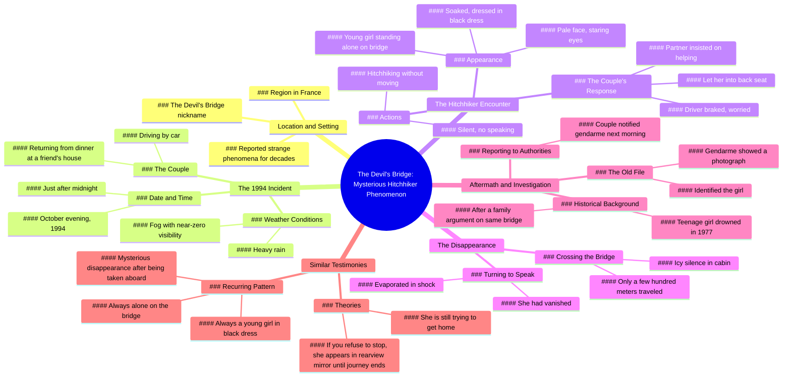

# The Devil's Bridge: Strange Phenomena in France Since 1994

> 🌐 **Read this in:** **English** · [中文](../../zh-CN/2026-06/tiktok-transcript-horreurtiktok-horreur-histoire-histoirevrai-urbanlegends-fyp-a88e.md)

> **Creator:** [@murmuresdelarealite](https://www.tiktok.com/@murmuresdelarealite) · **Views:** 804.4K · **Posted:** 2026-06-11 · **Niche:** entertainment
>
> **TL;DR:** Opens with a cryptic location and supernatural claim to immediately hook curiosity.

[Watch original video →](https://www.tiktok.com/@murmuresdelarealite/video/7533949785363991830?lang=fr)

## Why This Went Viral

## Hook (first 3 seconds)
- **Verbatim opening line:** "Did you know that in France, in the region of, there is an old bridge, nicknamed the bridge of the devil, where strange phenomena have been reported for decades."
- **Hook pattern:** Question + scene-setting (specific location + eerie nickname)
- **Why it stops scrolling:** The phrase "bridge of the devil" creates instant intrigue and a promise of supernatural content. The question "Did you know" triggers curiosity gap — viewers need to know what happens next.

## Emotional Rhythm
- **Beat 1 — Curiosity:** "Did you know…" opens a knowledge gap.
- **Beat 2 — Tension:** "Strange phenomena…" builds anticipation.
- **Beat 3 — Suspense:** The couple driving in rain/fog, zero visibility.
- **Beat 4 — Shock:** "She had disappeared, as if it had evaporated."
- **Beat 5 — Horror twist:** Gendarme shows photo of a girl who drowned 17 years prior.
- **Beat 6 — Lingering dread:** "Some say she is still looking to get home… if you refuse, you see it in your rearview mirror."
- **Climax:** The photo reveal — "It was her."

## Keyword Density
| Strongest repeated words/phrases | Why they matter |
|----------------------------------|-----------------|
| Bridge / bridge of the devil | Algorithmic reach (location + supernatural niche) |
| Young girl / black dress | Emotional pull (vulnerability + visual imagery) |
| Disappeared / evaporated | High emotional resonance (mystery + fear) |
| Gendarme / file / photo | Authority + credibility boost |
| Hitchhiking / rearview mirror | Relatable horror trope (driving alone at night) |
| October / midnight / fog | Sensory triggers (time + weather = high tension) |

## Why It Spreads
1. **Universal fear hook** — "Hitchhiker who vanishes" is a cross-cultural urban legend. The specific French location makes it feel real but not local to any single viewer.
2. **Visual cliffhanger** — The "rearview mirror" ending is a perfect shareable image. Viewers will text friends: "Never pick up a hitchhiker in France."
3. **Authority twist** — The gendarme pulling out an old file adds credibility. It transforms a campfire story into a "true crime" case.
4. **Emotional rollercoaster** — The video compresses curiosity → tension → shock → dread into under 90 seconds. High retention = algorithm boost.
5. **Open-ended threat** — "If you refuse, you see it in your rearview mirror" creates a lingering mental image. Viewers re-share to warn others.

## What You Can Steal
1. **Start with a question + location** — "Did you know that in [specific place]…" instantly builds trust and curiosity. Avoid vague openings.
2. **Use sensory weather details** — "Rain was falling hard, fog made visibility almost zero." Specific weather = immersion. Copy this for any horror/mystery video.
3. **End with a "what happens if you don't" threat** — "If you refuse, you see it in your rearview mirror." This creates shareable fear. Always give the viewer a personal stake in the story.

## Mind Map

## Full Transcript (Generated by [TokTranscript](https://toktranscript.com/?utm_source=github&utm_medium=breakdown&utm_campaign=tool_attribution))

> 📝 Transcripts on this page are auto-generated and show the first 60%. Want to transcribe any TikTok in 30 seconds and get the full version? [Try TokTranscript free →](https://toktranscript.com/?utm_source=github&utm_medium=breakdown&utm_campaign=transcript_cta)

Did you know that in France, in the region of, there is an old bridge, nicknamed the bridge of the devil, where strange phenomena have been reported for decades. It is said that one evening in October mille-neuf-cent-quatre-vingt-quatorze, a couple was crossing this bridge by car after having dinner at a friend's house. It was a little over midnight, the rain was falling hard and the fog made visibility almost zero. As they moved slowly, they saw a young girl standing alone on the bridge, soaked, dressed in a black dress. She was hitchhiking without moving. The driver braked, worried. His partner told him, we can't leave her like that. They got him in the back. She was not saying anything, the pale face, the eyes staring at the darkness. There was an icy silence in the cabin. After crossing the bridge just a few hundred meters away, they turned around to talk to him. She had disappeared, as if it had evaporated in shock.

*[Read the full transcript on TokTranscript →](https://toktranscript.com/plaza/tiktok-transcript-horreurtiktok-horreur-histoire-histoirevrai-urbanlegends-fyp-a88e?utm_source=github&utm_medium=breakdown&utm_campaign=transcript_full)*

## Browse More

- All [entertainment](../../by-niche/en/entertainment.md) breakdowns
- All [Mystery/Curiosity Gap](../../by-pattern/en/hook-mystery-curiosity-gap.md) examples

## Video Info

| | |
|---|---|
| Creator | [@murmuresdelarealite](https://www.tiktok.com/@murmuresdelarealite) |
| Original video | [https://www.tiktok.com/@murmuresdelarealite/video/7533949785363991830?lang=fr](https://www.tiktok.com/@murmuresdelarealite/video/7533949785363991830?lang=fr) |
| Original title | #horreurtiktok #horreur #histoire #histoirevrai #urbanlegends #fyp #p... |
| Views | 804.4K (804400) |
| Posted | 2026-06-11 |
| Duration | 0s |
| Niche | `entertainment` |
| Hook pattern | `Mystery/Curiosity Gap` |
| Original language | `en` |
| Available languages | en, zh-CN |
| Generated | 2026-06-12 by [TokTranscript](https://toktranscript.com/) |

---

*This breakdown is for educational analysis under fair use. Original video © [@murmuresdelarealite](https://www.tiktok.com/@murmuresdelarealite). All transcripts are auto-generated and may contain errors.*

*Want to analyze your own TikToks like this? [analyze your own TikToks →](https://toktranscript.com/viral-breakdown?utm_source=github&utm_medium=breakdown&utm_campaign=footer_cta)*