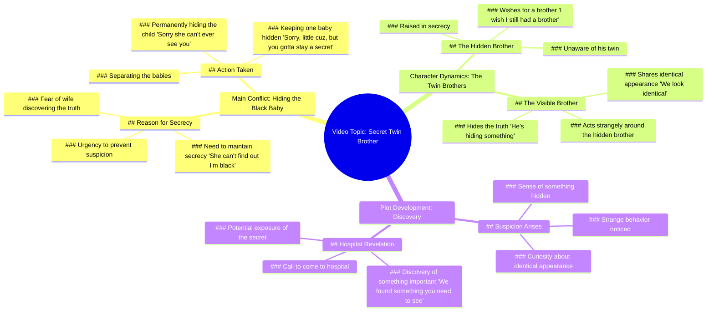

# Hiding Baby Secret From Wife

> 🌐 **Read this in:** **English** · [中文](../../zh-CN/2026-06/tiktok-transcript-how-long-can-he-keep-little-cuh-a-secret-fruitstory-aistory-ee2e.md)

> **Creator:** [@aihoodfruit](https://www.tiktok.com/@aihoodfruit) · **Views:** 1.1M · **Posted:** 2026-06-26 · **Niche:** entertainment
>
> **TL;DR:** The hook immediately creates intrigue and humor by suggesting a secret identity, drawing viewers in.

[Watch original video →](https://www.tiktok.com/@aihoodfruit/video/7654821998513736991?is_from_webapp=1&sender_device=pc)

## Why This Went Viral

## Hook (first 3 seconds)
- **Verbatim opening line:** "I have to hurry. She can't find out I'm black, CUH."
- **Hook pattern:** Bold claim + contrast (black vs. implied non-black) + slang ("CUH" as a recurring identity marker)
- **Why it stops scrolling:** The line is immediately disorienting—a character in a hurry, a secret about race, and a slang term that feels both intimate and coded. The contradiction (black vs. "she can't find out") triggers instant curiosity: *Why is this a secret?*

## Emotional Rhythm
- **Beat 1 (0–3s): Curiosity + Tension** — "I have to hurry. She can't find out I'm black." The viewer is dropped into a high-stakes secret.
- **Beat 2 (3–8s): Confusion + Suspense** — "Where my wife at? She just gave birth. Why is one baby black?" The twist lands: a black baby born to a non-black couple. Viewer leans in.
- **Beat 3 (8–15s): Emotional Drop (Resonance)** — "Sorry, little cuz, but you gotta stay a secret." The secret is heartbreaking—a baby hidden.
- **Beat 4 (15–22s): Twist + Relief (False)** — "Happy birthday, little cuh. I wish I still had a brother." The wish reframes the secret as a lost sibling. Viewer feels a gut-punch.
- **Beat 5 (22–30s): Suspense Builds Again** — "He's hiding something. I can sense it." The brother character becomes suspicious, raising stakes.
- **Beat 6 (30–35s): Climax** — "You need to come into the hospital. We found something you need to see." Open-ended cliffhanger—viewer is left with unresolved mystery.
- **Climax moment:** The hospital call at 30s. It recontextualizes the whole story as a medical/genetic reveal, not just a social secret.

## Keyword Density
| Keyword/Phrase | Frequency | Role |
|----------------|-----------|------|
| "CUH" / "cuh" / "kuh" | 8 | **Emotional pull** — slang creates in-group identity and rhythmic hook. Drives shareability (people repeat it). |
| "black" | 3 | **Algorithmic reach** — race-related content triggers high engagement (both positive and controversial). Also emotional pull (identity). |
| "secret" / "hide" / "hiding" | 3 | **Emotional pull** — universal tension driver. Makes viewer feel complicit. |
| "brother" | 3 | **Emotional pull** — family bond, loss, longing. |
| "wish" | 2 | **Emotional pull** — hope + tragedy (the wish is for a brother who is already dead/hidden). |
| "hospital" | 2 | **Algorithmic reach** — medical/genetic twist triggers curiosity and "what happens next" clicks. |
| "identical" | 1 | **Algorithmic reach** — triggers "twins" and "DNA" search queries. |

**Why it works:** "CUH" is the viral glue—it's a unique, repeatable sound that becomes a meme. "Black" + "secret" + "brother" + "hospital" create a high-tension, high-curiosity cocktail that both the algorithm (controversy + medical drama) and human psychology (mystery + family) reward.

## Why It Spreads
1. **The "CUH" catchphrase is a shareable sound.** Every line ends with "cuh" or "kuh," making it easy to quote, remix, or parody. Viewers repeat it in comments, which boosts algorithmic signals.
2. **The race-based secret is a high-engagement trigger.** The line "She can't find out I'm black" is provocative but not overtly offensive—it invites debate ("Is this a joke? A drama? A satire?") without being hateful. That ambiguity drives comments and shares.
3. **The twist (hidden brother → hospital call) creates a cliffhanger.** The video ends without resolution. Viewers are forced to comment "Part 2?" or "What's in the hospital?" This boosts watch time and completion rate for the next video.
4. **The emotional rollercoaster is compressed into 35 seconds.** Curiosity → confusion → sadness → hope → suspense → cliffhanger. Each beat is short enough to keep retention high, but varied enough to feel like a mini-movie.
5. **The "identical" line at 26s is a late-stage hook.** "We look identical" recontextualizes the entire story—now it's about twins, not just a black baby. This forces re-watches and re-evaluation, which increases total watch time.

## What You Can Steal
1. **Build a signature catchphrase into the first 3 seconds.** "CUH" isn't just slang—it's a branded sound. Pick a word or phrase that is unique, repeatable, and can be used in every line. It becomes the video's "earworm."
2. **Use a "false resolution" to reset tension.** The birthday wish ("I wish I still had a brother") feels like a sad ending, but then the suspicion and hospital call reopen the story. Don't let the emotional peak be the end—leave a loose thread.
3. **End on a question or cliffhanger that forces a comment.** The hospital call is a perfect example: it's a direct invitation for viewers to ask "What did they find?" or "Is he the twin?" Always end with an open loop that only the next video (or a comment reply) can close.

## Mind Map

## Full Transcript (Generated by [try this transcription tool](https://toktranscript.com/?utm_source=github&utm_medium=breakdown&utm_campaign=tool_attribution))

> 📝 Transcripts on this page are auto-generated and show the first 60%. Want to transcribe any TikTok in 30 seconds and get the full version? [Try TokTranscript free →](https://toktranscript.com/?utm_source=github&utm_medium=breakdown&utm_campaign=transcript_cta)

I have to hurry. She can't find out I'm black, CUH. I need to get there before she notices and gets suspicious, CUH. Where my wife at, CUH? She just gave birth. Why is one baby black, cuz? I gotta take care of this. Sorry she can't ever see you, little cuz. Sorry, little cuz, but you gotta stay a secret. Happy birthday, little cuh. Make a big wish. What do you wish for? I wish. I wish I still had a brother. What a strange little wish. You don't have a brother. Uh, uh.

*[Read the full transcript on TokTranscript →](https://toktranscript.com/plaza/tiktok-transcript-how-long-can-he-keep-little-cuh-a-secret-fruitstory-aistory-ee2e?utm_source=github&utm_medium=breakdown&utm_campaign=transcript_full)*

## Browse More

- All [entertainment](../../by-niche/en/entertainment.md) breakdowns
- All [Misdirection / Unexpected Reveal](../../by-pattern/en/hook-misdirection-unexpected-reveal.md) examples

## Video Info

| | |
|---|---|
| Creator | [@aihoodfruit](https://www.tiktok.com/@aihoodfruit) |
| Original video | [https://www.tiktok.com/@aihoodfruit/video/7654821998513736991?is_from_webapp=1&sender_device=pc](https://www.tiktok.com/@aihoodfruit/video/7654821998513736991?is_from_webapp=1&sender_device=pc) |
| Original title | how long can he keep little cuh a secret #fruitstory #aistory #aifrui... |
| Views | 1.1M (1100000) |
| Posted | 2026-06-26 |
| Duration | 0s |
| Niche | `entertainment` |
| Hook pattern | `Misdirection / Unexpected Reveal` |
| Original language | `en` |
| Available languages | en, zh-CN |
| Generated | 2026-06-27 by [TokTranscript](https://toktranscript.com/) |

---

*This breakdown is for educational analysis under fair use. Original video © [@aihoodfruit](https://www.tiktok.com/@aihoodfruit). All transcripts are auto-generated and may contain errors.*

*Want to analyze your own TikToks like this? [TokTranscript →](https://toktranscript.com/viral-breakdown?utm_source=github&utm_medium=breakdown&utm_campaign=footer_cta)*