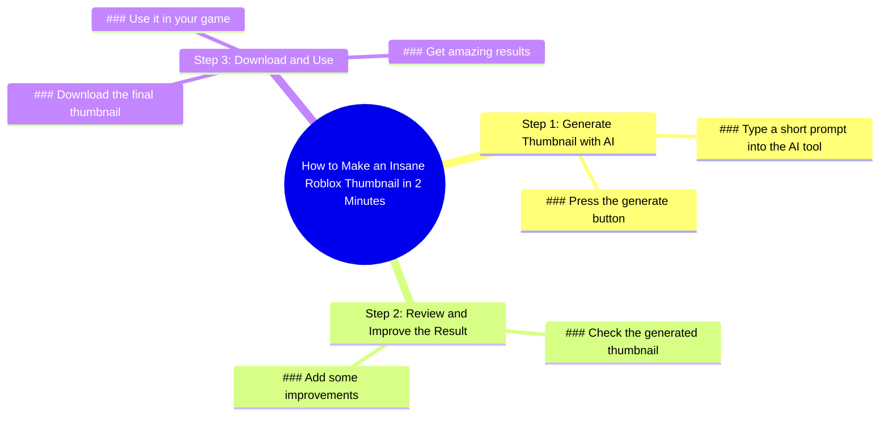

# How to Make Roblox Thumbnails for Your Game Easily

> 🌐 **Read this in:** **English** · [中文](../../zh-CN/2026-06/tiktok-transcript-how-to-make-roblox-thumbnails-for-your-game-easily-robloxdev-1a53.md)

> **Creator:** [@dminer_rbx](https://www.tiktok.com/@dminer_rbx) · **Views:** 124.1K · **Posted:** 2026-06-07 · **Niche:** other
>
> **TL;DR:** Promises a fast, impressive result to hook viewers interested in Roblox content creation.

[Watch original video →](https://vt.tiktok.com/ZSQjXQHtR/)

## Why This Went Viral

## Hook (first 3 seconds)
- **Verbatim opening line:** "here's how I made this insane Roblox thumbnail in 2 minutes"
- **Hook pattern:** Bold claim + numbers + scene (showing the thumbnail)
- **Why it stops scrolling:** The word "insane" creates immediate intrigue, the 2-minute time promise taps into efficiency desire, and the specific Roblox context targets a highly engaged niche audience. The visual of the thumbnail itself acts as proof-of-concept before the claim is even finished.

## Emotional Rhythm
1. **Curiosity** (0–3s) — "here's how I made this insane Roblox thumbnail" triggers "how is that possible?"
2. **Anticipation** (3–6s) — "type short prompt into this AI tool" builds step-by-step expectation
3. **Satisfaction** (6–9s) — "press generate button / check the result" delivers the payoff
4. **Resonance** (9–12s) — "add some improvements" acknowledges the audience's desire for customization
5. **Aspiration** (12–15s) — "download it to use in your game and get amazing results" creates a future-self vision

**Climax moment:** "check the result" — the split-second where the AI output is revealed, satisfying the curiosity built in the hook.

## Keyword Density
- **"Roblox"** (2x) — Algorithmic reach: targets the massive Roblox creator community
- **"thumbnail"** (2x) — Algorithmic + emotional: high-search-volume term for creators
- **"AI tool"** (1x) — Algorithmic: trending tech keyword
- **"2 minutes"** (1x) — Emotional: speed promise triggers urgency
- **"insane"** (1x) — Emotional: hyperbole creates curiosity gap
- **"amazing results"** (1x) — Emotional: aspirational payoff
- **"your game"** (1x) — Emotional: personalization hook

**Algorithmic drivers:** Roblox, thumbnail, AI tool — these are high-search-volume, niche-specific terms that feed YouTube/TikTok recommendation algorithms.

**Emotional pull:** insane, amazing, your game — these create desire, personalization, and status signaling within the Roblox creator community.

## Why It Spreads
1. **Speed-to-value promise** — "2 minutes" is specific and believable. Creators know thumbnails take 20+ minutes manually. This 90% time reduction creates immediate share impulse. *Transcript evidence: "in 2 minutes"*

2. **Zero-skill barrier** — "type short prompt into this AI tool and press generate button" removes all technical friction. Any Roblox creator can replicate this, making it highly shareable within friend groups. *Transcript evidence: "type short prompt"*

3. **Immediate visual proof** — The thumbnail itself is shown in the first frame. Viewers don't need to imagine the result — they see it. This builds instant credibility and reduces skepticism. *Transcript evidence: "this insane Roblox thumbnail" (shown while spoken)*

4. **Customization layer** — "add some improvements" signals the AI output isn't final. This addresses the common fear that AI looks generic, making the workflow feel authentic and adaptable. *Transcript evidence: "add some improvements"*

5. **Direct utility call** — "download it to use in your game" creates a clear next step. The video isn't just interesting — it's immediately actionable. *Transcript evidence: "download it to use in your game"*

## What You Can Steal
1. **The "speed + specificity" hook formula** — Open with a specific time (2 minutes) + a tangible outcome (Roblox thumbnail). Avoid vague promises like "make money fast." Use concrete numbers and niche-specific objects.

2. **The 3-step frictionless workflow** — Structure your tutorial as: Input → Action → Result. No fluff, no setup, no backstory. "Type prompt → press button → check result" is a pattern that works for any AI tool.

3. **The "personalize the generic" twist** — After showing the AI output, add one sentence about customization ("add some improvements"). This signals you're not just a prompt-paster — you're a creator who adds value. Apply this to any automation content.

## Mind Map

## Full Transcript (Generated by [analyze your own TikToks](https://toktranscript.com/?utm_source=github&utm_medium=breakdown&utm_campaign=tool_attribution))

> 📝 Transcripts on this page are auto-generated and show the first 60%. Want to transcribe any TikTok in 30 seconds and get the full version? [Try TokTranscript free →](https://toktranscript.com/?utm_source=github&utm_medium=breakdown&utm_campaign=transcript_cta)

here's how I made this insane Roblox thumbnail in 2 minutes type short prompt into this AI tool and press generate button check the 

*[Read the full transcript on TokTranscript →](https://toktranscript.com/plaza/tiktok-transcript-how-to-make-roblox-thumbnails-for-your-game-easily-robloxdev-1a53?utm_source=github&utm_medium=breakdown&utm_campaign=transcript_full)*

## Browse More

- All [other](../../by-niche/en/other.md) breakdowns
- All [Speed/Result Promise](../../by-pattern/en/hook-speed-result-promise.md) examples

## Video Info

| | |
|---|---|
| Creator | [@dminer_rbx](https://www.tiktok.com/@dminer_rbx) |
| Original video | [https://vt.tiktok.com/ZSQjXQHtR/](https://vt.tiktok.com/ZSQjXQHtR/) |
| Original title | How to make roblox thumbnails for your game easily #robloxdeveloper #... |
| Views | 124.1K (124100) |
| Posted | 2026-06-07 |
| Duration | 0s |
| Niche | `other` |
| Hook pattern | `Speed/Result Promise` |
| Original language | `en` |
| Available languages | en, zh-CN |
| Generated | 2026-06-08 by [TokTranscript](https://toktranscript.com/) |

---

*This breakdown is for educational analysis under fair use. Original video © [@dminer_rbx](https://www.tiktok.com/@dminer_rbx). All transcripts are auto-generated and may contain errors.*

*Want to analyze your own TikToks like this? [free TikTok transcript generator →](https://toktranscript.com/viral-breakdown?utm_source=github&utm_medium=breakdown&utm_campaign=footer_cta)*