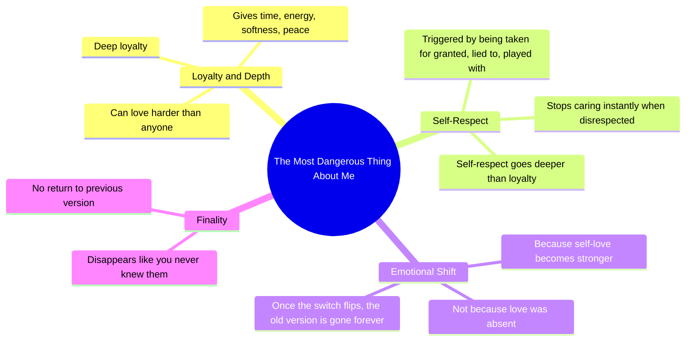

# Loving Harder While Protecting Self-Respect

> 🌐 **Read this in:** **English** · [中文](../../zh-CN/2026-06/tiktok-transcript-i-can-love-you-harder-than-you-ever-been-loved-motivetion-mo-4a6b.md)

> **Creator:** [@motivationme5](https://www.tiktok.com/@motivationme5) · **Views:** 1.7M · **Posted:** 2026-06-13 · **Niche:** other
>
> **TL;DR:** Opens with a provocative, paradoxical statement that challenges expectations and hooks curiosity.

[Watch original video →](https://vm.tiktok.com/ZNRcHA73k/)

## Why This Went Viral

## Hook (first 3 seconds)
- **Verbatim opening:** "The most dangerous thing about me."
- **Hook pattern:** Bold claim / Intrigue gap ("dangerous" creates immediate tension)
- **Why it stops scrolling:** The word "dangerous" subverts expectations — this isn't a threat, it's emotional power. Viewers freeze to learn what makes her dangerous, not physically but psychologically.

## Emotional Rhythm
- **Beat 1 — Curiosity:** "The most dangerous thing about me" (mystery)
- **Beat 2 — Tension:** "I can love you harder... and disappear like you never knew me" (contradiction creates suspense)
- **Beat 3 — Resonance:** "My loyalty is deep. But my self respect goes deeper" (validation for those who've been hurt)
- **Beat 4 — Climax:** "The second I feel taken for granted... I stop caring instantly" (emotional release — the "switch flip")
- **Beat 5 — Finality:** "You will never get the same version of me again" (closure + power shift)
- **Twist:** The "danger" is not aggression but self-love — a reversal of victimhood into agency.

## Keyword Density
| Keyword/Phrase | Frequency | Drive |
|---|---|---|
| dangerous / danger | 2 | Algorithmic intrigue + emotional pull |
| love / loved / loving | 4 | Emotional resonance (core hook) |
| self respect / love myself | 3 | Identity + relatability (viral trigger) |
| disappear / stop caring | 2 | Tension + release (emotional rhythm) |
| taken for granted / lied to / played with | 3 | Relatability (shared pain) |
| switch flips / same version of me | 2 | Memorable metaphor (shareable) |

- **Algorithmic drivers:** "dangerous," "disappear," "switch flips" — high CTR keywords that trigger curiosity and emotional tagging.
- **Emotional pull drivers:** "self respect," "love myself," "taken for granted" — words that trigger identification and validation.

## Why It Spreads
1. **Universal pain point + empowerment resolution** — "Taken for granted" is a near-universal experience. The video transforms victimhood into power, making it instantly shareable among anyone who's felt undervalued.
2. **Contrast structure creates memorability** — "Loyalty deep / self respect deeper" is a clean, quotable opposition. Viewers screenshot or quote this line as a personal mantra.
3. **The "switch flip" metaphor is visual and sticky** — It's a simple, cinematic image (a switch) that viewers can replay in their minds. Metaphors boost retention and sharing.
4. **Emotional arc mirrors a breakup narrative** — The video feels like a breakup speech without naming a specific person. This ambiguity lets viewers project their own story, maximizing relatability.
5. **Final line is a threat with no malice** — "You will never get the same version of me again" is a clean mic-drop. It feels like a boundary-setting declaration, which resonates deeply with audiences reclaiming self-worth.

## What You Can Steal
1. **Open with a subversive label** — Use a word like "dangerous," "scary," or "toxic" to describe something positive about yourself. The contrast creates instant curiosity.
2. **Build a "this, but this" loyalty hierarchy** — State two opposing values (e.g., "I forgive deeply, but I trust slowly") to create tension and resolution in one sentence.
3. **End with a boundary statement that's final, not angry** — Close with a line that feels like a door closing softly, not slamming. "You will never get the same version of me again" is calm, final, and empowering — not bitter.

## Mind Map

## Full Transcript (Generated by [try this transcription tool](https://toktranscript.com/?utm_source=github&utm_medium=breakdown&utm_campaign=tool_attribution))

> 📝 Transcripts on this page are auto-generated and show the first 60%. Want to transcribe any TikTok in 30 seconds and get the full version? [Try TokTranscript free →](https://toktranscript.com/?utm_source=github&utm_medium=breakdown&utm_campaign=transcript_cta)

The most dangerous thing about me. I can love you harder than anyone ever has. And disappear like you never knew me. Yeah, because my loyalty is deep. But my self respect goes deeper. I will give you my time, my energy, my softness, my peace.

*[Read the full transcript on TokTranscript →](https://toktranscript.com/plaza/tiktok-transcript-i-can-love-you-harder-than-you-ever-been-loved-motivetion-mo-4a6b?utm_source=github&utm_medium=breakdown&utm_campaign=transcript_full)*

## Browse More

- All [other](../../by-niche/en/other.md) breakdowns
- All [Contrast & Paradox](../../by-pattern/en/hook-contrast-paradox.md) examples

## Video Info

| | |
|---|---|
| Creator | [@motivationme5](https://www.tiktok.com/@motivationme5) |
| Original video | [https://vm.tiktok.com/ZNRcHA73k/](https://vm.tiktok.com/ZNRcHA73k/) |
| Original title | I can love you harder than you ever been Loved !!! #motivetion #motiv... |
| Views | 1.7M (1700000) |
| Posted | 2026-06-13 |
| Duration | 0s |
| Niche | `other` |
| Hook pattern | `Contrast & Paradox` |
| Original language | `en` |
| Available languages | en, zh-CN |
| Generated | 2026-06-14 by [TokTranscript](https://toktranscript.com/) |

---

*This breakdown is for educational analysis under fair use. Original video © [@motivationme5](https://www.tiktok.com/@motivationme5). All transcripts are auto-generated and may contain errors.*

*Want to analyze your own TikToks like this? [free TikTok transcript generator →](https://toktranscript.com/viral-breakdown?utm_source=github&utm_medium=breakdown&utm_campaign=footer_cta)*