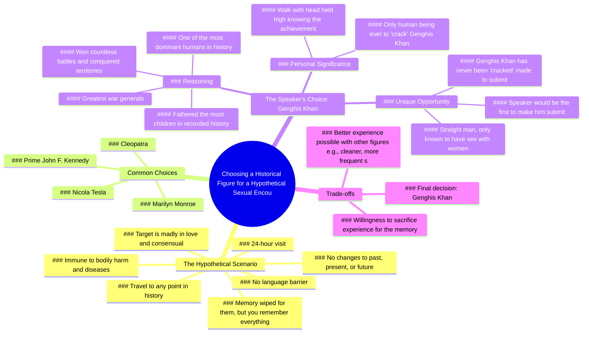

# Meeting Cleopatra: A Time Travel Fantasy

> 🌐 **Read this in:** **English** · [中文](../../zh-CN/2026-06/tiktok-transcript-i-will-say-it-would-be-really-cool-to-meet-cleopatra-just-to-1de2.md)

> **Creator:** [@jamynon](https://www.tiktok.com/@jamynon) · **Views:** 8.1M · **Posted:** 2026-06-04 · **Niche:** entertainment
>
> **TL;DR:** The hook immediately engages viewers with a provocative and absurd hypothetical, sparking curiosity and debate.

[Watch original video →](https://www.tiktok.com/t/ZP8s2qqLU/)

## Why This Went Viral

## Hook (first 3 seconds)
- **Verbatim opening line:** "if you could go back in time and have sex with one historical figure who would it be"
- **Hook pattern:** Question + bold hypothetical scenario
- **Why it stops scrolling:** The question is absurd, taboo, and instantly provocative. It forces viewers to pause and think about their own answer, creating immediate mental engagement. The phrasing "go back in time and have sex" is unexpected and attention-grabbing.

## Emotional Rhythm
1. **Curiosity** (0:00–0:05): The question sparks intrigue and humor.
2. **Tension** (0:05–0:20): The detailed rules build a serious, almost legalistic tone, heightening the absurdity.
3. **Anticipation** (0:20–0:30): The creator rejects obvious choices (JFK, Monroe, Cleopatra), creating suspense for his pick.
4. **Surprise + Shock** (0:30–0:35): "I am cracking Genghis Khan" — the twist lands hard.
5. **Humor + Self-awareness** (0:35–0:50): He acknowledges the absurdity ("you're gonna choose to crack Genghis Khan? yes yes I am").
6. **Pride + Triumph** (0:50–1:10): The climax — he frames it as an act of dominance over "the most dominant human ever."
7. **Relief + Laughter** (1:10–end): Self-deprecating punchline about hygiene and memory.

**Climax moment:** "I would be the first ever human to make Genghis Khan submit to me" — the ultimate twist on power dynamics.

## Keyword Density
- **"Genghis Khan"** (7x) — Algorithmic reach: high search volume, historical figure. Emotional pull: iconic, evokes power.
- **"Crack / cracked"** (6x) — Emotional pull: slang for "dominate" or "have sex with," creates in-group humor.
- **"Historical figure"** (4x) — Algorithmic reach: broad topic keyword.
- **"Dominant"** (4x) — Emotional pull: frames the choice as a power play.
- **"Sex"** (3x) — Algorithmic reach: high-engagement topic, but risky for some platforms.
- **"Memory / remember"** (3x) — Emotional pull: taps into desire for significance.
- **"First ever"** (2x) — Emotional pull: exclusivity, uniqueness.
- **"24 hours"** (2x) — Algorithmic reach: specific detail that triggers curiosity.

## Why It Spreads
1. **Shock + absurd premise forces sharing.** The question "who would you have sex with in history?" is inherently shareable because it's taboo and invites debate. People will send it to friends with "you have to hear this guy's answer."
2. **The twist subverts expectations.** After listing obvious choices (JFK, Monroe, Cleopatra), he picks Genghis Khan — a historical figure associated with brutality, not sex appeal. This surprise creates a "wait, what?" moment that compels viewers to rewatch or share.
3. **Power fantasy + humor hook.** The creator reframes sex as an act of dominance over "the most dominant human ever." This is both hilarious and psychologically resonant — everyone wants to feel powerful. The line "I would walk every single day with my head held high knowing I'm the only human being ever that cracked Genghis Khan" is pure viral gold.
4. **Self-aware delivery.** He acknowledges the absurdity ("maybe one that showered more frequently") while doubling down on his choice. This balance of commitment and humor makes the video feel authentic and relatable, not cringe.
5. **Detailed rules create replay value.** The 24-hour scenario with language fluency, immunity, and memory wipe is so specific that viewers will mentally play along, re-engage, and discuss in comments.

## What You Can Steal
1. **Start with a provocative question that invites participation.** Ask a question that forces viewers to answer mentally before you reveal your own. The gap between their answer and yours creates engagement.
2. **Subvert a predictable list with an unexpected choice.** List obvious options first, then pivot to something shocking. This pattern (setup → twist) is proven to hold attention and drive shares.
3. **Reframe a taboo topic as a power fantasy or intellectual challenge.** Instead of focusing on the sexual aspect, frame it as a "dominance" or "significance" play. This makes the content feel clever and shareable rather than just crude.

## Mind Map

## Full Transcript (Generated by [the tool we used to generate this](https://toktranscript.com/?utm_source=github&utm_medium=breakdown&utm_campaign=tool_attribution))

> 📝 Transcripts on this page are auto-generated and show the first 60%. Want to transcribe any TikTok in 30 seconds and get the full version? [Try TokTranscript free →](https://toktranscript.com/?utm_source=github&utm_medium=breakdown&utm_campaign=transcript_cta)

if you could go back in time and have sex with one historical figure who would it be in this hypothetical you are given the option to travel to any point in history to have sex with one adult historical figure and in this scenario you will be fluent in whatever language they speak there will be no language barrier you you are there for 24 hours and you will be immune to any type of bodily harm and diseases that might have been prevalent at the time also once you get into that time period and you go to them this individual will be madly in love with you and will agree to do basically anything that you say so any and all actions that take place are purely consensual as soon as your 24 hours are up you will be teleported back to your own timeline and the person that you chose to have sex with will have their memory wiped and it'll be like you were never there but you will remember absolutely everything that happened your actions will not change the past present or future this is purely for your memory who are you choosing a lot of people might say something like maybe Prime John F Kennedy Marilyn Monroe Cleopatra Nicola Tesla was a decent looking guy at the time but all of those choices are nothing and compared to what I'm gonna choose I am cracking Genghis Khan now I know when I say that some of you might be like Genghis Khan you can have sex with any historical figure some of the most beautiful women in the world are right there and you're gonna choose to crack Genghis Khan yes yes I am why because Genghis Khan is one of the most dominant if not the most dominant human ever in human history one of the greatest war generals that the wo

*[Read the full transcript on TokTranscript →](https://toktranscript.com/plaza/tiktok-transcript-i-will-say-it-would-be-really-cool-to-meet-cleopatra-just-to-1de2?utm_source=github&utm_medium=breakdown&utm_campaign=transcript_full)*

## Browse More

- All [entertainment](../../by-niche/en/entertainment.md) breakdowns
- All [Hypothetical Question](../../by-pattern/en/hook-hypothetical-question.md) examples

## Video Info

| | |
|---|---|
| Creator | [@jamynon](https://www.tiktok.com/@jamynon) |
| Original video | [https://www.tiktok.com/t/ZP8s2qqLU/](https://www.tiktok.com/t/ZP8s2qqLU/) |
| Original title | I will say it would be really cool to meet cleopatra just to see what... |
| Views | 8.1M (8100000) |
| Posted | 2026-06-04 |
| Duration | 0s |
| Niche | `entertainment` |
| Hook pattern | `Hypothetical Question` |
| Original language | `en` |
| Available languages | en, zh-CN |
| Generated | 2026-06-05 by [TokTranscript](https://toktranscript.com/) |

---

*This breakdown is for educational analysis under fair use. Original video © [@jamynon](https://www.tiktok.com/@jamynon). All transcripts are auto-generated and may contain errors.*

*Want to analyze your own TikToks like this? [analyze your own TikToks →](https://toktranscript.com/viral-breakdown?utm_source=github&utm_medium=breakdown&utm_campaign=footer_cta)*