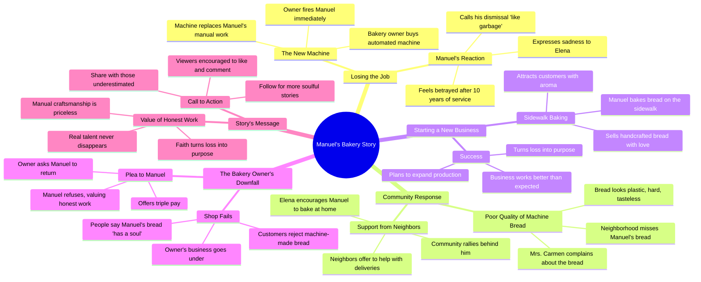

# Bakery Owner Replaced by Machine

> 🌐 **Read this in:** **English** · [中文](../../zh-CN/2026-06/tiktok-transcript-if-you-enjoyed-this-story-leave-a-like-and-a-comment-emotion-bb14.md)

> **Creator:** [@healthcare448](https://www.tiktok.com/@healthcare448) · **Views:** 886.8K · **Posted:** 2026-06-27 · **Niche:** other
>
> **TL;DR:** Immediately creates conflict and sympathy by showing a loyal worker being replaced without warning.

[Watch original video →](https://vt.tiktok.com/ZSCrA4SkJ/)

## Why This Went Viral

## Hook (first 3 seconds)
- **Verbatim:** "Mr. Manuel, I've bought a new machine for the bakery. From now on, I won't need you here anymore."
- **Pattern:** Scene + Bold claim (the boss fires the baker mid-sentence)
- **Why it stops scroll:** Immediate conflict and injustice. The viewer hears a human being replaced by a machine in real time—this triggers visceral unfairness that demands resolution.

## Emotional Rhythm
- **Beat 1 (0–5s):** Shock + Injustice (boss fires Manuel coldly)  
- **Beat 2 (5–10s):** Despair (Manuel tells Elena he was thrown out like garbage)  
- **Beat 3 (10–15s):** Anger + Solidarity (neighbors reject machine bread, rally around Manuel)  
- **Beat 4 (15–20s):** Triumph (Manuel starts baking on sidewalk, crowd cheers)  
- **Beat 5 (20–25s):** Reversal (boss begs Manuel to return, offers triple pay)  
- **Beat 6 (25–30s):** Moral climax ("A soul has no price")  
- **Climax moment:** "A soul has no price. My bread is for those who value a man's work."

## Keyword Density
| Keyword / Phrase | Emotional Pull | Algorithmic Reach |
|---|---|---|
| "machine" | Fear of replacement, coldness | High (trending topic: AI/automation) |
| "bread" | Warmth, tradition, craft | Medium (food content) |
| "soul" | Emotional resonance, humanity | Low volume, high engagement |
| "fired" | Injustice, job loss | High (trending topic: layoffs) |
| "real" | Authenticity vs. artificial | Medium (value-driven) |
| "line" | Social proof, scarcity | High (FOMO triggers shares) |
| "neighborhood" | Community, belonging | Low volume, high emotional pull |
| "arrogant" | Villain framing | Low volume, high engagement |

**Why it works:** "Machine" and "fired" tap into current fears about automation, while "soul" and "real" create emotional contrast that drives comments and shares.

## Why It Spreads
1. **Underdog narrative with clear villain.** The boss ("arrogant man") is a perfect antagonist. Viewers instantly side with Manuel.  
2. **Reversal of power.** The climax ("A soul has no price") flips the script—the fired worker now has leverage. This creates a satisfying emotional payoff that viewers want to share.  
3. **Community rallying moment.** Lines like "I'll help you with deliveries" and "There's a line, there's a line" show social proof in action. Viewers feel part of the movement.  
4. **Call to action baked into story.** The ending ("If this story made you feel something, leave a like… share this with someone who was underestimated") directly converts emotion into engagement.  
5. **Universal fear + hope.** Automation replacing humans is a global anxiety. Manuel's triumph offers a fantasy resolution—skill and soul beat technology.

## What You Can Steal
1. **Open with a firing or rejection scene.** It's the fastest way to create empathy. Start your video with someone losing something unfair.  
2. **Build a crowd reaction in the middle.** Show people physically lining up or cheering. This visual social proof makes viewers want to join the movement.  
3. **End with a value statement that can be quoted.** "A soul has no price" is shareable as a standalone line. Craft one moral sentence viewers will want to repost.

## Mind Map

## Full Transcript (Generated by [TokTranscript](https://toktranscript.com/?utm_source=github&utm_medium=breakdown&utm_campaign=tool_attribution))

> 📝 Transcripts on this page are auto-generated and show the first 60%. Want to transcribe any TikTok in 30 seconds and get the full version? [Try TokTranscript free →](https://toktranscript.com/?utm_source=github&utm_medium=breakdown&utm_campaign=transcript_cta)

Mr. Manuel, I've bought a new machine for the bakery. From now on, I won't need you here anymore. It does everything on its own. All you have to do is press a button. What used to take you hours, this machine does in minutes. So take off your apron, grab your things and leave. Pipe now! Manuel! So early? What happened, my dear? They replaced me with a machine. Elena. 10 years giving this town its best bread, and they throw me out like garbage. I went to the bakery and the bread looked like plastic, hard and tasteless. I'm not there anymore, Mrs. Carmen. I was fired for a machine. I don't want machine bread, I want your bread! Elena. If they don't want my hands, this neighborhood does. I'm going to bake right here! That's the spirit, Manuel! Yeah, I'll help you with deliveries. Yeah, we're going to show that arrogant man who the master really is! Look at this cake, mihra. Made by hand, with love. A master baker selling on the sidewalk. What a shame! Give me 3. Haha, that smell is a blessing. I haven't eaten real bread in weeks. It worked!

*[Read the full transcript on TokTranscript →](https://toktranscript.com/plaza/tiktok-transcript-if-you-enjoyed-this-story-leave-a-like-and-a-comment-emotion-bb14?utm_source=github&utm_medium=breakdown&utm_campaign=transcript_full)*

## Browse More

- All [other](../../by-niche/en/other.md) breakdowns
- All [Unexpected dismissal](../../by-pattern/en/hook-unexpected-dismissal.md) examples

## Video Info

| | |
|---|---|
| Creator | [@healthcare448](https://www.tiktok.com/@healthcare448) |
| Original video | [https://vt.tiktok.com/ZSCrA4SkJ/](https://vt.tiktok.com/ZSCrA4SkJ/) |
| Original title | If you enjoyed this story, leave a like and a comment.#emotionalstory... |
| Views | 886.8K (886800) |
| Posted | 2026-06-27 |
| Duration | 0s |
| Niche | `other` |
| Hook pattern | `Unexpected dismissal` |
| Original language | `en` |
| Available languages | en, zh-CN |
| Generated | 2026-06-27 by [TokTranscript](https://toktranscript.com/) |

---

*This breakdown is for educational analysis under fair use. Original video © [@healthcare448](https://www.tiktok.com/@healthcare448). All transcripts are auto-generated and may contain errors.*

*Want to analyze your own TikToks like this? [the tool we used to generate this →](https://toktranscript.com/viral-breakdown?utm_source=github&utm_medium=breakdown&utm_campaign=footer_cta)*