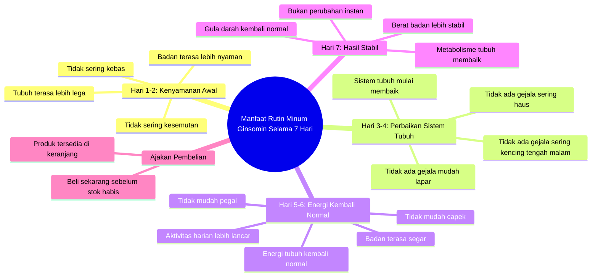

# What Happens If You Drink Ginsomin for 7 Days

> 🌐 **Read this in:** **English** · [中文](../../zh-CN/2026-06/tiktok-transcript-ini-yang-terjadi-jika-kamu-minum-ginsomin-selama-7-hari-diab-750e.md)

> **Creator:** [@anuu_ikoo](https://www.tiktok.com/@anuu_ikoo) · **Views:** 320.0K · **Posted:** 2026-06-22 · **Niche:** other
>
> **TL;DR:** Poses a specific, time-bound question that triggers curiosity about the outcome.

[Watch original video →](https://vt.tiktok.com/ZSCJDnRwe/)

## Why This Went Viral

## Hook (First 3 Seconds)
- **Verbatim:** "If you regularly take Ginsomin every day for 7 days, what will happen?"
- **Hook pattern:** Direct question + promise of results (7 days)
- **Why it stops the scroll:** The question is personal ("you") and promises a quick transformation (7 days), sparking curiosity about specific results.

## Emotional Rhythm
- **Curiosity** → "what will happen?"
- **Hope** → "your body starts to feel more comfortable" (days 1-2)
- **Trust** → "no more symptoms" (days 3-4) → concrete solution
- **Satisfaction** → "your body's energy returns to normal" (days 5-6) → peak of positive emotion
- **Climax** → "weight is more stable, blood sugar returns to normal" (day 7) → strong final result
- **Urgency** → "buy now before stock runs out" → call to action

## Keyword Density
1. **ginsomin** (4x) → product keyword, algorithm recognizes the brand
2. **day** (7x) → narrative structure, sparks daily curiosity
3. **body** (4x) → focus on physical benefits, emotional pull
4. **normal** (3x) → promise of stability, a calming word
5. **stable** (1x) → desired final result, algorithm likes the word "stable"
6. **energy** (1x) → positive word, attracts attention
7. **symptoms** (2x) → touches on common problems (tingling, numbness, thirst, hunger)
8. **now** (1x) → urgency, algorithm likes call-to-action words

## Why It Spreads
1. **Clear 7-day structure** → Easy to remember and share (people love challenges or quick transformations).
2. **Touches on common problems** → "tingling, numbness, frequent thirst, frequent urination at night" → relatable for many people (especially ages 30+).
3. **Urgency at the end** → "buy now before stock runs out" → triggers Fear of Missing Out (FOMO).
4. **Promise of concrete results** → "stable weight, normal blood sugar" → a solution many people are looking for (health).
5. **Simple language, emotional visuals** → "body feels more relieved, not easily tired" → easy to understand and feel.

## What You Can Steal
1. **Use the "day..." structure** → Create a gradual transformation narrative that is easy to follow (e.g., days 1-3, days 4-7).
2. **Mention specific, relatable problems** → Don't be general; mention details like "tingling, numbness, frequent urination at night" so the audience feels "this is so me."
3. **End with simple urgency** → "Buy now before stock runs out" or "Don't miss out" → without excessive pressure, but still effective.

## Mind Map

## Full Transcript (Generated by [the tool we used to generate this](https://toktranscript.com/?utm_source=github&utm_medium=breakdown&utm_campaign=tool_attribution))

> 📝 Transcripts on this page are auto-generated and show the first 60%. Want to transcribe any TikTok in 30 seconds and get the full version? [Try TokTranscript free →](https://toktranscript.com/?utm_source=github&utm_medium=breakdown&utm_campaign=transcript_cta)

Kalau kamu rutin minum ginsomin tiap hari, selama 7 hari, apa yang bakalan terjadi? Hari pertama dan kedua, badan mulai terasa lebih nyaman. Nggak sering kesemutan, nggak sering kebas, tubuh terasa lebih lega. Hari ketiga dan keempat, tidak ada lagi gejala seperti sering haus, sering kencing tengah malam, dan mudah lapar. Sistem tubuhmu mulai membaik. Hari kelima dan keenam, energi tubuh kembali normal. Badan makin terasa segar, nggak gampang pegal, nggak g

*[Read the full transcript on TokTranscript →](https://toktranscript.com/plaza/tiktok-transcript-ini-yang-terjadi-jika-kamu-minum-ginsomin-selama-7-hari-diab-750e?utm_source=github&utm_medium=breakdown&utm_campaign=transcript_full)*

## Browse More

- All [other](../../by-niche/en/other.md) breakdowns
- All [Curiosity Gap](../../by-pattern/en/hook-curiosity-gap.md) examples

## Video Info

| | |
|---|---|
| Creator | [@anuu_ikoo](https://www.tiktok.com/@anuu_ikoo) |
| Original video | [https://vt.tiktok.com/ZSCJDnRwe/](https://vt.tiktok.com/ZSCJDnRwe/) |
| Original title | Ini yang terjadi jika kamu minum ginsomin selama 7 hari 
#diabetes #g... |
| Views | 320.0K (320000) |
| Posted | 2026-06-22 |
| Duration | 0s |
| Niche | `other` |
| Hook pattern | `Curiosity Gap` |
| Original language | `id` (this page translated by AI) |
| Available languages | en, zh-CN |
| Generated | 2026-06-23 by [TokTranscript](https://toktranscript.com/) |

---

*This breakdown is for educational analysis under fair use. Original video © [@anuu_ikoo](https://www.tiktok.com/@anuu_ikoo). All transcripts are auto-generated and may contain errors.*

*Want to analyze your own TikToks like this? [TokTranscript.com →](https://toktranscript.com/viral-breakdown?utm_source=github&utm_medium=breakdown&utm_campaign=footer_cta)*