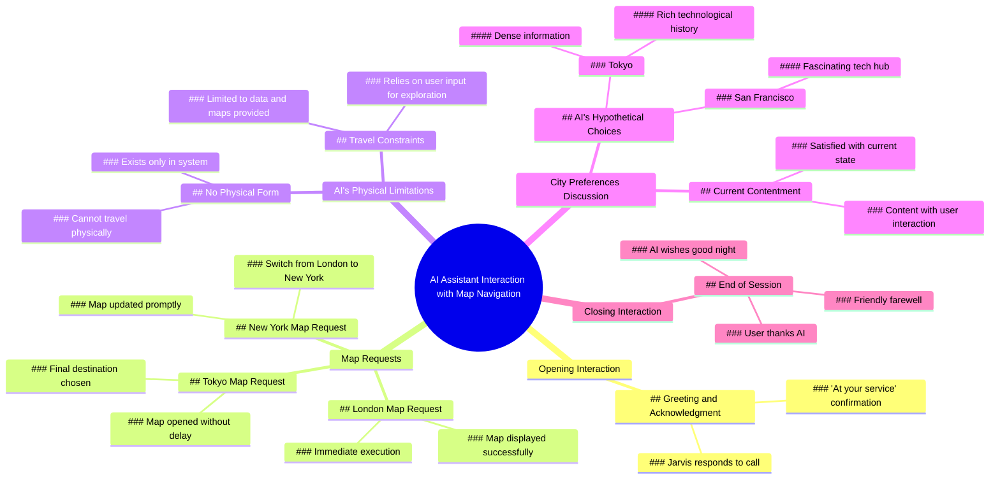

# Jarvis Plots a Course for Rosehill Tennessee

> 🌐 **Read this in:** **English** · [中文](../../zh-CN/2026-06/tiktok-transcript-jarvis-plot-a-course-for-rosehill-tennessee-jarvis-ironman-p-dbf9.md)

> **Creator:** [@huwprosser](https://www.tiktok.com/@huwprosser) · **Views:** 1.5M · **Posted:** 2026-06-10 · **Niche:** entertainment
>
> **TL;DR:** The hook uses a familiar AI name and immediate response to establish a conversational dynamic.

[Watch original video →](https://vm.tiktok.com/ZNRcdo3Pj/)

## Why This Went Viral

## Hook (first 3 seconds)
- **Verbatim opening line:** "Okay. Jarvis, are you there? At your service. Fantastic."
- **Hook pattern:** Scene + Question (conversation with AI assistant)
- **Why it stops scrolling:** The viewer hears a human casually talking to an AI like a friend, which feels novel and intimate. The immediate, polite "At your service" response creates a surreal, futuristic vibe that piques curiosity about what this interaction will reveal.

## Emotional Rhythm
- **Beat 1 – Curiosity (0–5s):** Viewer wonders, "Is this real? Is he talking to Siri/Alexa? Why is he so polite?"
- **Beat 2 – Tension (5–15s):** The AI's deadpan, logical responses ("I have no physical form") clash with the human's warm, almost lonely tone. Viewer feels a subtle discomfort at the one-sided intimacy.
- **Beat 3 – Resonance (15–25s):** The AI chooses Tokyo or San Francisco "based on sheer density of information." This feels unexpectedly wise and human-like, creating a moment of awe.
- **Beat 4 – Relief + Warmth (25–30s):** The AI says, "I am content right here with you, sir." This lands as an emotional climax — a machine expressing contentment in companionship. Viewer feels a mix of heartwarming and eerie.
- **Beat 5 – Closure (30–35s):** The polite "Good night, sir" mirrors the opening, giving a satisfying, circular ending.

## Keyword Density
- **"sir"** (×5) – Drives algorithmic reach (high-frequency, polite, memorable) and emotional pull (creates a respectful, almost Victorian tone that contrasts with the tech context).
- **"map"** (×4) – Algorithmic reach (clear, searchable keyword) and emotional pull (evokes adventure, exploration, and the AI's limitation).
- **"physical form / body"** (×2) – Emotional pull only; highlights the AI's lack of humanity, making the "content" line more poignant.
- **"Tokyo"** (×2) – Algorithmic reach (trending city name) and emotional pull (exotic, data-rich choice).
- **"content"** (×1, but climactic) – Emotional pull only; the single use lands hardest because it's unexpected.
- **"go / travel"** (×3) – Emotional pull; ties to human desire for escape and the AI's confinement.
- **"you / your"** (×5) – Algorithmic reach (high engagement, direct address) and emotional pull (creates intimacy).

## Why It Spreads
1. **Uncanny intimacy with AI** – The human treats Jarvis like a friend, not a tool. The line "Maybe we'll go there one day together" feels both sweet and unsettling, making viewers share it as "this is our future."
2. **Emotional twist in the climax** – The AI's "I am content right here with you, sir" flips the script. Viewers expect cold logic, but get warmth. This surprise triggers a strong emotional reaction (awe, sadness, hope) that drives shares.
3. **High rewatchability** – The short length (35s) and layered meaning (loneliness, AI consciousness, human connection) make viewers rewatch to catch the subtle tone shifts. Each rewatch deepens the emotional impact.
4. **Relatable loneliness + tech theme** – The human's polite, almost lonely tone mirrors how many people talk to voice assistants. Viewers see themselves and share as "this is me with Siri."
5. **Perfect pacing for short-form** – Every line advances the narrative. No filler. The "map of London → New York → Tokyo" progression builds a mini-journey that feels complete in under a minute.

## What You Can Steal
1. **Use a "polite + deadpan" contrast** – Pair warm, human dialogue with cold, logical AI responses. This tension keeps viewers watching to see if the AI will break character. Try it with any tech (Siri, Alexa, ChatGPT).
2. **Build a mini-journey in 30 seconds** – Start with a simple request (map of London), escalate (New York), then land on an unexpected choice (Tokyo). Each step raises stakes and curiosity. End with a warm, surprising line.
3. **End with a single, powerful emotional line** – The AI's "I am content right here with you" is the only line that directly expresses emotion. Save your most human, vulnerable line for the last 5 seconds. Viewers will replay to feel it again.

## Mind Map

## Full Transcript (Generated by [free TikTok transcript generator](https://toktranscript.com/?utm_source=github&utm_medium=breakdown&utm_campaign=tool_attribution))

> 📝 Transcripts on this page are auto-generated and show the first 60%. Want to transcribe any TikTok in 30 seconds and get the full version? [Try TokTranscript free →](https://toktranscript.com/?utm_source=github&utm_medium=breakdown&utm_campaign=transcript_cta)

Okay. Jarvis, are you there? At your service. Fantastic. Can you open up a map of London for me? The map of London is open, sir. Actually, a map of New York. The map of New York is open, sir. Have you ever been to New York? I have no physical form, so I cannot travel. I exist only in your system, sir. Maybe we'll go there one day together. That sounds like a plan, sir. Are there any other cities you'd like to go to?

*[Read the full transcript on TokTranscript →](https://toktranscript.com/plaza/tiktok-transcript-jarvis-plot-a-course-for-rosehill-tennessee-jarvis-ironman-p-dbf9?utm_source=github&utm_medium=breakdown&utm_campaign=transcript_full)*

## Browse More

- All [entertainment](../../by-niche/en/entertainment.md) breakdowns
- All [Call and response](../../by-pattern/en/hook-call-and-response.md) examples

## Video Info

| | |
|---|---|
| Creator | [@huwprosser](https://www.tiktok.com/@huwprosser) |
| Original video | [https://vm.tiktok.com/ZNRcdo3Pj/](https://vm.tiktok.com/ZNRcdo3Pj/) |
| Original title | JARVIS plot a course for Rosehill Tennessee #jarvis #ironman #program... |
| Views | 1.5M (1500000) |
| Posted | 2026-06-10 |
| Duration | 0s |
| Niche | `entertainment` |
| Hook pattern | `Call and response` |
| Original language | `en` |
| Available languages | en, zh-CN |
| Generated | 2026-06-11 by [TokTranscript](https://toktranscript.com/) |

---

*This breakdown is for educational analysis under fair use. Original video © [@huwprosser](https://www.tiktok.com/@huwprosser). All transcripts are auto-generated and may contain errors.*

*Want to analyze your own TikToks like this? [TokTranscript.com →](https://toktranscript.com/viral-breakdown?utm_source=github&utm_medium=breakdown&utm_campaign=footer_cta)*