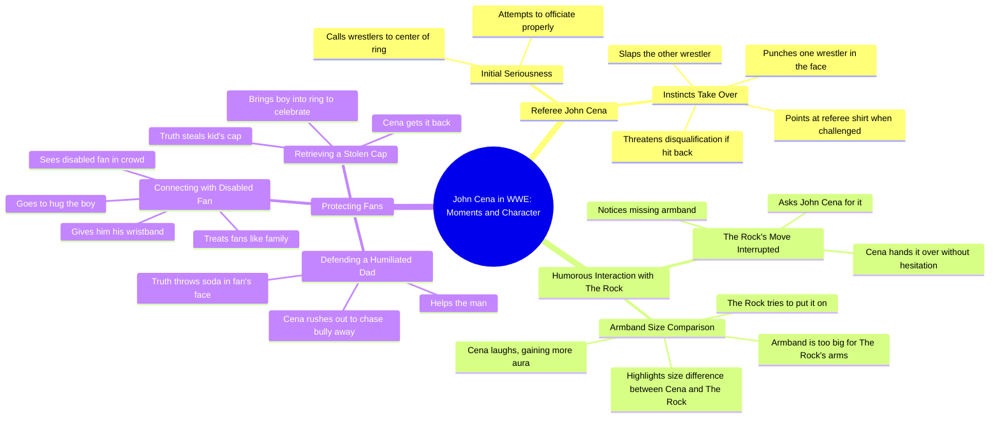

# John Cena Becomes a Wild WWE Referee

> 🌐 **Read this in:** **English** · [中文](../../zh-CN/2026-06/tiktok-transcript-john-cena-is-the-worst-referee-wwe-wrestling-fighting-champi-7449.md)

> **Creator:** [@waynewrestle0](https://www.tiktok.com/@waynewrestle0) · **Views:** 1.5M · **Posted:** 2026-06-29 · **Niche:** entertainment
>
> **TL;DR:** Sets up a familiar scenario then subverts it with danger.

[Watch original video →](https://www.tiktok.com/t/ZP8GYQf6D/)

## Why This Went Viral

## Hook (first 3 seconds)
- **Verbatim:** "when John Cena becomes a referee in WWE nobody around is safe"
- **Hook pattern:** Bold claim + scene setting (unexpected role reversal)
- **Why it stops scrolling:** It promises a specific, high-stakes, unpredictable moment involving a massive celebrity. The phrase "nobody around is safe" triggers immediate curiosity and anticipation of chaos.

## Emotional Rhythm
1. **Curiosity** – "when John Cena becomes a referee" (unusual premise)
2. **Tension** – "at first he actually takes the job seriously" (false calm)
3. **Surprise** – "out of nowhere Cena turns around and punches one of the wrestlers right in the face"
4. **Humor** – "I'm the ref here hit me and you're disqualified" (clever loophole)
5. **Satisfaction** – Cena slaps the other guy too (payoff)
6. **Amusement** – The Rock tries Cena's armband, reveals tiny arms (comedic humiliation)
7. **Warmth/Respect** – Cena protects fans, defends disabled boy, hugs fan (emotional climax)
8. **Call to action** – "subscribe if you respect John Cena" (loyalty trigger)

**Climax moment:** The armband reveal — "proved how tiny his arms were compared to Cena's" — combines humor, status, and relatability.

## Keyword Density
| Word/Phrase | Frequency | Purpose |
|-------------|-----------|---------|
| "John Cena" | 7 | Algorithmic reach (celebrity name) |
| "fan" / "fans" | 4 | Emotional pull (community) |
| "referee" / "ref" | 3 | Context hook (role twist) |
| "hit" / "slap" / "punch" | 4 | Action/violence (engagement) |
| "armband" | 3 | Visual prop (memorable detail) |
| "subscribe" | 2 | Direct CTA (conversion) |
| "protects" / "defends" | 2 | Emotional resonance (hero archetype) |

**Algorithmic drivers:** "John Cena" (search volume), "subscribe" (retention metric)  
**Emotional drivers:** "fan", "protects", "armband" (relatability, underdog story)

## Why It Spreads
1. **Unexpected role reversal** – "John Cena becomes a referee" breaks the expected hero/villain dynamic, making viewers think "I have to see this."
2. **Comedic humiliation hook** – The Rock's armband moment ("proved how tiny his arms were") is a universally funny, shareable visual that works as a standalone clip.
3. **Hero narrative arc** – The video shifts from chaotic referee antics to "Cena protects fans," creating a complete emotional journey: laugh → respect → feel good.
4. **Low-effort, high-reward CTA** – "subscribe if you respect John Cena" ties the action to identity (respect), not just interest. It's a loyalty test, not a request.
5. **Pacing & contrast** – Fast action (punch, slap) → slow comedy (armband) → heartfelt moment (disabled fan). This rhythm prevents drop-off and maximizes retention.

## What You Can Steal
1. **The "unexpected role" hook** – Start with a character doing something they're not supposed to (e.g., "When a referee fights back"). It instantly signals novelty.
2. **The "humiliation → redemption" structure** – Use a funny, embarrassing moment (armband) to build engagement, then pivot to a heartwarming payoff (fan protection). This keeps viewers through the entire video.
3. **The identity-based CTA** – Replace "subscribe for more" with "subscribe if you [value/trait]" (e.g., "subscribe if you respect loyalty"). It converts viewers who want to signal that identity.

## Mind Map

## Full Transcript (Generated by [TokTranscript.com](https://toktranscript.com/?utm_source=github&utm_medium=breakdown&utm_campaign=tool_attribution))

> 📝 Transcripts on this page are auto-generated and show the first 60%. Want to transcribe any TikTok in 30 seconds and get the full version? [Try TokTranscript free →](https://toktranscript.com/?utm_source=github&utm_medium=breakdown&utm_campaign=transcript_cta)

when John Cena becomes a referee in WWE nobody around is safe at first he actually takes the job seriously and calls the two wrestlers into the middle of the ring just a few seconds later his fighting instincts completely take over out of nowhere Cena turns around and punches one of the wrestlers right in the face and when the furious wrestler steps up to fight back Cena points at his referee shirt saying I'm the ref here hit me and you're disqualified the opponent is forced to stop so Cena takes his chance and slaps the other guy too subscribe if you miss John Cena the was about to finish his move but he noticed something was missing so he asked John Cena for his armband and Cena handed it over without hesitation the crowd got hyped up expecting something crazy to happen but the rock didn't realize that John's armband was way too when he tried to put it on it 

*[Read the full transcript on TokTranscript →](https://toktranscript.com/plaza/tiktok-transcript-john-cena-is-the-worst-referee-wwe-wrestling-fighting-champi-7449?utm_source=github&utm_medium=breakdown&utm_campaign=transcript_full)*

## Browse More

- All [entertainment](../../by-niche/en/entertainment.md) breakdowns
- All [Unexpected Twist](../../by-pattern/en/hook-unexpected-twist.md) examples

## Video Info

| | |
|---|---|
| Creator | [@waynewrestle0](https://www.tiktok.com/@waynewrestle0) |
| Original video | [https://www.tiktok.com/t/ZP8GYQf6D/](https://www.tiktok.com/t/ZP8GYQf6D/) |
| Original title | John Cena is the WORST Referee_ 😂(#wwe #wrestling #fighting #champion... |
| Views | 1.5M (1500000) |
| Posted | 2026-06-29 |
| Duration | 0s |
| Niche | `entertainment` |
| Hook pattern | `Unexpected Twist` |
| Original language | `en` |
| Available languages | en, zh-CN |
| Generated | 2026-07-01 by [TokTranscript](https://toktranscript.com/) |

---

*This breakdown is for educational analysis under fair use. Original video © [@waynewrestle0](https://www.tiktok.com/@waynewrestle0). All transcripts are auto-generated and may contain errors.*

*Want to analyze your own TikToks like this? [try this transcription tool →](https://toktranscript.com/viral-breakdown?utm_source=github&utm_medium=breakdown&utm_campaign=footer_cta)*