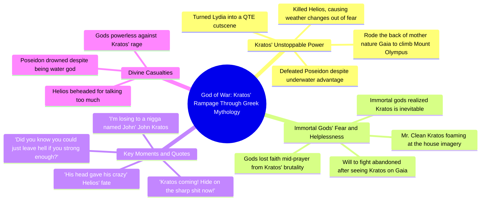

# Kratos 6 Rerun: Poseidon Drowned

> 🌐 **Read this in:** **English** · [中文](../../zh-CN/2026-06/tiktok-transcript-kratos-6-rerun-kratos-godofwar-gow-godofwarragnarok-godofwar-940b.md)

> **Creator:** [@jaypierlis](https://www.tiktok.com/@jaypierlis) · **Views:** 109.3K · **Posted:** 2026-06-06 · **Niche:** entertainment
>
> **TL;DR:** Immediate panic and urgency hook viewers by tapping into shared gaming fear.

[Watch original video →](https://vm.tiktok.com/ZNRvk1SBH/)

## Why This Went Viral

## Hook (first 3 seconds)
- Verbatim: "Kratos coming! Hide on the sharp shit now! Calm down! Nigga, don't call the fuck down!"
- Hook pattern: **Scene + Urgency** (chaotic alarm, immediate stakes, and a direct contradiction)
- Why it stops scroll: The panic is contagious. The speaker contradicts himself instantly ("calm down" → "don't call the fuck down"), creating disorienting comedy. Viewers need context for the absurd fear.

## Emotional Rhythm
1. **Confusion + Urgency** (0:00–0:05): Panic over "Kratos coming" — viewer has no idea why.
2. **Curiosity + Humor** (0:05–0:15): "He drowned Poseidon" — absurd logic hits. Viewer laughs at the premise.
3. **Escalating Tension** (0:15–0:30): "What's his full name? John Kratos. I'm losing to a nigga named John." — the mundane name vs. god-killing power creates peak comedic tension.
4. **Resonance + Surprise** (0:30–0:45): "Believers lose faith mid-prayer" — unexpected depth. Viewer feels the weight.
5. **Climax** (0:45–0:55): "He killed the sun god and the weather changed out of pure fear." — hyperbolic, visual, unforgettable.
6. **Release** (0:55–end): "I lost my will to fight that day" — deflation. Comedic surrender.

## Keyword Density
- **Kratos** (6x) — algorithmic anchor (game character name drives search/discovery)
- **Nigga** (5x) — emotional pull (vernacular intimacy, humor, relatability in Black gaming culture)
- **God / Sun god / Poseidon** (4x) — algorithmic reach (mythology + gaming crossover)
- **Fear / Will** (3x) — emotional pull (humanizes the joke, creates stakes)
- **Mount Olympus / Hell / Drowned / Head / Breath** (2x each) — scene-setting keywords that reinforce the absurd premise

## Why It Spreads
1. **Subverts a known character's power scale**  
   - "He drowned Poseidon. Can't he breathe underwater?" — takes a known god-killer and makes him *even more* terrifying. Fans of God of War share because it validates their awe.

2. **Uses "everyman" naming for comedic contrast**  
   - "I'm losing to a nigga named John" — turns a mythical figure into a relatable joke. Viewers tag friends who'd find this funny.

3. **Packs a complete narrative arc into 60 seconds**  
   - From panic → logic → surrender. Each line escalates. No dead air. Perfect for TikTok/Reels retention.

4. **Delivers a quotable climax phrase**  
   - "He killed the sun god and the weather changed out of pure fear" — standalone shareable line. Meme-ready.

5. **Relatable emotional truth hidden in absurdity**  
   - "You ever wake up and see Mr. Clean standing over you foaming at them house?" — mixes terror with domestic humor. Viewers comment their own "unfair boss" stories.

## What You Can Steal
1. **Open with a contradiction** — "Calm down! Don't call the fuck down!" makes viewers rewind. Use a line that contradicts itself to create immediate confusion → curiosity.

2. **Scale a known character beyond their established lore** — Take a popular figure (game, movie, meme) and invent a new, more absurd feat. The gap between expectation and exaggeration drives shares.

3. **End with a deflated surrender** — "I lost my will to fight that day" closes the loop. Don't over-explain. Let the punchline land and leave. Short-form thrives on abrupt, confident endings.

## Mind Map

## Full Transcript (Generated by [TokTranscript.com](https://toktranscript.com/?utm_source=github&utm_medium=breakdown&utm_campaign=tool_attribution))

> 📝 Transcripts on this page are auto-generated and show the first 60%. Want to transcribe any TikTok in 30 seconds and get the full version? [Try TokTranscript free →](https://toktranscript.com/?utm_source=github&utm_medium=breakdown&utm_campaign=transcript_cta)

Kratos coming! Hide on the sharp shit now! Calm down! Nigga, don't call the fuck down! How the fuck you make an example out of zoos, dog? He drowned Poseidon! Can't he breathe underwater? Did you know you could just leave hell if you strong enough? No. Either did I! What's his full name? John Kratos. I'm losing to a nigga named John. He turned my nigga Lydia into a QTE cutscene. I can't. Helios was running his fucking mouth. What happened? Let's just say his head gave his crazy. So this nigga can fly too, huh? You ain't never been put so hard that your believers lose faith mid-prayer.

*[Read the full transcript on TokTranscript →](https://toktranscript.com/plaza/tiktok-transcript-kratos-6-rerun-kratos-godofwar-gow-godofwarragnarok-godofwar-940b?utm_source=github&utm_medium=breakdown&utm_campaign=transcript_full)*

## Browse More

- All [entertainment](../../by-niche/en/entertainment.md) breakdowns
- All [Urgent Call to Action](../../by-pattern/en/hook-urgent-call-to-action.md) examples

## Video Info

| | |
|---|---|
| Creator | [@jaypierlis](https://www.tiktok.com/@jaypierlis) |
| Original video | [https://vm.tiktok.com/ZNRvk1SBH/](https://vm.tiktok.com/ZNRvk1SBH/) |
| Original title | Kratos 6.(rerun) #kratos #godofwar #gow #godofwarragnarok #godofwar3  |
| Views | 109.3K (109300) |
| Posted | 2026-06-06 |
| Duration | 0s |
| Niche | `entertainment` |
| Hook pattern | `Urgent Call to Action` |
| Original language | `en` |
| Available languages | en, zh-CN |
| Generated | 2026-06-09 by [TokTranscript](https://toktranscript.com/) |

---

*This breakdown is for educational analysis under fair use. Original video © [@jaypierlis](https://www.tiktok.com/@jaypierlis). All transcripts are auto-generated and may contain errors.*

*Want to analyze your own TikToks like this? [TokTranscript →](https://toktranscript.com/viral-breakdown?utm_source=github&utm_medium=breakdown&utm_campaign=footer_cta)*