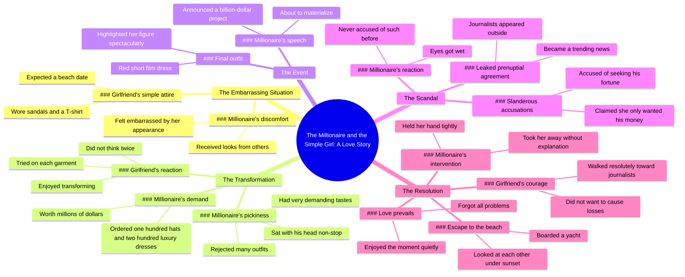

# Millionaire Buys 100 Hats and 200 Dresses for Embarrassed...

> 🌐 **Read this in:** **English** · [中文](../../zh-CN/2026-06/tiktok-transcript-latintiktok-viralusaticktok-movieexplained-f6ec.md)

> **Creator:** [@jgkgstiufsjf](https://www.tiktok.com/@jgkgstiufsjf) · **Views:** 2.4M · **Posted:** 2026-06-23 · **Niche:** other
>
> **TL;DR:** Sets up a relatable underdog scenario with immediate social tension.

[Watch original video →](https://vt.tiktok.com/ZSCRESToq/)

## Why This Went Viral

## Hook (first 3 seconds)
- **Verbatim opening line:** "This man was terribly embarrassed the companions of the others looked like princesses his girlfriend, on the other hand, dressed very simply received looks of everywhere"
- **Hook pattern:** Scene + contrast (embarrassment vs. princesses, simple vs. luxury)
- **Why it stops scrolling:** Immediate social tension and status anxiety — a relatable fear of being judged for a partner's appearance. The word "terribly embarrassed" triggers emotional urgency, and the contrast between "princesses" and "simply dressed" sets up a Cinderella-style conflict.

## Emotional Rhythm
- **Beat 1 — Curiosity + Tension:** Man is embarrassed, girlfriend is underdressed, receives "looks of everywhere" → viewer wants to see how this resolves.
- **Beat 2 — Escalation + Relief:** Millionaire orders 100 hats and 200 luxury dresses → wealth fantasy, transformation begins. Girlfriend tries them on, enjoys it → catharsis.
- **Beat 3 — Twist (Resonance):** She was wearing sandals and a T-shirt — didn't know it was a business meeting → humanizes her, shifts sympathy.
- **Beat 4 — Climax (Suspense + Emotional Peak):** Journalists leak prenuptial agreement, she's slandered as a gold digger, her eyes get wet → high stakes, identity crisis.
- **Beat 5 — Resolution (Relief + Romance):** He grabs her hand, ignores the scandal, takes her to a yacht at sunset → love triumphs over money and reputation. "Love was floating in the air" → emotional payoff.

## Keyword Density
- **"Millionaire"** (5+ times) — algorithmic reach: high-aspiration keyword, triggers wealth fantasy tags.
- **"Embarrassed" / "slandered" / "accused"** — emotional pull: shame and injustice drive engagement.
- **"Dresses" / "hats" / "garments"** — visual + aspirational: fashion content performs well on short-form platforms.
- **"Contract" / "billion-dollar" / "reputation"** — algorithmic + emotional: business stakes add perceived value and drama.
- **"Love" / "sunset" / "looked at each other"** — emotional pull: romantic resolution triggers shareability (feel-good ending).
- **"Journalists" / "leaked" / "trend"** — algorithmic reach: scandal + news format hooks curiosity.

## Why It Spreads
1. **Cinderella plot with a gender-swapped power dynamic** — The poor girl is judged, then transformed, then defended by the rich man. This formula (underdog + wealth + romance) has massive cross-demographic appeal. Concrete: "the companions of the others looked like princesses" vs. "the girl dressed very simply."
2. **High-stakes emotional rollercoaster in under 90 seconds** — From embarrassment → luxury → scandal → tears → rescue → sunset. Each beat is a cliffhanger that rewards retention. Concrete: "her eyes got wet" → "he took her in his arms."
3. **Scandal + redemption arc** — The leaked prenuptial agreement and "gold digger" accusation create a relatable fear (public judgment) that resolves with a romantic defiance. Concrete: "there was no need for explanations in the face of rumors."
4. **Wealth fantasy + moral payoff** — The viewer gets to imagine 100 hats and 200 dresses, then gets the emotional reward of love over money. Concrete: "the piece was worth millions of dollars" → "took her in his arms and walked to the beach."
5. **Open-loop structure** — Every sentence ends with a hook into the next (embarrassment → hats → transformation → scandal → rescue). Viewers cannot predict the ending, which drives watch time and rewatches.

## What You Can Steal
1. **Start with a status threat, not a compliment.** "Terribly embarrassed" triggers anxiety faster than "beautiful." Open with what's wrong, not what's right.
2. **Use the "three-bag trick" — escalate stakes in threes.** First: embarrassment. Second: luxury transformation. Third: public scandal. Each bag of stakes is bigger than the last. Map your story as: problem → solution → bigger problem → ultimate solution.
3. **End with a visual metaphor, not a lecture.** "Looked at each other under the rays of the sunset" does more work than any moral statement. Close on a sensory image that implies the emotional resolution — let the viewer feel it, don't tell them.

## Mind Map

## Full Transcript (Generated by [TokTranscript](https://toktranscript.com/?utm_source=github&utm_medium=breakdown&utm_campaign=tool_attribution))

> 📝 Transcripts on this page are auto-generated and show the first 60%. Want to transcribe any TikTok in 30 seconds and get the full version? [Try TokTranscript free →](https://toktranscript.com/?utm_source=github&utm_medium=breakdown&utm_campaign=transcript_cta)

this man was terribly embarrassed the companions of the others looked like princesses his girlfriend, on the other hand, dressed very simply received looks of everywhere the millionaire could not take it anymore ordered the bringing of one hundred hats and two hundred luxury dresses the piece was worth millions of dollars the young woman did not think twice about it each of the garments was tested one after the other had planned to go on a trip that day she thought it would be a date at the beach who only wore sandals and a T-shirt I didn't know he had to attend a meeting very important business the man had very demanding tastes that each clothing fit him well none were able to convince him sat there his head non-stop the girl did not bother at all enjoyed transforming and looking much better when he finished painting in the afternoon the woman who used to be so haughty looked from head to toe with total astonishment. the millionaire was speechless drank a sip of water to calm down the event was about to begin she wore a dress red short film that highlighted his figure in a spectacular way.

*[Read the full transcript on TokTranscript →](https://toktranscript.com/plaza/tiktok-transcript-latintiktok-viralusaticktok-movieexplained-f6ec?utm_source=github&utm_medium=breakdown&utm_campaign=transcript_full)*

## Browse More

- All [other](../../by-niche/en/other.md) breakdowns
- All [Contrast & Embarrassment](../../by-pattern/en/hook-contrast-embarrassment.md) examples

## Video Info

| | |
|---|---|
| Creator | [@jgkgstiufsjf](https://www.tiktok.com/@jgkgstiufsjf) |
| Original video | [https://vt.tiktok.com/ZSCRESToq/](https://vt.tiktok.com/ZSCRESToq/) |
| Original title | #latintiktok #viralusaticktok🇺🇸 #movieexplained  |
| Views | 2.4M (2400000) |
| Posted | 2026-06-23 |
| Duration | 0s |
| Niche | `other` |
| Hook pattern | `Contrast & Embarrassment` |
| Original language | `en` |
| Available languages | en, zh-CN |
| Generated | 2026-06-24 by [TokTranscript](https://toktranscript.com/) |

---

*This breakdown is for educational analysis under fair use. Original video © [@jgkgstiufsjf](https://www.tiktok.com/@jgkgstiufsjf). All transcripts are auto-generated and may contain errors.*

*Want to analyze your own TikToks like this? [TokTranscript →](https://toktranscript.com/viral-breakdown?utm_source=github&utm_medium=breakdown&utm_campaign=footer_cta)*