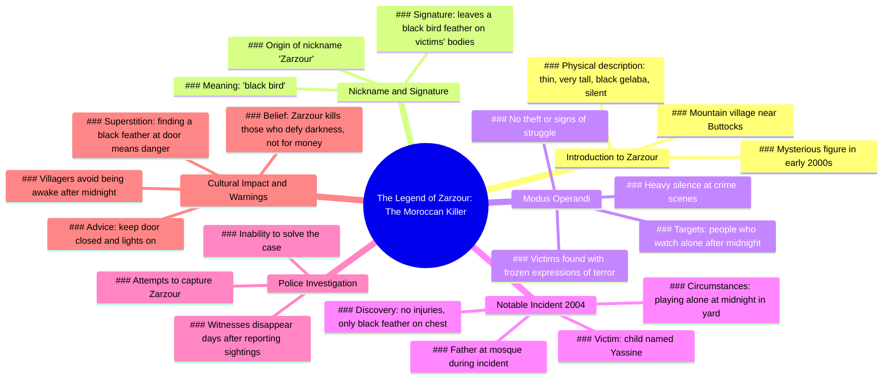

# The Moroccan Killer Zarzour: A Silent Stranger

> 🌐 **Read this in:** **English** · [中文](../../zh-CN/2026-06/tiktok-transcript-le-tueur-marocain-zarzour-horreurtiktok-horreur-histoire-mys-bfe8.md)

> **Creator:** [@murmuresdelarealite](https://www.tiktok.com/@murmuresdelarealite) · **Views:** 730.5K · **Posted:** 2026-06-11 · **Niche:** entertainment
>
> **TL;DR:** Opens with a mysterious name and location to immediately intrigue and draw in viewers.

[Watch original video →](https://www.tiktok.com/@murmuresdelarealite/video/7535214623457365270?lang=fr)

## Why This Went Viral

## Hook (first 3 seconds)
- **Verbatim opening line:** "Have you ever heard of the Moroccan killer nicknamed zarzour?"
- **Hook pattern:** Question + curiosity gap (introduces an unknown, specific figure with a mysterious nickname)
- **Why it stops scrolling:** The question implies a secret or legend the viewer hasn't heard, and "zarzour" is an unfamiliar, exotic name that triggers immediate intrigue. The combination of "Moroccan killer" and a nickname builds a dark, specific mystery that demands an answer.

## Emotional Rhythm
- **Beat 1 – Curiosity:** "Have you ever heard…" – opens a knowledge gap.
- **Beat 2 – Unease:** "thin, very tall, dressed in a black gelaba and who never spoke" – visual creepiness.
- **Beat 3 – Tension escalation:** "always left a black bird feather on the bodies" – signature detail creates pattern and dread.
- **Beat 4 – Suspense:** "people who watched alone after midnight" – sets a rule and a time constraint.
- **Beat 5 – Horror twist:** "a child named yassine played alone at midnight… a black feather on his chest" – innocent victim, no violence, just terror.
- **Beat 6 – Paranoia:** "all those who said they had seen it disappeared a few days later" – witness elimination raises stakes.
- **Beat 7 – Climax / Moral:** "zarzour… kills those who defy darkness" – gives the legend a purpose, a warning.
- **Beat 8 – Final chill:** "if one day you find a black feather… do not turn off the light" – direct call to action that lingers after video ends.

## Keyword Density
1. **"zarzour"** – 7 times. Drives algorithmic reach (unique, searchable name) and emotional pull (mystery, fear).
2. **"midnight" / "after midnight"** – 4 times. Algorithmic: time-specific triggers curiosity. Emotional: builds dread, rule-breaking.
3. **"black feather"** – 4 times. Algorithmic: visual, memorable. Emotional: iconic symbol of the killer.
4. **"alone"** – 3 times. Emotional: isolation amplifies fear, relatable vulnerability.
5. **"disappeared"** – 2 times. Emotional: consequence, threat of vanishing.
6. **"terror"** – 1 time. Emotional: peak intensity word.
7. **"silence"** – 2 times. Emotional: eerie, sensory detail.
8. **"child" / "yassine"** – 2 times. Emotional: innocence violated, increases horror.
9. **"door"** – 2 times. Emotional: home invasion fear, actionable warning.
10. **"darkness"** – 2 times. Emotional: primal fear, symbolic of the unknown.

## Why It Spreads
1. **Legend-format storytelling** – The video feels like an ancient campfire tale, not a news report. Lines like "it is said" and "nobody knew his real name" create a mythic, shareable aura. People share legends, not facts.
2. **Specific, visual details** – "black gelaba," "black bird feather," "frozen expression of terror" are easy to imagine and retell. The feather becomes a simple, creepy symbol that viewers can describe in one sentence.
3. **Rule-based horror** – "people who watched alone after midnight" and "do not turn off the light" give viewers a clear, actionable fear. This makes the story stick in memory and prompts comments like "I'm never staying up late again."
4. **Unresolved mystery** – The killer is never caught, witnesses disappear, and the ending is a warning. This open-endedness invites speculation, theories, and reposts (e.g., "Is this real?" "Has anyone else heard of Zarzour?").
5. **Direct address to viewer** – The final line "if one day you find a black feather in front of your door, close the door well and do not turn off the light" breaks the fourth wall, making the viewer feel personally threatened. This drives engagement (comments, shares, saves) because it feels like a warning meant for *them*.

## What You Can Steal
1. **Open with a question that implies a secret** – "Have you ever heard of…" instantly creates a knowledge gap. Use this pattern for any niche: "Have you ever heard of the ghost that haunts subway platform 7?" or "Have you ever heard of the algorithm that predicts your breakup?"
2. **Anchor horror in a simple, repeatable symbol** – The black feather is easy to remember and recognize. In your next video, choose one object (a red balloon, a single glove, a cracked mirror) that becomes the story's signature. This makes the story shareable and visually sticky.
3. **End with a direct, rule-based warning to the viewer** – "If you see X, do Y." This transforms passive watching into personal involvement. For non-horror: "If you get this email, don't click the link" or "If your phone rings at 3 AM, don't answer." It forces the viewer to imagine themselves in the scenario, increasing engagement and recall.

## Mind Map

## Full Transcript (Generated by [the tool we used to generate this](https://toktranscript.com/?utm_source=github&utm_medium=breakdown&utm_campaign=tool_attribution))

> 📝 Transcripts on this page are auto-generated and show the first 60%. Want to transcribe any TikTok in 30 seconds and get the full version? [Try TokTranscript free →](https://toktranscript.com/?utm_source=github&utm_medium=breakdown&utm_campaign=transcript_cta)

Have you ever heard of the Moroccan killer nicknamed zarzour? In the early two thousand years, in a mountain village near the buttocks, the inhabitants started talking about a strange man, thin, very tall, dressed in a black gelaba and who never spoke. Nobody knew his real name, but he nicknamed him zarzour, because he always left a black bird feather on the bodies of his victims, his victims. Always people who watched alone after midnight. Nothing was stolen, no sign of struggle, only a heavy silence and a frozen expression of terror on their faces. In two thousand four, a child named yassine played alone at midnight in the yard of his house while his father was at the mosque.

*[Read the full transcript on TokTranscript →](https://toktranscript.com/plaza/tiktok-transcript-le-tueur-marocain-zarzour-horreurtiktok-horreur-histoire-mys-bfe8?utm_source=github&utm_medium=breakdown&utm_campaign=transcript_full)*

## Browse More

- All [entertainment](../../by-niche/en/entertainment.md) breakdowns
- All [Rhetorical question with exotic hook](../../by-pattern/en/hook-rhetorical-question-with-exotic-hook.md) examples

## Video Info

| | |
|---|---|
| Creator | [@murmuresdelarealite](https://www.tiktok.com/@murmuresdelarealite) |
| Original video | [https://www.tiktok.com/@murmuresdelarealite/video/7535214623457365270?lang=fr](https://www.tiktok.com/@murmuresdelarealite/video/7535214623457365270?lang=fr) |
| Original title | le tueur marocain zarzour #horreurtiktok #horreur #histoire #mystery ... |
| Views | 730.5K (730500) |
| Posted | 2026-06-11 |
| Duration | 0s |
| Niche | `entertainment` |
| Hook pattern | `Rhetorical question with exotic hook` |
| Original language | `en` |
| Available languages | en, zh-CN |
| Generated | 2026-06-12 by [TokTranscript](https://toktranscript.com/) |

---

*This breakdown is for educational analysis under fair use. Original video © [@murmuresdelarealite](https://www.tiktok.com/@murmuresdelarealite). All transcripts are auto-generated and may contain errors.*

*Want to analyze your own TikToks like this? [try this transcription tool →](https://toktranscript.com/viral-breakdown?utm_source=github&utm_medium=breakdown&utm_campaign=footer_cta)*