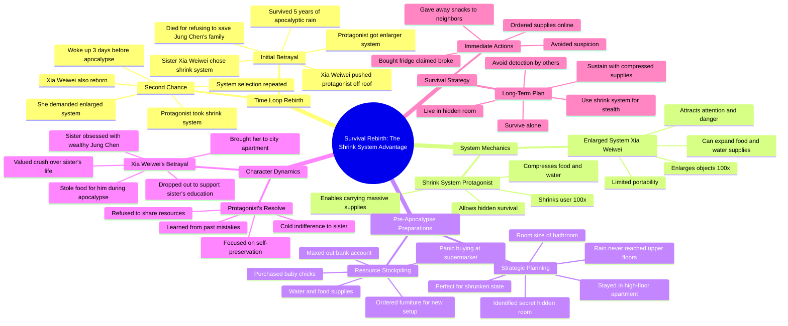

# Sisters Get Shrink and Enlarge Systems Before Apocalypse

> 🌐 **Read this in:** **English** · [中文](../../zh-CN/2026-06/tiktok-transcript-loredeepdive-tiktoktvfilmcontest-shortdramareview-tiktok-fyp-6822.md)

> **Creator:** [@etuscx](https://www.tiktok.com/@etuscx) · **Views:** 1.4M · **Posted:** 2026-06-20 · **Niche:** entertainment
>
> **TL;DR:** The hook presents a random, high-stakes choice between two systems, instantly creating intrigue and conflict.

[Watch original video →](https://vt.tiktok.com/ZSQ3pu6ro/)

## Why This Went Viral

## Hook (first 3 seconds)
- **Verbatim opening line:** "Me and my little sister randomly got two systems. One that shrinks things 100 x, 1 that enlarges things 100 x."
- **Hook pattern:** **Scene + Contrast** (two opposing powers, immediate sibling rivalry setup).
- **Why it stops scrolling:** The "two systems" premise is instantly intriguing and novel. The contrast between "shrink" and "enlarge" creates a clear, high-stakes choice. The sibling dynamic ("she didn't even hesitate") adds immediate emotional tension and relatability (who hasn't felt slighted by a sibling?).

## Emotional Rhythm
- **Beats:**
    1. **Curiosity** (0–5s): "Two systems, she grabbed the shrink, I got the enlarger" – sets up a puzzle.
    2. **Tension** (5–15s): "Apocalyptic downpour... five brutal years... she shoved me off the roof." – stakes skyrocket instantly.
    3. **Shock/Twist** (15–20s): "Right before everything went dark, I blinked. And suddenly I was back three days before the apocalypse." – time-loop reveal.
    4. **Relief/Resolve** (20–30s): "I'll take the shrink system." – protagonist gains control.
    5. **Vindication** (30–45s): "She yanked the front door open and went straight to knock on Jung Chen's door." – antagonist's predictable mistake.
    6. **Satisfaction/Strategy** (45s–end): "I jumped in my car and headed straight to a big supermarket. Full on panic buy mode." – proactive, smart preparation.
- **Climax moment:** "She's been reborn, just like me. I let out a cold laugh inside." – the moment the protagonist realizes she's not alone in the time loop, and the revenge/survival game truly begins.

## Keyword Density
- **Strongest repeated words/phrases:**
    1. **"System"** (8x) – core mechanic, drives algorithmic discoverability (keyword for survival/game genres).
    2. **"Shrink" / "Enlarge"** (12x combined) – unique power contrast, high recall.
    3. **"Apocalypse" / "Rain"** (6x) – genre tag, high search volume.
    4. **"Sister"** (10x) – emotional anchor, family betrayal trope.
    5. **"Jung Chen"** (6x) – antagonist's love interest, creates romantic subplot tension.
    6. **"Last time" / "Reborn"** (5x) – time-loop / second-chance narrative, high engagement.
    7. **"Protect" / "Betray"** (4x) – emotional pull, drives comments ("she killed her own sister!").
- **Algorithmic reach drivers:** "System," "Apocalypse," "Reborn" – high-volume search terms in web novel / LitRPG / survival niches.
- **Emotional pull drivers:** "Sister," "Betray," "Protect" – trigger strong reactions (anger, sympathy, justice).

## Why It Spreads
1. **High-stakes betrayal + time-loop revenge hook:** "She shoved me off the roof" → "I blinked and was back." This is a classic, proven narrative engine (see *Re:Zero*, *Mother of Learning*). The twist that *both* sisters are reborn ("She's been reborn, just like me") adds a unique strategic layer that fuels speculation and "what would you do?" comments.
2. **Clear, relatable villain:** Xiao Weiwei is immediately despicable (greedy, selfish, prioritizes a crush over family). "You throw me away for John Chen and his family?" – this line is a lightning rod for outrage and identification. Viewers love to hate her.
3. **Smart, satisfying protagonist strategy:** "I'll take the shrink system. It can also compress food and water. So I can carry way more." – this is a *tactical* revenge, not just emotional. It makes viewers feel smart for rooting for her. The "panic buy" sequence ("Stocked up on water and food. Even grabbed a batch of baby chicks.") is deeply satisfying and shareable (people love prepper content).
4. **Cliffhanger + world-building:** "The hidden room in my bedroom... About the size of a bathroom, but for a shrunken version of me." – ends on a promise of more clever survival tactics. This drives "part 2?" comments and keeps people in the algorithm loop.
5. **Universal emotional resonance:** Sibling rivalry, betrayal, second chances, and the fantasy of outsmarting someone who wronged you. These are primal, cross-cultural themes that trigger strong emotional reactions and shares.

## What You Can Steal
1. **Start with an immediate, high-stakes choice:** Don't explain the world; drop the viewer into a dilemma with clear consequences. "She grabbed the shrink system" is better than "Let me tell you about these systems." The hook is the *decision*, not the premise.
2. **Use the "double reveal" twist:** The audience thinks the protagonist is the only one who time-traveled, then you reveal the antagonist did too. This creates a new layer of tension and makes the protagonist's cold laugh feel earned. In your next video, set up an assumption, then subvert it with a second reveal.
3. **End with a specific, actionable plan:** Don't just have the protagonist "get ready." Show her *buying baby chicks* and *finding a secret room*. Specificity makes the preparation feel real and gives viewers a concrete fantasy to latch onto. "I jumped in my car and headed straight to a big supermarket" is infinitely more shareable than "I prepared for the apocalypse."

## Mind Map

## Full Transcript (Generated by [TokTranscript](https://toktranscript.com/?utm_source=github&utm_medium=breakdown&utm_campaign=tool_attribution))

> 📝 Transcripts on this page are auto-generated and show the first 60%. Want to transcribe any TikTok in 30 seconds and get the full version? [Try TokTranscript free →](https://toktranscript.com/?utm_source=github&utm_medium=breakdown&utm_campaign=transcript_cta)

Me and my little sister randomly got two systems. One that shrinks things 100 x, 1 that enlarges things 100 x. She didn't even hesitate. She straight up grabbed the shrink system. And all I got was the enlarger. Three days later, the apocalyptic downpour hit right on schedule. I had the enlarged system, so I stretched every last bit of supplies. We had barely kept it together, but I got us through five brutal years. Then the second the rain finally stopped, Xia Weiwei went and shoved me off the roof. The look in her eyes was pure venom. If you weren't so selfish, I could have used the enlarged ability to save Jung Chen's whole family. You heartless woman. Right before everything went dark, I blinked. And suddenly I was back three days before the apocalypse. That cold, robotic voice echoed in my head again. Please choose your system immediately. I was completely disoriented. Then I looked over at Xiao Weiwei. She froze for, like, a split second. Then she lost it, screaming, I want the enlarged system! One look at that greedy expression on her face, and everything clicked for me. She went back in time, too. She's been reborn, just like me. I let out a cold laugh inside. You throw me away for John Chen and his family? You wanted your own sister gone? Fine. I'll make that happen. The shrink system doesn't just shrink me. It can also compress food and water. So I Can carry way more. Once I figured that out, I kept my voice completely flat. All right then. I'll take the shrink system. Xiaoweiwei couldn't wait to test her new power. She waved her hand and blew up the water glass on the table 100 times. Oh, my god, it actually works. I stood there watching her show off, stone faced. This is the sister I nearly died protecting last time around. That rain fell for five straight years. Everyone got trapped inside their buildings. Outside supplies were long gone. I kept enlarging the last of our instant noodles and bread with that system. That's the only reason we survived. Xiao Weiwei's boyfriend, Jung Chen, lived right across the hall. She got down on her knees and begged me to save his family. But I knew how dark people got in the apocalypse. I said no because we flat out didn't have enough. Jung Chen's family didn't make it through those five years. They starved to death in their apartment. The irony. I survived the disaster, only to get killed by the very sister I've been protecting all along. The enlarged system is mine now. Bet you're dying of jealousy, huh? I let out a slow breath and played it cool, smiling like I didn't care. It's just a system. Not a big deal. You want it, it's yours. I don't care. I must have looked convincing enough. Xiaoweiwei finally relaxed. Watching her grin like she'd already won, I knew Exactly what was coming. She'd worshiped Jung Chen's family like royalty. But the moment she let anyone know about that system, she wouldn't last a single day in the apocalypse. Sure enough, just like I expected, she yanked the front door open and went straight to knock on Jung Chen's door. Xia Weiwei. What's up, Jung Chen? I need to talk to you. Inside, I watched their door close and pulled out my phone. August 15th. Three full days until the rain hits. There was still time to fix everything. I jumped in my car and headed straight to a big supermarket. Full on panic buy mode. Stocked up on water and food. Even grabbed a batch of baby chicks. Then I shot over to a furniture store, ordered a whole furniture set for my new setup. My apartment was already on a high floor. The rain never reached us last time, so I wasn't moving, just living differently. Every single minute. After that, I was buying. Didn't stop until I'd maxed out every last cent in my account. That night, Xiao Weiwei came home all giddy, acting like her and Jung Chen were already married. If I saved Jung Chen's whole family, you think he'd fall head over heels for me? She had this full on simp face. I hit her with the Cold Truth. No, don't even think about it. She snapped like I'd stepped on her tail. You're lying. Jung Chen totally likes me.

*[Read the full transcript on TokTranscript →](https://toktranscript.com/plaza/tiktok-transcript-loredeepdive-tiktoktvfilmcontest-shortdramareview-tiktok-fyp-6822?utm_source=github&utm_medium=breakdown&utm_campaign=transcript_full)*

## Browse More

- All [entertainment](../../by-niche/en/entertainment.md) breakdowns
- All [Choice with consequence](../../by-pattern/en/hook-choice-with-consequence.md) examples

## Video Info

| | |
|---|---|
| Creator | [@etuscx](https://www.tiktok.com/@etuscx) |
| Original video | [https://vt.tiktok.com/ZSQ3pu6ro/](https://vt.tiktok.com/ZSQ3pu6ro/) |
| Original title | #loredeepdive #tiktoktvfilmcontest #ShortDramaReview#tiktok#fyp |
| Views | 1.4M (1400000) |
| Posted | 2026-06-20 |
| Duration | 0s |
| Niche | `entertainment` |
| Hook pattern | `Choice with consequence` |
| Original language | `en` |
| Available languages | en, zh-CN |
| Generated | 2026-06-21 by [TokTranscript](https://toktranscript.com/) |

---

*This breakdown is for educational analysis under fair use. Original video © [@etuscx](https://www.tiktok.com/@etuscx). All transcripts are auto-generated and may contain errors.*

*Want to analyze your own TikToks like this? [free TikTok transcript generator →](https://toktranscript.com/viral-breakdown?utm_source=github&utm_medium=breakdown&utm_campaign=footer_cta)*