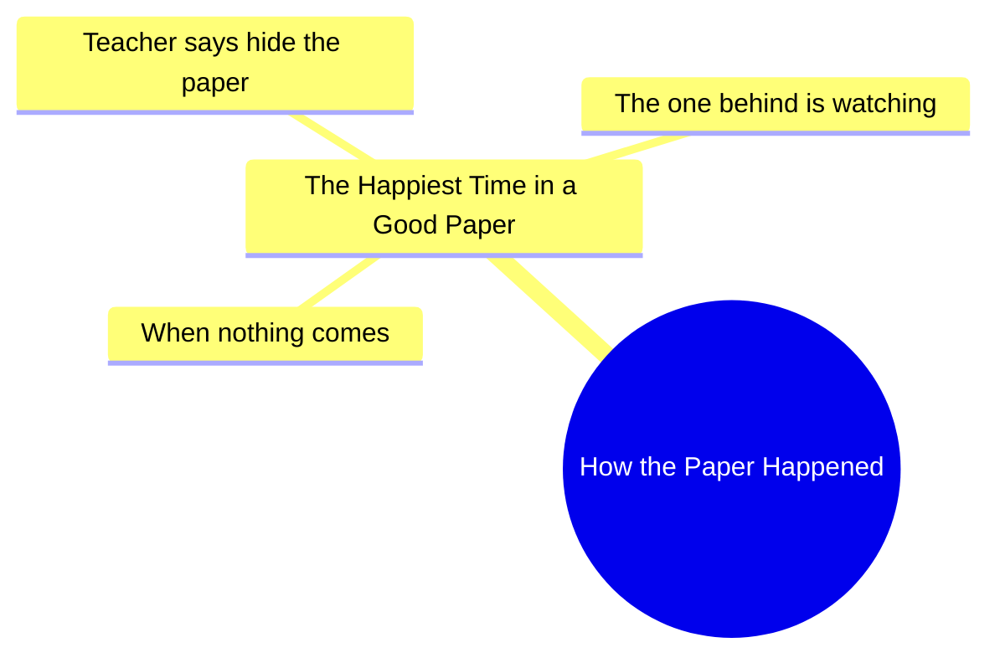

# Happiest Time in a Paper: Teacher Says Hide It

> 🌐 **Read this in:** **English** · [中文](../../zh-CN/2026-06/tiktok-transcript-money-monky-viral-video-monky-55f2.md)

> **Creator:** [@karenkarma11](https://www.tiktok.com/@karenkarma11) · **Views:** 2.5M · **Posted:** 2026-06-16 · **Niche:** other
>
> **TL;DR:** The hook uses a rhetorical question to draw in viewers, then subverts expectations with a relatable school scenario.

[Watch original video →](https://vt.tiktok.com/ZSQqVwuKU/)

## Why This Went Viral

## Hook (first 3 seconds)
- **Verbatim:** "How the paper happened" (spoken in a fast, curious tone)
- **Hook pattern:** **Question + Scene** — a rhetorical, cryptic question immediately followed by a relatable classroom scene.
- **Why it stops scrolling:** The question is vague yet specific (“the paper” — a universal school stressor). It creates instant curiosity: *What paper? What happened?* Viewers need to see the answer, especially if they’ve lived that moment.

## Emotional Rhythm
- **Beat 1 — Curiosity (0–3s):** “How the paper happened” — sets up a mystery.
- **Beat 2 — Tension (3–6s):** “What is the happiest time in a good paper?” — builds anticipation with a rhetorical question.
- **Beat 3 — Relief/Recognition (6–9s):** “When nothing comes and the teacher says hide the paper” — the payoff is relatable, a shared inside joke.
- **Beat 4 — Twist/Humor (9–12s):** “The one behind is watching” — adds a comedic betrayal: the student behind you is cheating off your hidden paper. This flips the relief into a new tension (being caught or copied).
- **Climax:** The line “The one behind is watching” — it’s the punchline that makes the video memorable and shareable.

## Keyword Density
1. **Paper** — repeated 3 times; drives the core concept and searchability (school, exam, test).
2. **Teacher** — appears once but is implied throughout; algorithmic reach for “teacher” clips.
3. **Hide** — strong emotional verb; triggers memory of hiding answers.
4. **Watching** — creates paranoia and humor; drives shareability.
5. **Happiest** — contrast word; irony (happiest moment is about hiding/survival).
6. **Behind** — positional word; sets up the twist.
- **Algorithmic drivers:** “paper,” “teacher,” “hide” — high search volume in education/humor niches.
- **Emotional pull:** “happiest,” “watching” — tap into nostalgia and shared anxiety.

## Why It Spreads
1. **Universal school memory** — “Hide the paper” is a ritual almost every student knows. The video activates collective nostalgia, making viewers tag friends who “did this.”
2. **Twist ending** — “The one behind is watching” subverts the expected “relief” moment. That surprise is the share trigger: viewers send it to friends who were “the one behind.”
3. **Short, tight structure** — 12 seconds, no wasted words. The pattern (setup → question → payoff → twist) is optimized for retention loops and rewatches.
4. **Relatable anxiety → humor** — The video turns a stressful moment (exam pressure) into a joke. That relief + humor combo makes it feel like a “safe” share (not too dark, not too silly).
5. **Implied dialogue** — The transcript reads like a scripted voiceover, but it mimics real classroom chatter. This “overheard” quality makes it feel authentic and easy to remix or react to.

## What You Can Steal
1. **The “cryptic question + scene” hook** — Start with a vague, curiosity-driving question (“How the [universal experience] happened?”) then immediately cut to a visual that answers it. This buys you 2–3 seconds of retention.
2. **The “relief → twist” emotional flip** — Build a moment of shared relief (“teacher says hide the paper”), then undercut it with a new tension (“the one behind is watching”). This creates a punchline that feels earned and surprising.
3. **Use “implied audience” language** — Phrases like “the one behind” make viewers mentally insert themselves (or their friends). This triggers tagging and commenting. Always leave a role open for the viewer to fill.

## Mind Map

## Full Transcript (Generated by [TokTranscript](https://toktranscript.com/?utm_source=github&utm_medium=breakdown&utm_campaign=tool_attribution))

> 📝 Transcripts on this page are auto-generated and show the first 60%. Want to transcribe any TikTok in 30 seconds and get the full version? [Try TokTranscript free →](https://toktranscript.com/?utm_source=github&utm_medium=breakdown&utm_campaign=transcript_cta)

How the Paper Happened What is the happiest time in a good paper?

*[Read the full transcript on TokTranscript →](https://toktranscript.com/plaza/tiktok-transcript-money-monky-viral-video-monky-55f2?utm_source=github&utm_medium=breakdown&utm_campaign=transcript_full)*

## Browse More

- All [other](../../by-niche/en/other.md) breakdowns
- All [Rhetorical question with unexpected answer](../../by-pattern/en/hook-rhetorical-question-with-unexpected-answer.md) examples

## Video Info

| | |
|---|---|
| Creator | [@karenkarma11](https://www.tiktok.com/@karenkarma11) |
| Original video | [https://vt.tiktok.com/ZSQqVwuKU/](https://vt.tiktok.com/ZSQqVwuKU/) |
| Original title | پیپر میں خوشی کس وقت ہوتی    🤣😂😅ہے #money #monky #viral #video #monky  |
| Views | 2.5M (2500000) |
| Posted | 2026-06-16 |
| Duration | 0s |
| Niche | `other` |
| Hook pattern | `Rhetorical question with unexpected answer` |
| Original language | `en` |
| Available languages | en, zh-CN |
| Generated | 2026-06-17 by [TokTranscript](https://toktranscript.com/) |

---

*This breakdown is for educational analysis under fair use. Original video © [@karenkarma11](https://www.tiktok.com/@karenkarma11). All transcripts are auto-generated and may contain errors.*

*Want to analyze your own TikToks like this? [the tool we used to generate this →](https://toktranscript.com/viral-breakdown?utm_source=github&utm_medium=breakdown&utm_campaign=footer_cta)*