# Build AI Agent That Handles Emails and Meetings

> 🌐 **Read this in:** **English** · [中文](../../zh-CN/2026-06/tiktok-transcript-most-people-overcomplicate-ai-agents-i-built-one-that-handle-0ccc.md)

> **Creator:** [@stephengpope](https://www.tiktok.com/@stephengpope) · **Views:** 1.3M · **Posted:** 2026-06-09 · **Niche:** tech
>
> **TL;DR:** Opens with a high-value hypothetical that immediately hooks viewers dreaming of automation and income.

[Watch original video →](https://www.tiktok.com/@stephengpope/video/7501359036789574955?_r=1&_t=ZS-972wkiaqqNJ)

## Why This Went Viral

## Hook (first 3 seconds)
- **Verbatim opening line:** "What if you could build your own AI assistant? One that writes emails, books, meetings, handles customer questions, or even sells for you without being an AI expert."
- **Hook pattern:** Bold promise + rhetorical question + list of high-value outcomes
- **Why it stops scroll:** It targets a massive pain point (AI overwhelm/exclusion) with an irresistible "you can do this too" framing. The question format creates an open loop — the viewer *needs* to know the answer. The list of actions (writes emails, books meetings, sells) hits multiple desires at once.

## Emotional Rhythm
- **Beat 1: Curiosity** — "What if you could build your own AI assistant?" Opens a possibility gap.
- **Beat 2: Desire + Status** — "Sell these AI agents to your clients for $5,000 or more." Triggers greed/ambition.
- **Beat 3: Credibility** — "$100,000 per month, all without writing a single line of code." Social proof + removes fear.
- **Beat 4: Tension relief** — "It's a lot easier than you think." Lowers barrier.
- **Beat 5: Urgency + FOMO** — "Put you ahead of 99% of all the other people trying to figure out AI." Status threat.
- **Beat 6: Demo (satisfaction)** — Live Telegram demo shows it working. Concrete proof.
- **Beat 7: Educational payoff** — "I'll explain all the logic." Viewer feels smart for staying.
- **Climax moment:** The live demo where the agent books the calendar event — *"I heard back from Steven. Can you go ahead and book that event tonight?"* → calendar shows it worked. This is the "magic" moment.

## Keyword Density
| Keyword/Phrase | Count | Driver |
|---|---|---|
| AI agent(s) | 18 | Algorithmic reach (trending topic) + emotional (new, powerful) |
| Build/build out | 9 | Emotional (agency, empowerment) |
| Telegram | 5 | Algorithmic (specific tool, searchable) |
| Demo | 4 | Emotional (proof, trust) |
| Sell/selling | 4 | Emotional (greed, business value) |
| Without writing a single line of code | 2 | Emotional (relief, accessibility) |
| 99% of people | 1 | Emotional (status, FOMO) |
| $100,000 per month | 1 | Algorithmic (high-value number) + emotional (greed) |
| N8N | 5 | Algorithmic (brand search, tool-specific) |
| Think/thinking | 4 | Emotional (intellectual payoff, "you're smart") |

- **Algorithmic drivers:** "AI agent," "Telegram," "N8N," "sell" — these are high-search-volume terms that also signal authority.
- **Emotional drivers:** "Build," "demo," "99%," "without code" — these trigger agency, proof, status, and relief.

## Why It Spreads
1. **"You can sell this for $5,000"** — The video explicitly frames the skill as a revenue stream. Viewers share it with peers because it promises a path to income, not just knowledge. *Line: "Now imagine being able to sell these AI agents to your clients for $5,000 or more."*
2. **Live demo removes skepticism** — The Telegram demo is concrete. Viewers see the agent actually send an email and book a calendar. This builds trust and makes the claim feel real. *Line: "I can double check here in Gmail... the agent was able to successfully book that."*
3. **"Put you ahead of 99% of people"** — Status threat + FOMO is a powerful share trigger. People share to signal their own intelligence or to help friends who feel behind. *Line: "Unlocking a new skill set that will put you ahead of 99% of all the other people trying to figure out AI."*
4. **Step-by-step build + free template** — The video offers a downloadable template ("No Code Architects community inside the classroom"). This reduces friction for viewers to try it themselves, increasing completion rate and shares. *Line: "This automation can be found in the No Code Architects community inside the classroom... you'll have the entire automation set up just like that."*
5. **Educational depth + clarity** — The creator explains *why* agents work, not just how. This builds authority and makes the video bookmark-worthy. Viewers save it for later reference. *Line: "What an AI agent does is that it actually does some amount of thinking to determine what path to take in your automation."*

## What You Can Steal
1. **Open with a "what if" question that lists 3–5 specific pain-solving outcomes.** Don't just say "build an AI assistant." Say "one that writes emails, books meetings, handles customer questions, or even sells for you." Specificity = believability.
2. **Include a live, real-time demo early in the video.** Show the tool working with a real task (e.g., sending an email, booking a meeting). This builds instant trust and proves the claim before the tutorial even starts.
3. **Give away a template or resource that lowers the barrier to action.** Even if it's just a link to a template or a community, offering a "shortcut" increases the likelihood viewers will try it — and share it with others who want the same shortcut.

## Mind Map

```mermaid
mindmap
  root((Build Your Own AI Assistant: A Complete Guide))
    Introduction and Overview
      ### The Vision: Build and Sell AI Agents
          Create AI assistants without coding expertise
          Sell AI agents to clients for $5,000+
          Generate significant monthly revenue e.g., $100,000/month
      ### What You Will Learn
          How AI agents work
          When to use them and when not to
          How to customize and sell them as a service
          Unlock a skill set ahead of 99% of AI learners
    Demo: AI Voice Assistant in Action
      ### Using Telegram for Voice and Text
          Send voice notes on the go
          Agent responds in text or voice if configured
      ### Example Tasks Performed
          Send an email to a contact e.g., Steven Pope
              Check Gmail for confirmation
          Book a calendar event
              Verify event on calendar
      ### Speed and Simplicity
          Built in just a few minutes
          Integrates with contacts and calendar
    Core Concepts: What Are AI Agents?
      ### Definition and Purpose
          AI agents think to determine the path in automation
          Needed when automation requires decision-making
      ### Primary Functions
          Monitor chat conversations
          Identify user intent e.g., send email, book meeting
          Select the right tool and extract required inputs
      ### Types of AI Agents
          Specific agents: Use predefined tools with high success rates
              Example: Today's Telegram agent
          Advanced agents: Execute entire tasks autonomously e.g., OpenAI's Operator
              More prone to errors or getting stuck
          Hybrid agents: Fall between specific and fully autonomous
    Building the AI Agent: Step-by-Step
      ### Setting Up the Environment
          Use N8N for automation development
          Import template from No Code Architects community optional
          Create a new workspace and import file
      ### Adding the Chat Model The Brain
          Connect to OpenAI e.g., GPT-4o for better performance
          Downgrade to cheaper model after testing
      ### Adding Memory
          Use window buffer memory for conversation recall
          Enables agent to remember past messages
      ### Testing with Built-in Chat
          N8N provides a chat interface for testing
          Agent responds like ChatGPT without tools
    Adding Tools to the Agent
      ### Tool 1: Get Contacts
          Connect to Airtable or CRM
              Create a simple table with name and email
          Set operation to search
          Return all records or use formula for filtering
          Name the tool descriptively: 'Get Contacts'
              Helps agent identify the right tool
      ### Tool 2: Send Email
          Connect to Gmail with credentials
          Set resource to message and operation to send
          Map fields to AI agent
              Use AI button for automatic field definition
              Subject and message extracted from conversation
          Disable N8N's appended message optional
          Name the tool: 'Send Email'
      ### Tool 3: Book Calendar Event
          Connect to Google Calendar
          Set operation to create event
          Map fields to AI agent
              Event title, date/time, and participants extracted
          Name the tool: 'Book Event'
    How the Agent Makes Decisions
      ### Tool Selection Process
          Agent listens to conversation for intent
          Matches intent to tool names and descriptions
          Extracts required inputs from chat
      ### Debugging and Optimization
          View agent's decision-making in N8N
          Check memory and tool usage
          Refine tools and names for better accuracy
    Final Steps: Integrating with Telegram
      ### Replace Built-in Chat with Telegram
          Connect Telegram trigger node
          Set up Telegram bot for receiving messages
      ### Respond Back to Telegram
          Use Telegram send message node
          Configure for text or voice responses
      ### Test the Full Workflow
          Send voice notes or text via Telegram
          Agent performs tasks email, booking seamlessly
    When to Use AI Agents
      ### Ideal Use Cases
          Tasks requiring decision-making and conversation
          Automating repetitive business processes email, scheduling
          Building client-facing AI services
      ### When Not to Use
          Simple, rule-based automations no thinking needed
          High-risk tasks where errors are costly
      ### Selling AI Agents as a Service
          Offer to clients for $5,000+
          Customize tools for specific business needs
          Leverage high success rates of specific agents
```

## Full Transcript (Generated by [free TikTok transcript generator](https://toktranscript.com/?utm_source=github&utm_medium=breakdown&utm_campaign=tool_attribution))

> 📝 Transcripts on this page are auto-generated and show the first 60%. Want to transcribe any TikTok in 30 seconds and get the full version? [Try TokTranscript free →](https://toktranscript.com/?utm_source=github&utm_medium=breakdown&utm_campaign=transcript_cta)

What if you could build your own AI assistant? One that writes emails, books, meetings, handles customer questions, or even sells for you without being an AI expert. Now imagine being able to sell these AI agents to your clients for $5,000 or more. Just like the AI automation product that I sell that helps me generate more than $100,000 per month, all without writing a single line of code. Sound impossible? That's the power of AI agents. It's a lot easier than you think. Let me show you how. By the end of this video, you won't just have an AI assistant. You'll understand how AI agents work, when to use them and when not to use them, and how to customize or sell them as a service. This isn't just about building something cool. It's about unlocking a new skill set that will put you ahead of 99% of all the other people trying to figure out AI. So here's the plan. First, I'll demo an AI powered voice agent using Telegram. And then while we build it out from scratch, we'll talk about what AI agents actually are, why they matter, how they work, and when to use them. We'll build out your first agent, and along the way, I'll explain all of the logic that you need to know in order to imagine, build, and sell your own agents. So here's the agenda today. First, I'll do a demo of the AI powered voice assistant, and Then we'll get into the build. And while we do that build, we'll talk about why agents matter. And then we'll build out that entire Telegram AI voice agent. If you have ever felt overwhelmed by AI, feel like you're getting left behind, or if you've wasted hours trying to figure out where to start, this video is for you. Let's get started. Alright, so now let's go ahead and show you how this AI voice assistant actually works. And I'm building this out in Nathan largely for this AI agent that they have, which I'll explain in more detail in a bit. Now, I'm specifically using Telegram because I can send it voice notes, which is easy to do when you're on the go. I can also send a message and type that in as well, but I wanted the ability to send voice notes. Currently, I have the agent responding in text, but I could also have the agent respond in a voice note as well. So I'm here on my phone here. I'm gonna send an email to Steven. could you reach out to Steven Pope and see if he's available tonight, February 22nd, for a meeting to talk about YouTube and what we're gonna publish next week at 5 p m. So you can see there that we got the message back from the agent saying that they sent out the message. I can double check here in Gmail. Hey, Steven, hope this message finds you Well, are you available tonight to talk about the YouTube video that we're gonna publish next week? Looking forward to your response. So now let's just go ahead and assume he confirmed. I heard back from Steven. Can you go ahead and book that event tonight? So we got that message back, and now if we check out the calendar, we can see. I tried to book a meeting with myself tonight at 5:00 to talk about the YouTube video, and you can see here on my phone that the agent was able to successfully book that. So this AI assistant only took a few minutes to build a consent emails. It can get all of your contacts and book events. Now, let's go ahead and build this out from scratch. And along the way, I'll explain the important things that you need to know about AI agents. When to use them, how they work, which ones to use. Everything that you need to know about AI agents. Now, this automation that we're reviewing today can be found in the No Code Architects community inside the classroom. When you click on this resource here, it'll download the template, and then from within 8 and N, you simply create a new workspace and import the file, and you'll have the entire automation set up just like that. But I'm also gonna build this entire automation from scratch. So let's get started. So I'm gonna start with the AI agent. Just to Talk a little bit about this agent and how it works and how to think about it. Because this agent is one of the primary reasons why I'm currently using N8N to develop some automations. They make it very straightforward to you add an AI agent that even make it so that you can chat with it without actually hooking up something like Telegram, which isn't necessarily hard. But when you want to chat with your agent just to test, it's quite nice to just be able to open up a chat and say hello. Now, we haven't configured this agent yet, so we're getting an error. But let's talk a little bit about what an agent really is. From my point of view, what an AI agent does is that it actually does some amount of thinking to determine what path to take in your automation. So you really only need an AI agent when you need your automation to think. Now, realistically, these agents really only have two functions. They monitor the chat, and then from that chat, which is just a typical conversation that you'd have with anybody, like a real assistant, it's trying to figure out, okay, what exactly does this person want to do? Like, do they want to send an email? And if the agent, through the conversation, is able to figure out that they want to send an email, it then has to figure out, okay, who is this email to? What is The subject and what is the contents of that email? So this agent is simply trying to figure out what is the tool we need to use right now. And then for that given tool, what are the different inputs that we need? Right, so we talked about what we need for email, but to book a calendar event, we'll need who is the event with and what is the date and time. And there are other types of agents as well, like Open AI's operator. This is an agent that actually runs on your PC, and then you can give it some simple instructions find and book the highest rated one day tour of Rome on Tripadvisor. And then it will actually take control of your PC and try to execute the entire task on its own. And so you can see here, there is a wide range of AI agents, those that understand specific tools and how to use those tools. And then there are other agents all the way on the other spectrum, where you give it a task and it tries to figure out everything on its own. And there really is a place for both of these agents. Really, the strength of the agent that we're gonna build today is that it's much more specific, the tools are more simple, and it's much more likely to succeed without any human intervention. These more advanced AI agents are trying to accomplish the entire task on Their own, which you can imagine is much more prone to error or they're like much more likely to make a mistake or get stuck. And then of course there's AI agents that are in between the more specific and the ones that are completely automated all on their own. And so again, the agent we're building today is definitely more specific. Where we give it specific tools and then we show it how to use those tools and that is really all that it can do. But the advantage to that is that it's much more simple and you're much more likely to get 100% success rate. Alright, so now let's explain a bit about how this AI agent works. There's a few different things that we need to hook up to this agent in order for it to work. We need to add a chat model. In this example, I'm just simply going to use open AI and I'll just go ahead with its pre built decisions here. You might actually go with GPT4O to start. This model tends to perform a bit better. And you can always downgrade it to a more cheaper model after you get it working. So the first thing that we added here was the chat model. And this is really the brain. This is what allows your agent to think on its own. If you think about a robot here where we have a head, a body and then the legs inside This head here, we definitely want to have a brain. Now, also, in order to make this agent work well, is we need a memory. As it's talking to us, it needs to be able to remember the conversations back and forth, not just remembering the last message that you sent. So in order to add memory, we're gonna come here, and we're simply going to use the window buffer memory. This is the easiest one to set up. We can go ahead and leave these details as is, and that should be everything that we need in order to test this. I'm gonna go ahead and type hello. So again, we just use this built in chat interface to start interacting. Before we've actually set up something like Telegram where we can chat with it in a typical interface that we're used to. But again, this is why I like N A N, because it gives you this chat interface so that you can go ahead and start chatting with your agent without having to set up anything else. So this is really great for testing. So I said, hello, and I said, hey, how can I assist you today? What are you able to help me with? So right now, it's just giving us some general information on how it could help. And it's really just using this chat GPT model right here to answer any of those questions. It doesn't have any additional tools to pull from In order to help us, it can really only help us as much as ChatGPT could hear. So if we were to log into ChatGPT, it would really be like conversing with Openai ChatGPT through the UI interface. So as you can imagine, that's not terribly helpful. So we're gonna add in our own tools as well. And you can also see here that the agent is also accessing its memory, so that as these messages come in, it's not forgetting the previous conversation. And the cool thing about these agents are, is that you can actually see what's actually happening in that agent. How is it making decisions? What are the previous conversations it's had? As it updates its memory and as it's chatting with ChatGPT and as it's using these tools, you can always come back here to debug how the agent is actually working and make it better. And so, again, before we move on, remember the primary objective of this agent is to converse with whomever it is via chat, and then to identify the right tool to solve the problem for the particular chat that is happening right now. And then once you identify what tool to use, whether it's to send an email, to get the contact list, or to book a meeting, it's to identify what information do we need to execute that tool. Let's have the conversation with the user to make sure we have that information, whatever it is. And then Once we have it, let's execute this tool to make it actually happen. Alright? So now let's go ahead and add the three tools that we need for this particular AI agent. And then once we're done, we'll come back and we'll replace this built in chat that we have in N8N, and we'll replace it with Telegram. And we'll actually respond back to Telegram. But until then, we'll just use the built in chat that N8N has to make things easier so we can focus on the tools. So first, let's go ahead and add a tool to actually look up our contacts. So for our contact database, I'm gonna go ahead and use Airtable. Now, I've gone ahead and added an airtable base. It's very simple. It's just a contacts list that keeps track of names and email addresses. For our AI agent, this could easily be hooked up to your CRM instead. So you'll want to create a connection to your Airtable base and then you just simply want to create a very simple table with name and email. That's all you need. And you'll be able to use a free account on Airtable for this example. Now in this case, we're using this to search the contact list for all of our contacts so we can get their email when we need to send them something. So for this, I'm gonna change the operation to search. Then we're gonna search a base type contact list. We'll Select that base. And then for the table, we'll select contact list as well. Now, I'm gonna leave the formula blank, cause we want to return all of the records in our contact list. And then I'm gonna go ahead and leave return all on. And then I should be able to come back here, I'll go ahead and save it. And then I should be able to ask the bot, please tell me who's in our contact list. And then from here, it should be able to figure that out. Now, one thing I do want to mention is that as you add these different tools, you want to give them a name that describes exactly what they do. And the reason why is because this agent is smart enough to actually look at the tools that we hook up and it's actually looking at the names that we provide in order to figure out which tool to use. So if this tool is to get our contact list, then name it, get contacts, and then just go ahead and hit rename. Because what's gonna happen here is that when the agent is actually trying to sort out what the user is asking for, it's gonna use all of the information, including the name of the tool, to figure out if that is the right tool. So as you add these, be as descriptive as possible. So you can see here that it went and used the tool and It returned the two contacts that are in my contact database. Steven Pope and Aaron Pope. So that's working just fine. Now let's go ahead and add the next tool. This time, I'll use Gmail. You'll want to create your own credentials so that you can connect up to your email. You can leave these as is. Set automatically. Resource message, operation send. Now here we have to actually send the email to someone, so N8N is making this very easy for us. In order to map this field to the agent, we just simply need to click on this little A I. Button here. And then what you're gonna see here is that this is now actually defined automatically by the model. So, again, remember what I said was, is that the main objective of this AI agent is one to figure out what the tool is to use right now. So it's gonna listen to that conversation, and it's gonna figure out, oh, they need to send an email. So it's going to look for that tool. And then by defining these specific fields here, we're telling the AI agent, hey, we need to fill in the subject. So can you monitor the conversation and extract out the email that we need to make this successful? So they make this as easy as possible? So we'll go ahead and do that for the subject as well, and then I'll go ahead and do that for the message. And What that's basically saying is we're gonna let the AI agent help figure out what these should actually be on our behalf. I'm gonna go ahead and add another option here, because I just know this is gonna be there. N A D N. Always appends this little message saying that the email was generated from N A D N. So I'm just gonna go ahead and turn that off. Now I'm gonna jump up here. I'm gonna rename this tool to send email. Remember, it's important to name the tool exactly what it does so that your agent is able to find that tool. Becomes a lot more important when you have a lot more tools here. So now we have get contacts, and now we have send email. So now one thing I am gonna do is I'm gonna come up to the agent here, and I'm just going to remind it that when it is sending emails, to make sure it looks up the email from the contacts first. So I'm going to come here to the agent, and then I'm going to add an option. We're going to add a system message. And I usually do try to keep this simple. So it starts off with, you are a helpful assistant. But I'm also going to add a directive here. Always use the Get contacts tool for finding an email address for the send email and book event tool. And then one other thing, I'm gonna Do. Because it's going to be booking events for me, and it needs to understand the date and time is. I'm going to tell the agent what time it is. Essentially, every time this agent runs, it's gonna look at this system message. And with N A N, we can actually define a dynamic message using the expressions here. If you're not familiar with this, you can have a fixed expression that will use this every single time. And you can also use the expressions here, which allows you to put in variables. So here we're gonna go ahead and say today's date is. Then I'm going to use the curly braces dollar sign now, which is going to get the current time. And then I'm simply going to dot format. And for the format, I'll use year, month, and day. And so you can see here we open this up right here. This allows you to expand it to see the full message. This is the actual system message that will be interpreted each time it's looking at a chat. You are a helpful assistant. Always use the get contacts tool for finding an email address for the send email or book event tool. And today's date is 2025 to 22. So that should be good. I'm gonna go ahead and save things here. So now we should be able to say, please send an email to Steven Pope about attending a meeting at 5 p m. Pacific on 2:22 about discussing the next YouTube video. See if he can make it. So we'll go ahead and send that message. So we're gonna see here that it already sent the message. I'm gonna jump over to my email and I'm just gonna take a look here. Looks like it did send that message. And now you're gonna notice here that it was able to send it to the correct email address, even though in this particular message, I said, send an email to Steven Pope, I didn't give the actual email address. But because previously in our chat, we had asked for all of the contacts, it was able to figure that out simply by looking at its memory. So it didn't actually have to go to the contacts to look it up again, because it had already done that. So again, I really wanna drive this home. What this agent is doing is that it's using its brain and it's memory and these tools to figure things out in order to produce a specific outcome. Now, if I had removed this memory, it wouldn't have had that, and it would have had to go to the context first, and then it would have had to send the email. Alright, so now that we have the get contacts and the send email, let's go ahead and add the next tool, which is the calendar booking. So add the calendar tool. Now you'll need to set up your credentials here. For tool description will set automatically resource event, operation create. And then we need to select which calendar. Go ahead and use S G P. Labs. Now, for the start time, it already has some values in here. Now, again, in this case, we're gonna go ahead and use the A I. Feature here, and we're gonna let the agent define the start time, because we're gonna talk about it in our conversation. So it should be able to figure out what that start time is. And we're gonna do the same for the end time as well. Now, the only thing that we do need to add here is the attendees. So let's go ahead and add the attendees. And then for this as well, we're gonna let the AI agent figure out the attendees for us based off of the conversation. And then I'm gonna come up here to the name of this tool, and we're gonna call it book event. And then we'll go ahead and rename that. So let's come back out. Let's go ahead and clean the actual workspace up just a bit. Let's go ahead and save. And then let's come back down here to our chat. So now we can say, Steven Pope said the time was good. Can you please book the YouTube discussion meeting with him for today, 2:22 at 5 p M. Pacific? So we'll send that into the agent. Looks like it already booked that event.

*[Read the full transcript on TokTranscript →](https://toktranscript.com/plaza/tiktok-transcript-most-people-overcomplicate-ai-agents-i-built-one-that-handle-0ccc?utm_source=github&utm_medium=breakdown&utm_campaign=transcript_full)*

## Browse More

- All [tech](../../by-niche/en/tech.md) breakdowns
- All [What if + aspirational promise](../../by-pattern/en/hook-what-if-aspirational-promise.md) examples

## Video Info

| | |
|---|---|
| Creator | [@stephengpope](https://www.tiktok.com/@stephengpope) |
| Original video | [https://www.tiktok.com/@stephengpope/video/7501359036789574955?_r=1&_t=ZS-972wkiaqqNJ](https://www.tiktok.com/@stephengpope/video/7501359036789574955?_r=1&_t=ZS-972wkiaqqNJ) |
| Original title | Most people overcomplicate AI agents. I built one that handles contac... |
| Views | 1.3M (1300000) |
| Posted | 2026-06-09 |
| Duration | 0s |
| Niche | `tech` |
| Hook pattern | `What if + aspirational promise` |
| Original language | `en` |
| Available languages | en, zh-CN |
| Generated | 2026-06-10 by [TokTranscript](https://toktranscript.com/) |

---

*This breakdown is for educational analysis under fair use. Original video © [@stephengpope](https://www.tiktok.com/@stephengpope). All transcripts are auto-generated and may contain errors.*

*Want to analyze your own TikToks like this? [try this transcription tool →](https://toktranscript.com/viral-breakdown?utm_source=github&utm_medium=breakdown&utm_campaign=footer_cta)*