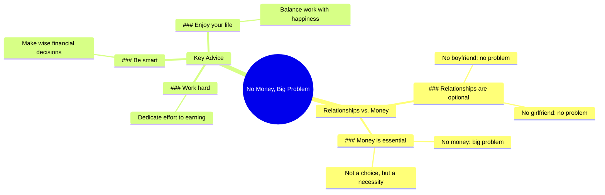

# No Money, Big Problem: Work Hard and Be Smart

> 🌐 **Read this in:** **English** · [中文](../../zh-CN/2026-06/tiktok-transcript-no-boy-friend-no-problem-no-girl-friend-no-problem-no-money-b0e9.md)

> **Creator:** [@mediverse_3d](https://www.tiktok.com/@mediverse_3d) · **Views:** 76.3M · **Posted:** 2026-06-02 · **Niche:** finance
>
> **TL;DR:** Uses a relatable contrast between relationships and money to create a sudden shift in priority.

[Watch original video →](https://vm.tiktok.com/ZNR7Yx55w/)

## Why This Went Viral

## Hook (first 3 seconds)
- **Verbatim opening line:** "No boyfriend, no problem. No girlfriend, no problem. But no money, big problem."
- **Hook pattern:** Contrast + Bold Claim (juxtaposes optional relationships against the necessity of money)
- **Why it stops scrolling:** The repetition of "no X, no problem" builds a rhythmic, almost hypnotic pattern, then the sharp pivot to "big problem" creates a jolt of tension. It flips a common societal anxiety (loneliness) into a more universal, pragmatic fear (financial insecurity), making viewers pause to see where the logic leads.

## Emotional Rhythm
- **Beat 1 – Dismissal (0–2s):** "No boyfriend, no problem. No girlfriend, no problem." – Creates a cool, detached tone. Viewers may feel a slight defiance or relief.
- **Beat 2 – Tension (3s):** "But no money, big problem." – The "but" is a verbal speed bump. The rhythm breaks, and the word "big" amplifies the weight. Anxiety spikes.
- **Beat 3 – Justification (4–5s):** "Relationships can be a choice, but money is essential." – Rational logic lands. The viewer feels a cognitive click of agreement.
- **Beat 4 – Resolution (6–7s):** "So work hard, be smart, and enjoy your life." – Climax is the word "enjoy." It resolves the tension with a permission slip for self-focus, delivering a micro-catharsis.
- **Climax moment:** The phrase "big problem" is the emotional peak. Everything after is a descending, calming explanation.

## Keyword Density
- **"No"** (4x) – Drives the rhythmic hook and creates a binary, stark contrast. Algorithmic reach: high repetition triggers pattern recognition.
- **"Problem"** (3x) – Emotional pull word that signals threat/danger. Keeps viewer engaged to see the solution.
- **"Money"** (2x) – Core algorithmic keyword (personal finance, hustle culture, self-improvement). Drives discovery.
- **"Work hard"** (1x) – Action-oriented, high-engagement phrase for motivation niches.
- **"Enjoy"** (1x) – Emotional payoff word. Creates resonance and shareability (people want to feel permission to enjoy life).
- **"Choice"** (1x) – Power word that reframes relationships as optional, reinforcing the video's autonomy theme.

## Why It Spreads
1. **Universal fear + permission structure:** The line *"Relationships can be a choice, but money is essential"* taps into a widespread anxiety (financial insecurity) while giving viewers permission to prioritize themselves over romantic pressure. People share it as a subtle flex or a wake-up call.
2. **Rhythmic, repeatable hook:** The triplet pattern ("No X, no problem… no Y, no problem… but Z, big problem") is almost musical. It's easy to memorize and quote, making it highly remixable (voiceovers, text overlays, duets).
3. **Low friction, high resonance:** The video is only 7 seconds. No complex argument, no personal story. It's a single, airtight logical syllogism. Viewers can instantly agree or disagree, driving comments and debate.
4. **Self-affirmation in a shareable package:** The ending *"work hard, be smart, and enjoy your life"* is a self-burnishing mantra. People share it to signal their own values (hustle, independence, pragmatism) without having to write anything themselves.

## What You Can Steal
1. **Use the "Triplet Pivot" hook:** Start with two dismissive statements (things that don't matter), then a sharp "but" + a high-stakes third statement. This pattern works for any niche: *"No likes, no problem. No views, no problem. But no retention? Big problem."*
2. **End with a permission slip:** After creating tension, resolve it with a simple, actionable permission (e.g., "enjoy your life"). This makes the video feel like a gift, increasing saves and shares.
3. **Keep it under 10 seconds with zero fluff:** Every word must earn its place. The transcript has no filler adjectives, no "um," no setup. Write your script, then cut it in half. The shorter the video, the higher the completion rate and the more algorithmic favor.

## Mind Map

## Full Transcript (Generated by [TokTranscript](https://toktranscript.com/?utm_source=github&utm_medium=breakdown&utm_campaign=tool_attribution))

> 📝 Transcripts on this page are auto-generated and show the first 60%. Want to transcribe any TikTok in 30 seconds and get the full version? [Try TokTranscript free →](https://toktranscript.com/?utm_source=github&utm_medium=breakdown&utm_campaign=transcript_cta)

No boyfriend, no problem. No girlfriend, no problem. But no money, big problem.

*[Read the full transcript on TokTranscript →](https://toktranscript.com/plaza/tiktok-transcript-no-boy-friend-no-problem-no-girl-friend-no-problem-no-money-b0e9?utm_source=github&utm_medium=breakdown&utm_campaign=transcript_full)*

## Browse More

- All [finance](../../by-niche/en/finance.md) breakdowns
- All [contrast escalation](../../by-pattern/en/hook-contrast-escalation.md) examples

## Video Info

| | |
|---|---|
| Creator | [@mediverse_3d](https://www.tiktok.com/@mediverse_3d) |
| Original video | [https://vm.tiktok.com/ZNR7Yx55w/](https://vm.tiktok.com/ZNR7Yx55w/) |
| Original title | No Boy Friend No Problem No Girl Friend No Problem No Money Big Probl... |
| Views | 76.3M (76300000) |
| Posted | 2026-06-02 |
| Duration | 0s |
| Niche | `finance` |
| Hook pattern | `contrast escalation` |
| Original language | `en` |
| Available languages | en, zh-CN |
| Generated | 2026-06-03 by [TokTranscript](https://toktranscript.com/) |

---

*This breakdown is for educational analysis under fair use. Original video © [@mediverse_3d](https://www.tiktok.com/@mediverse_3d). All transcripts are auto-generated and may contain errors.*

*Want to analyze your own TikToks like this? [TokTranscript →](https://toktranscript.com/viral-breakdown?utm_source=github&utm_medium=breakdown&utm_campaign=footer_cta)*