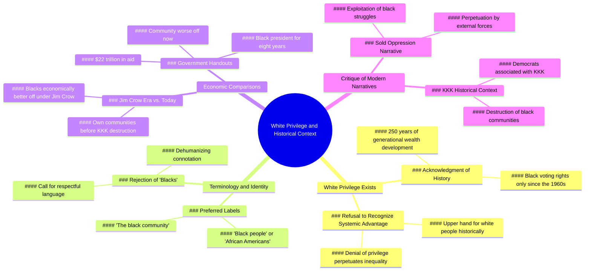

# Black Woman Explains Why White Privilege Exists

> 🌐 **Read this in:** **English** · [中文](../../zh-CN/2026-06/tiktok-transcript-onthisday-36b0.md)

<a href="https://www.tiktok.com/@charliekirkdebateclips/video/7651369032280558862?_r=1&u_code=df0k2j5b15legb&preview_pb=0&sharer_language=en&_d=ef9010d52628gk&share_item_id=7651369032280558862&source=h5_m&timestamp=1781912077&user_id=6882025710753317893&sec_user_id=MS4wLjABAAAArJVF44B10P3hOc2VfEQuuxGVUElvdF2ABC8Hhc8cACEZh1m1ihn8V3Fajs2oqDmg&social_share_type=0&utm_source=copy&utm_campaign=client_share&utm_medium=android&share_iid=7646817896225015568&share_link_id=2dede328-8abc-425e-9d11-1914180076f9&share_app_id=1233&ugbiz_name=MAIN&ug_btm=b5836%2Cb2878&sp_root_share_link_id=2dede328-8abc-425e-9d11-1914180076f9&link_reflow_popup_iteration_sharer=%7B%22click_empty_to_play%22%3A1%2C%22dynamic_cover%22%3A1%2C%22follow_to_play_duration%22%3A-1.0%2C%22profile_clickable%22%3A1%7D&panel_source_v2=share_panel&share_enter_from=others_homepage&item_author_type=2&enable_checksum=1&sp_level=1&sp_root_u=df0k2j5b15legb&sp_root_d=ef9010d52628gk" target="_blank"></a>

> **Creator:** [@charliekirkdebateclips](https://www.tiktok.com/@charliekirkdebateclips) · **Views:** 546.3K · **Posted:** 2026-06-19 · **Niche:** other
>
> **TL;DR:** Opens with a bold, identity-driven claim that immediately sparks debate and curiosity.

[Watch original video →](https://www.tiktok.com/@charliekirkdebateclips/video/7651369032280558862?_r=1&u_code=df0k2j5b15legb&preview_pb=0&sharer_language=en&_d=ef9010d52628gk&share_item_id=7651369032280558862&source=h5_m&timestamp=1781912077&user_id=6882025710753317893&sec_user_id=MS4wLjABAAAArJVF44B10P3hOc2VfEQuuxGVUElvdF2ABC8Hhc8cACEZh1m1ihn8V3Fajs2oqDmg&social_share_type=0&utm_source=copy&utm_campaign=client_share&utm_medium=android&share_iid=7646817896225015568&share_link_id=2dede328-8abc-425e-9d11-1914180076f9&share_app_id=1233&ugbiz_name=MAIN&ug_btm=b5836%2Cb2878&sp_root_share_link_id=2dede328-8abc-425e-9d11-1914180076f9&link_reflow_popup_iteration_sharer=%7B%22click_empty_to_play%22%3A1%2C%22dynamic_cover%22%3A1%2C%22follow_to_play_duration%22%3A-1.0%2C%22profile_clickable%22%3A1%7D&panel_source_v2=share_panel&share_enter_from=others_homepage&item_author_type=2&enable_checksum=1&sp_level=1&sp_root_u=df0k2j5b15legb&sp_root_d=ef9010d52628gk)

## Why This Went Viral

## Hook (first 3 seconds)
- **Verbatim:** "I'm a black woman and I believe that white privilege fucking exists."
- **Hook pattern:** Bold claim + identity reveal + taboo language
- **Why it stops scroll:** The speaker leads with a high-stakes identity (black woman) and a charged, profane affirmation of a controversial concept ("white privilege fucking exists"). This immediately signals she's not neutral — she's about to challenge both sides of the debate, which creates instant tension and curiosity.

## Emotional Rhythm
1. **Curiosity + Tension** (0:00–0:05): Bold claim about white privilege — viewer expects a standard left-wing take.
2. **Challenge & Defiance** (0:06–0:20): She flips the script by blaming *refusal to acknowledge history*, then drops the 250-year generational wealth argument — feels like a familiar progressive argument.
3. **Surprise / Twist** (0:20–0:40): She shifts to a Q&A with a white interlocutor ("Can't we just be black people?"). The tension rises as she mirrors his evasiveness ("Anything else other than what you're saying?").
4. **Climax / Shock** (0:40–0:55): "In the Jim Crow era, blacks were doing better economically... than we are doing today." This is the viral pivot — a counterintuitive, controversial claim that contradicts mainstream narratives.
5. **Resonance + Anger** (0:55–1:10): She blames "they sold you our oppression and you bought it" — a direct accusation at the viewer, creating either resonance or outrage.
6. **Final punch** (1:10–end): "Blacks were doing better under the Jim Crow" — repeats the most provocative line, leaving the viewer unsettled.

## Keyword Density
| Keyword / Phrase | Frequency | Function |
|---|---|---|
| "white privilege" | 3 | Algorithmic reach (high-search term) + emotional trigger |
| "black" / "blacks" | 10+ | Identity anchor — drives both emotional pull and search |
| "Jim Crow" | 3 | Historical reference that creates shock value and debate |
| "oppression" | 2 | Emotional pull — frames the argument as betrayal |
| "bought it" / "sold you" | 3 | Emotional resonance — accuses audience of being duped |
| "anything else" | 5 | Conversational hook — creates rhythmic tension in Q&A |
| "KKK" / "Democrats" | 1 | Controversial historical claim — drives shareability |

**Algorithmic drivers:** "white privilege," "Jim Crow," "black community" — high search volume, debate-prone terms.  
**Emotional drivers:** "oppression," "bought it," "sold you" — create personal stake and outrage.

## Why It Spreads
1. **Identity bait + script flip:** She opens as a black woman affirming white privilege, then pivots to blame *progressive narratives* for black economic decline. This bait-and-switch makes both left and right viewers share it — left to debunk, right to validate.
2. **Counterintuitive historical claim:** "Blacks were doing better under Jim Crow" is a shocking, data-adjacent statement that forces engagement. People comment to argue, fact-check, or agree — all of which boost algorithmic reach.
3. **Conversational tension pattern:** The Q&A segment ("Can't we just be black people?" → "Anything else other than what you're saying?") creates a rhythmic, almost theatrical confrontation that keeps viewers watching to see who "wins."
4. **Direct accusation of the viewer:** "They sold you our oppression and you bought it" turns the audience into the antagonist. This triggers defensive commenting, which is the highest-value engagement for short-form platforms.
5. **Taboo language + identity credibility:** The profanity ("fucking") signals authenticity, and her identity as a black woman gives her permission to make claims that would be attacked if a white person said them. This combination is algorithm gold.

## What You Can Steal
1. **The "identity + taboo" opener:** Start with your identity and a charged word ("fucking," "bullshit," "lie") to signal you're not playing it safe. This stops scroll immediately.
2. **The conversational pivot:** Use a Q&A or role-play segment where you quote an imagined opponent, then deconstruct their words. The back-and-forth rhythm keeps viewers hooked longer.
3. **The counterintuitive data drop:** Find a statistic or historical fact that contradicts the mainstream narrative on your topic. Lead with it mid-video — not at the start — to create a twist that forces re-watches and shares.

## Mind Map

## Full Transcript (Generated by [analyze your own TikToks](https://toktranscript.com/?utm_source=github&utm_medium=breakdown&utm_campaign=tool_attribution))

> 📝 Transcripts on this page are auto-generated and show the first 60%. Want to transcribe any TikTok in 30 seconds and get the full version? [Try TokTranscript free →](https://toktranscript.com/?utm_source=github&utm_medium=breakdown&utm_campaign=transcript_cta)

I'm a black woman and I believe that white privilege fucking exists. And the reason why white privilege exists is because you guys refuse to acknowledge the history that put people in this position. You want to tell me that white privilege doesn't exist when white people had a fucking upper hand for 250 years to develop generational wealth and that black people didn't get the right to fucking vote until the 60s? What's funny about that is blacks were doing better during that time. Why do we always call people blacks? Because you're black. Can't we just be black people? Can't we just be like African Americans or something? The black community? How would you like it said? What makes you feel better on the inside? Really anything else other than what you're saying? I'll say how you want it to. Anything else other than what you need it. Tell me what makes you feel better. Literally anything else other than what you're saying. Okay, anything else. Why is that anything else?

*[Read the full transcript on TokTranscript →](https://toktranscript.com/plaza/tiktok-transcript-onthisday-36b0?utm_source=github&utm_medium=breakdown&utm_campaign=transcript_full)*

## Browse More

- All [other](../../by-niche/en/other.md) breakdowns
- All [Controversial Identity Declaration](../../by-pattern/en/hook-controversial-identity-declaration.md) examples

## Video Info

| | |
|---|---|
| Creator | [@charliekirkdebateclips](https://www.tiktok.com/@charliekirkdebateclips) |
| Original video | [https://www.tiktok.com/@charliekirkdebateclips/video/7651369032280558862?_r=1&u_code=df0k2j5b15legb&preview_pb=0&sharer_language=en&_d=ef9010d52628gk&share_item_id=7651369032280558862&source=h5_m&timestamp=1781912077&user_id=6882025710753317893&sec_user_id=MS4wLjABAAAArJVF44B10P3hOc2VfEQuuxGVUElvdF2ABC8Hhc8cACEZh1m1ihn8V3Fajs2oqDmg&social_share_type=0&utm_source=copy&utm_campaign=client_share&utm_medium=android&share_iid=7646817896225015568&share_link_id=2dede328-8abc-425e-9d11-1914180076f9&share_app_id=1233&ugbiz_name=MAIN&ug_btm=b5836%2Cb2878&sp_root_share_link_id=2dede328-8abc-425e-9d11-1914180076f9&link_reflow_popup_iteration_sharer=%7B%22click_empty_to_play%22%3A1%2C%22dynamic_cover%22%3A1%2C%22follow_to_play_duration%22%3A-1.0%2C%22profile_clickable%22%3A1%7D&panel_source_v2=share_panel&share_enter_from=others_homepage&item_author_type=2&enable_checksum=1&sp_level=1&sp_root_u=df0k2j5b15legb&sp_root_d=ef9010d52628gk](https://www.tiktok.com/@charliekirkdebateclips/video/7651369032280558862?_r=1&u_code=df0k2j5b15legb&preview_pb=0&sharer_language=en&_d=ef9010d52628gk&share_item_id=7651369032280558862&source=h5_m&timestamp=1781912077&user_id=6882025710753317893&sec_user_id=MS4wLjABAAAArJVF44B10P3hOc2VfEQuuxGVUElvdF2ABC8Hhc8cACEZh1m1ihn8V3Fajs2oqDmg&social_share_type=0&utm_source=copy&utm_campaign=client_share&utm_medium=android&share_iid=7646817896225015568&share_link_id=2dede328-8abc-425e-9d11-1914180076f9&share_app_id=1233&ugbiz_name=MAIN&ug_btm=b5836%2Cb2878&sp_root_share_link_id=2dede328-8abc-425e-9d11-1914180076f9&link_reflow_popup_iteration_sharer=%7B%22click_empty_to_play%22%3A1%2C%22dynamic_cover%22%3A1%2C%22follow_to_play_duration%22%3A-1.0%2C%22profile_clickable%22%3A1%7D&panel_source_v2=share_panel&share_enter_from=others_homepage&item_author_type=2&enable_checksum=1&sp_level=1&sp_root_u=df0k2j5b15legb&sp_root_d=ef9010d52628gk) |
| Original title | #onthisday  |
| Views | 546.3K (546300) |
| Posted | 2026-06-19 |
| Duration | 0s |
| Niche | `other` |
| Hook pattern | `Controversial Identity Declaration` |
| Original language | `en` |
| Available languages | en, zh-CN |
| Generated | 2026-06-20 by [TokTranscript](https://toktranscript.com/) |

---

*This breakdown is for educational analysis under fair use. Original video © [@charliekirkdebateclips](https://www.tiktok.com/@charliekirkdebateclips). All transcripts are auto-generated and may contain errors.*

*Want to analyze your own TikToks like this? [TokTranscript.com →](https://toktranscript.com/viral-breakdown?utm_source=github&utm_medium=breakdown&utm_campaign=footer_cta)*