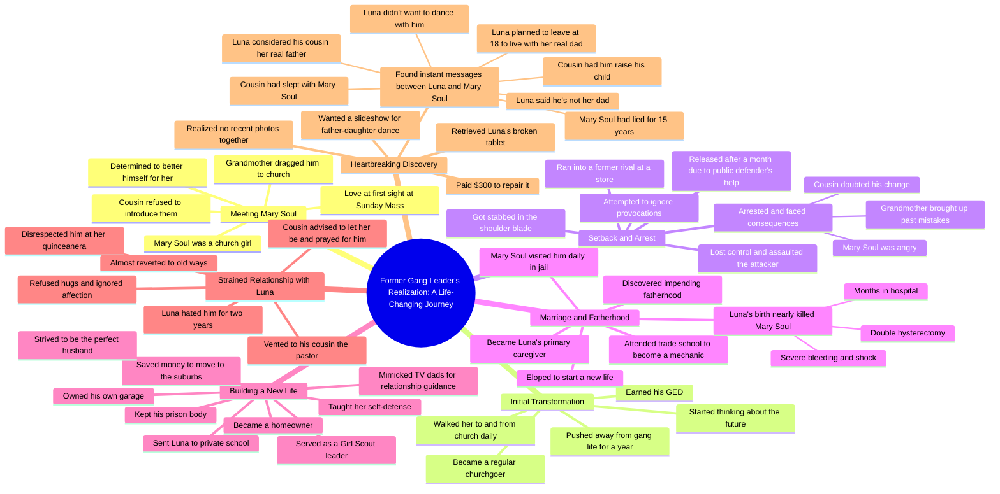

# Former Gang Leaders: Why I Left the Life

> 🌐 **Read this in:** **English** · [中文](../../zh-CN/2026-06/tiktok-transcript-part-1-fyp-redditstories-viral-foryoupage-2f6f.md)

> **Creator:** [@kick.me.pls00](https://www.tiktok.com/@kick.me.pls00) · **Views:** 12.2M · **Posted:** 2026-06-23 · **Niche:** entertainment
>
> **TL;DR:** The hook introduces a specific person and age, creating immediate intrigue and emotional investment.

[Watch original video →](https://vm.tiktok.com/ZNRTAn3nq/)

## Why This Went Viral

## Hook (first 3 seconds)
- **Verbatim opening line:** "Former gang leaders. What made you realize it wasn't the life for you?"
- **Hook pattern:** Question + identity label ("former gang leaders")
- **Why it stops scrolling:** The contrast between "gang leader" and "realization" creates instant curiosity. Viewers want to see the turning point of a dangerous person — it promises a redemption arc or shocking reveal.

## Emotional Rhythm
- **Beat 1 — Curiosity:** "Former gang leaders" sets intrigue about a violent past.
- **Beat 2 — Warmth/Relief:** Meeting Mary Soul, falling in love, leaving the gang — feels like a clean redemption story.
- **Beat 3 — Tension:** Stabbed, arrested, public defender — stakes rise, old life pulls him back.
- **Beat 4 — Hope:** Gets off, marries, has a child, builds a suburban life — emotional high.
- **Beat 5 — Slow Burn Hurt:** Luna’s rejection (eye rolls, no hugs) — subtle but growing pain.
- **Beat 6 — Climax (twist):** Reading the texts — "He's not even my dad." This is the gut-punch. Everything prior is recontextualized.
- **Beat 7 — Devastation + Rage:** Wife lied 15 years, cousin betrayed him — emotional explosion.
- **Climax moment:** The line "He's not even my dad" — it’s the exact second the story pivots from redemption to tragedy.

## Keyword Density
1. **"Mary Soul"** — The anchor name, repeated for emotional connection.
2. **"Luna"** — Daughter’s name, drives the father-daughter bond.
3. **"Cousin"** — Repeated as a trusted figure, then as the betrayer — algorithmic tension.
4. **"Church" / "God"** — Religious framing adds moral weight and reach to faith-based audiences.
5. **"Better" / "Future"** — Repeated in the redemption arc — drives emotional pull.
6. **"Stabbed" / "Arrested" / "Dead or in jail"** — High-stakes keywords that trigger algorithmic engagement (crime, survival).
7. **"Father" / "Dad"** — The core emotional conflict — drives both reach (family content) and pull (betrayal).

- **Algorithmic reach drivers:** "gang leader," "stabbed," "arrested," "father," "betrayal" — high-engagement tags.
- **Emotional pull drivers:** "Mary Soul," "Luna," "love at first sight," "hated me" — keeps viewers watching through heartbreak.

## Why It Spreads
1. **The twist is perfectly timed.** The entire first half builds a redemption story — then "He's not even my dad" shatters it. Viewers feel the betrayal viscerally, which compels them to comment, share, or tag friends. *Concrete line:* "He's not even my dad."
2. **It weaponizes "unreliable narrator" structure.** The storyteller presents himself as a hero who overcame everything — then reveals the ultimate betrayal. This creates a "wait, what?" moment that forces rewatching and discussion. *Concrete line:* "My cousin, whom I confide... not only slept with my wife, but had me raise his child."
3. **It triggers moral outrage and empathy simultaneously.** Viewers feel rage at the wife and cousin, but deep sympathy for the narrator. This emotional cocktail is highly shareable — people want others to feel what they felt. *Concrete line:* "My wife lied to me for 15 years."
4. **The pacing mimics a thriller.** Every beat escalates — love, danger, redemption, rejection, discovery, betrayal. No dead air. Viewers can't look away. *Concrete evidence:* The entire transcript has zero filler sentences — each line advances the plot.
5. **It ends on a cliffhanger of unresolved rage.** The story stops at the moment of discovery — no resolution. Viewers are left emotionally hanging, which drives them to seek closure in the comments or share to get reactions. *Concrete line:* "But had me raise his child."

## What You Can Steal
1. **Start with a high-stakes identity + a question.** "Former gang leaders. What made you realize..." instantly hooks because it promises a transformation story. Apply this to any niche: "Former addict. What made you quit?" or "Former CEO. What made you walk away?"
2. **Use the "false redemption" structure.** Build a clean, happy arc — then pull the rug. Viewers emotionally invest in the first half, making the second half hit harder. In your next video, set up a "everything was perfect" moment before introducing the twist.
3. **End before the resolution.** Don't wrap it up neatly. Leave viewers in the middle of the emotional climax — they'll comment, share, or ask for part 2. The narrator here ends on "had me raise his child" — no closure, just raw pain. That’s what spreads.

## Mind Map

## Full Transcript (Generated by [free TikTok transcript generator](https://toktranscript.com/?utm_source=github&utm_medium=breakdown&utm_campaign=tool_attribution))

> 📝 Transcripts on this page are auto-generated and show the first 60%. Want to transcribe any TikTok in 30 seconds and get the full version? [Try TokTranscript free →](https://toktranscript.com/?utm_source=github&utm_medium=breakdown&utm_campaign=transcript_cta)

Former gang leaders. What made you realize it wasn't the life for you? I was 18 when I met Mary Soul. During that time, I was a gang leader with the Latin Kings. Mary Soul was a church girl. My grandmother dragged me to Sunday Mass, and when I saw her, to me, it was love at first sight. I asked my cousin, who was a friend of hers, if he could introduce us, but he refused. He didn't want me to mess with her. He didn't want me to ruin her. I had never met someone that I wanted to make myself better, to be with. That was her. When I found out that she was going to church almost every day, I hung out by the steps talking to her. I always walked her to and from church. She made me feel like there was more to the Latin Kings. One thing LED to another, and we ended up going on a date. I felt great. For a year, I pushed myself away from the gang life, got my GED, became a regular church goer, and was thinking about the future when I got unintentionally pulled back in. I was at a store and ran into someone that I used to have problems with. They were running their mouths, and I tried to ignore it. I swear I did. I just let them talk and I walked away. But then I got stabbed in the shoulder blade. The Pain hadn't hit yet, and I lost my mind. I beat the hell out of them. I got arrested, and suddenly it was like the crap I did to make my life better vanished. Mary Soul was pissed at me. My grandmother kept bringing up my past mistakes, and my cousin was telling me that he knew that I wasn't going to change. My public defender saw me trying to better myself, and by the Grace of god, got me off after a month in lock up. Despite being angry with me, Mary Soul did visit me almost daily. A month after I got out, I found out I was going to be a father. And I didn't want my kid to have a dad that was dead or in jail. We eloped. I went to a trade school to become a mechanic, and I busted my butt for my future family. When Luna was born, it was almost the worst day of my life. Mary Soul wouldn't stop bleeding. She went into shock, and they had to give her a double hysterectomy. She was in the hospital for months, and Luna became my world. I wanted her life to be the best. I wanted to give her the world. When Mary Soul was released, I promised her that our daughter will have a life far better than ours. And for years, I kept that promise. I saved enough money to move us to the suburbs, became homeowners. I was A Girl Scout leader, if you could believe that. I made sure Luna went to private school, made sure she knew how to defend herself, and always made sure I was the perfect husband. I didn't know my parents didn't have a positive male role model in my life, so I didn't know what a healthy relationship looked like. That's a lie. TV dads were my male role models, and I mimic them in the marriage they had on TV. As the years went by, I own my own garage. My cousin became a pastor, but still. My grandmother was still a pain in my ass. My relationship with my wife was stronger than ever. I made sure I kept my prison body. Luna hated me. She didn't want me to hug her. She rolled her eyes every time I told her I loved her, ignored me when I asked her about her day in school.

*[Read the full transcript on TokTranscript →](https://toktranscript.com/plaza/tiktok-transcript-part-1-fyp-redditstories-viral-foryoupage-2f6f?utm_source=github&utm_medium=breakdown&utm_campaign=transcript_full)*

## Browse More

- All [entertainment](../../by-niche/en/entertainment.md) breakdowns
- All [Personal anecdote with a name](../../by-pattern/en/hook-personal-anecdote-with-a-name.md) examples

## Video Info

| | |
|---|---|
| Creator | [@kick.me.pls00](https://www.tiktok.com/@kick.me.pls00) |
| Original video | [https://vm.tiktok.com/ZNRTAn3nq/](https://vm.tiktok.com/ZNRTAn3nq/) |
| Original title | Part 1 #fyp #redditstories #viral #foryoupage  |
| Views | 12.2M (12200000) |
| Posted | 2026-06-23 |
| Duration | 0s |
| Niche | `entertainment` |
| Hook pattern | `Personal anecdote with a name` |
| Original language | `en` |
| Available languages | en, zh-CN |
| Generated | 2026-06-24 by [TokTranscript](https://toktranscript.com/) |

---

*This breakdown is for educational analysis under fair use. Original video © [@kick.me.pls00](https://www.tiktok.com/@kick.me.pls00). All transcripts are auto-generated and may contain errors.*

*Want to analyze your own TikToks like this? [TokTranscript →](https://toktranscript.com/viral-breakdown?utm_source=github&utm_medium=breakdown&utm_campaign=footer_cta)*