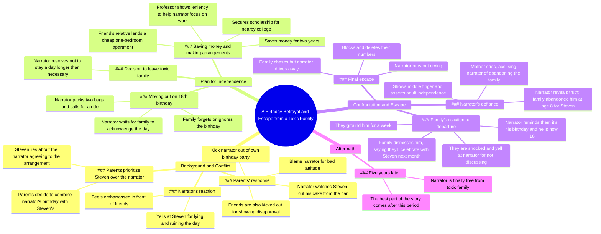

# Part 2: Confronting Steven Over the Birthday Lie

> 🌐 **Read this in:** **English** · [中文](../../zh-CN/2026-06/tiktok-transcript-part-2-diy-storytime-fyp-foryou-tiktok-2744.md)

> **Creator:** [@redditbybot1](https://www.tiktok.com/@redditbybot1) · **Views:** 2.5M · **Posted:** 2026-06-01 · **Niche:** entertainment
>
> **TL;DR:** The hook immediately introduces a shocking injustice, making viewers want to see how the narrator reacts.

[Watch original video →](https://vm.tiktok.com/ZS92StWtHmQm6-xWkLP/ This post is shared via TikTok Lite. Download TikTok Lite to enjoy more posts: https://www.tiktok.com/tiktoklite)

## Why This Went Viral

## Hook (first 3 seconds)
- **Verbatim opening line:** "When I asked what was going on, my parents replied, Steven's birthday is just next month, so we decided today can be a Celebration for the both of you."
- **Hook pattern:** Scene + contrast (a personal celebration is hijacked for someone else)
- **Why it stops scrolling:** The immediate injustice is visceral — a birthday party being co-opted for a sibling, with a lie attached. It triggers instant empathy and outrage, forcing the viewer to ask "What happens next?"

## Emotional Rhythm
- **Beats in order:**
  1. **Curiosity** — "What was going on?" sets up mystery
  2. **Tension** — Parents' unfair decision and Steven's lie
  3. **Outrage** — Being kicked out of own birthday party, watching cake being cut
  4. **Resolve/Determination** — Saving money, planning escape
  5. **Anticipation** — "The big day comes around" — will they finally care?
  6. **Despair** — They forget his 18th birthday entirely
  7. **Defiance** — Middle finger, running out crying
  8. **Catharsis** — "I was finally free"
  9. **Climax** — "The best part came five years later" (twist)
- **Climax moment:** The five‑year time jump — the ultimate payoff of freedom and likely revenge or success

## Keyword Density
- **Strongest repeated words/phrases:**
  - "birthday" (9×) — algorithmic: high‑engagement topic (celebrations, disappointment)
  - "Steven" (6×) — emotional: the antagonist, drives resentment
  - "kicked out" (3×) — emotional: core injustice, triggers sympathy
  - "family" (4×) — emotional: identity, belonging, betrayal
  - "forgot/forgotten" (3×) — emotional: neglect, abandonment
  - "18" (3×) — algorithmic: milestone, legal independence
  - "party" (5×) — algorithmic: visual, shareable moment
  - "abandoned" (2×) — emotional: climax of the narrative
- **Algorithmic reach:** "birthday," "18," "party" — high‑search, relatable life events
- **Emotional pull:** "kicked out," "forgot," "abandoned" — trigger strong reactions (anger, sadness, solidarity)

## Why It Spreads
1. **Universal injustice** — "They kicked me out of my own birthday party" is a relatable nightmare scenario. Viewers instantly imagine themselves in that position and feel compelled to share.
2. **Escalating stakes** — Each beat raises the emotional bar: from a hijacked party → forgotten 18th → running away → five‑year revenge. The twist at the end ("the best part came five years later") creates a cliffhanger that drives comments and shares.
3. **Clear villain and victim** — Steven and the parents are unambiguous antagonists. The narrator is a sympathetic underdog. This binary makes the story easy to moralize and share ("Can you believe this?")
4. **Satisfying resolution** — The narrator escapes and thrives (implied by "finally free" and the five‑year time jump). Viewers love a happy ending after suffering, which increases shareability.
5. **High emotional contrast** — The story swings from humiliation → determination → despair → triumph. This emotional rollercoaster keeps viewers engaged and makes the video memorable enough to recommend.

## What You Can Steal
1. **Open with a micro‑injustice** — Start your video with a specific, unfair moment (like a party being hijacked). Don’t explain the backstory first. The viewer should feel angry or curious within 3 seconds.
2. **Use a "then vs. now" time jump** — End with a cliffhanger like "But that wasn't the end of it. The best part came five years later." This teases a sequel or payoff and boosts retention.
3. **Create a clear villain and victim** — Give the audience someone to root against (Steven) and someone to root for (the narrator). Use direct quotes from the antagonist to make them feel real and hateable. This drives emotional investment and sharing.

## Mind Map

## Full Transcript (Generated by [free TikTok transcript generator](https://toktranscript.com/?utm_source=github&utm_medium=breakdown&utm_campaign=tool_attribution))

> 📝 Transcripts on this page are auto-generated and show the first 60%. Want to transcribe any TikTok in 30 seconds and get the full version? [Try TokTranscript free →](https://toktranscript.com/?utm_source=github&utm_medium=breakdown&utm_campaign=transcript_cta)

When I asked what was going on, my parents replied, Steven's birthday is just next month, so we decided today can be a Celebration for the both of you. He said he already talked to you about this and said you're happy to include him. I was so pissed and yelled at Steven. How dare you lie and ruin my day! Couldn't you have let me get just one day for myself? I was also embarrassed because this was in front of my friends. Steven acted all cute and innocent and replied, but we talked about this and you agreed. Why are you yelling at me, dear brother? We had definitely not talked about this or anything at all. My parents decided that I suddenly didn't deserve a party because of my attitude and kicked me out. Yep, they kicked me out of my own birthday party. I had to sit in the car and watch through the window as Steven cut the cake that was supposed to be for me. My friends tried to express their disapproval, but they were also kicked out. I decided then that I wouldn't stay with this toxic family a day more than I have to. I talked to my professor and he went a bit lenient on me in class so I could work hard on my job and save money. I saved up for two years. One of my friends had a relative that owned some real estate and was able to Lend me a one bedroom apartment for cheap in a nearby city. I had also secured a scholarship for a college near my apartment. I was all set to move out the day I turned 18. Well, the big day comes around and I'm slightly nervous. I was worried that if they threw a big party for me and made it up to me, I would forgive them. Guess what? They didn't even wish me a happy birthday. It was a holiday. So I lays around waiting for someone to remember what day it is. Eventually I just gave up and went to my room to finish packing. I wasn't taking too much with me, so I had just two bags that I could easily carry. I gave a call to one of my friend's older brother to come pick me up and made my way downstairs.

*[Read the full transcript on TokTranscript →](https://toktranscript.com/plaza/tiktok-transcript-part-2-diy-storytime-fyp-foryou-tiktok-2744?utm_source=github&utm_medium=breakdown&utm_campaign=transcript_full)*

## Browse More

- All [entertainment](../../by-niche/en/entertainment.md) breakdowns
- All [Betrayal Reveal](../../by-pattern/en/hook-betrayal-reveal.md) examples

## Video Info

| | |
|---|---|
| Creator | [@redditbybot1](https://www.tiktok.com/@redditbybot1) |
| Original video | [https://vm.tiktok.com/ZS92StWtHmQm6-xWkLP/ This post is shared via TikTok Lite. Download TikTok Lite to enjoy more posts: https://www.tiktok.com/tiktoklite](https://vm.tiktok.com/ZS92StWtHmQm6-xWkLP/ This post is shared via TikTok Lite. Download TikTok Lite to enjoy more posts: https://www.tiktok.com/tiktoklite) |
| Original title | Part 2 #diy #storytime #fyp #foryou #tiktok  |
| Views | 2.5M (2500000) |
| Posted | 2026-06-01 |
| Duration | 0s |
| Niche | `entertainment` |
| Hook pattern | `Betrayal Reveal` |
| Original language | `en` |
| Available languages | en, zh-CN |
| Generated | 2026-06-02 by [TokTranscript](https://toktranscript.com/) |

---

*This breakdown is for educational analysis under fair use. Original video © [@redditbybot1](https://www.tiktok.com/@redditbybot1). All transcripts are auto-generated and may contain errors.*

*Want to analyze your own TikToks like this? [analyze your own TikToks →](https://toktranscript.com/viral-breakdown?utm_source=github&utm_medium=breakdown&utm_campaign=footer_cta)*