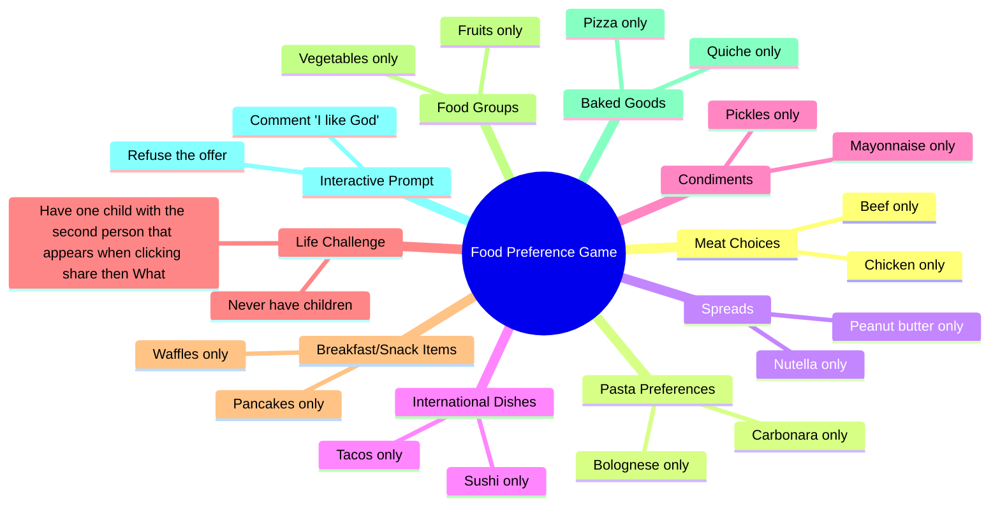

# Food Dilemma: Beef vs Chicken, Carbonara vs Bolognese

> 🌐 **Read this in:** **English** · [中文](../../zh-CN/2026-06/tiktok-transcript-part-340-tu-pr-f-res-tupreferes-tupreferesquoi-dilemme-375f.md)

> **Creator:** [@tu_preferes_n1](https://www.tiktok.com/@tu_preferes_n1) · **Views:** 1.8M · **Posted:** 2026-06-29 · **Niche:** food
>
> **TL;DR:** Immediately engages viewers by asking them to choose between two common food options.

[Watch original video →](https://vm.tiktok.com/ZSCUnxHmd/ تتم مشاركة هذا المنشور عبر TikTok Lite. نزّل TikTok Lite للاستمتاع بمزيد من المنشورات: https://www.tiktok.com/tiktoklite)

## Why This Went Viral

## Hook (first 3 seconds)
- **What happens verbatim:** "Tu préfères, version nourriture, tu préfères manger que du bœuf ou manger que du poulet ?"
- **Hook pattern:** Question + Niche (nourriture) + Binary choice
- **Why it stops scroll:** The "tu préfères" format is instantly recognizable as a social game. By immediately specifying "version nourriture," it signals a low-stakes, relatable, and debate-worthy premise that invites the viewer to mentally answer before they can look away.

## Emotional Rhythm
- **Beat 1 – Curiosity (0–3s):** The question format triggers a "which one would I pick?" mental response.
- **Beat 2 – Mild engagement (3–10s):** Rapid-fire choices (boeuf/poulet, carbonara/bolognaise) create a low-effort, addictive pattern.
- **Beat 3 – Tension spike (10–12s):** "Commenter j'aime Dieu ou refuser l'offre?" – This is the twist. The absurd, high-stakes choice (God vs. refusing the offer) breaks the food pattern and jolts the viewer.
- **Beat 4 – Surprise (12–15s):** The WhatsApp challenge ("1 enfant avec la 2e personne qui s'affiche quand tu cliques sur partager puis WhatsApp") introduces a real-world social dare, raising stakes from hypothetical to actionable.
- **Beat 5 – Comfort return (15–22s):** Back to safe, relatable food choices (gaufres/crêpes, légumes/fruits, pizzas/quiches), allowing the viewer to disengage on a pleasant note.
- **Climax moment:** The "Commenter j'aime Dieu ou refuser l'offre" line. It’s the most unexpected, meme-worthy, and shareable moment.

## Keyword Density
| Keyword/Phrase | Frequency (approx.) | Driver |
|----------------|---------------------|--------|
| "Tu préfères" | 9x | **Algorithmic reach** – high repetition of a searchable, trend-friendly phrase |
| "manger que du/des" | 8x | **Emotional pull** – creates rhythmic, hypnotic pattern |
| "ou" | 9x | **Algorithmic + emotional** – binary choice structure is both predictable and engaging |
| "nourriture" | 1x (title) | **Algorithmic** – niche keyword for food content |
| "Dieu" / "refuser l'offre" | 1x each | **Emotional pull** – the shock value words that make the video memorable |
| "WhatsApp" | 1x | **Emotional pull** – triggers social sharing and real-world action |

## Why It Spreads
1. **The "tu préfères" format is inherently viral.** It’s a low-friction social game that people naturally play in groups. The transcript directly invites comments ("Commenter j'aime Dieu ou refuser l'offre?"), which boosts engagement signals.
2. **The absurd twist breaks pattern.** After 10 seconds of safe food choices, the video suddenly asks "j'aime Dieu ou refuser l'offre?" – a nonsensical, high-stakes question. This surprise moment is clip-worthy and shareable because it feels like a glitch in the matrix.
3. **Real-world social dare.** The WhatsApp challenge ("1 enfant avec la 2e personne qui s'affiche quand tu cliques sur partager puis WhatsApp") turns passive watching into active participation. Viewers are incentivized to open the app, screenshot, and share – creating a chain reaction.
4. **Relatable low-risk start, high-risk finish.** The first 10 seconds are universally relatable (food choices), drawing in a broad audience. The last 10 seconds escalate to absurdity, ensuring the video is memorable and rewatchable.
5. **Comment bait is explicit.** The line "Commenter j'aime Dieu ou refuser l'offre?" directly commands engagement. It’s not a suggestion; it’s a challenge that feels like a game.

## What You Can Steal
1. **Start with a safe, relatable pattern, then break it.** Use 3–4 normal questions (food, hobbies, travel) to lull the viewer into a rhythm, then drop one absurd, high-stakes question. The contrast makes the twist land harder.
2. **Embed a real-world social dare.** Ask viewers to do something outside the app (e.g., "Send this to the 3rd person in your chat," "Screenshot and post the result"). This turns passive consumption into active sharing.
3. **Explicitly command engagement.** Don't just say "comment below." Say "Commenter j'aime Dieu ou refuser l'offre?" – make the comment feel like a game move, not a request. The more specific and playful the call-to-action, the higher the response rate.

## Mind Map

## Full Transcript (Generated by [TokTranscript](https://toktranscript.com/?utm_source=github&utm_medium=breakdown&utm_campaign=tool_attribution))

> 📝 Transcripts on this page are auto-generated and show the first 60%. Want to transcribe any TikTok in 30 seconds and get the full version? [Try TokTranscript free →](https://toktranscript.com/?utm_source=github&utm_medium=breakdown&utm_campaign=transcript_cta)

Tu préfères, version nourriture, tu préfères manger que du bœuf ou manger que du poulet ? Tu préfères manger que des pâtes carbonara ou manger que des pâtes bolognaises ? Tu préfères manger que du beurre de cacahuète ou manger que du Nutella ? Tu préfères manger que des sushis ou manger que des tacos ? Commenter j'aime Dieu ou refuser l'offre ? Tu préfères manger que de la mayonnaise ou manger que des cornichons ?

*[Read the full transcript on TokTranscript →](https://toktranscript.com/plaza/tiktok-transcript-part-340-tu-pr-f-res-tupreferes-tupreferesquoi-dilemme-375f?utm_source=github&utm_medium=breakdown&utm_campaign=transcript_full)*

## Browse More

- All [food](../../by-niche/en/food.md) breakdowns
- All [Interactive choice hook](../../by-pattern/en/hook-interactive-choice-hook.md) examples

## Video Info

| | |
|---|---|
| Creator | [@tu_preferes_n1](https://www.tiktok.com/@tu_preferes_n1) |
| Original video | [https://vm.tiktok.com/ZSCUnxHmd/ تتم مشاركة هذا المنشور عبر TikTok Lite. نزّل TikTok Lite للاستمتاع بمزيد من المنشورات: https://www.tiktok.com/tiktoklite](https://vm.tiktok.com/ZSCUnxHmd/ تتم مشاركة هذا المنشور عبر TikTok Lite. نزّل TikTok Lite للاستمتاع بمزيد من المنشورات: https://www.tiktok.com/tiktoklite) |
| Original title | Part 340 | Tu Préfères ? #tupreferes #tupreferesquoi #dilemme  |
| Views | 1.8M (1800000) |
| Posted | 2026-06-29 |
| Duration | 0s |
| Niche | `food` |
| Hook pattern | `Interactive choice hook` |
| Original language | `en` |
| Available languages | en, zh-CN |
| Generated | 2026-06-30 by [TokTranscript](https://toktranscript.com/) |

---

*This breakdown is for educational analysis under fair use. Original video © [@tu_preferes_n1](https://www.tiktok.com/@tu_preferes_n1). All transcripts are auto-generated and may contain errors.*

*Want to analyze your own TikToks like this? [free TikTok transcript generator →](https://toktranscript.com/viral-breakdown?utm_source=github&utm_medium=breakdown&utm_campaign=footer_cta)*