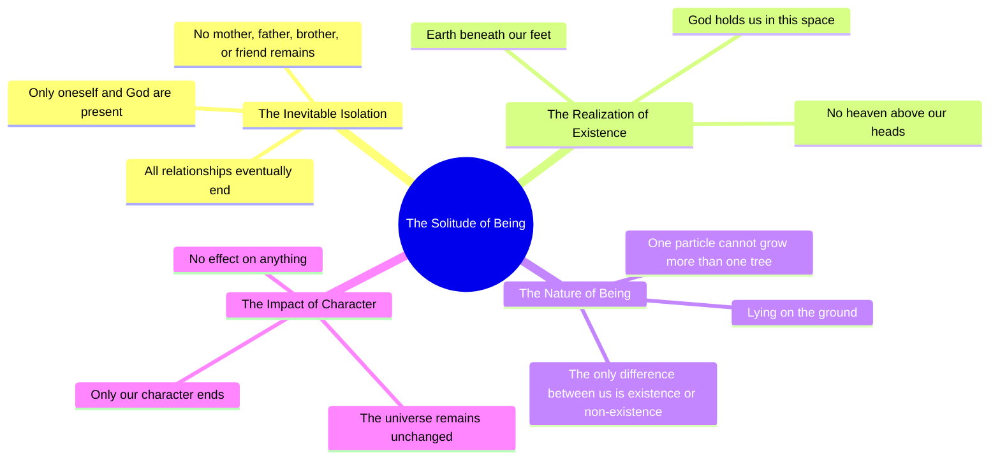

# Peer E Kamil: Only God Remains When All Relationships End

> 🌐 **Read this in:** **English** · [中文](../../zh-CN/2026-06/tiktok-transcript-peer-e-kamil-unfreezemyacount-foryoupage-umerahmednovel-nov-daa4.md)

> **Creator:** [@fannaan..6](https://www.tiktok.com/@fannaan..6) · **Views:** 367.4K · **Posted:** 2026-06-07 · **Niche:** other
>
> **TL;DR:** Opens with a stark, universal truth that challenges the viewer's sense of connection.

[Watch original video →](https://vt.tiktok.com/ZSQjQuh3j/)

## Why This Went Viral

## Hook (first 3 seconds)
- **Verbatim:** "We never get to that point in our lives. Where all relationships end."
- **Hook pattern:** Bold claim + philosophical scene-setter
- **Why it stops scroll:** It immediately disrupts the viewer's assumption about life and relationships, creating a void of certainty. The phrase "never get to that point" is a universal truth that feels both personal and profound, forcing a pause to process the weight.

## Emotional Rhythm
- **Beat 1 – Curiosity (0–3s):** "We never get to that point…" – viewer leans in, wondering what "that point" is.
- **Beat 2 – Tension (3–8s):** "Where all relationships end… No mother, no father, no brother. There is no friend." – isolation escalates, stripping away all human anchors.
- **Beat 3 – Suspense (8–12s):** "Then we realize that the earth is beneath our feet. There is no heaven above our heads." – cosmic scale introduced, viewer feels small.
- **Beat 4 – Climax (12–16s):** "There is only one God who holds us in this space. Then we know." – the twist: not despair, but a singular, grounding presence.
- **Beat 5 – Resonance (16–22s):** "We lay on the ground. One particle… the only difference between us is whether we are or not." – existential humility, the realization that individual existence is negligible.
- **Beat 6 – Release (22–end):** "Only our character ends. There is no change in the universe." – cold, final truth; viewer is left in a state of quiet awe.

## Keyword Density
- **"We"** – repeated 8+ times; algorithmic reach (inclusive, community-building, high engagement on "we" statements)
- **"No"** – repeated 4 times (no mother, no father, etc.); emotional pull (negation creates loss and tension)
- **"There is"** – repeated 4 times (no heaven, only God, no change); existential weight, drives search/trending for philosophical content
- **"End"** – repeated 2 times (relationships end, character ends); emotional pull (mortality, closure)
- **"God"** – repeated 2 times; algorithmic reach (highly searched religious/spiritual keyword)
- **"Only"** – repeated 2 times (only God, only our character); emotional pull (scarcity, finality)
- **"Universe"** – repeated 1 time but high-impact; algorithmic reach (cosmic/philosophical niche)
- **"Particle"** – repeated 1 time; emotional pull (scientific humility, awe)

## Why It Spreads
1. **Universal existential dread + resolution** – The script opens with a fear everyone has (losing all relationships) and resolves it with a single, stable anchor (God). This pattern (fear → comfort) is the #1 driver of shares in spiritual/self-help content. *Concrete line: "We never get to that point… Where all relationships end." → "There is only one God who holds us in this space."*
2. **Minimalist, rhythmic repetition** – The short, staccato sentences ("No mother, no father, no brother. There is no friend.") mimic a mantra or meditation, making it easy to re-watch, quote, or stitch. *Concrete line: "No mother, no father, no brother. There is no friend."*
3. **Inversion of common wisdom** – The video claims that relationships (the most valued human bond) are irrelevant at the final point, which is counterintuitive and sparks debate. *Concrete line: "We never get to that point in our lives. Where all relationships end."*
4. **Micro-scale + macro-scale contrast** – "One particle" vs. "the universe" creates a cognitive gap that viewers want to bridge by commenting or sharing. *Concrete line: "One particle… There is no change in the universe."*
5. **Open-ended final line** – "Only our character ends. There is no change in the universe." leaves the viewer with a question (so what matters?), which drives comments and saves. *Concrete line: "Only our character ends. There is no change in the universe."*

## What You Can Steal
1. **The "void → anchor" structure** – Open with a universal fear or loss (void), then pivot to a single, stable truth (anchor). This pattern works for any niche: finance (losing money → one rule), fitness (aging → one habit), relationships (loneliness → one value).
2. **Use negation to create tension** – Stack "no" statements (no mother, no father, no friend) to strip away layers. This forces the viewer to mentally fill the void, increasing emotional investment.
3. **End with a cold, unanswered truth** – Do not resolve the final line into a neat lesson. Leave a gap ("Only our character ends…") so the viewer has to complete the thought, which boosts comments, saves, and re-watches.

## Mind Map

## Full Transcript (Generated by [analyze your own TikToks](https://toktranscript.com/?utm_source=github&utm_medium=breakdown&utm_campaign=tool_attribution))

> 📝 Transcripts on this page are auto-generated and show the first 60%. Want to transcribe any TikTok in 30 seconds and get the full version? [Try TokTranscript free →](https://toktranscript.com/?utm_source=github&utm_medium=breakdown&utm_campaign=transcript_cta)

We never get to that point in our lives. Where all relationships end. We are the only ones there, and God is there. No mother, no father, no brother. There is no friend. Then we realize that the earth is beneath our feet. There is no heaven above our heads. There is only one God who holds us in this space. Then we know. We lay on the ground.

*[Read the full transcript on TokTranscript →](https://toktranscript.com/plaza/tiktok-transcript-peer-e-kamil-unfreezemyacount-foryoupage-umerahmednovel-nov-daa4?utm_source=github&utm_medium=breakdown&utm_campaign=transcript_full)*

## Browse More

- All [other](../../by-niche/en/other.md) breakdowns
- All [Provocative Statement](../../by-pattern/en/hook-provocative-statement.md) examples

## Video Info

| | |
|---|---|
| Creator | [@fannaan..6](https://www.tiktok.com/@fannaan..6) |
| Original video | [https://vt.tiktok.com/ZSQjQuh3j/](https://vt.tiktok.com/ZSQjQuh3j/) |
| Original title | peer e kamil 🩶 . . #unfreezemyacount #foryoupage #umerahmednovel #nov... |
| Views | 367.4K (367400) |
| Posted | 2026-06-07 |
| Duration | 0s |
| Niche | `other` |
| Hook pattern | `Provocative Statement` |
| Original language | `en` |
| Available languages | en, zh-CN |
| Generated | 2026-06-08 by [TokTranscript](https://toktranscript.com/) |

---

*This breakdown is for educational analysis under fair use. Original video © [@fannaan..6](https://www.tiktok.com/@fannaan..6). All transcripts are auto-generated and may contain errors.*

*Want to analyze your own TikToks like this? [TokTranscript →](https://toktranscript.com/viral-breakdown?utm_source=github&utm_medium=breakdown&utm_campaign=footer_cta)*