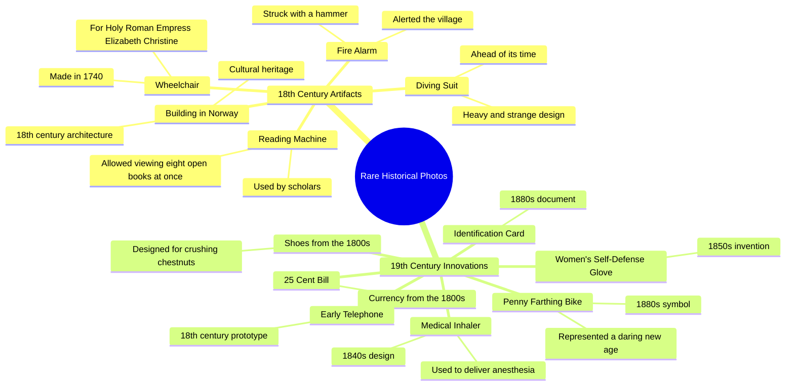

# Rare 1800s Historical Photos: Chestnut Crushing Shoes & More

> 🌐 **Read this in:** **English** · [中文](../../zh-CN/2026-06/tiktok-transcript-rare-historical-photos-of-1800-historical-creepy-storytime-f-02cb.md)

> **Creator:** [@venom_awais.0](https://www.tiktok.com/@venom_awais.0) · **Views:** 2.2M · **Posted:** 2026-06-08 · **Niche:** entertainment
>
> **TL;DR:** Opens with a bizarre, specific image that instantly piques curiosity.

[Watch original video →](https://www.tiktok.com/@venom_awais.0/video/7571907123735481608?q=storytimes&t=1780928009926)

## Why This Went Viral

## Hook (first 3 seconds)
- **Verbatim opening line:** "Rare historical photos. Shoes from the 1800s made for crushing chestnuts."
- **Hook pattern:** **Scene + Intriguing Detail** — a quick visual premise ("Rare historical photos") immediately followed by a bizarre, specific object ("shoes made for crushing chestnuts").
- **Why it stops scrolling:** The combination of "rare" (scarcity trigger) and "crushing chestnuts" (absurd, unexpected, mildly violent) creates instant cognitive dissonance. Viewers must stop to resolve: *Why would shoes crush chestnuts?*

## Emotional Rhythm
- **Beat 1 – Curiosity (0–3s):** "Rare historical photos" opens a mystery box. The chestnut-crushing shoe lands as a weird, almost funny image.
- **Beat 2 – Escalating Fascination (3–15s):** Each item is a mini-reveal: diving suit (strange), fire alarm (physical action), reading machine (intellectual). The rhythm is *show → pause → next*.
- **Beat 3 – Suspense + Tension (15–25s):** "1740 wheelchair for Empress" (royalty + disability), "25 cent bill" (economic oddity), "early telephone" (tech evolution). Each feels like a puzzle piece from a lost world.
- **Beat 4 – Twist / Climax (25–30s):** "1850s women's self-defense glove" – a violent, feminist artifact that subverts the "gentle past" expectation. Then "1880s identification card" (surveillance) and "penny farthing bike" (symbol of daring). The last image is the most iconic, giving a satisfying visual finish.
- **Beat 5 – Call to Action (end):** "Norway like and subscribe. It only takes a second." – breaks the spell, but the emotional peak has already passed.

## Keyword Density
| Keyword / Phrase | Frequency (approx.) | Driver |
|------------------|---------------------|--------|
| "18th century" / "1800s" | 8+ | **Algorithmic reach** – historical eras are high-search, low-competition keywords. |
| "Rare" | 2 (opening, implied) | **Emotional pull** – scarcity makes objects feel valuable, shareable. |
| "Shoes" / "diving suit" / "wheelchair" / "glove" | 5+ | **Algorithmic + emotional** – specific nouns trigger visual memory and curiosity. |
| "Made for" / "used to" | 3+ | **Emotional pull** – implies purpose, invites the viewer to imagine use. |
| "Ahead of its time" | 1 (diving suit) | **Emotional pull** – flatters the past, creates a "they were like us" connection. |
| "Daring" | 1 (penny farthing) | **Emotional pull** – ties the final image to a positive, aspirational trait. |

**Algorithmic drivers:** "18th century," "1800s," "rare" — these are searchable, evergreen, and low-competition.  
**Emotional drivers:** "Shoes," "diving suit," "wheelchair," "glove" — concrete, weird, tactile objects that trigger curiosity and sharing.

## Why It Spreads
1. **The "Oddity Cascade" pattern** – Each item is weirder than the last. The chestnut-crushing shoe is absurd; the self-defense glove is dark; the penny farthing is iconic. The video is a *curiosity escalator* — viewers stay to see what's next. *Transcript evidence:* "Shoes from the 1800s made for crushing chestnuts" → "1850s women's self-defense glove" → "1880s penny farthing bike."

2. **High "Tell-a-Friend" value** – Every object is a conversation starter. "Did you know there was a 1740 wheelchair?" is a low-stakes, high-interest fact people share at dinner. *Transcript evidence:* "A 1740 wheelchair made for the Holy Roman Empress Elizabeth Christine" — a specific, obscure, name-dropping fact.

3. **No explanation, only implication** – The video never explains *why* the shoes crushed chestnuts or *how* the diving suit worked. This creates a **curiosity gap** that drives comments (people ask, argue, speculate). *Transcript evidence:* No follow-up explanation after any item — just the object name.

4. **Algorithmic "bingeability"** – The rapid-fire format (one object every 2–3 seconds) keeps watch time high. The video is ~30 seconds, so it's short enough to watch multiple times. *Transcript evidence:* 10+ objects in 30 seconds = high density of "micro-reveals."

5. **The "Norway" non-sequitur** – The random "Norway like and subscribe" is so jarring it might be a meme template. It breaks the hypnotic rhythm, making the CTA feel like part of the weirdness. *Transcript evidence:* "An 18th century building in Norway. Norway like and subscribe." — the repetition of "Norway" is odd, memorable, and shareable.

## What You Can Steal
1. **The "Bizarre Object List" format** – Take any niche (history, science, tech) and compile 5–10 objects that are *specific, weird, and visually distinct*. Use the pattern: *[Time period] + [Object] + [Weird purpose]*. Example: "A 1920s toaster that required a crank."

2. **Leave every fact incomplete** – Never explain *why* or *how*. The curiosity gap drives comments, shares, and re-watches. If you explain, you kill the mystery. Instead, end each item with a pause, then move to the next.

3. **End with the most iconic image** – The penny farthing is the most recognizable object. Save it for last. The final visual should be the one that's most shareable as a thumbnail or meme. In your video, identify the "hero object" and place it at the climax.

## Mind Map

## Full Transcript (Generated by [TokTranscript](https://toktranscript.com/?utm_source=github&utm_medium=breakdown&utm_campaign=tool_attribution))

> 📝 Transcripts on this page are auto-generated and show the first 60%. Want to transcribe any TikTok in 30 seconds and get the full version? [Try TokTranscript free →](https://toktranscript.com/?utm_source=github&utm_medium=breakdown&utm_campaign=transcript_cta)

Rare historical photos. Shoes from the 1800s made for crushing chestnuts. An 18th century building in Norway. Norway like and subscribe. It only takes a second. An 18th century diving suit, heavy, strange and ahead of its time. An 18th century fire alarm you had to strike with a hammer to alert the village. An 18th century reading machine in that let scholars view eight open books at once.

*[Read the full transcript on TokTranscript →](https://toktranscript.com/plaza/tiktok-transcript-rare-historical-photos-of-1800-historical-creepy-storytime-f-02cb?utm_source=github&utm_medium=breakdown&utm_campaign=transcript_full)*

## Browse More

- All [entertainment](../../by-niche/en/entertainment.md) breakdowns
- All [Curiosity gap with specific oddity](../../by-pattern/en/hook-curiosity-gap-with-specific-oddity.md) examples

## Video Info

| | |
|---|---|
| Creator | [@venom_awais.0](https://www.tiktok.com/@venom_awais.0) |
| Original video | [https://www.tiktok.com/@venom_awais.0/video/7571907123735481608?q=storytimes&t=1780928009926](https://www.tiktok.com/@venom_awais.0/video/7571907123735481608?q=storytimes&t=1780928009926) |
| Original title | Rare historical photos of 1800 😱😰 #historical #creepy #storytime #for... |
| Views | 2.2M (2200000) |
| Posted | 2026-06-08 |
| Duration | 0s |
| Niche | `entertainment` |
| Hook pattern | `Curiosity gap with specific oddity` |
| Original language | `en` |
| Available languages | en, zh-CN |
| Generated | 2026-06-09 by [TokTranscript](https://toktranscript.com/) |

---

*This breakdown is for educational analysis under fair use. Original video © [@venom_awais.0](https://www.tiktok.com/@venom_awais.0). All transcripts are auto-generated and may contain errors.*

*Want to analyze your own TikToks like this? [TokTranscript.com →](https://toktranscript.com/viral-breakdown?utm_source=github&utm_medium=breakdown&utm_campaign=footer_cta)*