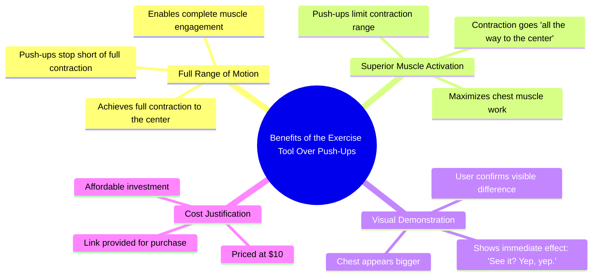

# No Broke Boys: Ab Coaster vs Push Ups for Core Contractions

> 🌐 **Read this in:** **English** · [中文](../../zh-CN/2026-06/tiktok-transcript-replying-to-bighead-no-broke-boys-c7bd.md)

> **Creator:** [@thevitalcart](https://www.tiktok.com/@thevitalcart) · **Views:** 3.1M · **Posted:** 2026-06-16 · **Niche:** fitness
>
> **TL;DR:** Directly challenges the viewer's financial status to provoke engagement.

[Watch original video →](https://vt.tiktok.com/ZSQbxPUF6/)

## Why This Went Viral

## Hook (first 3 seconds)
- **Verbatim opening:** "Big homie, it sounds like you just don't have $10 to spend because this gives you the freaking contraction that goes all the way to the center."
- **Hook pattern:** Bold claim + direct challenge (accusation of being cheap) + contrast (this vs. push-ups)
- **Why it stops scrolling:** It opens with a personal jab ("you just don't have $10") that triggers defensiveness and curiosity. The viewer instantly wants to know what "this" is and whether the claim is true. The phrase "contraction that goes all the way to the center" sounds technical and visceral, creating a knowledge gap.

## Emotional Rhythm
- **Beat 1 – Challenge/Defensiveness (0–2s):** "Big homie, it sounds like you just don't have $10" – viewer feels called out.
- **Beat 2 – Curiosity/Tension (2–4s):** "This gives you the freaking contraction that goes all the way to the center" – vague but powerful claim.
- **Beat 3 – Contrast/Clarity (4–6s):** "Whereas a push-ups just gonna stop right there" – simple comparison makes the claim concrete.
- **Beat 4 – Demonstration/Proof (6–9s):** "See it? Yep, yep." – visual confirmation of the contraction.
- **Beat 5 – Triumph/Climax (9–10s):** "My chest is bigger than yours." – direct, cocky mic-drop that validates the product.
- **Beat 6 – Call-to-Action (10s):** "There's the link." – immediate conversion prompt.

## Keyword Density
| Keyword/Phrase | Frequency (approx.) | Function |
|---|---|---|
| Contraction | 3 | **Algorithmic reach** – fitness niche keyword, high search volume |
| Center | 2 | **Emotional pull** – implies core activation, deeper results |
| $10 | 2 | **Algorithmic + emotional** – low price point triggers affordability and FOMO |
| Push-ups | 2 | **Algorithmic** – broad fitness term, comparison drives search |
| Bigger than yours | 1 | **Emotional pull** – competitive, ego-driven, highly shareable |
| Link | 1 | **Conversion** – direct CTA for sales |

## Why It Spreads
1. **The "You vs. Me" challenge creates shareability.** "My chest is bigger than yours" is a direct taunt that invites friends to tag each other in the comments. Viewers share it to prove a point or start a debate.
2. **The price anchor ($10) removes friction.** By explicitly calling out affordability, the video preempts the #1 objection to buying fitness products. The phrase "you just don't have $10" makes not buying feel shameful.
3. **The contrast hook (this vs. push-ups) is instantly understandable.** Even non-gym-goers know what a push-up is. The video doesn't require prior knowledge – the comparison is visual and verbal.
4. **The demonstration ("See it?") builds trust.** Rather than just talking, the creator shows the contraction happening. This visual proof reduces skepticism and increases conversion intent.
5. **The "big homie" tone creates in-group belonging.** The casual, confrontational but friendly language makes the viewer feel like they're getting insider advice from a trusted peer, not a brand.

## What You Can Steal
1. **Open with a direct challenge to the viewer's identity.** Instead of "This product is great," say "You're missing out because you don't have this." It triggers defensiveness and keeps them watching.
2. **Use a simple contrast to explain value.** Pick one common alternative (push-ups, squats, etc.) and explain why your solution is better in one sentence. Keep it binary: "This does X, that stops at Y."
3. **End with a competitive, ego-driven line.** A line like "My [body part] is bigger than yours" or "I'm better than you at this" is instantly shareable because it invites comparison and tagging. Use it sparingly for maximum impact.

## Mind Map

## Full Transcript (Generated by [try this transcription tool](https://toktranscript.com/?utm_source=github&utm_medium=breakdown&utm_campaign=tool_attribution))

> 📝 Transcripts on this page are auto-generated and show the first 60%. Want to transcribe any TikTok in 30 seconds and get the full version? [Try TokTranscript free →](https://toktranscript.com/?utm_source=github&utm_medium=breakdown&utm_campaign=transcript_cta)

Big homie, it sounds like you just don't have $10 to spend because this gives you the freaking contraction that goes all the way to the center.

*[Read the full transcript on TokTranscript →](https://toktranscript.com/plaza/tiktok-transcript-replying-to-bighead-no-broke-boys-c7bd?utm_source=github&utm_medium=breakdown&utm_campaign=transcript_full)*

## Browse More

- All [fitness](../../by-niche/en/fitness.md) breakdowns
- All [Challenge/Insult Hook](../../by-pattern/en/hook-challenge-insult-hook.md) examples

## Video Info

| | |
|---|---|
| Creator | [@thevitalcart](https://www.tiktok.com/@thevitalcart) |
| Original video | [https://vt.tiktok.com/ZSQbxPUF6/](https://vt.tiktok.com/ZSQbxPUF6/) |
| Original title | Replying to @BigHead no broke boys |
| Views | 3.1M (3100000) |
| Posted | 2026-06-16 |
| Duration | 0s |
| Niche | `fitness` |
| Hook pattern | `Challenge/Insult Hook` |
| Original language | `en` |
| Available languages | en, zh-CN |
| Generated | 2026-06-17 by [TokTranscript](https://toktranscript.com/) |

---

*This breakdown is for educational analysis under fair use. Original video © [@thevitalcart](https://www.tiktok.com/@thevitalcart). All transcripts are auto-generated and may contain errors.*

*Want to analyze your own TikToks like this? [TokTranscript.com →](https://toktranscript.com/viral-breakdown?utm_source=github&utm_medium=breakdown&utm_campaign=footer_cta)*