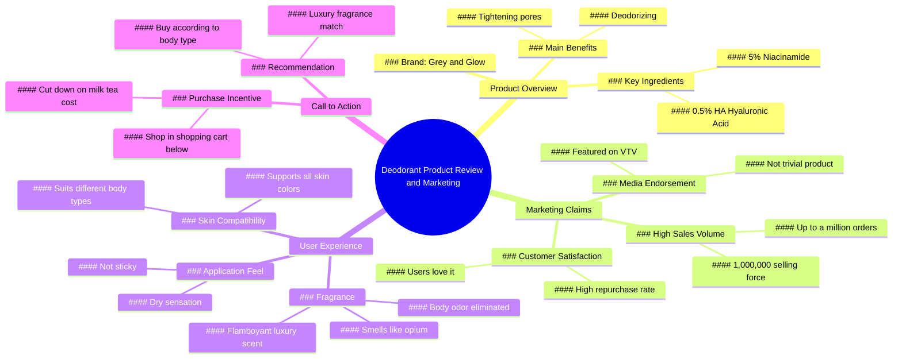

# Truth About Grace And Glow Deodorant Roll-On

> 🌐 **Read this in:** **English** · [中文](../../zh-CN/2026-06/tiktok-transcript-s-th-t-v-l-n-kh-m-i-grace-and-glow-lannach-lankhumui-huongnu-6f75.md)

> **Creator:** [@nguaca99](https://www.tiktok.com/@nguaca99) · **Views:** 1.5M · **Posted:** 2026-06-14 · **Niche:** beauty
>
> **TL;DR:** Opens with a million-sales claim to instantly establish credibility and intrigue.

[Watch original video →](https://l.facebook.com/l.php?u=https%3A%2F%2Fvt.tiktok.com%2FZSQxGyAGW%2F%3Ffbclid%3DIwZXh0bgNhZW0CMTAAYnJpZBExV0tIcWp4N3p2bmxRenB3eHNydGMGYXBwX2lkEDIyMjAzOTE3ODgyMDA4OTIAAR7auXdk5TTX38pANDsEmYY021o8C0Ndl37CX7AMxoSZw56WS_gEtn4_8obfWA_aem_y14H16E-0Vkj-zqe1wIX6w&h=AUC4DUhe59Df-FRdJl-wf3DhQiJC0_DRMKh7XUsxv7oXf8mcBo6c-iGXSbzq2XLs16gz1TZEUKdPOQFSWvRmJa-vRjoRFHzrgo6oFMDW2RFRpsGNdX_MvKgXWlaw5JUkRkU)

## Why This Went Viral

## Hook (first 3 seconds)
- **Verbatim:** "Don't you have illusions anymore. This 1,000,000 selling force Ra is a good thing."
- **Hook pattern:** Bold claim + social proof (numbers)
- **Why it stops scroll:** Opens with a direct, confrontational challenge ("Don't you have illusions anymore") that creates instant cognitive dissonance, followed by the massive number "1,000,000" which signals authority and FOMO.

## Emotional Rhythm
1. **Curiosity (0–3s):** "Don't you have illusions anymore" — viewer is jolted, wants to know what they're missing.
2. **Skepticism → Tension (3–10s):** "Is this really a deodorant bottle?" — rhetorical question builds doubt, then product claims pile up (niacinamide, HA, pore tightening).
3. **Relief + Validation (10–20s):** "I use this deodorant and it feels dry. It's not stuck. It smells like opium." — personal testimony resolves doubt, sensory language ("opium," "flamboyant luxury") creates pleasure.
4. **Urgency + Belonging (20–30s):** "Up to a million orders... You should buy it back so much." — social proof escalates into fear of missing out.
5. **Climax (30–35s):** "The AI body that's smelly knows. Buy the one that suits the body with the fragrance of luxury." — twist: personalization + exclusivity ("AI body") elevates product from commodity to identity.
6. **Call to action (35–end):** "Cut down on a cup of milk tea. Always shop in the shopping cart below." — low-cost sacrifice framed as smart decision, direct link.

## Keyword Density
| Keyword/Phrase | Frequency (approx.) | Driver |
|---|---|---|
| "deodorant" | 5 | Algorithmic — product category, searchable |
| "smell(s)/smelly" | 4 | Emotional — sensory trigger, relatability |
| "million" / "1,000,000" | 2 | Algorithmic — social proof, viral signal |
| "buy/bought" | 5 | Algorithmic — purchase intent, conversion |
| "luxury" / "flamboyant" | 2 | Emotional — aspirational, status appeal |
| "body" | 3 | Emotional — personal, identity-driven |
| "AI" | 1 | Algorithmic + Emotional — novelty, tech buzz |

**Algorithmic drivers:** "deodorant," "million," "buy" — high search volume, transaction intent.
**Emotional pull:** "smell," "luxury," "body," "AI" — sensory, identity, exclusivity.

## Why It Spreads
1. **Social proof bomb:** "1,000,000 selling force Ra... up to a million orders" — raw numbers trigger herd behavior; viewers think "if a million people bought, it must work."
2. **Sensory contrast:** "It smells like opium... flamboyant luxury" vs. "It's not stuck. It's dry." — solves a common pain point (sticky deodorant) while promising an exotic reward (opium scent), creating a memorable dichotomy.
3. **Identity targeting:** "The AI body that's smelly knows... buy the one that suits the body with the fragrance of luxury" — frames product as personalized, almost algorithmic ("AI body"), making viewers feel uniquely understood, not mass-marketed.
4. **Low-friction sacrifice:** "Cut down on a cup of milk tea" — trivial cost comparison reduces purchase anxiety; viewer rationalizes "it's just one bubble tea."
5. **Authority cue:** "Products that have been on VTV" — mentions a trusted TV channel (VTV) as third-party validation, adding credibility beyond influencer hype.

## What You Can Steal
1. **Open with a challenge, not a pitch.** Start with "Don't you have illusions anymore?" — a confrontational question that forces the viewer to stop and think, rather than a generic "Hey guys, check this out."
2. **Bundle pain relief with sensory pleasure.** Pair a practical benefit ("dry, not stuck") with an evocative reward ("smells like opium, flamboyant luxury") — this creates a "problem solved + treat yourself" emotional loop.
3. **Use a trivial cost comparison.** "Cut down on a cup of milk tea" — anchor the price to an everyday indulgence to make the purchase feel like a no-brainer sacrifice. Works for any product under $10.

## Mind Map

## Full Transcript (Generated by [the tool we used to generate this](https://toktranscript.com/?utm_source=github&utm_medium=breakdown&utm_campaign=tool_attribution))

> 📝 Transcripts on this page are auto-generated and show the first 60%. Want to transcribe any TikTok in 30 seconds and get the full version? [Try TokTranscript free →](https://toktranscript.com/?utm_source=github&utm_medium=breakdown&utm_campaign=transcript_cta)

Don't you have illusions anymore. This 1,000,000 selling force Ra is a good thing. According to the information flow, the goods are sold as much as they are delicious. What's so easy to do? Is this really a deodorant bottle? Grey and Glow has 5% Niacinamide This hip, as they say, supports all skin colors. or ha 0.5% aid in deodorizing and tightening pores here no Please answer for me. I use this deodorant and it feels dry. It's not stuck. It smells like opium. It's a flamboyant luxury. The smell of the body is missing. Can anyone answer that? Since the day I used this, I've loved it.

*[Read the full transcript on TokTranscript →](https://toktranscript.com/plaza/tiktok-transcript-s-th-t-v-l-n-kh-m-i-grace-and-glow-lannach-lankhumui-huongnu-6f75?utm_source=github&utm_medium=breakdown&utm_campaign=transcript_full)*

## Browse More

- All [beauty](../../by-niche/en/beauty.md) breakdowns
- All [Social proof + curiosity gap](../../by-pattern/en/hook-social-proof-curiosity-gap.md) examples

## Video Info

| | |
|---|---|
| Creator | [@nguaca99](https://www.tiktok.com/@nguaca99) |
| Original video | [https://l.facebook.com/l.php?u=https%3A%2F%2Fvt.tiktok.com%2FZSQxGyAGW%2F%3Ffbclid%3DIwZXh0bgNhZW0CMTAAYnJpZBExV0tIcWp4N3p2bmxRenB3eHNydGMGYXBwX2lkEDIyMjAzOTE3ODgyMDA4OTIAAR7auXdk5TTX38pANDsEmYY021o8C0Ndl37CX7AMxoSZw56WS_gEtn4_8obfWA_aem_y14H16E-0Vkj-zqe1wIX6w&h=AUC4DUhe59Df-FRdJl-wf3DhQiJC0_DRMKh7XUsxv7oXf8mcBo6c-iGXSbzq2XLs16gz1TZEUKdPOQFSWvRmJa-vRjoRFHzrgo6oFMDW2RFRpsGNdX_MvKgXWlaw5JUkRkU](https://l.facebook.com/l.php?u=https%3A%2F%2Fvt.tiktok.com%2FZSQxGyAGW%2F%3Ffbclid%3DIwZXh0bgNhZW0CMTAAYnJpZBExV0tIcWp4N3p2bmxRenB3eHNydGMGYXBwX2lkEDIyMjAzOTE3ODgyMDA4OTIAAR7auXdk5TTX38pANDsEmYY021o8C0Ndl37CX7AMxoSZw56WS_gEtn4_8obfWA_aem_y14H16E-0Vkj-zqe1wIX6w&h=AUC4DUhe59Df-FRdJl-wf3DhQiJC0_DRMKh7XUsxv7oXf8mcBo6c-iGXSbzq2XLs16gz1TZEUKdPOQFSWvRmJa-vRjoRFHzrgo6oFMDW2RFRpsGNdX_MvKgXWlaw5JUkRkU) |
| Original title | Sự thật về lăn khử mùi Grace And Glow! #lannach #lankhumui #huongnuoc... |
| Views | 1.5M (1500000) |
| Posted | 2026-06-14 |
| Duration | 0s |
| Niche | `beauty` |
| Hook pattern | `Social proof + curiosity gap` |
| Original language | `en` |
| Available languages | en, zh-CN |
| Generated | 2026-06-16 by [TokTranscript](https://toktranscript.com/) |

---

*This breakdown is for educational analysis under fair use. Original video © [@nguaca99](https://www.tiktok.com/@nguaca99). All transcripts are auto-generated and may contain errors.*

*Want to analyze your own TikToks like this? [TokTranscript.com →](https://toktranscript.com/viral-breakdown?utm_source=github&utm_medium=breakdown&utm_campaign=footer_cta)*