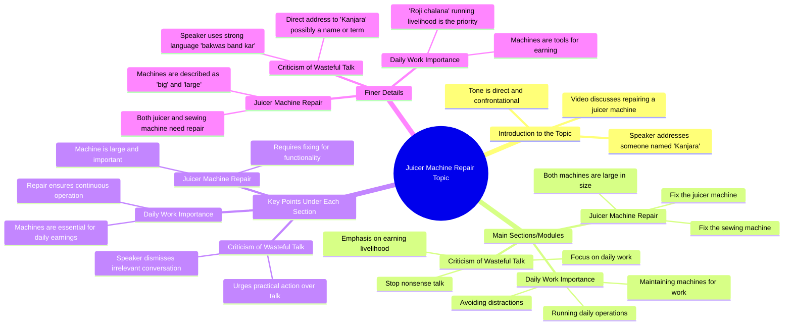

# Fix Your Juicer Machine, Stop Wasting Money

> 🌐 **Read this in:** **English** · [中文](../../zh-CN/2026-06/tiktok-transcript-saraikimonkey-bandar-viraltiktok-ai-42f3.md)

> **Creator:** [@qadirgra24k](https://www.tiktok.com/@qadirgra24k) · **Views:** 3.2M · **Posted:** 2026-06-16 · **Niche:** other
>
> **TL;DR:** The hook uses a repetitive, commanding tone about fixing machines, immediately creating a relatable and humorous frustration.

[Watch original video →](https://vt.tiktok.com/ZSQqssbnb/)

## Why This Went Viral

Here is the viral-content breakdown for the provided transcript.

---

## Hook (first 3 seconds)
- **Verbatim opening:** "जूसर मशीना ठीक करा लो, सलाई मशीना ठीक करा लो, अब बात हुता आप भी ता बड़ी वड़ी मशीन है, बकवास बंद कर कंजरा, रोजी चलातना मार"
- **Hook pattern:** **Bold claim + Contrast + Aggression.** The speaker dismisses "big machines" (juicer, sewing machine) as irrelevant and attacks the listener directly ("बकवास बंद कर कंजरा").
- **Why it stops scrolling:** The sudden, high-energy aggression is shocking. It breaks the pattern of polite or instructional content. The viewer is immediately offended or intrigued—they must know *why* this person is so angry about machines.

## Emotional Rhythm
- **Beats:**
    1.  **Tension (0–3s):** Aggressive dismissal of "big machines" creates immediate conflict.
    2.  **Curiosity (3–5s):** The phrase "अब बात हुता आप भी ता बड़ी वड़ी मशीन है" shifts from attack to a claim of superiority. Viewer thinks: "Wait, what machine is *he* talking about?"
    3.  **Suspense (5–7s):** The pause after "बकवास बंद कर" builds anticipation for the punchline.
    4.  **Climax (7s):** "रोजी चलातना मार" — the reveal. The "machine" is a metaphor for one's daily hustle or survival.
    5.  **Resonance/Relief:** The aggression is recontextualized as tough love or a motivational kick. The viewer realizes the "big machines" are excuses; the real "machine" is their own grind.
- **Climax moment:** The line "रोजी चलातना मार" — this is where the abstract rant becomes a concrete, relatable call to action.

## Keyword Density
- **Strongest repeated words/phrases:**
    1.  **मशीना / मशीन (Machine)** — Repeated 3 times. *Algorithmic reach* (common, searchable term) but also *emotional pull* (contrast between literal and metaphorical).
    2.  **ठीक करा लो (Get it fixed)** — Repeated twice. *Emotional pull* (implies brokenness, need for repair).
    3.  **बकवास (Nonsense)** — High emotional charge. *Emotional pull* (dismissive, confrontational).
    4.  **कंजरा (Miser/Scoundrel)** — Strong insult. *Emotional pull* (creates shock and memorability).
    5.  **रोजी (Daily bread/livelihood)** — The core metaphor. *Emotional pull* (universal, relatable).
    6.  **बड़ी वड़ी (Big/big)** — Repeated for emphasis. *Emotional pull* (contrast between size and value).
- **Algorithmic drivers:** "मशीन" is the key searchable term. "रोजी" and "बकवास" drive engagement (comments, shares) due to high emotional resonance.

## Why It Spreads
1.  **The "Reverse Bait-and-Switch" Mechanism:** The video starts as an aggressive rant about fixing physical machines, but pivots to a metaphor about your own life. Viewers who expected a repair tutorial stay for the motivational twist. *Concrete line:* "जूसर मशीना ठीक करा लो" → "रोजी चलातना मार."
2.  **High Emotional Contagion (Anger → Motivation):** The initial anger is contagious. Viewers feel attacked, then relieved when they realize the target is their own excuses. This emotional rollercoaster is highly shareable. *Concrete line:* "बकवास बंद कर कंजरा."
3.  **Universal Relatability (The "Grind" Metaphor):** The metaphor of "अपनी मशीन" (your own machine) is instantly understood by anyone working hard. It bypasses cultural specifics and taps into a global "hustle" mindset. *Concrete line:* "रोजी चलातना मार."
4.  **Verbal Punchline (Memorable & Quotable):** The final line "रोजी चलातना मार" is a perfect, tight punchline. It's easy to repeat, quote, and remix. This drives user-generated content (comments, stitches). *Concrete line:* The entire final phrase.

## What You Can Steal
1.  **The "Angry Metaphor" Hook:** Start with a seemingly unrelated, aggressive complaint about a common object (a machine, a tool, a habit). Then, in the last 3 seconds, reveal it's a metaphor for the viewer's own life or work. This creates high retention.
2.  **The "Insult-to-Inspiration" Arc:** Use a direct, confrontational tone (e.g., "बकवास बंद कर") to grab attention, but ensure the ending reframes the aggression as tough love or a motivational kick. The viewer must feel *called out* but not *attacked*.
3.  **The "One-Line Punchline" Structure:** Build the entire video around a single, repeatable, punchy line (here: "रोजी चलातना मार"). Make sure that line is the climax. Everything before it is setup. This makes the video easy to quote and share.

## Mind Map

## Full Transcript (Generated by [analyze your own TikToks](https://toktranscript.com/?utm_source=github&utm_medium=breakdown&utm_campaign=tool_attribution))

> 📝 Transcripts on this page are auto-generated and show the first 60%. Want to transcribe any TikTok in 30 seconds and get the full version? [Try TokTranscript free →](https://toktranscript.com/?utm_source=github&utm_medium=breakdown&utm_campaign=transcript_cta)

जूसर मशीना ठीक करा लो, सलाई मशीना ठीक करा लो, अब बात हुता आप भी ता बड़ी व

*[Read the full transcript on TokTranscript →](https://toktranscript.com/plaza/tiktok-transcript-saraikimonkey-bandar-viraltiktok-ai-42f3?utm_source=github&utm_medium=breakdown&utm_campaign=transcript_full)*

## Browse More

- All [other](../../by-niche/en/other.md) breakdowns
- All [Repetitive command with escalating absurdity](../../by-pattern/en/hook-repetitive-command-with-escalating-absurdity.md) examples

## Video Info

| | |
|---|---|
| Creator | [@qadirgra24k](https://www.tiktok.com/@qadirgra24k) |
| Original video | [https://vt.tiktok.com/ZSQqssbnb/](https://vt.tiktok.com/ZSQqssbnb/) |
| Original title | کنجرا روزی اِچ لَت نہ مار 😂😂 #saraikimonkey #bandar #viraltiktok #ai ... |
| Views | 3.2M (3200000) |
| Posted | 2026-06-16 |
| Duration | 0s |
| Niche | `other` |
| Hook pattern | `Repetitive command with escalating absurdity` |
| Original language | `en` |
| Available languages | en, zh-CN |
| Generated | 2026-06-17 by [TokTranscript](https://toktranscript.com/) |

---

*This breakdown is for educational analysis under fair use. Original video © [@qadirgra24k](https://www.tiktok.com/@qadirgra24k). All transcripts are auto-generated and may contain errors.*

*Want to analyze your own TikToks like this? [TokTranscript →](https://toktranscript.com/viral-breakdown?utm_source=github&utm_medium=breakdown&utm_campaign=footer_cta)*