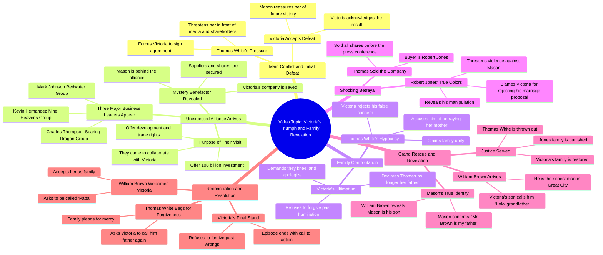

# Secret Billionaire Father's Child - Episode 8 Finale (Tag...

> 🌐 **Read this in:** **English** · [中文](../../zh-CN/2026-06/tiktok-transcript-sekretong-anak-bilyonaryong-ama-episode-8-ang-pagwawakas-tag-e36e.md)

> **Creator:** [@Drama Nation PH](https://www.tiktok.com/@Drama Nation PH) · **Views:** 2.2M · **Posted:** 2026-06-24 · **Niche:** entertainment
>
> **TL;DR:** The hook immediately establishes a high-stakes confrontation with a tone of reluctant surrender, drawing viewers into the conflict.

[Watch original video →](https://www.facebook.com/reel/2102636893638189)

## Why This Went Viral

## Hook (first 3 seconds)
- **Verbatim opening:** "Tinatanggap ko ang resulta. Sige na. Victoria, lahat ng yan dapat lang na mangyari sa'yo."
- **Hook pattern:** Scene + Bold claim (a character accepting defeat, then immediately threatening another)
- **Why it stops scroll:** Immediate tension and power dynamics are established — one character seems to concede, but the tone is aggressive and ominous. The viewer is hooked by the contradiction and wants to see who "wins" this confrontation.

## Emotional Rhythm
- **Beats:** Tension (threat) → Curiosity (who is Victoria?) → Frustration (family betrayal) → Hope (allies arrive) → Triumph (power reversal) → Shock (new betrayal) → Relief (final protector appears) → Resolution (justice served)
- **Suspense lands:** When the three big bosses arrive for "Miss White" — the viewer realizes a massive power shift is happening.
- **Twist:** Robert Jones reveals he bought the company — a betrayal that escalates stakes.
- **Climax:** President Brown reveals Mason is his son — the ultimate power reversal that destroys the antagonists.

## Keyword Density
- **"Miss White" / "Victoria"** — 20+ mentions; drives identity and status (algorithmic reach via character name search)
- **"Kumpanya" (company)** — 10+ mentions; central conflict (emotional pull: family vs. business)
- **"Shares" / "Shares ng kumpanya"** — 8+ mentions; stakes and power (algorithmic: business drama keywords)
- **"Pamilya" (family)** — 12+ mentions; emotional core (emotional pull: betrayal and loyalty)
- **"President Brown" / "Mr. Brown"** — 10+ mentions; ultimate authority figure (algorithmic: character authority boost)
- **"Lolo" / "Apo"** — 6+ mentions; emotional trigger (emotional pull: family bond and protection)

## Why It Spreads
1. **Power reversal is the core viral engine.** The video repeatedly sets up a weak character (Victoria) being bullied, then flips the script with powerful allies arriving one by one. Each arrival is a dopamine hit. *Concrete line: "Kaming lahat nandito para kay Miss White!"*
2. **Multiple twists within 5 minutes.** Most short-form videos have one twist; this has 3–4 (allies arrive, betrayal by Robert Jones, President Brown reveal). This keeps retention high because viewers stay for "what happens next." *Concrete line: "Sa akin niya binenta."*
3. **Family betrayal + redemption arc.** The emotional stakes are universal — viewers love seeing a villainous family get humbled. The "lolo" reveal at the end provides catharsis. *Concrete line: "Si Mason, sarili ko siyang anak."*
4. **Cliffhanger + call to action.** The ending ("Like and follow for more episode") is a direct retention tactic. The video is clearly part of a series, so viewers are incentivized to binge. *Concrete line: "Like and follow for more episode."*
5. **High emotional contrast.** The video swings from humiliation to triumph to shock to relief — each emotional shift is a "hook" that resets attention. *Concrete line: "Honey... Yun lang ang anahala ni Mama!"*

## What You Can Steal
1. **The "ally arrival" pattern.** Introduce a character who seems powerless, then have a powerful figure arrive to defend them. This creates instant emotional payoff. Apply: In your video, set up an underdog, then reveal a hidden supporter.
2. **Stack multiple reversals.** Don't settle for one twist. After a victory, introduce a betrayal. After the betrayal, introduce a bigger protector. Each reversal resets the viewer's attention span. Apply: Write a script with at least 3 power shifts.
3. **End with a cliffhanger + direct CTA.** The final line explicitly tells viewers to follow for more. This turns a viral video into a series that builds an audience. Apply: Always end with "Like and follow for part [next number]" — even if it's a standalone video, imply a sequel.

## Mind Map

## Full Transcript (Generated by [TokTranscript](https://toktranscript.com/?utm_source=github&utm_medium=breakdown&utm_campaign=tool_attribution))

> 📝 Transcripts on this page are auto-generated and show the first 60%. Want to transcribe any TikTok in 30 seconds and get the full version? [Try TokTranscript free →](https://toktranscript.com/?utm_source=github&utm_medium=breakdown&utm_campaign=transcript_cta)

Tinatanggap ko ang resulta. Sige na. Victoria, lahat ng yan dapat lang na mangyari sa'yo. Victoria, alam mo na mangyayari kapag nilabanan mo pa ako. Got me in the right way, got me in the best way Now you got me thinking, you're not competition Think you gotta fit Hoy! Anong ibig sabihin niya? Sinasabi ko sa'yo. Hindi matatalo ang asawa ko ngayon. Magtatagumpay siya. Victoria, parang nabubuhayan ka. Huwag mo sabihin naniniwala ka sa lalaking niya. Victoria, walang dudang lahat naman sa River City. Alam nila na kaluguyo mo ang lalaking yan at puro papogi lang naman. at ang lakas ng loob ang gulo rito. Victoria, sa harap ng media at lahat ng shareholders, ang agreement na yan ay pipirma mo. Sa ayaw mo nung gusto mo. Mason, ang talo ay talo. Tatanggapin ko. Sa future, magkakaroon tayo ng pagkakataong bumangon. Honey, wag ka na mag-alala. Pag sinabi kong hindi ka matatalo, hindi ka talaga matatalo. Lantito na si Charles Thompson ng Storytrip Si Kevin Hernandez sa Nine Heavens Group at si Mr. Mark Johnson ng Redwater Group. Soring Dragon Group, Nine Heavens Group, Redwater Group, Pampira, mga bigate ng ibang syudad. Mga bigating boss, bakit sila nandito? Eh ang litlang naman ang River City. Ba't nandito sila? Dahil kaya kay Mason? Mr. Thompson, Mr. Hernandez, Mr. Jackson, bakit kayo naparisi? At ikaw si... Ah, ako si Thomas White. Ako ang chairman ng AW Group. Ako rin ang nagpatawag ng press conference nito. Bakit ba? Napabisita kayo. Hindi ba ang chairman ng AW? Di ba si chairman Victoria White yun? Mr. Thompson, bakit ninyo alam. Pero mahinang klase ang Victoria niya. Tinanggal na siya ng board of directors sa chairmanship niya. Hindi mo ba alam, kaming lahat ay nandito para kay Miss White? Ano ka mo? Sabi ko, kaming lahat nandito para kay Miss White! Tama ka, kaming lahat nandito para kay Miss White! Mr. Thompson, Mr. Hernandez, nagkakamali kayo. Walang kwenta yan si Victoria. Bakit ka ba siya hinahanap? Sino ba rito si Miss Victoria White? Ako po yun. Charles Thompson ng Soaring Dragon Group. Kevin Hernandez and Nine Heavens. Mark Jackson ng Redwater Group! Karangalan makilala kayo! Teka, sandali lang, mga sir. Anong ano nangyari yan Ah mga sir bakit kayo nandito Miss White, sinabihan kaming makipag-collaborate sa company mo. Makipag-collaborate sa akin? Tapa, Miss White, ano mang kailangan mo, yung kumpanya namin, bibigyan ka ng fans o kaya manpower. Miss White, bilang token ang aming sincerity, masahin po ninyo. 100 billion investment? Won feng development rights? At maritime trade rights? Sobro naman to! Hindi ko deserve ang kaputihan niyo! Miss White, masyado kang formal sa amin. Maliit na bagay lang yan kung tutuusin. Kahit nga ang mismong company ko, kaya kong ibigayin sa'yo kung iingin mo. Lala akin to, suwabi rin kong magsalita. Pero, hindi ko kayong tanggapin lahat to. Sabihin nyo, sinong nasa likod nito? Ah, si ano? Ah, alam mo, honey. Ibigay nila ang mga regalong to. Tanggapin mo na lang. Hindi kaya si Mason? Kapano? May pinirmahan kang vet agreement sa asawa ko, diba? Yung mga supplier, yan ah. Nailigtas na ang kumpanya. Di ba dapat yung shares nyo malilipot na yung lahat sa asawa ko? Ano na? Pirmahan nyo na! Ah, Victoria, pamilya tayong lahat dito. Bakit natin pinag-aawayan ang shares ng pamilya? Kahit nasa amin yung iba, pamilya pa rin naman tayo kita. Tama siya, Victoria. Walang masamang intensyon ng papa mo. Kapakanan lang ng kumpanya ang iniisip niya. Anong pamilya yan? Isang malaking kahibangan niya atay. Itong inaaway niya ang asawa ko at ang anak ko, hindi ko narinig ang mga salitang yan. Sis, Nagkamali talaga kami. Baka pwedeng patawarin mo na kami. Patawarin kayo? O sige, lumuhod kayo, humingi ng tawad at huwag na magpakita pa sa kanya ulit. Gawin nyo ngayon din! Ikaw! Victoria White, kailangan bang ipahiya mo kami? Ha? Sa harap pa ng ibang tao? Ipahiya kayo ngayon? Ni minsan ba inisip nyo ako? Nung pinahiya niyo ako sa harap na iba? Huwag mong kalimutan, ako pa rin ang iyong ama. Anong ama? Ang tulad mo, hindi ka rapat dapat maging ama ko Nung namatay si mama at pinakasalan mong babae niyan Sa puso ko, wala na akong ama Hoy Victoria, sumusobra ka na Nakalimutan mo, akong siyang nagpalaki sa'yo, di ba? Teka lang Thomas, hindi ka na talaga nahiya Paano mo katrinato nitong nagdaang taon? Ang pakikitungo mo kay mama at kay Daisy Ikaw ang mas nakakaalam ko nung tama Bumbuhi ko, hindi kita mapapatawad Abayaan mo na siya Luluhut ka ba? O pipirmahan mo ang mga papeles? Pirmahan? Asaka ba? Victoria, akala mo masasagit mo ang kumpanya dahil natalong mo ako para sabihin ko sa'yo. Kuli na ang lahat. Anong ibig sabihin? Sasabihin ko sa'yo ang totoo. Bago pa ang press conference, naibenta ko na lahat ng shares ng kumpanya. Hanggang sa kauli-uli yan. Anong sabi mo? Victoria, sige, panalo ka na. Pero ano pong magagawa ko? Wala na, di ba? Pero alam mo, kinamumuhi ang kita. Alam mo kung bakit? Dahil kayo ng maho mo ay talagang nakakabigil. Sinampal mo ko Ang kapal mo talaga Thomas White, ganino mo binenta ang kumpanya? Sagutin mo ako! Honey... Yun lang ang anahala ni Mama! Gayunan naman ngayon. Nai-beta ko na ang kumpanya! Sabihin mo sa akin, ganino mo binenta? Sa akin niya binenta. Sa akin niya binenta Si Robert Jones, ba't nandito siya? Huwag mong sabihin na si Robert na ang may-ari ng AW Group Robert, bakit nandito ka? Masaya raw dito eh, bawal ba ako matend? Mr. Jones, butit dumating ka na Magkakampi tayong dalawa, di ba? Hindi mo ako pwede mabayaan. Umayas ka nga! Sinong sinasabi mong kakampi mo, ha? Ha?

*[Read the full transcript on TokTranscript →](https://toktranscript.com/plaza/tiktok-transcript-sekretong-anak-bilyonaryong-ama-episode-8-ang-pagwawakas-tag-e36e?utm_source=github&utm_medium=breakdown&utm_campaign=transcript_full)*

## Browse More

- All [entertainment](../../by-niche/en/entertainment.md) breakdowns
- All [Resigned Acceptance](../../by-pattern/en/hook-resigned-acceptance.md) examples

## Video Info

| | |
|---|---|
| Creator | [@Drama Nation PH](https://www.tiktok.com/@Drama Nation PH) |
| Original video | [https://www.facebook.com/reel/2102636893638189](https://www.facebook.com/reel/2102636893638189) |
| Original title | Sekretong Anak Bilyonaryong Ama - Episode 8 | Ang pagwawakas (Tagalog Dubbed) |
| Views | 2.2M (2235826) |
| Posted | 2026-06-24 |
| Duration | 0s |
| Niche | `entertainment` |
| Hook pattern | `Resigned Acceptance` |
| Original language | `en` |
| Available languages | en, zh-CN |
| Generated | 2026-06-25 by [TokTranscript](https://toktranscript.com/) |

---

*This breakdown is for educational analysis under fair use. Original video © [@Drama Nation PH](https://www.tiktok.com/@Drama Nation PH). All transcripts are auto-generated and may contain errors.*

*Want to analyze your own TikToks like this? [TokTranscript →](https://toktranscript.com/viral-breakdown?utm_source=github&utm_medium=breakdown&utm_campaign=footer_cta)*