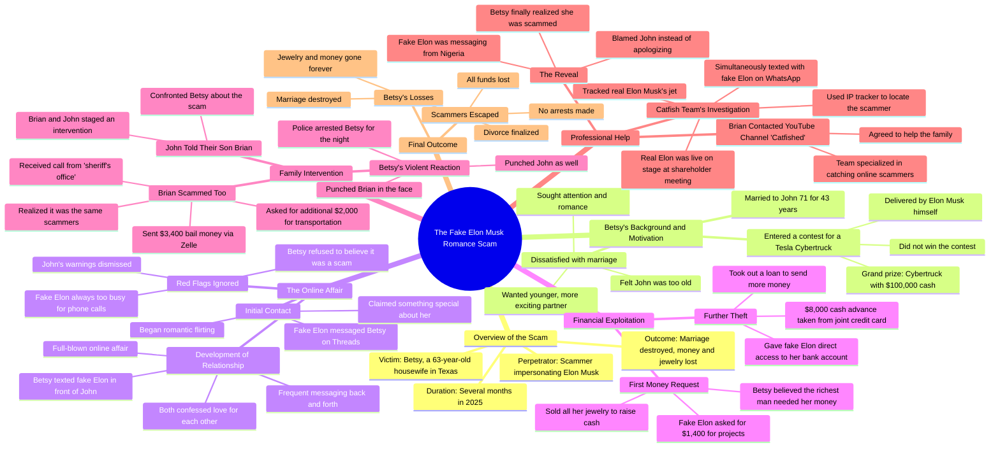

# Catfished Team Helps Betsy Expose Elon Musk Affair

> 🌐 **Read this in:** **English** · [中文](../../zh-CN/2026-06/tiktok-transcript-shout-out-to-the-catfished-team-for-helping-betsy-and-for-pu-ef4a.md)

> **Creator:** [@realraywilliam](https://www.tiktok.com/@realraywilliam) · **Views:** 3.9M · **Posted:** 2026-06-09 · **Niche:** entertainment
>
> **TL;DR:** Opens with an unbelievable, clickbait-worthy claim about Elon Musk to instantly grab attention.

[Watch original video →](https://www.tiktok.com/@realraywilliam/video/7626417709781110047?is_from_webapp=1&sender_device=pc&web_id=7626876829698491912)

## Why This Went Viral

## Hook (first 3 seconds)
- **Verbatim:** "so Elon Musk is apparently having an affair with this 63 year old woman this story is wild"
- **Pattern:** Bold claim + curiosity gap (affair with an unlikely person)
- **Why it stops scroll:** Combines a massive celebrity name (Elon Musk) with a shocking, age-specific detail (63-year-old woman) that defies expectation. The word "wild" signals a juicy, unbelievable story — immediate FOMO.

## Emotional Rhythm
1. **Curiosity** — "Elon Musk is having an affair with a 63-year-old" (hook)
2. **Tension** — Betsy's marriage dissatisfaction, desire for younger man
3. **Suspense** — She enters contest, gets messaged by "Elon"
4. **Doubt (viewer)** — "He's always too busy" — audience knows it's a scam
5. **Frustration** — Betsy ignores husband, sells jewelry, gives bank access
6. **Shock** — She punches her son and husband
7. **Irony** — Brian falls for a scam too
8. **Climax** — Catfish team shows IP tracker: "Nigeria"
9. **Resonance/Disappointment** — Betsy blames husband, no redemption
- **Climax moment:** "this person is actually messaging from Nigeria sorry Nigeria" — the reveal that shatters her delusion.

## Keyword Density
- **Elon Musk** — algorithm gold (high-search celebrity name)
- **Betsy** — emotional anchor (viewer attaches to her story)
- **Scam / scammers** — drives reach (high-interest, evergreen topic)
- **Fake Elon** — contrast phrase (creates tension, keyword for search)
- **John (husband)** — emotional pull (sympathy victim)
- **Nigeria** — specific location detail (adds credibility, shock)
- **Money / cash / bank account** — triggers financial anxiety (high engagement)
- **Divorce** — emotional hook (relationship drama)
- **Punch / punched** — visceral action (shock value)
- **Catfished** — brand mention (community crossover)

## Why It Spreads
1. **Unbelievable but true premise** — "63-year-old housewife falls for fake Elon Musk romance scam" is a headline so absurd it demands to be shared. The transcript opens with "this story is wild" — a self-aware invitation to tell others.
2. **Multiple mini-plot twists** — Betsy punches her son, Brian gets scammed by the same scammers, she blames her husband after the reveal. Each twist is a new shareable moment. The audience gets dopamine hits from each "wait, what?" beat.
3. **Relatable victim archetype** — John is the sympathetic, betrayed husband. Viewers root for him, feel anger at Betsy, then pity. This emotional rollercoaster drives comments and shares ("I can't believe she did that to him").
4. **Educational + entertaining hybrid** — It's a cautionary tale about romance scams disguised as a gossip story. People share it to warn others ("this could happen to your mom"). The "Nigeria" IP tracker moment is both shocking and informative.
5. **Cliffhanger ending** — "the fake Elon scammers get away with all of it" leaves viewers unsatisfied, prompting them to comment "what happened next?" or search for updates, boosting dwell time and algorithmic signals.

## What You Can Steal
1. **Open with a celebrity + contradiction** — Name-drop a famous person in an unexpected context (e.g., "Elon Musk" + "63-year-old housewife"). This instantly breaks the viewer's mental filter. Apply to any trending figure: "Taylor Swift is secretly dating a 72-year-old plumber" (if true, obviously).
2. **Stack mini-twists every 30 seconds** — Don't let the story plateau. The transcript has a twist at :30 (she wants younger man), 1:30 (she enters contest), 2:30 (fake Elon), 3:30 (punches), 4:30 (Brian scammed), 5:30 (Nigeria reveal). Map your story to have a surprise every 20–40 seconds.
3. **End with a "no redemption" punch** — The most viral stories don't always have a happy ending. Betsy blames her husband and the scammers win. This creates frustration that drives comments ("she deserved it" / "I feel so bad for John"). Leave your audience with a strong emotion they need to vent.

## Mind Map

## Full Transcript (Generated by [TokTranscript.com](https://toktranscript.com/?utm_source=github&utm_medium=breakdown&utm_campaign=tool_attribution))

> 📝 Transcripts on this page are auto-generated and show the first 60%. Want to transcribe any TikTok in 30 seconds and get the full version? [Try TokTranscript free →](https://toktranscript.com/?utm_source=github&utm_medium=breakdown&utm_campaign=transcript_cta)

so Elon Musk is apparently having an affair with this 63 year old woman this story is wild now the woman's name is Betsy and like I said she's 63 and she's living in Texas and Betsy lives a regular life she's a housewife and a mom however Betsy has a big problem she's married to this guy John and they've been married for 43 years but now John 71 and Betsy starting to think that maybe he's a little too old for her and she decides that she doesn't wanna watch him grow even older or be around when he dies one day instead she wants to find a new man someone younger and more exciting someone who will give her lots of attention and get you know spicy in the bedroom then one day in 2025 she gets that chance because Betsy's scrolling around on her phone on threads when she sees an online contest and the winner of this contest will get a grand prize of a new Tesla cybertruck with $100,000 cash inside and Elon Musk himself will deliver the truck to the winner's house and Betsy's like I want that and so she enters the contest now she doesn't actually win the contest of course however something crazy does happen she's chilling at home one day and she gets a message probably on threads and the message is from Elon Musk himself and he's like Betsy this is Elon Musk I don't normally reach out like this but there's something special about you then he starts messaging her romantic things like he's flirting and Betsy thinks he's kind of fine so she starts flirting back and soon they're messaging back and forth a lot and eventually this develops into a full blown online affair and Betsy loves all this new attention she's getting and she makes no secret that she's having an online affair with Elon Musk in fact she'll text him right in front of her husband John like she just rubs it in his face now eventually as this relationship develops Elon confesses his love for Betsy and Betsy she loves him right back but strangely whenever she asks Elon to talk on the phone he's always too busy that's suspicious but whatever I guess they're in love I suppose okay here's the thing about this Elon guy she's talking to he's not really Elon Musk this person is a scammer and this is a romance scam and this may be obvious to like me and you and her husband John but it's not obvious to Betsy in fact whenever her husband John tells her that she's talking to an imposter she doesn't listen and she just keeps this relationship going and after a few months inevitably fake Elon starts hitting her up for money telling her that he needs some cash to fund his projects or whatever and yes Betsy actually believes him she believes that the richest man in the world a man whose wealth grows by like 600 million dollars a day really needs her to loan him like 14 hundred dollars now 14 hundred dollars is not a small amount of money especially not to Betsy and John in fact she doesn't actually have it so she starts selling all her things including pawning all her jewelry to come up with the cash to send him and to make it worse Betsy even gives fake Elon direct access to her bank account where he takes an extra $8,000 cash advance off her and John's joint credit card meanwhile poor John is still supporting Betsy he's cooking her dinner every night and trying to be the best husband that he can be so that he can win her back but ultimately that doesn't help because eventually Betsy drops a bomb on him she's filing for divorce she's gonna leave him for a guy pretending to be Elon Musk a guy she's never even spoken on the phone to and at this point poor John he doesn't know what to do so he goes and he tells their son this guy Brian so John tells Brian and the two of them decide to stage an intervention so Brian goes to his parents house and he and John confront Betsy and they try to get her to face reality Brian's like mom he's the richest man in the world of all the women on the earth why would he choose you and this of course pisses Betsy off and she flips out and she starts yelling you have no idea what you've just done Elon has satellites and he can aim them at the house and blow up your car and Brian's like mom you're a 63 year old housewife what do you have to offer him and Betsy gets even more mad and suddenly POW she punches Brian in the face and then POW she punches John too and eventually the police show up and they intervene and Bam they arrest her and they throw her in jail for the night the next day Brian gets a phone call and the person on the phone says this is the sheriff's office we just need the bail money and then we'll le

*[Read the full transcript on TokTranscript →](https://toktranscript.com/plaza/tiktok-transcript-shout-out-to-the-catfished-team-for-helping-betsy-and-for-pu-ef4a?utm_source=github&utm_medium=breakdown&utm_campaign=transcript_full)*

## Browse More

- All [entertainment](../../by-niche/en/entertainment.md) breakdowns
- All [Shocking Claim](../../by-pattern/en/hook-shocking-claim.md) examples

## Video Info

| | |
|---|---|
| Creator | [@realraywilliam](https://www.tiktok.com/@realraywilliam) |
| Original video | [https://www.tiktok.com/@realraywilliam/video/7626417709781110047?is_from_webapp=1&sender_device=pc&web_id=7626876829698491912](https://www.tiktok.com/@realraywilliam/video/7626417709781110047?is_from_webapp=1&sender_device=pc&web_id=7626876829698491912) |
| Original title | Shout out to the Catfished team for helping Betsy and for putting thi... |
| Views | 3.9M (3900000) |
| Posted | 2026-06-09 |
| Duration | 0s |
| Niche | `entertainment` |
| Hook pattern | `Shocking Claim` |
| Original language | `en` |
| Available languages | en, zh-CN |
| Generated | 2026-06-10 by [TokTranscript](https://toktranscript.com/) |

---

*This breakdown is for educational analysis under fair use. Original video © [@realraywilliam](https://www.tiktok.com/@realraywilliam). All transcripts are auto-generated and may contain errors.*

*Want to analyze your own TikToks like this? [TokTranscript →](https://toktranscript.com/viral-breakdown?utm_source=github&utm_medium=breakdown&utm_campaign=footer_cta)*