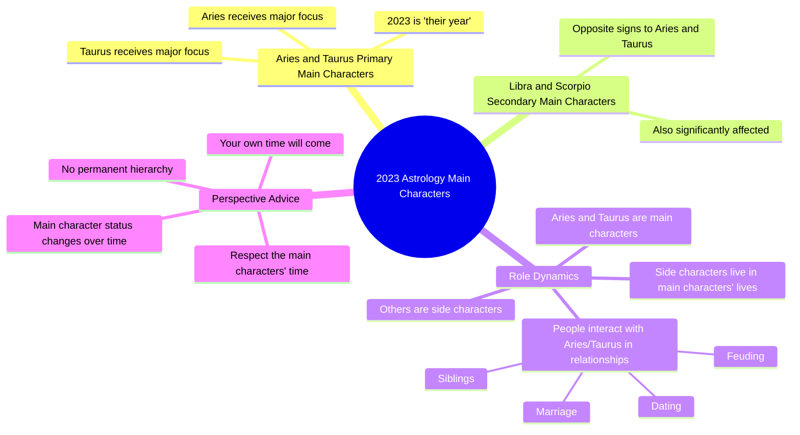

# Shoutout to Aries and Taurus for 2023

> 🌐 **Read this in:** **English** · [中文](../../zh-CN/2026-06/tiktok-transcript-shoutout-to-aries-taurus-2f18.md)

> **Creator:** [@marenaltman](https://www.tiktok.com/@marenaltman) · **Views:** 2.6M · **Posted:** 2026-06-28 · **Niche:** entertainment
>
> **TL;DR:** Declares a definitive, exclusive prediction that immediately positions the viewer as either a main character or a side character.

[Watch original video →](https://www.tiktok.com/@marenaltman/video/7180456466132798763)

## Why This Went Viral

## Hook (first 3 seconds)
- **Verbatim opening line:** "Keep in mind that the main characters for 2023 are Aries and Taurus."
- **Hook pattern:** Bold claim + astrological authority (prediction-based).
- **Why it stops scroll:** It positions the viewer as either a main character (flattering) or a side character (intriguing/competitive). The "main character" trope is culturally viral right now — it triggers identity check.

## Emotional Rhythm
1. **Curiosity** — "Main characters for 2023" makes viewers wonder if they're included.
2. **Validation** — Aries/Taurus viewers feel seen and chosen.
3. **Tension** — "You are a side character" creates a slight sting for non-Aries/Taurus viewers.
4. **Relief** — "Your time will come" releases the tension and reframes the hierarchy as temporary.
5. **Defiance/Resonance** — "I don't give a shit who the main character is" adds a rebellious, no-nonsense tone that feels authentic.
6. **Climax** — "Aries and Taurus are getting the attention next year" — the final confirmation that rewards the in-group.

## Keyword Density
| Keyword / Phrase | Frequency Context | Driver |
|------------------|------------------|--------|
| Main character(s) | 4x | **Emotional pull** — identity, status, narrative |
| Aries | 3x | **Algorithmic reach** — searchable zodiac tag |
| Taurus | 3x | **Algorithmic reach** — searchable zodiac tag |
| Side character | 2x | **Emotional pull** — contrast, FOMO |
| Year / 2023 | 2x | **Algorithmic reach** — time-sensitive, trending |
| Attention | 1x | **Emotional pull** — desire, scarcity |
| Respect | 1x | **Emotional pull** — authority, social contract |

**Algorithmic drivers:** Zodiac signs + year = searchable, shareable, trendable.
**Emotional drivers:** "Main character" vs "side character" = identity friction that drives comments and saves.

## Why It Spreads
1. **Identity-based in-group/out-group framing** — "You are a side character" forces non-Aries/Taurus viewers to comment "I'm a main character though" or "When is my sign's turn?" → engagement bait that works.
2. **Astrology + pop culture crossover** — The "main character" meme is already viral on TikTok. By merging it with zodiac predictions, the video taps into two high-engagement verticals simultaneously.
3. **Short, declarative, no waffle** — The transcript is 90 seconds of pure assertion. No "maybe," no hedging. Certainty drives saves and shares (people send it to friends who are Aries/Taurus).
4. **Defiant tone creates parasocial trust** — "I don't give a shit who the main character is" sounds like a real person, not a scripted astrologer. That authenticity makes viewers more likely to trust and share.
5. **Temporal urgency** — "2023 is their year" creates a now-or-never feeling. Viewers save it to remember, share it to warn friends, or comment to argue.

## What You Can Steal
1. **Lead with a binary identity hook.** "You're either X or Y" forces the viewer to self-sort in the first 2 seconds. Apply this to any niche: "Two types of investors this quarter — which one are you?"
2. **Use the "side character" tension to drive comments.** Explicitly tell a large segment of your audience they're not the focus. They will comment to defend their relevance, boosting your engagement.
3. **Add a defiant, unbothered line to build trust.** A phrase like "I don't give a shit" (or your niche's equivalent) signals you're not pandering. That perceived honesty increases shareability, especially with skeptical audiences.

## Mind Map

## Full Transcript (Generated by [the tool we used to generate this](https://toktranscript.com/?utm_source=github&utm_medium=breakdown&utm_campaign=tool_attribution))

> 📝 Transcripts on this page are auto-generated and show the first 60%. Want to transcribe any TikTok in 30 seconds and get the full version? [Try TokTranscript free →](https://toktranscript.com/?utm_source=github&utm_medium=breakdown&utm_campaign=transcript_cta)

Keep in mind that the main characters for 2023 are Aries and Taurus There is by far the most moving through the signs of Aries and Taurus Secondarily Libra and Scorpio the opposite signs So if you're in a house with dating married siblings whatever feuding with an Aries or a Taurus know that 2023 is their year You are a side character they're t

*[Read the full transcript on TokTranscript →](https://toktranscript.com/plaza/tiktok-transcript-shoutout-to-aries-taurus-2f18?utm_source=github&utm_medium=breakdown&utm_campaign=transcript_full)*

## Browse More

- All [entertainment](../../by-niche/en/entertainment.md) breakdowns
- All [Astrological Authority + Bold Claim](../../by-pattern/en/hook-astrological-authority-bold-claim.md) examples

## Video Info

| | |
|---|---|
| Creator | [@marenaltman](https://www.tiktok.com/@marenaltman) |
| Original video | [https://www.tiktok.com/@marenaltman/video/7180456466132798763](https://www.tiktok.com/@marenaltman/video/7180456466132798763) |
| Original title | shoutout to aries & taurus  |
| Views | 2.6M (2600000) |
| Posted | 2026-06-28 |
| Duration | 0s |
| Niche | `entertainment` |
| Hook pattern | `Astrological Authority + Bold Claim` |
| Original language | `en` |
| Available languages | en, zh-CN |
| Generated | 2026-06-29 by [TokTranscript](https://toktranscript.com/) |

---

*This breakdown is for educational analysis under fair use. Original video © [@marenaltman](https://www.tiktok.com/@marenaltman). All transcripts are auto-generated and may contain errors.*

*Want to analyze your own TikToks like this? [TokTranscript.com →](https://toktranscript.com/viral-breakdown?utm_source=github&utm_medium=breakdown&utm_campaign=footer_cta)*