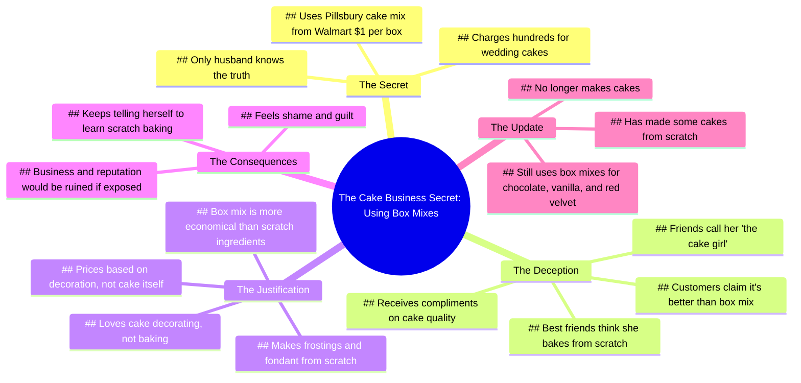

# Story Time: My Cake Business Secret Part 1

> 🌐 **Read this in:** **English** · [中文](../../zh-CN/2026-06/tiktok-transcript-story-time-part-1-story-fyp-diy-foryoupage-viral-tiktok-7513.md)

> **Creator:** [@jerryhlgiii](https://www.tiktok.com/@jerryhlgiii) · **Views:** 1.4M · **Posted:** 2026-06-02 · **Niche:** food
>
> **TL;DR:** The hook uses a high-stakes question to immediately engage curiosity, then delivers a jaw-dropping confession.

[Watch original video →](https://vm.tiktok.com/ZS92yvXCCNQSn-tbG0C/ This post is shared via TikTok Lite. Download TikTok Lite to enjoy more posts: https://www.tiktok.com/tiktoklite)

## Why This Went Viral

## Hook (first 3 seconds)
- "What's your secret that could literally ruin your life if it came out?"
- Type: **Bold claim** (disguised as a question with high-stakes language: "ruin your life")
- Why it stops scrolling: The phrase "ruin your life" triggers immediate anxiety and curiosity. It promises a confession with serious consequences, making the viewer feel they're about to witness something forbidden or scandalous.

## Emotional Rhythm
1. **Curiosity** (0:00–0:05) – The opening question raises stakes and mystery.
2. **Tension** (0:05–0:20) – Reveal: "I use Pillsbury cake mix." The confession creates dissonance (professional baker using box mix).
3. **Relief + Humor** (0:20–0:35) – "I suck at baking" and "my whole life is a lie" lighten the mood with self-deprecation.
4. **Resonance** (0:35–0:50) – "People compliment my cakes... telling me it's so much better than box mix cake." The irony creates a shared "aha" moment.
5. **Climax** (0:50–1:10) – "No one knows about this except my husband." The secret deepens, and the guilt becomes tangible.
6. **Vulnerability** (1:10–1:30) – "I feel like such a shame sometimes." The emotional payoff – the viewer now feels for the creator.
7. **Resolution** (1:30–end) – "I actually no longer make cakes." A final twist that closes the story arc with a punch.

## Keyword Density
- **"cake"** (14x) – Algorithmic reach: high-volume, searchable keyword.
- **"box mix" / "Pillsbury"** (6x) – Emotional pull: creates the central conflict (homemade vs. shortcut).
- **"lie" / "secret"** (4x) – Emotional pull: drives the confessional, scandalous tone.
- **"suck" / "hate"** (3x) – Emotional pull: raw, relatable frustration.
- **"reputation" / "business"** (2x) – Algorithmic reach: triggers business/entrepreneur keywords.
- **"husband"** (1x) – Emotional pull: intimacy, trust, secrecy.
- **"shame"** (1x) – Emotional pull: vulnerability that humanizes the creator.

## Why It Spreads
1. **Universal "dirty secret" pattern** – Everyone has a shortcut they're embarrassed about. The line "My whole life is a lie" makes the viewer think, "I've done something similar." This creates instant relatability and shareability.
2. **High-stakes framing** – "Ruin your life" vs. "Pillsbury cake mix" is absurdly disproportionate. That contrast is comedy gold. The viewer feels clever for catching the irony, and wants to share it.
3. **Self-deprecating vulnerability** – "I feel like such a shame sometimes" and "I suck at baking" are not defensive. The creator owns the flaw, which makes the audience root for them instead of judge them. This emotional safety encourages sharing.
4. **Specific, visual details** – "$1 a box at Walmart," "add oil, eggs, and water," "I make all the frostings and fondant from scratch." These concrete details make the story feel true and memorable. They're quotable, meme-able, and easy to retell.
5. **Closure with a twist** – "I actually no longer make cakes." This ending is unexpected (not a redemption arc, but a quiet exit). It leaves the viewer satisfied yet slightly sad, which makes them more likely to comment or share to discuss the ending.

## What You Can Steal
1. **Lead with a high-stakes question that undersells the reveal.** Frame your confession as life-ruining, then reveal something hilariously mundane. The gap between expectation and reality is the hook.
2. **Use a "confession" structure with a clear emotional arc.** Start with mystery → reveal → self-deprecation → vulnerability → resolution. This keeps viewers watching until the end because they want emotional closure.
3. **Plant a specific, reusable detail.** "Pillsbury cake mix for $1 at Walmart" is instantly memorable. In your own video, pick one concrete, relatable detail (brand, price, location) that people can repeat to their friends. That's what makes a story spread.

## Mind Map

## Full Transcript (Generated by [TokTranscript.com](https://toktranscript.com/?utm_source=github&utm_medium=breakdown&utm_campaign=tool_attribution))

> 📝 Transcripts on this page are auto-generated and show the first 60%. Want to transcribe any TikTok in 30 seconds and get the full version? [Try TokTranscript free →](https://toktranscript.com/?utm_source=github&utm_medium=breakdown&utm_campaign=transcript_cta)

What's your secret that could literally ruin your life if it came out? I run a cake business. I charge people hundreds for wedding cakes. Every last one is made using Pillsbury cake mix I buy for $1 a box at Walmart. I suck at baking. Every time I've ever tried to make a cake from scratch, it sucked. But baking is like my whole deal. My friends all call me the cake girl. It's like my whole life is a lie. People compliment my cakes all the time. Telling me how delicious they are, telling me it's so much better than box mix cake. Telling me they could never bake a cake so delicious. Well guess what? For $1, they too can make a cake just as delicious. Just add oil, eggs, and water. In my defense, I love cake decorating. I make all of the frostings and fondant from scratch. I just hate baking ducking cakes. I base my prices mostly on the decoration of the cakes and not of the cake itself, if that makes sense. Still, no one knows about this except my husband. Even my best friends think I ducking slave over the oven mixing and baking these damn cakes.

*[Read the full transcript on TokTranscript →](https://toktranscript.com/plaza/tiktok-transcript-story-time-part-1-story-fyp-diy-foryoupage-viral-tiktok-7513?utm_source=github&utm_medium=breakdown&utm_campaign=transcript_full)*

## Browse More

- All [food](../../by-niche/en/food.md) breakdowns
- All [Rhetorical question + shocking reveal](../../by-pattern/en/hook-rhetorical-question-shocking-reveal.md) examples

## Video Info

| | |
|---|---|
| Creator | [@jerryhlgiii](https://www.tiktok.com/@jerryhlgiii) |
| Original video | [https://vm.tiktok.com/ZS92yvXCCNQSn-tbG0C/ This post is shared via TikTok Lite. Download TikTok Lite to enjoy more posts: https://www.tiktok.com/tiktoklite](https://vm.tiktok.com/ZS92yvXCCNQSn-tbG0C/ This post is shared via TikTok Lite. Download TikTok Lite to enjoy more posts: https://www.tiktok.com/tiktoklite) |
| Original title | Story time | Part 1 #story #fyp #diy #foryoupage #viral #tiktok  |
| Views | 1.4M (1400000) |
| Posted | 2026-06-02 |
| Duration | 0s |
| Niche | `food` |
| Hook pattern | `Rhetorical question + shocking reveal` |
| Original language | `en` |
| Available languages | en, zh-CN |
| Generated | 2026-06-04 by [TokTranscript](https://toktranscript.com/) |

---

*This breakdown is for educational analysis under fair use. Original video © [@jerryhlgiii](https://www.tiktok.com/@jerryhlgiii). All transcripts are auto-generated and may contain errors.*

*Want to analyze your own TikToks like this? [TokTranscript →](https://toktranscript.com/viral-breakdown?utm_source=github&utm_medium=breakdown&utm_campaign=footer_cta)*