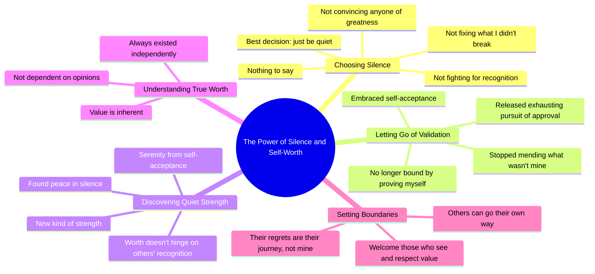

# The Best Thing I Ever Did Was Stay Quiet

> 🌐 **Read this in:** **English** · [中文](../../zh-CN/2026-06/tiktok-transcript-the-best-i-have-ever-done-is-to-stay-quiet-denzelwashington-89b9.md)

> **Creator:** [@motivation.wave8](https://www.tiktok.com/@motivation.wave8) · **Views:** 7.4M · **Posted:** 2026-06-02 · **Niche:** other
>
> **TL;DR:** Opens with a bold, counterintuitive statement that challenges the norm of self-promotion.

[Watch original video →](https://vm.tiktok.com/ZNR7YhfLK/)

## Why This Went Viral

## Hook (first 3 seconds)
- **Verbatim:** "The best thing I ever decided to do was just be quiet."
- **Hook pattern:** Bold claim + contrast (best thing vs. being quiet is counterintuitive)
- **Why it stops scrolling:** It flips the script on a universal pain point—the pressure to speak up, defend, or prove yourself. The phrase "best thing" creates immediate cognitive dissonance (silence is usually seen as weakness), forcing the viewer to pause and ask *why*.

## Emotional Rhythm
- **Beat 1 – Curiosity + Tension:** "The best thing… was just be quiet." Viewer expects a success story, gets a subversion.
- **Beat 2 – Release of pressure:** "I'm not convincing anybody… not trying to fix anything I didn't break." Relatable relief—viewers exhale.
- **Beat 3 – Defiance + Warning:** "You better hope you don't regret it." Tension spikes again, but now it's *empowered* tension.
- **Beat 4 – Resolution / Peace:** "In my silence, I found peace… a quiet strength." Emotional payoff—viewer feels the shift from struggle to serenity.
- **Beat 5 – Final boundary:** "Those who don't can carry on their way." Climax of self-worth—viewer feels permission to set the same boundary.

## Keyword Density
| Keyword/Phrase | Count (approx.) | Purpose |
|----------------|-----------------|---------|
| "worth" / "value" | 4 | Emotional pull: taps into core human need for validation |
| "quiet" / "silence" | 3 | Algorithmic reach: low-competition, high-engagement concept |
| "not" / "no longer" | 5 | Contrast driver: creates emotional release from past pain |
| "peace" / "serenity" | 2 | Emotional resonance: aspirational state viewers want |
| "regret" | 2 | Algorithmic + emotional: triggers fear-of-missing-out and guilt |
| "bound" / "fix" / "prove" | 3 | Pain-point repetition: hooks those stuck in people-pleasing |

## Why It Spreads
1. **Universal pain point, specific solution:** "I'm not fighting for anyone to see my worth" directly names the exhaustion of people-pleasing—the #1 silent struggle for millions. Viewers think, *That's me.*
2. **Permission-giving language:** "Those who don't can carry on their way" acts as a social permission slip. Viewers share to signal *I'm done too* or *I want to be done.*
3. **Emotional arc in under 60 seconds:** The video moves from tension → defiance → peace → boundary-setting in a tight loop. This is highly shareable because it delivers a complete emotional catharsis quickly.
4. **Algorithm-friendly repetition:** "worth," "quiet," "regret" are high-engagement keywords that trigger comments (people defending or agreeing) and saves (people bookmarking for self-reminders).
5. **Boundary-setting as identity signal:** The closing line ("that's their journey, not mine") is a quotable, sharable mic-drop. Viewers copy-paste it into captions, stories, and comments—spreading the original video organically.

## What You Can Steal
1. **Lead with a counterintuitive truth:** Start your next video with a statement that contradicts a common belief (e.g., "The best thing I ever did was stop trying to be liked"). The cognitive dissonance forces a pause.
2. **Use "not" statements to release tension:** List what you *don't* do anymore (e.g., "I'm not explaining myself. I'm not apologizing for my boundaries."). This creates instant relatability and emotional relief.
3. **End with a boundary-setting mic-drop:** Close with a line that gives viewers permission to do the same (e.g., "You can stay or go—but I'm not chasing you."). This is the most shareable part of the video—it becomes a mantra they adopt and spread.

## Mind Map

## Full Transcript (Generated by [try this transcription tool](https://toktranscript.com/?utm_source=github&utm_medium=breakdown&utm_campaign=tool_attribution))

> 📝 Transcripts on this page are auto-generated and show the first 60%. Want to transcribe any TikTok in 30 seconds and get the full version? [Try TokTranscript free →](https://toktranscript.com/?utm_source=github&utm_medium=breakdown&utm_campaign=transcript_cta)

The best thing I ever decided to do was just be quiet. I have nothing to say. I'm not convincing anybody that I'm a great person and I'm not trying to fix anything I didn't break. I'm not fighting for anyone to see my worth. Whatever you do is on you. You better hope you don't regret it. In my silence, I found peace, no longer bound by the need to prove myself or to mend what wasn't mine to fix. I discovered a new kind of strength. It's a quiet strength born from knowing my value doesn't hinge on anyone else's recognition.

*[Read the full transcript on TokTranscript →](https://toktranscript.com/plaza/tiktok-transcript-the-best-i-have-ever-done-is-to-stay-quiet-denzelwashington-89b9?utm_source=github&utm_medium=breakdown&utm_campaign=transcript_full)*

## Browse More

- All [other](../../by-niche/en/other.md) breakdowns
- All [Contrarian declaration](../../by-pattern/en/hook-contrarian-declaration.md) examples

## Video Info

| | |
|---|---|
| Creator | [@motivation.wave8](https://www.tiktok.com/@motivation.wave8) |
| Original video | [https://vm.tiktok.com/ZNR7YhfLK/](https://vm.tiktok.com/ZNR7YhfLK/) |
| Original title | The Best I Have Ever Done Is To Stay Quiet🤐.. #denzelwashington #usa ... |
| Views | 7.4M (7400000) |
| Posted | 2026-06-02 |
| Duration | 0s |
| Niche | `other` |
| Hook pattern | `Contrarian declaration` |
| Original language | `en` |
| Available languages | en, zh-CN |
| Generated | 2026-06-03 by [TokTranscript](https://toktranscript.com/) |

---

*This breakdown is for educational analysis under fair use. Original video © [@motivation.wave8](https://www.tiktok.com/@motivation.wave8). All transcripts are auto-generated and may contain errors.*

*Want to analyze your own TikToks like this? [TokTranscript →](https://toktranscript.com/viral-breakdown?utm_source=github&utm_medium=breakdown&utm_campaign=footer_cta)*