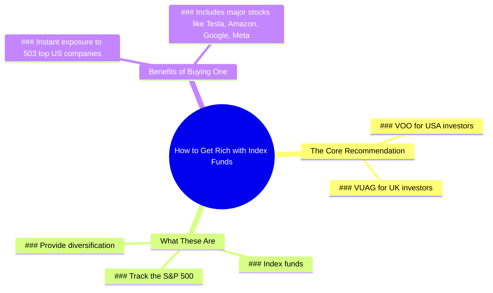

# 3 Best Stocks to Buy for Wealth Building

> 🌐 **Read this in:** **English** · [中文](../../zh-CN/2026-06/tiktok-transcript-the-best-stocks-to-buy-to-get-rich-9632.md)

> **Creator:** [@marktilbury](https://www.tiktok.com/@marktilbury) · **Views:** 1.4M · **Posted:** 2026-06-12 · **Niche:** finance
>
> **TL;DR:** The hook subverts the expectation of three stocks by offering 503, creating curiosity and surprise.

[Watch original video →](https://www.tiktok.com/@marktilbury/video/7473864079027850518)

## Why This Went Viral

## Hook (first 3 seconds)
- **Verbatim:** "If you're really a millionaire, tell me the three best stocks to buy to get rich."
- **Hook pattern:** Contrast + Bold claim (viewer expects a "3 stocks" answer; creator immediately promises *503* instead)
- **Why it stops scroll:** The premise sets up a classic "millionaire reveals secrets" trope, then instantly subverts the expectation. The viewer's brain does a double-take: *Wait, 503? That's not three.* That cognitive friction forces a pause.

## Emotional Rhythm
1. **Curiosity (0–3s):** "If you're really a millionaire..." — viewer expects a guru moment.
2. **Surprise + Tension (3–5s):** "503" lands. Viewer thinks, *That's absurd, how?*
3. **Confusion → Intrigue (5–10s):** "VOO / VUAG" are thrown out — viewer who doesn't know index funds feels lost, which creates a knowledge gap.
4. **Clarity + Relief (10–15s):** "These are index funds that track the S&P 500... you get a slice of 503 companies." — the twist is explained, and the viewer feels smarter.
5. **Resonance (15–18s):** Name-drops Tesla, Amazon, Google, Meta — familiar, aspirational brands that trigger *"I could own a piece of that"*.
- **Climax:** The moment "503" is revealed — it's the emotional peak because it flips the script from scarcity (3 stocks) to abundance (503 companies in one buy).

## Keyword Density
| Word/Phrase | Count (approx.) | Driver |
|---|---|---|
| 503 | 2 | **Algorithmic reach** — numeric oddity triggers high CTR and watch time |
| stocks / index funds | 3 | **Algorithmic + emotional** — high-intent financial keyword + safety signal |
| S&P 500 | 1 | **Algorithmic** — top-tier financial search term |
| Tesla, Amazon, Google, Meta | 4 | **Emotional pull** — aspirational brands create desire and trust |
| millionaire | 1 | **Emotional** — status trigger, but used only once to avoid clickbait penalty |
| VOO / VUAG | 2 | **Algorithmic** — specific tickers drive search and save-to-watchlist behavior |

## Why It Spreads
1. **The "503 vs. 3" math trick creates a shareable brain itch.**  
   - *Transcript line:* "tell me the three best stocks... I'm gonna give you 503."  
   - People share it because the number contrast is so unexpected that they want to see others' reactions.

2. **It demystifies a complex financial concept in 18 seconds.**  
   - *Transcript line:* "These are index funds that track the S&P 500."  
   - The video makes the viewer feel like they just learned a "hack" — low-effort, high-value knowledge that's easy to pass along.

3. **Brand-name anchoring builds instant trust and FOMO.**  
   - *Transcript line:* "Tesla, Amazon, Google, and Meta."  
   - By naming household giants, the creator removes the risk of the advice feeling shady or speculative. Viewers think, *"I know those companies — I'd buy that."*

4. **The "well, actually" correction feels like insider access.**  
   - *Transcript line:* "Well, actually, I'm gonna give you 503."  
   - The creator positions themselves as the "smart friend" who corrects a common mistake — that tone is highly shareable because it makes the viewer feel like they're in on a secret.

## What You Can Steal
1. **Use the "expectation subversion" hook pattern.**  
   - Open with a common question (e.g., "What's the best way to save money?"), then immediately contradict the expected answer with a bigger, more surprising number or concept.

2. **Name-drop 2–4 familiar brands/entities in the payoff.**  
   - Even if the advice is abstract, anchoring it to household names (Tesla, Amazon, etc.) instantly boosts credibility and emotional buy-in.

3. **Keep the entire video under 20 seconds with a single twist.**  
   - The entire structure is: setup → twist → explanation → payoff. No fluff. Any longer and the "aha" moment loses its punch. Aim for one clear "wait, what?" moment per clip.

## Mind Map

## Full Transcript (Generated by [free TikTok transcript generator](https://toktranscript.com/?utm_source=github&utm_medium=breakdown&utm_campaign=tool_attribution))

> 📝 Transcripts on this page are auto-generated and show the first 60%. Want to transcribe any TikTok in 30 seconds and get the full version? [Try TokTranscript free →](https://toktranscript.com/?utm_source=github&utm_medium=breakdown&utm_campaign=transcript_cta)

If you're really a millionaire, tell me the three best stocks to buy to get rich. Well, actually, I'm gonna give you 503 you should buy. Um, isn't that gonna take a while? Well, just remember V O O. If you're in the USA, or V U A G. If you're in the UK.

*[Read the full transcript on TokTranscript →](https://toktranscript.com/plaza/tiktok-transcript-the-best-stocks-to-buy-to-get-rich-9632?utm_source=github&utm_medium=breakdown&utm_campaign=transcript_full)*

## Browse More

- All [finance](../../by-niche/en/finance.md) breakdowns
- All [Unexpected twist](../../by-pattern/en/hook-unexpected-twist.md) examples

## Video Info

| | |
|---|---|
| Creator | [@marktilbury](https://www.tiktok.com/@marktilbury) |
| Original video | [https://www.tiktok.com/@marktilbury/video/7473864079027850518](https://www.tiktok.com/@marktilbury/video/7473864079027850518) |
| Original title | The best stocks to buy to get rich 🤑  |
| Views | 1.4M (1400000) |
| Posted | 2026-06-12 |
| Duration | 0s |
| Niche | `finance` |
| Hook pattern | `Unexpected twist` |
| Original language | `en` |
| Available languages | en, zh-CN |
| Generated | 2026-06-14 by [TokTranscript](https://toktranscript.com/) |

---

*This breakdown is for educational analysis under fair use. Original video © [@marktilbury](https://www.tiktok.com/@marktilbury). All transcripts are auto-generated and may contain errors.*

*Want to analyze your own TikToks like this? [try this transcription tool →](https://toktranscript.com/viral-breakdown?utm_source=github&utm_medium=breakdown&utm_campaign=footer_cta)*