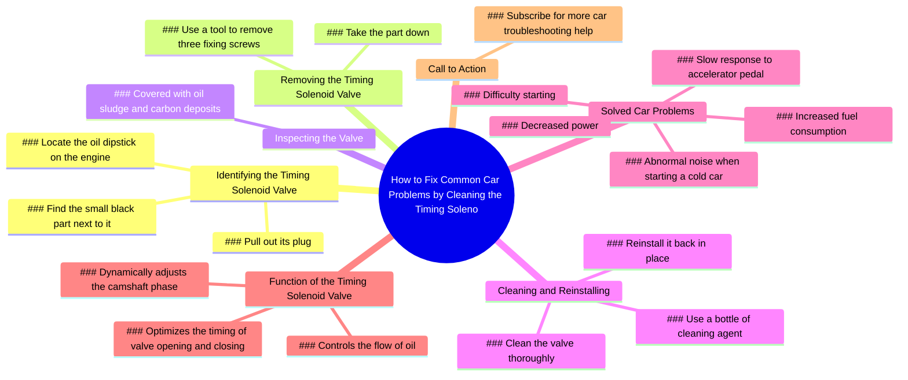

# How to Fix Car Hard Start, Power Loss, High Fuel Consumption

> 🌐 **Read this in:** **English** · [中文](../../zh-CN/2026-06/tiktok-transcript-the-car-is-difficult-to-start-the-power-decreases-and-the-fu-6292.md)

> **Creator:** [@zhxtfjxn9922hqym](https://www.tiktok.com/@zhxtfjxn9922hqym) · **Views:** 734.4K · **Posted:** 2026-06-20 · **Niche:** tech
>
> **TL;DR:** Starts with a simple challenge to engage viewers immediately.

[Watch original video →](https://www.tiktok.com/t/ZTBt617bo/)

## Why This Went Viral

## Hook (first 3 seconds)
- **What happens verbatim:** "Can you find the oil dipstick on the engine? Then you can find the small black part next to it."
- **Hook pattern:** Question + instruction sequence (challenge-based)
- **Why it stops scrolling:** It challenges the viewer's knowledge ("Can you find…?") while promising an actionable, low-effort fix. The question creates instant curiosity and self-testing, making drivers pause to see if they know the answer.

## Emotional Rhythm
- **Beat 1 – Curiosity:** "Can you find the oil dipstick?" → viewer self-tests.
- **Beat 2 – Competence boost:** "Pull out its plug… remove three screws" → simple steps build confidence.
- **Beat 3 – Discovery (tension):** "It's covered with oil sludge and carbon deposits" → gross reveal triggers disgust + "aha" moment.
- **Beat 4 – Relief + reward:** "Clean it and reinstall… all problems solved" → tension resolved, viewer feels capable.
- **Beat 5 – Validation:** "You gave me a thumbs up" → implicit social proof.
- **Beat 6 – Closure:** "Have you learned it? Subscribe" → direct call to action.
- **Climax moment:** The sludge/carbon deposit reveal – it's the visual payoff that makes the fix feel urgent and satisfying.

## Keyword Density
| Word/Phrase | Frequency (approx.) | Role |
|-------------|---------------------|------|
| "oil" | 4 | Algorithmic: high-search, car-maintenance term |
| "engine" | 2 | Algorithmic: broad car repair keyword |
| "clean" / "cleaning" | 2 | Emotional + search: implies solution, satisfaction |
| "problems" / "solved" | 3 | Emotional: triggers pain-point relief |
| "you" | 6 | Emotional: direct address, personalization |
| "subscribe" / "learned" | 2 | Algorithmic: engagement/retention signal |
| "carbon deposits" / "sludge" | 2 | Emotional: gross-out + urgency (visual trigger) |

## Why It Spreads
1. **Universal pain-point hook** – "Can you find the oil dipstick?" is a low-barrier entry that almost any driver can answer, instantly including the viewer.  
   *Transcript evidence:* "Can you find the oil dipstick on the engine? Then you can find the small black part next to it."

2. **Visual "gross-out" payoff** – The sludge/carbon deposit reveal is a visceral, shareable moment. People love before/after or dirty/clean transformations.  
   *Transcript evidence:* "It's covered with oil sludge and carbon deposits."

3. **Problem-solution compression** – Lists 5+ common car complaints (cold start noise, difficulty starting, fuel consumption, slow response, power loss) that all point to one simple fix, making the video feel like a cheat code.  
   *Transcript evidence:* "Abnormal noise… difficulty starting… increased fuel consumption… slow response… decreased power have all been solved."

4. **Direct address + gamification** – The "you gave me a thumbs up" line creates an implied social contract, encouraging viewers to actually like.  
   *Transcript evidence:* "You gave me a thumbs up."

5. **Low barrier to action** – The fix uses only a tool and a cleaning agent, no expensive parts, making it feel accessible and DIY-friendly.  
   *Transcript evidence:* "Take a bottle of cleaning agent, clean it and reinstall it back in place."

## What You Can Steal
1. **The "Can you find X?" challenge** – Start any tutorial with a simple test question that makes the viewer feel smart for knowing the answer, then build on it. This works for any DIY or how-to niche (home repair, tech, cooking).

2. **The problem-stack payoff** – List 3–5 specific, relatable pains your audience has, then reveal a single, simple fix. This creates "one weird trick" virality. Use in car, health, productivity, or finance content.

3. **The implied social proof line** – Say "You gave me a thumbs up" instead of "Please like." It presumes the viewer already took action, creating a subtle social nudge that boosts engagement rates.

## Mind Map

## Full Transcript (Generated by [free TikTok transcript generator](https://toktranscript.com/?utm_source=github&utm_medium=breakdown&utm_campaign=tool_attribution))

> 📝 Transcripts on this page are auto-generated and show the first 60%. Want to transcribe any TikTok in 30 seconds and get the full version? [Try TokTranscript free →](https://toktranscript.com/?utm_source=github&utm_medium=breakdown&utm_campaign=transcript_cta)

Can you find the oil dipstick on the engine? Then you can find the small black part next to it. Pull out its plug. Next, take a tool, remove the three fixing screws on it, and then take it down. It's not hard to find that it's covered with oil sludge and carbon deposits. Then take a bottle of cleaning agent, clean it and reinstall it back in place.

*[Read the full transcript on TokTranscript →](https://toktranscript.com/plaza/tiktok-transcript-the-car-is-difficult-to-start-the-power-decreases-and-the-fu-6292?utm_source=github&utm_medium=breakdown&utm_campaign=transcript_full)*

## Browse More

- All [tech](../../by-niche/en/tech.md) breakdowns
- All [Challenge question](../../by-pattern/en/hook-challenge-question.md) examples

## Video Info

| | |
|---|---|
| Creator | [@zhxtfjxn9922hqym](https://www.tiktok.com/@zhxtfjxn9922hqym) |
| Original video | [https://www.tiktok.com/t/ZTBt617bo/](https://www.tiktok.com/t/ZTBt617bo/) |
| Original title | The car is difficult to start, the power decreases, and the fuel cons... |
| Views | 734.4K (734400) |
| Posted | 2026-06-20 |
| Duration | 0s |
| Niche | `tech` |
| Hook pattern | `Challenge question` |
| Original language | `en` |
| Available languages | en, zh-CN |
| Generated | 2026-06-21 by [TokTranscript](https://toktranscript.com/) |

---

*This breakdown is for educational analysis under fair use. Original video © [@zhxtfjxn9922hqym](https://www.tiktok.com/@zhxtfjxn9922hqym). All transcripts are auto-generated and may contain errors.*

*Want to analyze your own TikToks like this? [TokTranscript.com →](https://toktranscript.com/viral-breakdown?utm_source=github&utm_medium=breakdown&utm_campaign=footer_cta)*