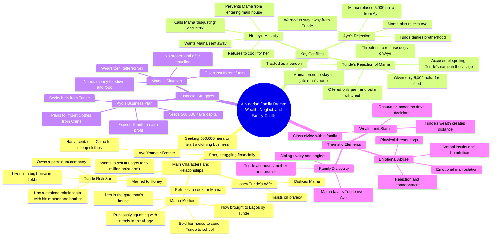

# The Chosen Son Part 1: Mother Sent to Gatekeeper House

> 🌐 **Read this in:** **English** · [中文](../../zh-CN/2026-06/tiktok-transcript-the-chosen-son-part-1-storytelling-motherandson-storytime-st-376f.md)

> **Creator:** [@morufatajani_stories](https://www.tiktok.com/@morufatajani_stories) · **Views:** 16.5M · **Posted:** 2026-06-08 · **Niche:** other
>
> **TL;DR:** Immediately establishes conflict and emotional stakes by revealing a son's cruel treatment of his mother.

[Watch original video →](https://www.tiktok.com/@morufatajani_stories/video/7643911442588060950?q=storytimes&t=1780928009926)

## Why This Went Viral

## Hook (first 3 seconds)
- **Verbatim opening line:** "Mama, that small house is where you will be staying. This one here, this gate man house."
- **Hook pattern:** Scene + bold claim (the son directly assigns his mother to a servant's quarters, creating immediate conflict)
- **Why it stops scrolling:** The sheer audacity and cruelty of a son relegating his own mother to a gatekeeper's house, paired with the mother's stunned "Why?" — viewers instantly feel outrage and curiosity about the backstory.

## Emotional Rhythm
- **Beat 1 – Shock/Outrage (0:00–0:30):** Son dismisses mother; viewer feels disgust at the disrespect.
- **Beat 2 – Tension (0:30–1:00):** Mother reveals she sold everything for his education. Son counters with gaslighting ("Don't blackmail me"). Wife escalates cruelty.
- **Beat 3 – Sympathy/Despair (1:00–2:00):** Mother's monologue ("Why does my own son hate me so much?"). She's hungry, given only garri and palm oil.
- **Beat 4 – Hope/Relief shift (2:00–3:00):** Introduction of Ayo (second son) with a business idea — a new protagonist enters.
- **Beat 5 – Rejection/Despair (3:00–4:00):** Ayo is also rejected by the rich brother and cruelly dismissed by their mother.
- **Beat 6 – Climax (4:00–4:30):** Mother insults and rejects Ayo despite his kindness. The cycle of abuse is complete.
- **Climax moment:** The mother's line "Get away from me, you bastard" — the ultimate betrayal, as she sides with the abusive son.

## Keyword Density
| Keyword/Phrase | Frequency (approx.) | Driver |
|----------------|---------------------|--------|
| "Mama" / "Mother" | 15+ | Emotional pull – familial guilt, cultural respect |
| "Useless" / "cursed" | 8 | Algorithmic reach – strong negative sentiment triggers engagement |
| "Brother" | 10 | Emotional pull – sibling rivalry, betrayal |
| "Money" / "5,000 naira" | 7 | Algorithmic reach – financial struggle is a universal topic |
| "Gate man house" / "small house" | 4 | Emotional pull – visual symbol of class and disrespect |
| "Spoiling my name" / "reputation" | 4 | Emotional pull – shame, social status |
| "I hate her" / "I hate that woman" | 3 | Algorithmic reach – extreme emotion drives comments |
| "Please" / "beg" | 6 | Emotional pull – desperation, power imbalance |

- **Algorithmic drivers:** "Useless," "money," "hate" — high-emotion words trigger watch time and comments.
- **Emotional pull drivers:** "Mama," "brother," "gate man house" — tap into family duty, betrayal, and class shame.

## Why It Spreads
1. **Universal family betrayal arc** – The transcript hits a primal nerve: a son rejecting his sacrificing mother. Lines like "I sold my house and everything I have to send you to school" create instant relatability for anyone who has sacrificed for family.
2. **Extreme emotional contrast** – The video oscillates between cruelty (son: "Don't let him touch you with that disgusting, dirty tears") and desperation (mother: "I'm so hungry"). This rollercoaster keeps viewers watching and commenting.
3. **Two parallel rejections** – Both sons (Tunde and Ayo) are rejected by the mother, but in opposite ways. The twist that the mother also abuses the kind son ("Get away from me, you bastard") creates shock and drives shares.
4. **Class and shame triggers** – "Spoiling my name in the village" and "gate man house" tap into deep cultural fears about social reputation, especially in collectivist societies. Viewers share to discuss or condemn.
5. **Cliffhanger business subplot** – Ayo's "500,000 naira" business idea introduces hope and a potential redemption arc, making viewers want to see the next part — boosting series retention.

## What You Can Steal
1. **Open with a shocking, morally wrong statement** – Don't ease in. Start with a line that makes viewers gasp (e.g., "That small house is where you will be staying"). This kills scroll instantly.
2. **Use a "triple rejection" structure** – One character (the mother) rejects two different sons in opposite ways (one with cruelty, one with neglect). This creates layered emotional tension and multiple talking points for comments.
3. **Insert a "business idea" hook mid-video** – Even in a family drama, drop a concrete financial number ("500,000 naira to start a business"). This gives viewers a reason to stay for the next episode and creates a "how will this resolve?" cliffhanger.

## Mind Map

## Full Transcript (Generated by [try this transcription tool](https://toktranscript.com/?utm_source=github&utm_medium=breakdown&utm_campaign=tool_attribution))

> 📝 Transcripts on this page are auto-generated and show the first 60%. Want to transcribe any TikTok in 30 seconds and get the full version? [Try TokTranscript free →](https://toktranscript.com/?utm_source=github&utm_medium=breakdown&utm_campaign=transcript_cta)

Mama, that small house is where you will be staying. This one here, this gate man house. Why? Why not inside the main house? No, Mama, the main house is for me and my wife. She likes her privacy. She said she wouldn't want you to dirty the new house. If you don't want, you can go and continue squatting at your friend's place in the village. How can you say that to me, knowing I sold my house and everything I have to send you to school? Even now that I am happy that you finally look my way since all these years that I've been suffering in the village, Mama, please don't blackmail me. Did I send you to sell your house? You gave birth to me. Am I not entitled to you sending me to school and spending money on me? Honey, please don't exhaust your energy on her. And don't let him touch you with that disgusting, dirty tears. Let's go inside. He's a child. Tandie, please calm down, my love. Don't let her stress you. I still don't understand why you brought her here from the village. Why couldn't she just stay there? Because people in the village were talking. They say a rich man like me has allowed his own mother to suffer, squatting with friends and sleeping in bad conditions. She was spoiling my name. That's why I brought her. But now I'm regretting it. I hate her. I don't even know how Much I hate that woman, then forget about her. Don't let her disturb your peace. What kind of life is this? Why does my own son hate me so much? He doesn't even care if I cry or die. And that wife of his, she's even worse. Instead of cautioning him, she's the one stopping me from entering the main house so I don't dirty it. Aah, I'm so hungry, Mama. What do you want again? I'm hungry. Please give me something to eat. Okay, wait. Here. Go and cook it yourself. Gary and palm oil. But I don't have anything to cook with. I've been travelling since morning. Please just give me proper food. Mama, don't disturb me. This is exactly why I didn't want you in the main house. The cook is not around. Mix the Gary with the palm oil and eat it. Tomorrow we will think of something. What is going on out there? It's your mother. She's disturbing my life. I gave her food and she's still complaining. Send her away. I don't want to hear her voice or see her face. Tell her to go back to where she came from, tonde. My son, please wait. I'm sorry to disturb you. Your wife says she cannot be cooking for me. Please give me a little money to buy a stove, a small cooker and some food stuff. Why you looking at me like that? Is my wife wrong? Is she your cook? Is she Your maid. I'm not insulting her. I'm only telling you why I need the money. I've been travelling since yesterday and I'm very hungry. I don't want to know, Mama. I don't want to know. Buy whatever you want to buy with that, Tunda. This is only 5,000 naira. Things are very expensive now. This money cannot buy anything meaningful. You, this ungrateful woman. Instead of thanking me, you're complaining. If you don't get out of my way, I will jam you with this car. I'm leaving. Who? Tunda. I have to get up. How much for the stove? Aah, it's so heavy. Ah, madam, this money is too small for this kind of heavy load. Why didn't you tell me your price before carrying it? You just carried my load without saying anything. Now you're complaining. Okay, Ma, no problem. You can go. Ayo, how are you, Sophie? I'm fine. How are you, Ayo? I have a business idea I want to discuss with you. It requires some money, but I think it can change our life. You know, I don't have money. Eva, just listen first. I have a contact in China supplying clothes very cheaply. We can order in bulk, ship them to Nigeria and sell here in Lagos. With 500,000 naira, we can start. After selling, we can make up to 5 million naira profit. 5 million naira? Are you serious? Yes, but we need the capital first. Where will I see 500,000 naira? I don't have that. Kind of money. Never say never. I've been telling you to go and meet your brother today. He's very rich now. He owns a petroleum company. Why is he not helping you? You already know my brother. He doesn't care about me or mama. Going to him will be a waste of time. Please try again. This time, go and beg him. The way you're living is not good enough.

*[Read the full transcript on TokTranscript →](https://toktranscript.com/plaza/tiktok-transcript-the-chosen-son-part-1-storytelling-motherandson-storytime-st-376f?utm_source=github&utm_medium=breakdown&utm_campaign=transcript_full)*

## Browse More

- All [other](../../by-niche/en/other.md) breakdowns
- All [Shocking Revelation](../../by-pattern/en/hook-shocking-revelation.md) examples

## Video Info

| | |
|---|---|
| Creator | [@morufatajani_stories](https://www.tiktok.com/@morufatajani_stories) |
| Original video | [https://www.tiktok.com/@morufatajani_stories/video/7643911442588060950?q=storytimes&t=1780928009926](https://www.tiktok.com/@morufatajani_stories/video/7643911442588060950?q=storytimes&t=1780928009926) |
| Original title | THE CHOSEN SON PART 1 #storytelling #motherandson  #storytime #storie... |
| Views | 16.5M (16500000) |
| Posted | 2026-06-08 |
| Duration | 0s |
| Niche | `other` |
| Hook pattern | `Shocking Revelation` |
| Original language | `en` |
| Available languages | en, zh-CN |
| Generated | 2026-06-09 by [TokTranscript](https://toktranscript.com/) |

---

*This breakdown is for educational analysis under fair use. Original video © [@morufatajani_stories](https://www.tiktok.com/@morufatajani_stories). All transcripts are auto-generated and may contain errors.*

*Want to analyze your own TikToks like this? [the tool we used to generate this →](https://toktranscript.com/viral-breakdown?utm_source=github&utm_medium=breakdown&utm_campaign=footer_cta)*