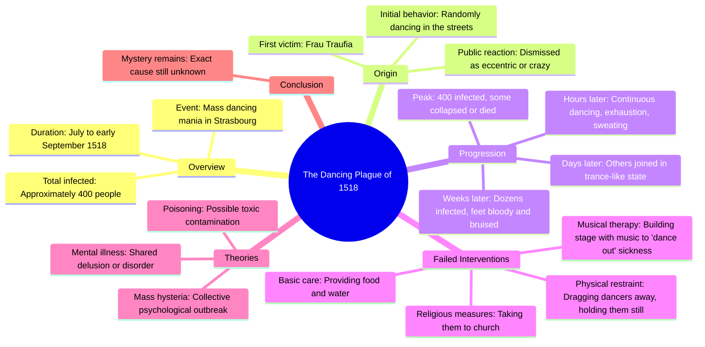

# The Dancing Plague of 1518 in Strasbourg

> 🌐 **Read this in:** **English** · [中文](../../zh-CN/2026-06/tiktok-transcript-the-dancing-plague-fyp-history-dff4.md)

> **Creator:** [@hoodieguyofficial1](https://www.tiktok.com/@hoodieguyofficial1) · **Views:** 3.2M · **Posted:** 2026-06-08 · **Niche:** entertainment
>
> **TL;DR:** Forces the viewer to visualize a bizarre, shocking scene, instantly grabbing attention.

[Watch original video →](https://www.tiktok.com/@hoodieguyofficial1/video/7645737088154897695?is_from_webapp=1&sender_device=pc&web_id=7575836601122965009)

## Why This Went Viral

## Hook (first 3 seconds)
- **Verbatim opening:** "Imagine you walked outside and saw dozens of your neighbors violently dancing until their feet bled and collapsed unconscious."
- **Hook pattern:** Scene + visceral contrast (mundane "walked outside" vs. extreme "violently dancing until their feet bled")
- **Why it stops scrolling:** The image is so bizarre and grotesque that it triggers immediate cognitive dissonance — the brain can't reconcile "neighbors dancing" with "bled and collapsed unconscious," forcing the viewer to stay for an explanation.

## Emotional Rhythm
1. **Curiosity (0–3s):** "Imagine you walked outside..." — personalizes the absurd premise
2. **Shock + disbelief (3–10s):** "This actually happened in 1518" — grounds the absurd in reality
3. **Escalating unease (10–30s):** Hours pass → days pass → people join → feet bleed — tension builds like a horror movie
4. **Desperation (30–45s):** "People tried dragging them away... holding them still... taking them to church" — the town's failed interventions amplify helplessness
5. **Climax (45–55s):** "Some even reportedly dying from exhaustion" — highest stakes moment
6. **Open-ended mystery (55s–end):** "To this day, we still don't know" — leaves a haunting, unresolved note
- **Climax moment:** "Some even reportedly dying from exhaustion" — the twist from "weird dancing" to "people are dying"

## Keyword Density
| Word/Phrase | Count | Function |
|-------------|-------|----------|
| "dancing" | 6 | Algorithmic reach (high-volume search term) |
| "people" | 8 | Emotional pull (relatability, herd behavior) |
| "stopped/stopping" | 5 | Tension driver (the core mystery: why can't they stop?) |
| "feet bled/bloody" | 3 | Visceral shock (memorable, shareable image) |
| "hours/days/months" | 4 | Escalation anchor (time compression builds horror) |
| "joined/joining" | 3 | Contagion trigger (makes viewer think "would I join?") |
| "died/dying" | 2 | Stakes elevator (raises from weird to tragic) |

- **Algorithmic drivers:** "dancing plague," "1518," "Strasbourg" — historical keywords with high curiosity search volume
- **Emotional drivers:** "bled," "collapsed," "trance," "couldn't stop" — visceral, fear-based language that triggers sharing

## Why It Spreads
1. **Impossible premise grounded in reality** — "This actually happened" turns a ridiculous image into a genuine mystery, making viewers feel smart for learning obscure history and compelled to share the "can you believe this?" fact
2. **Contagion structure mirrors the content** — The video itself spreads like the dancing plague: one person (Frau Traufia) → a few joiners → mass infection. Viewers subconsciously re-enact the phenomenon by sharing it
3. **Unresolved ending creates cognitive itch** — "To this day, we still don't know" leaves the mystery open, triggering the Zeigarnik effect (people share things that feel incomplete to find closure through discussion)
4. **Visceral, shareable imagery** — "Feet bled," "collapsed unconscious," "drenched in sweat" are visual phrases that stick in memory and are easy to retell, making the video perfect for word-of-mouth
5. **Universal fear of losing control** — The dancing plague taps into a primal anxiety: what if your body acted against your will? This emotional hook transcends niche interest in history

## What You Can Steal
1. **Open with "Imagine you..." + a grotesque contrast** — Personalize the absurd by placing the viewer in the scene, then immediately undercut it with a shocking detail. Works for any historical mystery or weird fact.
2. **Use time escalation as a tension ladder** — "Hours passed... days passed... months passed" creates a natural, easy-to-follow structure. Apply this to any story where things get progressively worse or stranger.
3. **End with an unanswered question** — "To this day, we still don't know" forces viewers to comment their theories, boosting engagement signals. Always leave one thread dangling in your video's final 5 seconds.

## Mind Map

## Full Transcript (Generated by [TokTranscript](https://toktranscript.com/?utm_source=github&utm_medium=breakdown&utm_campaign=tool_attribution))

> 📝 Transcripts on this page are auto-generated and show the first 60%. Want to transcribe any TikTok in 30 seconds and get the full version? [Try TokTranscript free →](https://toktranscript.com/?utm_source=github&utm_medium=breakdown&utm_campaign=transcript_cta)

Imagine you walked outside and saw dozens of your neighbors violently dancing until their feet bled and collapsed unconscious. This actually happened in 1518 in a town called Strasbourg, all starting with this woman right here named Frau Traufia, one day randomly walking outside of her house and dancing in the streets. At first, people thought nothing of it. Maybe she just like dancing, or it was a little bit crazy. But this is where things got weird. As hours passed, she just didn't stop, looking completely exhausted, drenched in sweat, and somehow kept moving all throughout day and night. It only got worse because people strangely started joining her one by one, dancing in this weird trance like state. Still, it was only a few people, so no one too concerned yet. But as days passed, not only weren't they stopping, but people kept joining in, at one point reaching dozens of people. Now the town was worried, hoping they would just eventually stop on their own.

*[Read the full transcript on TokTranscript →](https://toktranscript.com/plaza/tiktok-transcript-the-dancing-plague-fyp-history-dff4?utm_source=github&utm_medium=breakdown&utm_campaign=transcript_full)*

## Browse More

- All [entertainment](../../by-niche/en/entertainment.md) breakdowns
- All [Imaginary scenario](../../by-pattern/en/hook-imaginary-scenario.md) examples

## Video Info

| | |
|---|---|
| Creator | [@hoodieguyofficial1](https://www.tiktok.com/@hoodieguyofficial1) |
| Original video | [https://www.tiktok.com/@hoodieguyofficial1/video/7645737088154897695?is_from_webapp=1&sender_device=pc&web_id=7575836601122965009](https://www.tiktok.com/@hoodieguyofficial1/video/7645737088154897695?is_from_webapp=1&sender_device=pc&web_id=7575836601122965009) |
| Original title | The dancing plague… #fyp #history  |
| Views | 3.2M (3200000) |
| Posted | 2026-06-08 |
| Duration | 0s |
| Niche | `entertainment` |
| Hook pattern | `Imaginary scenario` |
| Original language | `en` |
| Available languages | en, zh-CN |
| Generated | 2026-06-09 by [TokTranscript](https://toktranscript.com/) |

---

*This breakdown is for educational analysis under fair use. Original video © [@hoodieguyofficial1](https://www.tiktok.com/@hoodieguyofficial1). All transcripts are auto-generated and may contain errors.*

*Want to analyze your own TikToks like this? [TokTranscript.com →](https://toktranscript.com/viral-breakdown?utm_source=github&utm_medium=breakdown&utm_campaign=footer_cta)*