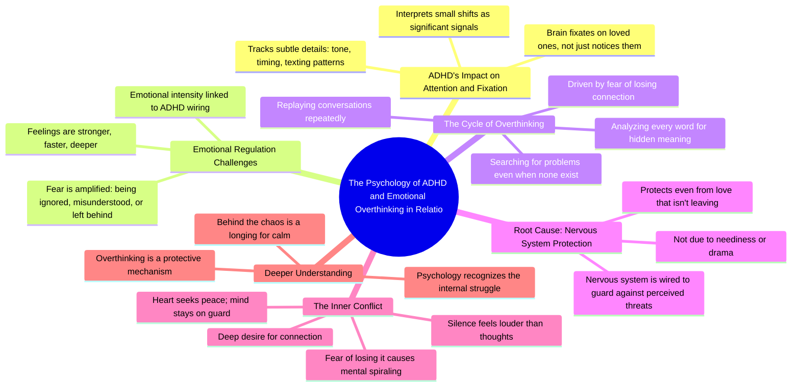

# The Hardest Part of ADHD: Hyperfixation on Loved Ones

> 🌐 **Read this in:** **English** · [中文](../../zh-CN/2026-06/tiktok-transcript-the-truth-about-adhd-no-one-talks-about-adhdawareness-psycho-400d.md)

> **Creator:** [@taraminds](https://www.tiktok.com/@taraminds) · **Views:** 4.1M · **Posted:** 2026-06-21 · **Niche:** other
>
> **TL;DR:** It immediately validates a hidden struggle by framing it as a psychological fact, making viewers feel seen.

[Watch original video →](https://vm.tiktok.com/ZNRT1DEf1/)

## Why This Went Viral

## Hook (first 3 seconds)
- **Verbatim opening line:** “according to psychology one of the hardest parts of having a d H d is this”
- **Hook pattern:** Bold claim + identity label (“having ADHD”)
- **Why it stops scrolling:** The phrase “one of the hardest parts” promises a specific, insider pain point. Viewers with ADHD (or who suspect they have it) feel instantly seen. The word “psychology” adds authority, making the claim feel research-backed, not anecdotal.

## Emotional Rhythm
- **Beats:**
  1. **Curiosity** — “one of the hardest parts” (what is it?)
  2. **Recognition** — “your brain fixates… tone, timing, text back” (viewer nods)
  3. **Tension** — “fear of being ignored, misunderstood, left behind” (anxiety spikes)
  4. **Validation** — “not because you’re needy… not because you’re dramatic” (relief)
  5. **Resonance** — “nervous system is wired to protect you even from love that isn’t leaving” (emotional release)
  6. **Climax** — “the only thing louder than your thoughts is the silence you’re afraid to break” (poetic, shareable line)
- **Suspense lands** at the fear description; **twist** is the reframe from “flaw” to “protection mechanism.”

## Keyword Density
- **Strongest repeated words/phrases:**
  - *ADHD / d H d* — algorithmic trigger (high search volume)
  - *fear* — emotional pull (drives anxiety-based engagement)
  - *brain / mind / nervous system* — authority + relatability
  - *fixates / replaying / analysing* — action verbs that mirror viewer behavior
  - *love / connection / silence* — emotional resonance (shareability)
- **Algorithmic reach drivers:** “psychology,” “ADHD” — niche, high-intent, low-competition tags
- **Emotional pull drivers:** “fear,” “silence,” “peace” — trigger comment and save behavior

## Why It Spreads
1. **Identity validation** — “not because you’re needy… not because you’re dramatic” directly contradicts the shame narrative. Viewers screenshot and share to partners/friends as proof they aren’t “broken.”
2. **Poetic closure** — “the only thing louder than your thoughts is the silence you’re afraid to break” is a quote-worthy line. It gets reposted on Instagram stories, Twitter, and TikTok stitches.
3. **High comment-bait** — The transcript ends with “follow for more psychology that understands the chaos.” This invites comments like “I feel so seen” and “this is me,” which boost engagement signals.
4. **Relatable micro-pain** — “replaying conversations, analysing every word” is a universal ADHD experience. It triggers the “tag someone” behavior, especially between partners or friends with ADHD.
5. **Authority + empathy blend** — “according to psychology” + “heart that just wants peace” creates trust. Viewers feel the creator is both expert and ally, making them more likely to follow.

## What You Can Steal
1. **Start with a pain-specific identity hook** — Use “one of the hardest parts of [condition/identity] is this” to instantly filter and hook your target audience. Avoid generic “have you ever…” questions.
2. **Reframe a flaw as a protective mechanism** — Instead of saying “you overthink because you’re anxious,” say “your nervous system is wired to protect you.” This reduces shame and increases shareability.
3. **End with a poetic, quoteable line** — The last 5 seconds should contain a sentence that sounds like a tweet or caption. That line becomes your viral fuel. Write it first, then build the video around it.

## Mind Map

## Full Transcript (Generated by [TokTranscript](https://toktranscript.com/?utm_source=github&utm_medium=breakdown&utm_campaign=tool_attribution))

> 📝 Transcripts on this page are auto-generated and show the first 60%. Want to transcribe any TikTok in 30 seconds and get the full version? [Try TokTranscript free →](https://toktranscript.com/?utm_source=github&utm_medium=breakdown&utm_campaign=transcript_cta)

according to psychology one of the hardest parts of having a d H d is this when you really care about someone your brain doesn't just notice them it fixates their tone their timing the way they text back every tiny shift starts to feel like a signal because a d H d doesn't just affect attention it affects emotional regulation you feel things stronger faster deeper especially fear fear of being ignored misunderstood or left behind so you start replaying conversations analysing every word searching for what went wrong even when nothing did you want connection more than anything but the fear of losing it makes your brain spin in circles not because

*[Read the full transcript on TokTranscript →](https://toktranscript.com/plaza/tiktok-transcript-the-truth-about-adhd-no-one-talks-about-adhdawareness-psycho-400d?utm_source=github&utm_medium=breakdown&utm_campaign=transcript_full)*

## Browse More

- All [other](../../by-niche/en/other.md) breakdowns
- All [Relatable Revelation](../../by-pattern/en/hook-relatable-revelation.md) examples

## Video Info

| | |
|---|---|
| Creator | [@taraminds](https://www.tiktok.com/@taraminds) |
| Original video | [https://vm.tiktok.com/ZNRT1DEf1/](https://vm.tiktok.com/ZNRT1DEf1/) |
| Original title | The Truth About ADHD No One Talks About' #ADHDAwareness #PsychologyFa... |
| Views | 4.1M (4100000) |
| Posted | 2026-06-21 |
| Duration | 0s |
| Niche | `other` |
| Hook pattern | `Relatable Revelation` |
| Original language | `en` |
| Available languages | en, zh-CN |
| Generated | 2026-06-22 by [TokTranscript](https://toktranscript.com/) |

---

*This breakdown is for educational analysis under fair use. Original video © [@taraminds](https://www.tiktok.com/@taraminds). All transcripts are auto-generated and may contain errors.*

*Want to analyze your own TikToks like this? [TokTranscript →](https://toktranscript.com/viral-breakdown?utm_source=github&utm_medium=breakdown&utm_campaign=footer_cta)*