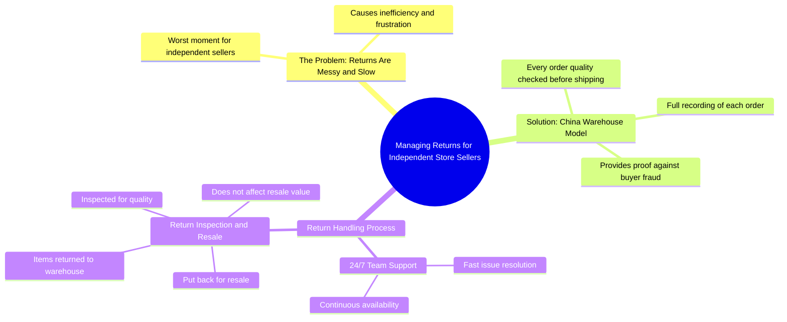

# The Worst Moment for Independent Store Sellers: Returns

> 🌐 **Read this in:** **English** · [中文](../../zh-CN/2026-06/tiktok-transcript-the-worst-moment-for-independent-store-sellers-warehousing-d-4afa.md)

> **Creator:** [@baimao.supply.cha](https://www.tiktok.com/@baimao.supply.cha) · **Views:** 569.4K · **Posted:** 2026-06-10 · **Niche:** other
>
> **TL;DR:** Opens with a relatable pain point to hook sellers frustrated with returns.

[Watch original video →](https://www.tiktok.com/@baimao.supply.cha/video/7618015090142416142?q=BM%20supplychain%20&t=1779417036152)

## Why This Went Viral

## Hook (first 3 seconds)
- **Verbatim opening line:** "The worst moment for independent store sellers, returns."
- **Hook pattern:** Bold claim + pain-point identification (contrast between "worst moment" and implied solution)
- **Why it stops scrolling:** Immediately names a universal, emotionally charged problem for the target audience (e-commerce sellers), creating instant relatability and FOMO (fear of missing out on a fix). The word "worst" signals high stakes.

## Emotional Rhythm
1. **Pain (0–3s):** "The worst moment" – triggers frustration, shared suffering.
2. **Curiosity (3–6s):** "Are you familiar with warehouses in China?" – opens a knowledge gap, hints at a secret solution.
3. **Tension (6–12s):** "First... quality checked... proof if a buyer tries anything" – builds hope of control and justice.
4. **Relief (12–18s):** "Second, 24/7 team handling return issues fast" – offers a concrete escape from the pain.
5. **Climax (18–22s):** "Third, return the items... for inspection and resale. It does not affect the resale." – the ultimate payoff: no financial loss. Emotional release.
- **Twist:** The solution is framed as a simple three-step system, not a complex strategy.

## Keyword Density
- **returns** (3x) – algorithmic reach (high-volume search term for e-commerce)
- **warehouses in China** (2x) – niche keyword, drives targeted traffic
- **quality checked** (2x) – emotional pull (trust, reliability)
- **proof** (1x) – emotional (security, justice)
- **24/7** (1x) – emotional (reassurance, convenience)
- **resale** (2x) – algorithmic + emotional (profit preservation)
- **fast** (1x) – emotional (immediate relief)
- **buyer** (2x) – algorithmic (common e-commerce term)
- **worst moment** (1x) – emotional hook, not algorithmic

**Drivers:** "returns" and "warehouses in China" are high-CPC keywords. "Proof" and "resale" create emotional resonance.

## Why It Spreads
1. **Pain-first framing:** "The worst moment for independent store sellers" – instantly unites a niche audience around a shared frustration. Viewers tag peers who suffer the same problem.
2. **Three-step solution structure:** The numbered list ("First... Second... Third") is easy to remember and share. Viewers can re-tell it in comments or DMs.
3. **Trust-building with evidence:** "Fully recorded before shipping" and "proof if a buyer tries anything" – addresses a core fear (scams) and offers a concrete defense, making the solution feel credible.
4. **Climax of zero loss:** "Does not affect the resale" – the final sentence removes the last objection. This is the shareable punchline: "You can resell returned items."
5. **Global vs. local contrast:** "Warehouses in China" vs. "independent store sellers" – creates an "insider knowledge" vibe. Viewers feel they're learning a secret that gives them an edge.

## What You Can Steal
1. **Open with a pain point, not a solution:** Name the exact worst moment your audience experiences. Don't start with "Here's how to fix returns" – start with "The worst moment is returns."
2. **Use a numbered list (First/Second/Third):** It signals structure, boosts retention, and makes the content re-tellable. Viewers can easily recall "the three things."
3. **End with a zero-loss guarantee:** The final line should remove the biggest objection. For any problem, ask: "What's the one thing that would make this solution perfect?" (e.g., "and it doesn't affect resale"). That's your closing sentence.

## Mind Map

## Full Transcript (Generated by [TokTranscript.com](https://toktranscript.com/?utm_source=github&utm_medium=breakdown&utm_campaign=tool_attribution))

> 📝 Transcripts on this page are auto-generated and show the first 60%. Want to transcribe any TikTok in 30 seconds and get the full version? [Try TokTranscript free →](https://toktranscript.com/?utm_source=github&utm_medium=breakdown&utm_campaign=transcript_cta)

The worst moment for independent store sellers, returns. Cause for the returns are messy and slow. Are you familiar with warehouses in China? First, every order is quality checked and fully recorded before shipping.

*[Read the full transcript on TokTranscript →](https://toktranscript.com/plaza/tiktok-transcript-the-worst-moment-for-independent-store-sellers-warehousing-d-4afa?utm_source=github&utm_medium=breakdown&utm_campaign=transcript_full)*

## Browse More

- All [other](../../by-niche/en/other.md) breakdowns
- All [Problem-Agitate](../../by-pattern/en/hook-problem-agitate.md) examples

## Video Info

| | |
|---|---|
| Creator | [@baimao.supply.cha](https://www.tiktok.com/@baimao.supply.cha) |
| Original video | [https://www.tiktok.com/@baimao.supply.cha/video/7618015090142416142?q=BM%20supplychain%20&t=1779417036152](https://www.tiktok.com/@baimao.supply.cha/video/7618015090142416142?q=BM%20supplychain%20&t=1779417036152) |
| Original title | The worst moment for independent store sellers? #warehousing #dropshi... |
| Views | 569.4K (569400) |
| Posted | 2026-06-10 |
| Duration | 0s |
| Niche | `other` |
| Hook pattern | `Problem-Agitate` |
| Original language | `en` |
| Available languages | en, zh-CN |
| Generated | 2026-06-11 by [TokTranscript](https://toktranscript.com/) |

---

*This breakdown is for educational analysis under fair use. Original video © [@baimao.supply.cha](https://www.tiktok.com/@baimao.supply.cha). All transcripts are auto-generated and may contain errors.*

*Want to analyze your own TikToks like this? [TokTranscript.com →](https://toktranscript.com/viral-breakdown?utm_source=github&utm_medium=breakdown&utm_campaign=footer_cta)*