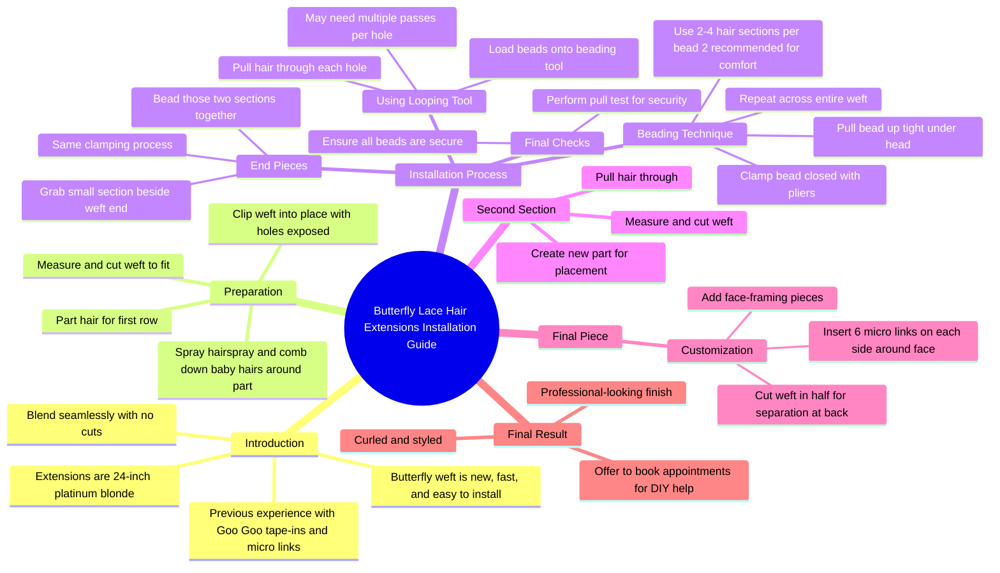

# Platinum Blonde 24 Inch Extensions Blend Seamlessly

> 🌐 **Read this in:** **English** · [中文](../../zh-CN/2026-06/tiktok-transcript-they-eat-everytime-googoohair-official-bbb8.md)

> **Creator:** [@rrileynelson](https://www.tiktok.com/@rrileynelson) · **Views:** 652.4K · **Posted:** 2026-06-21 · **Niche:** beauty
>
> **TL;DR:** Immediately challenges a common assumption to grab attention.

[Watch original video →](https://www.tiktok.com/@rrileynelson/video/7611739967366139149)

## Why This Went Viral

## Hook (first 3 seconds)
- **Verbatim opening:** "They're not gonna look the best straighten. You look better when they're curled."
- **Hook pattern:** **Contrast** ("not best straighten" vs. "better when curled") + **bold claim** (directly telling the viewer what they're doing wrong)
- **Why it stops scrolling:** It challenges a common assumption (straight hair = best look) and creates immediate tension — the viewer thinks "Wait, I've been doing it wrong?" This personal, almost corrective tone triggers curiosity and self-doubt, forcing them to watch to see if the claim is true.

## Emotional Rhythm
1. **Curiosity + slight insecurity** (0–3 sec): "They're not gonna look the best straighten" — viewer feels called out.
2. **Resistance → intrigue** (3–10 sec): "Anyways, these are my 24 inch platinum blonde extensions" — shifts from critique to solution, builds trust via product reveal.
3. **Anticipation** (10–30 sec): "Everybody's ranting and raving about how fast the install is" — social proof primes excitement.
4. **Tension** (30 sec–2 min): Step-by-step technical instructions ("pull a good amount of hair... clamp it together") — viewer feels the complexity, suspense around whether it will work.
5. **Relief + reward** (2 min–end): "All curled and done up" — final reveal delivers payoff, emotional release.
6. **Climax moment:** The final "All curled and done up" shot — the transformation validates the opening claim and satisfies the built-up tension.

## Keyword Density
- **"Extensions"** (x6) — algorithmic: high-search-volume beauty term.
- **"Bead" / "beads"** (x8) — emotional: signals precision, technique, trustworthiness.
- **"Clamp" / "clamping"** (x5) — emotional: creates tactile, visual action; reinforces "I know what I'm doing."
- **"Part"** (x4) — algorithmic: common hair-install keyword; also emotional: shows process.
- **"Curled"** (x3) — emotional: directly ties back to hook; drives desire for the final look.
- **"Seamlessly"** (x1) — algorithmic: high-intent keyword for extension quality.
- **"Easy"** (x2) — emotional: counters tension; promises attainable result.
- **"Install"** (x3) — algorithmic: search-friendly; positions video as tutorial.

## Why It Spreads
1. **Problem–solution arc with a twist:** The opening ("not best straighten") reframes a common mistake as a fixable problem. Viewers who've felt their extensions looked fake share it as "finally, someone tells the truth."  
   *Transcript evidence:* "They're not gonna look the best straighten. You look better when they're curled."
2. **High perceived value + low barrier to entry:** The video promises a "fast" and "easy" install (but shows detailed steps) — viewers feel they can replicate it, so they save/share as a how-to.  
   *Transcript evidence:* "Everybody's ranting and raving about how fast the install is and how easy it is to apply."
3. **Visual proof of transformation:** The final "curled and done up" shot is a before/after in one video — the most shareable format on social.  
   *Transcript evidence:* "And then this is the final result. All curled and done up."
4. **Authority + relatability blend:** Creator uses technical jargon ("beading tool," "micro links") but also admits personal preference ("I personally felt more comfortable only putting two pieces") — builds trust and humanizes the process.  
   *Transcript evidence:* "I personally felt more comfortable only putting two pieces in a bead at a time."
5. **Call to action with exclusivity:** "DM me to book an appointment" creates a low-friction, high-intent conversion path — viewers who try and fail will engage, driving comments and repeat views.  
   *Transcript evidence:* "If you don't think you can do this at home, DM me to book an appointment."

## What You Can Steal
1. **Open with a corrective claim, not a compliment.** Instead of "This is amazing," say "You're doing this wrong — here's the fix." It triggers immediate curiosity and positions you as an authority.
2. **Show the messy middle, not just the perfect end.** The detailed, slightly tedious install steps (beading, clamping, pulling) build trust and make the final reveal more satisfying. Viewers share because they "learned something."
3. **End with a visual payoff that directly contradicts the opening tension.** The final "curled and done up" shot visually proves the hook. Always close by showing the result of the fix you promised in the first 3 seconds.

## Mind Map

## Full Transcript (Generated by [TokTranscript](https://toktranscript.com/?utm_source=github&utm_medium=breakdown&utm_campaign=tool_attribution))

> 📝 Transcripts on this page are auto-generated and show the first 60%. Want to transcribe any TikTok in 30 seconds and get the full version? [Try TokTranscript free →](https://toktranscript.com/?utm_source=github&utm_medium=breakdown&utm_campaign=transcript_cta)

They're not gonna look the best straighten. You look better when they're curled. Anyways, these are my twenty four inch platinum blonde extensions. Blending seamlessly with no cuts. Alright guys, y'all have seen me try goo goo's tape ins. And y'all have seen me try their micro link extensions. But now we have a butterfly left. Everybody's ranting and raving about how fast the install is and how easy it is to apply. So we're gonna test that out today. I'm only walking out to the first row, so I better be listening. First we're gonna part our hair. We want that first row to go. And then we're gonna measure it out and cut it where it fits best. Now you're gonna grab some hairspray and a comb and comb down all those little baby hairs around the part so we don't snag them. After that, you're gonna grab the clips that google supplied with the hair and clip it into place with those holes exposed. Then we're gonna use our little looping tool. We're gonna pull a good amount of hair out of each one of those little holes. You might have to go through them a few times to get some hair. Load some beads onto the beating tool. Now i've seen some hair stylist grab three, even four little sections for this to make the installation quicker. I personally felt more comfortable only putting two pieces in a bead at a time. Once the beads on There, you're gonna pull it up as tight under the head as you can and clamp it together. You're gonna follow that process throughout the whole weft, except for on the end pieces. There's two sections in every bead. Scooping that bead all the way up to the scalp, and then leveling those pliers out to my head and clamping.

*[Read the full transcript on TokTranscript →](https://toktranscript.com/plaza/tiktok-transcript-they-eat-everytime-googoohair-official-bbb8?utm_source=github&utm_medium=breakdown&utm_campaign=transcript_full)*

## Browse More

- All [beauty](../../by-niche/en/beauty.md) breakdowns
- All [Contrasting advice](../../by-pattern/en/hook-contrasting-advice.md) examples

## Video Info

| | |
|---|---|
| Creator | [@rrileynelson](https://www.tiktok.com/@rrileynelson) |
| Original video | [https://www.tiktok.com/@rrileynelson/video/7611739967366139149](https://www.tiktok.com/@rrileynelson/video/7611739967366139149) |
| Original title | they eat EVERYTIME @googoohair_official  |
| Views | 652.4K (652400) |
| Posted | 2026-06-21 |
| Duration | 0s |
| Niche | `beauty` |
| Hook pattern | `Contrasting advice` |
| Original language | `en` |
| Available languages | en, zh-CN |
| Generated | 2026-06-22 by [TokTranscript](https://toktranscript.com/) |

---

*This breakdown is for educational analysis under fair use. Original video © [@rrileynelson](https://www.tiktok.com/@rrileynelson). All transcripts are auto-generated and may contain errors.*

*Want to analyze your own TikToks like this? [free TikTok transcript generator →](https://toktranscript.com/viral-breakdown?utm_source=github&utm_medium=breakdown&utm_campaign=footer_cta)*