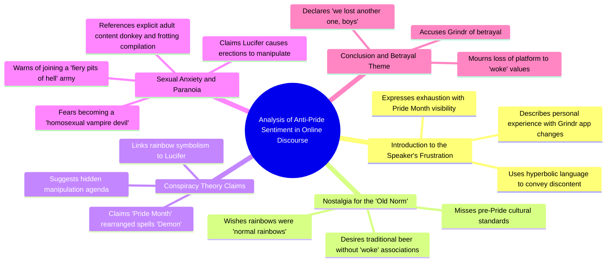

# Tired of Pride Month Rainbows on Grinder

> 🌐 **Read this in:** **English** · [中文](../../zh-CN/2026-06/tiktok-transcript-this-month-brings-me-great-distress-as-you-could-clearly-tel-cb8f.md)

> **Creator:** [@jamynon](https://www.tiktok.com/@jamynon) · **Views:** 1.6M · **Posted:** 2026-06-04 · **Niche:** other
>
> **TL;DR:** Opens with a relatable frustration that immediately flips into absurdity, hooking viewers with unexpected humor.

[Watch original video →](https://www.tiktok.com/t/ZP8s2uBVo/)

## Why This Went Viral

## Hook (first 3 seconds)
- **Verbatim opening line:** "It's only been one day and I'm already sick and tired of these rainbows everywhere."
- **Hook pattern:** Bold claim + emotional complaint (disgust/frustration) + immediate cultural reference (Pride Month)
- **Why it stops scrolling:** The line weaponizes a polarizing cultural flashpoint (Pride) with exaggerated, visceral disgust. It signals "I'm about to say something controversial/mocking" — viewers stop to see if the speaker is serious or satirical.

## Emotional Rhythm
1. **Anger/annoyance** (0:00–0:15) — "sick and tired of rainbows," "woke," "I miss the old norm" — builds a fake grievance tone.
2. **Confusion/curiosity** (0:15–0:25) — "spell out Pride Month… it says Demon" — introduces absurd pseudo-logic that makes viewer question if this is real.
3. **Escalating absurdity** (0:25–0:35) — "Lucifer is trying to jerk me off from the shadows" — the twist: this is satire, not sincerity. The tension snaps into comedy.
4. **Climax** (0:30–0:35) — "homosexual vampire devil… fiery pits of hell" — the most extreme, ridiculous claim. Peak laugh/recognition moment.
5. **Release** (0:35–end) — "We lost another one, boys" — punchline callback to internet meme culture. Resolves with knowing humor.

## Keyword Density
| Word/Phrase | Count | Driver |
|-------------|-------|--------|
| "rainbows" | 3 | Algorithmic (trending topic) + emotional (symbol of Pride) |
| "sick and tired" | 3 | Emotional pull (exaggerated frustration) |
| "woke" | 2 | Algorithmic (culture war keyword) + emotional (identity trigger) |
| "normal" | 2 | Emotional (nostalgia, "the old norm") |
| "demon" / "Lucifer" | 3 | Emotional (shock value, absurdity) |
| "Grinder" | 2 | Algorithmic (app name, searchable) |
| "penis" / "boner" | 2 | Emotional (taboo, surprise, viral shock) |

- **Algorithmic reach:** "rainbows," "woke," "Pride Month," "Grinder" — these are high-search-volume, trending, or controversial terms that platforms surface.
- **Emotional pull:** "sick and tired," "demon," "Lucifer," "penis" — these create visceral reactions (disgust, laughter, shock) that drive shares.

## Why It Spreads
1. **Double-bluff satire** — The video sounds like a genuine homophobic rant for the first 15 seconds, then pivots to absurdist comedy. Viewers who are fooled share it as "look at this crazy person," while those who catch the satire share it as "this is hilarious." Both reactions drive engagement.
2. **Shock escalation** — The line "Lucifer is trying to jerk me off from the shadows" is so specific and ridiculous it becomes unforgettable. Viewers quote it verbatim in comments and DMs, creating organic memes.
3. **Culture war bait** — The opening uses "woke," "Pride Month," "normal beer" — all trigger words that attract both supporters and opponents. Each side shares it for different reasons (mockery vs. validation), doubling the spread.
4. **Meme-ready punchline** — "We lost another one, boys" is a recognizable internet phrase that signals "this is a joke." It rewards viewers who stayed through the absurdity and makes the video feel like an inside joke.
5. **Taboo + humor** — Combining homophobic rhetoric with explicit sexual content ("penis," "boner") is risky but memorable. The taboo violation triggers automatic sharing ("you have to see this").

## What You Can Steal
1. **The "fake serious" opening** — Start with a believable, emotionally charged complaint that sounds real for 5–10 seconds. Then reveal it's satire with an absurd pivot. This creates a "gotcha" moment that viewers want to share to see others' reactions.
2. **Escalating absurdity ladder** — Take one premise (rainbows = demon) and push it to its most ridiculous conclusion (Lucifer jerking you off to turn you into a vampire). The further you go, the more shareable the punchline.
3. **Meme-coded sign-off** — End with a recognizable internet phrase ("We lost another one, boys") that signals "this is a joke" and gives viewers a ready-made caption for sharing. It turns your video into a template others can remix.

## Mind Map

## Full Transcript (Generated by [TokTranscript.com](https://toktranscript.com/?utm_source=github&utm_medium=breakdown&utm_campaign=tool_attribution))

> 📝 Transcripts on this page are auto-generated and show the first 60%. Want to transcribe any TikTok in 30 seconds and get the full version? [Try TokTranscript free →](https://toktranscript.com/?utm_source=github&utm_medium=breakdown&utm_campaign=transcript_cta)

It's only been one day and I'm already sick and tired of these rainbows everywhere. I wake up to check my favourite app, grinder, just to find out they went woke. No, this can't be! I am sick and tired of all this Pride Month stuff. I just want rainbows to be normal rainbows. I don't like the new norm. I miss the old norm. I wanna drink normal beer. I'm tired of everything being woke and I just wish there was an adult cartoon animated sitcom that echoed these exact same beliefs. And if you spell out Pride Month and put the two words together and split it down the middle, what does it say? Demon. And that's not a coincidence. Who else is a demon? Lucifer.

*[Read the full transcript on TokTranscript →](https://toktranscript.com/plaza/tiktok-transcript-this-month-brings-me-great-distress-as-you-could-clearly-tel-cb8f?utm_source=github&utm_medium=breakdown&utm_campaign=transcript_full)*

## Browse More

- All [other](../../by-niche/en/other.md) breakdowns
- All [Contrarian Complaint](../../by-pattern/en/hook-contrarian-complaint.md) examples

## Video Info

| | |
|---|---|
| Creator | [@jamynon](https://www.tiktok.com/@jamynon) |
| Original video | [https://www.tiktok.com/t/ZP8s2uBVo/](https://www.tiktok.com/t/ZP8s2uBVo/) |
| Original title | This month brings me great distress as you could clearly tell from my... |
| Views | 1.6M (1600000) |
| Posted | 2026-06-04 |
| Duration | 0s |
| Niche | `other` |
| Hook pattern | `Contrarian Complaint` |
| Original language | `en` |
| Available languages | en, zh-CN |
| Generated | 2026-06-05 by [TokTranscript](https://toktranscript.com/) |

---

*This breakdown is for educational analysis under fair use. Original video © [@jamynon](https://www.tiktok.com/@jamynon). All transcripts are auto-generated and may contain errors.*

*Want to analyze your own TikToks like this? [free TikTok transcript generator →](https://toktranscript.com/viral-breakdown?utm_source=github&utm_medium=breakdown&utm_campaign=footer_cta)*