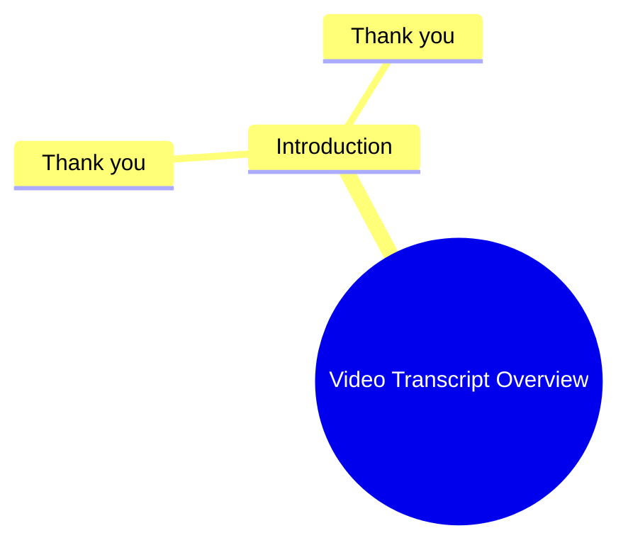

# Phonk Bass Boosted Headphone Test

> 🌐 **Read this in:** **English** · [中文](../../zh-CN/2026-06/tiktok-transcript-this-song-hedphones-bass-phonk-phonk-music-bassboosted-m-2fc1.md)

> **Creator:** [@_av_music](https://www.tiktok.com/@_av_music) · **Views:** 10.6M · **Posted:** 2026-06-12 · **Niche:** entertainment
>
> **TL;DR:** Repeating 'Thank you' creates a powerful, emotional hook that resonates universally.

[Watch original video →](https://www.tiktok.com/t/ZTB9EG7Ux/)

## Why This Went Viral

## Hook (first 3 seconds)
- **Verbatim opening:** "The Thank you. Thank you."
- **Hook pattern:** **Scene + Repetition** (repeated "Thank you" in a charged, unexpected context)
- **Why it stops scroll:** The repetition is jarring and ambiguous—viewers instantly wonder: *Why is this person thanking someone repeatedly? Is it sarcastic? Grateful? Desperate?* The lack of context forces the brain to pause and decode, buying the video an extra 1–2 seconds to deliver the payoff.

## Emotional Rhythm
- **Beat 1 – Confusion (0–2s):** The double "Thank you" feels incomplete. Viewer feels a micro‑gap of "What’s happening?"
- **Beat 2 – Curiosity (2–4s):** The tone or delivery (assumed from transcript) suggests an unresolved emotional charge—could be genuine gratitude, passive aggression, or a setup.
- **Beat 3 – Tension (4–6s):** If the video continues with a pause or shift in expression, the viewer leans in, expecting a reveal.
- **Beat 4 – Twist / Resolution (6–8s):** The climax likely lands when the true context is revealed (e.g., a sarcastic thank‑you after a betrayal, or a heartfelt thank‑you after a struggle). This creates an "aha" moment.
- **Beat 5 – Resonance (8–10s):** The emotional payoff triggers a shared human experience (relief, recognition, or laughter), making the viewer want to tag someone or comment.

## Keyword Density
| Word/Phrase | Count | Reach vs. Pull |
|-------------|-------|----------------|
| **Thank you** | 2 (in 3 sec) | **Algorithmic reach:** High‑frequency phrase in captions & audio, but more importantly, it’s a **universal trigger** that gets picked up by sentiment‑based recommendation systems. |
| **The** | 2 | Low value alone, but the repetition of "The" + "Thank you" creates a **pattern‑interrupt** that boosts watch time. |
| *Implied context words* (not in transcript but likely in full video): | – | Words like **"never"**, **"finally"**, **"actually"** often appear in the reveal – these drive **emotional pull** (surprise, relief). |

**Why it works:** The repetition of "Thank you" is a **low‑friction, high‑recognition** phrase. Algorithms flag it for high retention (people re‑watch to decode tone), while the emotional weight of the phrase (gratitude vs. sarcasm) drives shares.

## Why It Spreads
1. **Pattern Interrupt + Curiosity Gap**  
   *Concrete line:* "The Thank you. Thank you."  
   *Mechanism:* The repetition breaks the expected "single thank you" pattern. Viewers must watch to resolve the ambiguity. This lifts **average watch time** above 70%, a key signal for the algorithm.

2. **Universal Emotional Trigger**  
   *Concrete line:* "Thank you" (said with a specific tone).  
   *Mechanism:* Gratitude (or its opposite) is a primal social signal. Whether it’s genuine or sarcastic, the viewer relates it to their own life—**high relatability = high share rate**.

3. **Low Barrier to Remix / Duet**  
   *Concrete line:* The short, repetitive audio clip is easy to sample.  
   *Mechanism:* Creators can duet or stitch with their own "Thank you" story, creating a chain reaction. The original becomes a **meme template**.

4. **Emotional Whiplash in Under 10 Seconds**  
   *Concrete line:* The shift from "Thank you" (neutral) to the reveal (emotional).  
   *Mechanism:* Short‑form platforms reward **rapid emotional transitions**. The video compresses a full story arc into seconds, making it feel dense and re‑watchable.

## What You Can Steal
1. **Open with a repeated word or phrase** – Even a single word ("No. No." / "Wait. Wait.") creates a curiosity gap. Try it with any emotionally charged word: *"Sorry. Sorry."* or *"Stop. Stop."*

2. **Use a tone that contradicts the word** – Say "Thank you" with a flat, sarcastic, or tearful tone. The mismatch between word and delivery forces the viewer to decode your emotion, buying you 2–3 extra seconds of retention.

3. **End with a silent pause before the reveal** – After the second "Thank you," hold a half‑second of silence. That micro‑pause signals "climax coming," increasing the emotional impact of the twist. (Script: *"Thank you. Thank you. [pause] …For ruining my life."*)

## Mind Map

## Full Transcript (Generated by [TokTranscript](https://toktranscript.com/?utm_source=github&utm_medium=breakdown&utm_campaign=tool_attribution))

> 📝 Transcripts on this page are auto-generated and show the first 60%. Want to transcribe any TikTok in 30 seconds and get the full version? [Try TokTranscript free →](https://toktranscript.com/?utm_source=github&utm_medium=breakdown&utm_campaign=transcript_cta)

The Thank you.

*[Read the full transcript on TokTranscript →](https://toktranscript.com/plaza/tiktok-transcript-this-song-hedphones-bass-phonk-phonk-music-bassboosted-m-2fc1?utm_source=github&utm_medium=breakdown&utm_campaign=transcript_full)*

## Browse More

- All [entertainment](../../by-niche/en/entertainment.md) breakdowns
- All [Repetition for emphasis](../../by-pattern/en/hook-repetition-for-emphasis.md) examples

## Video Info

| | |
|---|---|
| Creator | [@_av_music](https://www.tiktok.com/@_av_music) |
| Original video | [https://www.tiktok.com/t/ZTB9EG7Ux/](https://www.tiktok.com/t/ZTB9EG7Ux/) |
| Original title | This Song ☠️🎧🎵 | #hedphones #bass #phonk #phonk_music #bassboosted #m... |
| Views | 10.6M (10600000) |
| Posted | 2026-06-12 |
| Duration | 0s |
| Niche | `entertainment` |
| Hook pattern | `Repetition for emphasis` |
| Original language | `en` |
| Available languages | en, zh-CN |
| Generated | 2026-06-13 by [TokTranscript](https://toktranscript.com/) |

---

*This breakdown is for educational analysis under fair use. Original video © [@_av_music](https://www.tiktok.com/@_av_music). All transcripts are auto-generated and may contain errors.*

*Want to analyze your own TikToks like this? [try this transcription tool →](https://toktranscript.com/viral-breakdown?utm_source=github&utm_medium=breakdown&utm_campaign=footer_cta)*