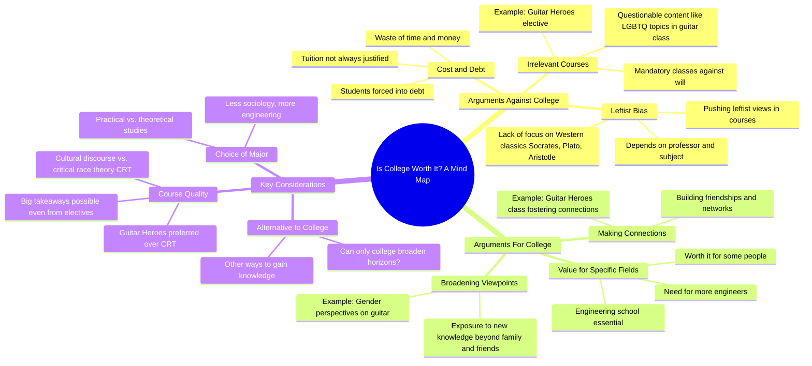

# College: Is It Entirely Useless for Growth?

> 🌐 **Read this in:** **English** · [中文](../../zh-CN/2026-06/tiktok-transcript-tiktok-video-7594956396702092557-7611.md)

> **Creator:** [@charliekirkdebateclips](https://www.tiktok.com/@charliekirkdebateclips) · **Views:** 733.7K · **Posted:** 2026-06-17 · **Niche:** other
>
> **TL;DR:** Directly challenges a common anti-college stance with a provocative question.

[Watch original video →](https://vt.tiktok.com/ZSQGevBWX/)

## Why This Went Viral

## Hook (first 3 seconds)
- **Verbatim opening:** "I've heard your opinions against college, and I want to ask if you think it's entirely useless."
- **Hook pattern:** **Question + Contrast** — directly challenges the audience's assumed stance (against college) by asking if they think it's *entirely* useless.
- **Why it stops scroll:** It frames the speaker as someone who has *listened* to the opposition, then pivots to a high-stakes binary (useless vs. not). This creates instant cognitive tension — viewers who have strong opinions on college *must* know if they're about to be validated or attacked.

## Emotional Rhythm
- **Beat 1 — Curiosity + Tension:** "I've heard your opinions against college... is it entirely useless?" — Viewer feels challenged, leans in.
- **Beat 2 — Intellectual framing:** "Can only college do that? Is it worth the cost?" — Raises two nuanced sub-questions, delaying resolution.
- **Beat 3 — Relatability + Agreement:** "How many of you have to take classes you consider a waste?" — Audience nods along; tension drops slightly.
- **Beat 4 — Surprise + Humor:** "Guitar Heroes? That's better than critical race theory, so I fully support." — Unexpected pivot into culture-war territory, spikes engagement.
- **Beat 5 — Escalation (climax):** "Do you think they're pushing leftist views...?" — Directly names the ideological tension. Viewer's emotional stakes spike.
- **Beat 6 — Resolution + Closure:** "Not always in college, unfortunately. Thank you. God bless you." — Ends on a gentle, almost pastoral note, releasing tension.

**Climax moment:** The question "Do you think they're pushing leftist views on us?" — this is where the video's core ideological friction surfaces.

## Keyword Density
| Keyword/Phrase | Frequency (approx.) | Function |
|---|---|---|
| "college" | 5 | **Algorithmic reach** — high-volume, evergreen search term |
| "useless / waste of time" | 3 | **Emotional pull** — triggers defensiveness or validation |
| "broadening" | 3 | **Emotional pull** — frames the debate as growth vs. stagnation |
| "connections" | 2 | **Emotional pull** — social proof / networking value |
| "leftist views / CRT" | 2 | **Algorithmic + emotional** — culture-war bait drives shares |
| "worth the cost" | 2 | **Algorithmic** — cost-benefit debate is highly searchable |
| "Guitar Heroes" | 2 | **Emotional pull** — specific, relatable, humorous example |
| "God bless you" | 1 | **Emotional pull** — signals identity (conservative/religious) |

**Drivers:** "college" + "leftist views" + "CRT" are the algorithmic fuel; "useless," "broadening," "connections" drive emotional resonance.

## Why It Spreads
1. **Culture-war bridge:** The speaker frames a hot-button issue (CRT, leftist bias in education) inside a *seemingly neutral* question ("Is college useless?"). This allows both sides to feel heard — anti-college viewers get validation, pro-college viewers get a nuanced defense. **Concrete line:** "That's better than critical race theory, so I fully support" — instantly polarizes and unites in one sentence.

2. **Relatable micro-conflict:** The audience member's "Guitar Heroes" example is so specific and absurd that it becomes a meme-ready moment. Viewers will screenshot or quote it. **Concrete line:** "It's under cultural discourse... how does this gender the guitar?"

3. **Socratic reversal:** The speaker doesn't attack — he asks permission ("Can I ask a question to the audience?"). This disarms hostility and makes viewers *want* to engage. **Concrete line:** "How many of you guys have to take classes that you consider a waste of time or money?"

4. **Identity signaling:** The closing "God bless you" is a low-key cultural flag. It tells conservative viewers "this person is on my team" without being overtly political. **Concrete line:** "Thank you. God bless you."

5. **Unresolved tension:** The video ends without a definitive answer — "Not always in college, unfortunately." This leaves the debate open, encouraging comments and shares. **Concrete line:** "Are you guys traditionally studying deeply about Socrates, Plato, and Aristotle? Not always in college, unfortunately."

## What You Can Steal
1. **The "Permission" Pivot:** Before asking a loaded question, get verbal buy-in ("Can I ask a question to the audience?"). This makes viewers feel respected and lowers their guard. *Apply:* In your next video, say "I want to ask you something — is that okay?" before dropping a controversial take.

2. **The Specific Absurdity Trap:** Use a hyper-specific, slightly ridiculous example (like "Guitar Heroes") to make a larger point. It becomes a shareable soundbite. *Apply:* Instead of saying "some classes are useless," name a real, weird course title.

3. **The Soft Exit with Identity Tag:** End with a phrase that subtly signals your tribe ("God bless you," "Keep grinding," "Stay curious"). This creates emotional closure and makes viewers feel they've connected with someone like them. *Apply:* Choose one signature sign-off and use it consistently.

## Mind Map

## Full Transcript (Generated by [try this transcription tool](https://toktranscript.com/?utm_source=github&utm_medium=breakdown&utm_campaign=tool_attribution))

> 📝 Transcripts on this page are auto-generated and show the first 60%. Want to transcribe any TikTok in 30 seconds and get the full version? [Try TokTranscript free →](https://toktranscript.com/?utm_source=github&utm_medium=breakdown&utm_campaign=transcript_cta)

I've heard your opinions against college, and I want to ask if you think it's entirely useless. If we are making connections and broadening our current viewpoints and opinions with new knowledge that we were not taught by family and friends, it can. The question is, can only college do that? Hmm. That's the operative question. And secondly, is it worth the cost? For some people, of course college is worth it. I mean, do you guys have an engineering school here? Yes, yes. I mean, we. We. We obviously need more engineers. Um, I think we need, uh, a lot less people studying sociology, let me put it that way. Understandable. So, can I ask a question to the audience? I'm curious, how many of you guys have to take classes that you consider a waste of time or money? I do. Yeah. I will say that. So, yeah, that's. That's against your will. Uh huh. People have to go into debt then. Yeah. So you gotta kind of wrestle with that, right? Yeah. But I feel like there are still big takeaways that you can take from this class. Like, for example, one of my elective classes is Guitar Heroes, which that has nothing to do with neuroscience, but I'm enjoying every single second of it, and I've already made friends and can in larger connections that are. Along with my major. Guitar heroes? Yes. It's. Wow. Yeah. It's about history of guitarists, and, you know, they even I remember earlier, was that a. Was that an elective or was that mandatory? Is that core?

*[Read the full transcript on TokTranscript →](https://toktranscript.com/plaza/tiktok-transcript-tiktok-video-7594956396702092557-7611?utm_source=github&utm_medium=breakdown&utm_campaign=transcript_full)*

## Browse More

- All [other](../../by-niche/en/other.md) breakdowns
- All [Challenge + Question](../../by-pattern/en/hook-challenge-question.md) examples

## Video Info

| | |
|---|---|
| Creator | [@charliekirkdebateclips](https://www.tiktok.com/@charliekirkdebateclips) |
| Original video | [https://vt.tiktok.com/ZSQGevBWX/](https://vt.tiktok.com/ZSQGevBWX/) |
| Original title | TikTok video #7594956396702092557 |
| Views | 733.7K (733700) |
| Posted | 2026-06-17 |
| Duration | 0s |
| Niche | `other` |
| Hook pattern | `Challenge + Question` |
| Original language | `en` |
| Available languages | en, zh-CN |
| Generated | 2026-06-18 by [TokTranscript](https://toktranscript.com/) |

---

*This breakdown is for educational analysis under fair use. Original video © [@charliekirkdebateclips](https://www.tiktok.com/@charliekirkdebateclips). All transcripts are auto-generated and may contain errors.*

*Want to analyze your own TikToks like this? [free TikTok transcript generator →](https://toktranscript.com/viral-breakdown?utm_source=github&utm_medium=breakdown&utm_campaign=footer_cta)*