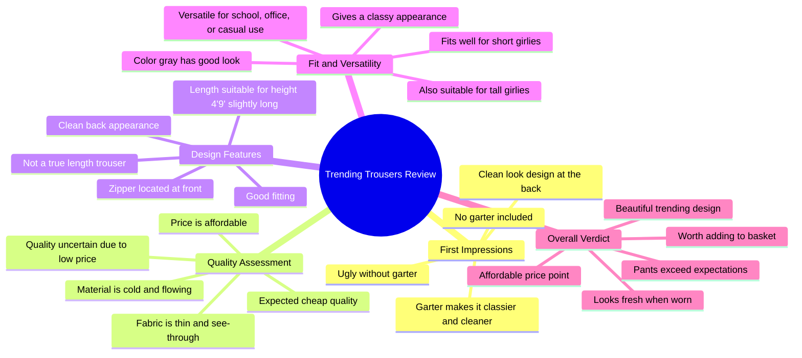

# Trending Loose Pants For Women

> 🌐 **Read this in:** **English** · [中文](../../zh-CN/2026-06/tiktok-transcript-trending-loose-pants-for-women-0616.md)

> **Creator:** [@itsme.gela](https://www.tiktok.com/@itsme.gela) · **Views:** 5.8M · **Posted:** 2026-06-20 · **Niche:** other
>
> **TL;DR:** Opens with a provocative question that challenges viewers' expectations and hooks curiosity.

[Watch original video →](https://www.tiktok.com/@itsme.gela/video/7651590801629220104)

## Why This Went Viral

## Hook (first 3 seconds)
- **Verbatim opening line:** "Is it really cuter? Trending Trousers to strength The class he used to be There is another new one Trousers trending now Did you think I would be beaten"
- **Hook pattern:** **Question + Contrast** (a direct question challenging the viewer's assumption, followed by a contrast between "trending" and "class")
- **Why it stops scrolling:** The question "Is it really cuter?" immediately creates doubt and curiosity. It challenges the viewer's own belief about the trending item, making them want to see the verdict.

## Emotional Rhythm
- **Beat 1 – Curiosity / Skepticism:** "Is it really cuter?" — viewer is prompted to question the trend.
- **Beat 2 – Tension / Anticipation:** "Did you think I would be beaten? When it's really cheap you get checked out" — sets up a conflict between price and quality.
- **Beat 3 – Surprise / Twist:** "The first thing I noticed here is that he doesn't have a garter. And that's what I'm telling you is ugly" — a specific, unexpected flaw is revealed.
- **Beat 4 – Relief / Validation:** "In the back, I will also open the one He designed the clean look... For his price, the one is fine" — the critique softens, offering a balanced view.
- **Beat 5 – Climax / Resonance:** "The pants really failed To look I'm class... I get why you guys are trending She is really beautiful" — the final verdict is given: the product is good despite initial skepticism, creating a satisfying resolution.
- **Beat 6 – Call to Action (implicit):** "I just dip it in my yellow basket" — signals purchase intent, inviting the viewer to do the same.

## Keyword Density
- **"Trousers"** (repeated 8+ times) — **Algorithmic reach:** High-frequency, product-specific keyword that triggers fashion/trending tags.
- **"Cheap" / "affordable"** (repeated 4+ times) — **Emotional pull:** Triggers value-seeking and price-conscious viewers.
- **"Class" / "classier"** (repeated 5+ times) — **Emotional pull:** Aspirational language that appeals to status and style.
- **"Garter" / "garterizing"** (repeated 3+ times) — **Algorithmic reach:** Unique, niche term that differentiates the video from generic reviews.
- **"Fit" / "fitting"** (repeated 4+ times) — **Emotional pull:** Addresses a common pain point (fit for short/tall girls).
- **"Trending"** (repeated 3+ times) — **Algorithmic reach:** High-volume, time-sensitive keyword that boosts discoverability.
- **"Clean"** (repeated 3+ times) — **Emotional pull:** Positive aesthetic descriptor that reinforces the product's appeal.
- **"Height" / "short girlies" / "tall girlies"** (repeated 2+ times) — **Emotional pull:** Inclusive language that builds community and relatability.

## Why It Spreads
1. **Skepticism-to-Validation Arc:** The video starts with a doubt ("Is it really cuter?") and ends with a positive verdict ("She is really beautiful"). This arc mirrors the viewer's own internal debate, making the resolution satisfying and shareable.
2. **Specific, Unexpected Criticism:** "He doesn't have a garter... that's what I'm telling you is ugly" — this is a highly specific, niche complaint that feels authentic and expert. It makes the video feel like a real review, not a paid ad.
3. **Inclusive Fit Language:** "He still fits my height Four nine is just a bit long... for short girlies At tsaka tall girlies" — directly addresses a common pain point (fit for petite and tall women), expanding the audience and encouraging shares among those groups.
4. **Price-Quality Tension:** "When it's really cheap you get checked out... For his price, the one is fine" — the creator acknowledges the skepticism around cheap items, then validates the purchase. This builds trust and reduces buyer's remorse, making viewers more likely to buy and share.
5. **Actionable Call to Purchase:** "I just dip it in my yellow basket" — a simple, visual, and memorable phrase that signals the creator's intent to buy. This acts as a social proof trigger, prompting viewers to do the same.

## What You Can Steal
1. **Start with a Skeptical Question:** Open with a direct, challenging question ("Is it really cuter?") that creates doubt and forces the viewer to watch for the answer. This works for any product review or trend commentary.
2. **Use a Specific, Niche Flaw to Build Credibility:** Instead of generic praise, point out a unique, unexpected flaw (e.g., "no garter"). This makes you seem like an expert and builds trust, even if you ultimately recommend the product.
3. **Address a Specific Pain Point for Your Audience:** Explicitly mention a common problem (e.g., fit for short/tall girls) and show how the product solves it. This makes the video highly relatable and shareable within that niche community.

## Mind Map

## Full Transcript (Generated by [free TikTok transcript generator](https://toktranscript.com/?utm_source=github&utm_medium=breakdown&utm_campaign=tool_attribution))

> 📝 Transcripts on this page are auto-generated and show the first 60%. Want to transcribe any TikTok in 30 seconds and get the full version? [Try TokTranscript free →](https://toktranscript.com/?utm_source=github&utm_medium=breakdown&utm_campaign=transcript_cta)

Is it really cuter? Trending Trousers to strength The class he used to be There is another new one Trousers trending now Did you think I would be beaten When it's really cheap you get checked out You know it's cheaper because on a horse One take one so that's what I chinecked out And since he's cheap I'm just not sure His quality This is what gray looks like The first thing I noticed here is that he doesn't have a garter And that's what I'm telling you is ugly Really when garterizing because there is no garter The classier the cleaner In the back, I will also open the one He designed the clean look For his price, the one is fine Cloth because he can't see Through because he expected cheap I really am going to be He is thin to see So through the His zipper is here ahead and te The beauty of Fitting And this is his back, isn't it just clean And in the conversation at length He still fits my height Four nine is just a bit long He 

*[Read the full transcript on TokTranscript →](https://toktranscript.com/plaza/tiktok-transcript-trending-loose-pants-for-women-0616?utm_source=github&utm_medium=breakdown&utm_campaign=transcript_full)*

## Browse More

- All [other](../../by-niche/en/other.md) breakdowns
- All [Rhetorical Question](../../by-pattern/en/hook-rhetorical-question.md) examples

## Video Info

| | |
|---|---|
| Creator | [@itsme.gela](https://www.tiktok.com/@itsme.gela) |
| Original video | [https://www.tiktok.com/@itsme.gela/video/7651590801629220104](https://www.tiktok.com/@itsme.gela/video/7651590801629220104) |
| Original title | Trending Loose Pants For Women |
| Views | 5.8M (5800000) |
| Posted | 2026-06-20 |
| Duration | 0s |
| Niche | `other` |
| Hook pattern | `Rhetorical Question` |
| Original language | `en` |
| Available languages | en, zh-CN |
| Generated | 2026-06-21 by [TokTranscript](https://toktranscript.com/) |

---

*This breakdown is for educational analysis under fair use. Original video © [@itsme.gela](https://www.tiktok.com/@itsme.gela). All transcripts are auto-generated and may contain errors.*

*Want to analyze your own TikToks like this? [analyze your own TikToks →](https://toktranscript.com/viral-breakdown?utm_source=github&utm_medium=breakdown&utm_campaign=footer_cta)*