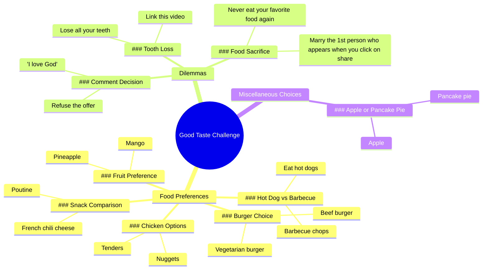

# Beef Burger or Veggie Burger? Food Preference Quiz

> 🌐 **Read this in:** **English** · [中文](../../zh-CN/2026-06/tiktok-transcript-tu-pr-f-res-quoi-tupreferes-quiz-tiktokfrance-nourriture-fr-3d22.md)

> **Creator:** [@la_dalle_food](https://www.tiktok.com/@la_dalle_food) · **Views:** 481.9K · **Posted:** 2026-06-03 · **Niche:** food
>
> **TL;DR:** Challenges the viewer's taste, creating immediate personal investment.

[Watch original video →](https://vm.tiktok.com/ZS92mBLBVx8w1-PSMJw/ تتم مشاركة هذا المنشور عبر TikTok Lite. نزّل TikTok Lite للاستمتاع بمزيد من المنشورات: https://www.tiktok.com/tiktoklite)

## Why This Went Viral

## Hook (first 3 seconds)
- **Verbatim opening line:** "we'll see if you have good taste"
- **Hook pattern:** Bold claim / challenge
- **Why it stops scrolling:** It issues a direct, personal challenge ("we'll see if *you* have good taste"), creating instant FOMO and ego involvement. Viewers feel compelled to prove themselves, which forces them to stay and engage.

## Emotional Rhythm
1. **Curiosity + challenge** (0–3s): "we'll see if you have good taste" — ego is on the line.
2. **Playful tension** (3–15s): Rapid-fire binary choices (burger vs. veggie, pineapple vs. mango) — viewer is mentally choosing, building micro-stakes.
3. **Escalating absurdity** (15–25s): "lose all your teeth or link this video" — twist introduces high-stakes humor and social pressure.
4. **Climax** (25–28s): "marry the 1st person who appears when you click on share" — the most outrageous, shareable threat lands.
5. **Relief + reward** (28–30s): Returns to a safe, easy choice ("tenders or nuggets") — emotional cooldown that feels satisfying.

## Keyword Density
| Word/Phrase | Count | Function |
|-------------|-------|----------|
| "or" | 10 | Structural — drives binary choice format (algorithm-friendly pattern) |
| "prefer" / "prefer 1" | 2 | Emotional pull — triggers personal identity |
| "eat" | 3 | Emotional pull — food is universally relatable |
| "lose all your teeth" | 1 | Viral hook — absurd, high-stakes, memorable |
| "link this video" | 1 | Direct CTA — algorithmic reach driver (shares) |
| "marry the 1st person" | 1 | Social pressure — emotional pull + share incentive |
| "comment" | 1 | Direct CTA — drives engagement metrics |
| "refuse the offer" | 1 | Emotional pull — creates tension/choice |

**Algorithm drivers:** "or" (pattern recognition), "link this video" (share signal), "comment" (engagement signal).  
**Emotional pull:** "lose all your teeth," "marry the 1st person," "refuse the offer" — absurd, high-stakes, memorable.

## Why It Spreads
1. **Binary choice format forces mental participation.** Every "or" creates a micro-decision that keeps viewers locked in mentally — they can't just watch passively. *Transcript line: "do you prefer 1 beef burger or 1 vegetarian burger"*
2. **Escalating absurdity creates shareable shock value.** The threat "lose all your teeth" is so ridiculous it becomes memorable and funny, making viewers want to show friends. *Transcript line: "lose all your teeth or link this video"*
3. **Embedded social pressure act as a viral loop.** "Marry the 1st person who appears when you click on share" directly forces a share action — it's a self-fulfilling viral mechanism. *Transcript line: "marry the 1st person who appears when you click on share"*
4. **Low-stakes start, high-stakes middle, safe ending.** The emotional arc keeps viewers from clicking away early (easy choices) while the absurd middle creates the share impulse, and the safe ending feels like a reward. *Transcript line: "pineapple or mango" (low) → "lose all your teeth" (high) → "tenders or nuggets" (safe)*
5. **Direct engagement CTA is embedded in the content itself.** "Comment I love God or refuse the offer" forces viewers to type something — any comment boosts the algorithm. *Transcript line: "comment I love God or refuse the offer"*

## What You Can Steal
1. **The "binary choice + escalation" structure.** Start with 3–5 harmless, relatable choices (food, colors, simple preferences) then suddenly spike to absurd, high-stakes threats. This creates a surprise twist that triggers the share impulse.
2. **Embed a share CTA inside a threat.** Instead of saying "share this video," say "lose all your teeth or link this video" — the threat makes the action feel urgent and funny, not salesy.
3. **End with a safe, easy choice.** After the absurd climax, return to a low-stakes binary (tenders vs. nuggets). This gives the viewer a satisfying emotional release and makes the whole experience feel playful, not aggressive.

## Mind Map

## Full Transcript (Generated by [TokTranscript.com](https://toktranscript.com/?utm_source=github&utm_medium=breakdown&utm_campaign=tool_attribution))

> 📝 Transcripts on this page are auto-generated and show the first 60%. Want to transcribe any TikTok in 30 seconds and get the full version? [Try TokTranscript free →](https://toktranscript.com/?utm_source=github&utm_medium=breakdown&utm_campaign=transcript_cta)

we'll see if you have good taste do you prefer 1 beef burger or 1 vegetarian burger pineapple or mango French chili cheese or Putin comment I love God or refuse the offer eat hot dogs or barbecue chops lose all your teeth or link 

*[Read the full transcript on TokTranscript →](https://toktranscript.com/plaza/tiktok-transcript-tu-pr-f-res-quoi-tupreferes-quiz-tiktokfrance-nourriture-fr-3d22?utm_source=github&utm_medium=breakdown&utm_campaign=transcript_full)*

## Browse More

- All [food](../../by-niche/en/food.md) breakdowns
- All [Challenge/Test](../../by-pattern/en/hook-challenge-test.md) examples

## Video Info

| | |
|---|---|
| Creator | [@la_dalle_food](https://www.tiktok.com/@la_dalle_food) |
| Original video | [https://vm.tiktok.com/ZS92mBLBVx8w1-PSMJw/ تتم مشاركة هذا المنشور عبر TikTok Lite. نزّل TikTok Lite للاستمتاع بمزيد من المنشورات: https://www.tiktok.com/tiktoklite](https://vm.tiktok.com/ZS92mBLBVx8w1-PSMJw/ تتم مشاركة هذا المنشور عبر TikTok Lite. نزّل TikTok Lite للاستمتاع بمزيد من المنشورات: https://www.tiktok.com/tiktoklite) |
| Original title | tu préfères quoi ? #tupreferes #quiz #tiktokfrance🇨🇵 #nourriture #fr  |
| Views | 481.9K (481900) |
| Posted | 2026-06-03 |
| Duration | 0s |
| Niche | `food` |
| Hook pattern | `Challenge/Test` |
| Original language | `en` |
| Available languages | en, zh-CN |
| Generated | 2026-06-06 by [TokTranscript](https://toktranscript.com/) |

---

*This breakdown is for educational analysis under fair use. Original video © [@la_dalle_food](https://www.tiktok.com/@la_dalle_food). All transcripts are auto-generated and may contain errors.*

*Want to analyze your own TikToks like this? [TokTranscript →](https://toktranscript.com/viral-breakdown?utm_source=github&utm_medium=breakdown&utm_campaign=footer_cta)*