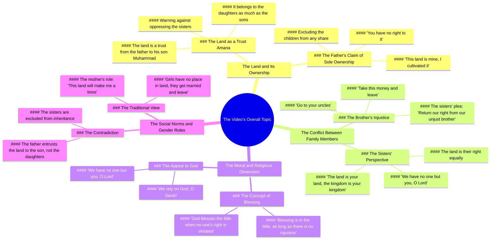

# Father Abandons Will and Trust, Chooses Money Over Daughters

> 🌐 **Read this in:** **English** · [中文](../../zh-CN/2026-06/tiktok-transcript-video-1e53.md)

> **Creator:** [@dima.storys](https://www.tiktok.com/@dima.storys) · **Views:** 576.6K · **Posted:** 2026-06-18 · **Niche:** other
>
> **TL;DR:** Opens with a powerful moral charge, framing sisters as a sacred trust, immediately engaging viewers with a universal ethical dilemma.

[Watch original video →](https://www.tiktok.com/@dima.storys/video/7644265026403962145)

## Why This Went Viral

## Hook (first 3 seconds)
- **Verbatim opening:** "اخواتك البنات امانة في ايدك" (Your sisters are a trust in your hands)
- **Hook pattern:** **Moral/emotional claim** — a direct, heavy ethical statement framed as a paternal warning.
- **Why it stops scrolling:** It weaponizes a deeply ingrained cultural value (honor, protection of sisters) and immediately signals a high-stakes family conflict. The viewer's brain registers: *This is about justice, betrayal, or a fight for inheritance* — a universal emotional trigger.

## Emotional Rhythm
1. **Curiosity + Tension** — "اخواتك البنات امانة في ايدك" sets up a moral duty.
2. **Contrast / Injustice** — "الارض دي حقهم زي ما هي حقك" (the land is their right as much as yours) introduces unfairness.
3. **Escalation (Anger)** — "اوعى تظلمهم يا ابني" (don't oppress them, my son) → paternal authority + threat.
4. **Resonance (Sister's voice)** — "البنات ما لهمش في الارض يتجوزو ويغورو" (girls have no right to land, they get married and disappear) — a raw, painful stereotype.
5. **Climax (Confrontation)** — "الارض دي بتاعتي انا" (this land is mine) — brother claims ownership, triggering the core conflict.
6. **Twist (Plea to God)** — "يا رب ما لناش غيرك" (Oh God, we have none but You) — shifts from anger to desperation, creating emotional release.
7. **Resolution (Moral lesson)** — "ربنا بيبارك في القليل طالما ما فيش فيه حق حد" (God blesses little as long as it's not stolen) — closes with a religious-ethical punch.

**Climax moment:** The brother's defiant "الارض دي كلها بتاعتي ما حدش هياخد مني جنيه واحد" (this land is all mine, no one takes a single pound from me).

## Keyword Density
| Word/Phrase | Frequency & Role |
|-------------|------------------|
| **الارض** (the land) | Highest repetition — drives **algorithmic keyword density** (topic: inheritance/property dispute) |
| **حق** (right) | Repeated in moral context — **emotional pull** (justice/injustice) |
| **بتاعتي/بتاعك** (mine/yours) | Ownership phrases — **algorithmic + emotional** (conflict marker) |
| **امانة** (trust) | Key moral frame — **emotional resonance** (cultural/religious duty) |
| **ربنا** (God) | Used at emotional peak — **algorithmic reach** (religious content) + **emotional authority** |
| **اخواتك/اخونا** (sisters/brother) | Family terms — **emotional pull** (sibling betrayal) |
| **ظلم** (oppression) | Strong negative charge — **emotional trigger** (injustice) |
| **فلوس** (money) | Practical stake — **algorithmic** (financial dispute content) |

**Algorithmic drivers:** الارض, حق, فلوس, ربنا — high search/trend volume in Arabic family/legal drama content.

**Emotional drivers:** امانة, ظلم, اخواتك, بتاعتي — trigger empathy, anger, and moral outrage.

## Why It Spreads
1. **Universal family conflict + specific cultural frame** — The transcript captures a real inheritance dispute between siblings, which resonates across the Arab world (and beyond). The line "البنات ما لهمش في الارض يتجوزو ويغورو" is a raw, controversial gender stereotype that sparks immediate debate and shares.
2. **Moral high ground + religious closure** — The video ends with a religious moral ("ربنا بيبارك في القليل طالما ما فيش فيه حق حد"), which provides emotional resolution and makes it shareable as a "lesson" or "reminder." Viewers tag friends/family to spread the message.
3. **Dual perspective (victim vs. villain)** — The transcript includes both the sister's plea and the brother's defiance. This creates a **"pick a side" dynamic** — viewers engage in comments, argue, and share to prove their stance.
4. **High emotional stakes + cliffhanger** — The climax ("الارض دي كلها بتاعتي ما حدش هياخد مني جنيه واحد") is a punchy, quotable line that can be clipped as a standalone hook. It triggers anger and sympathy, driving shares.
5. **Relatable life scenario** — Inheritance disputes are a near-universal experience in many cultures. The specific "sisters vs. brother" angle is a hot-button issue that guarantees emotional investment and comment wars.

## What You Can Steal
1. **Open with a loaded moral statement** — Don't start with "Hi guys." Start with a sentence that implies a broken trust or a moral duty. Example: "Your parents' savings are not your inheritance — they're a trust." This forces the viewer to stop and think.
2. **Use a "victim vs. villain" structure** — Give one character a clear, sympathetic voice (the sister pleading for her right) and another a defiant, selfish line (the brother claiming ownership). This creates instant conflict and drives engagement (comments, shares, tagging).
3. **End with a religious or ethical punchline** — Even if your content isn't religious, close with a universal moral lesson that feels final and wise. Example: "Money earned through injustice never lasts." This gives viewers a reason to share the video as a "lesson" or "reminder" to others.

## Mind Map

## Full Transcript (Generated by [TokTranscript](https://toktranscript.com/?utm_source=github&utm_medium=breakdown&utm_campaign=tool_attribution))

> 📝 Transcripts on this page are auto-generated and show the first 60%. Want to transcribe any TikTok in 30 seconds and get the full version? [Try TokTranscript free →](https://toktranscript.com/?utm_source=github&utm_medium=breakdown&utm_campaign=transcript_cta)

اخواتك البنات امانة في ايدك الارض دي حقهم زي ما هي حقك بالضبط اوعى تظلمهم يا ابني الارض دي هي اللي هتخليني باشا البنات ما لهمش في الارض يتجوزو ويغورو خدو الفلوس دي استدرو نفسكم بيها الارض دي بتاعتي انا انا اللي شهيت فيها وكبرتها وانتو ما لكوش فيها حاجة هي دي الامانة اللي بابا استامنك عليها يا محمد مش عايز اشوف وشكم هنا تاني الشقة دي بتاعتي روحو 

*[Read the full transcript on TokTranscript →](https://toktranscript.com/plaza/tiktok-transcript-video-1e53?utm_source=github&utm_medium=breakdown&utm_campaign=transcript_full)*

## Browse More

- All [other](../../by-niche/en/other.md) breakdowns
- All [Moral Responsibility](../../by-pattern/en/hook-moral-responsibility.md) examples

## Video Info

| | |
|---|---|
| Creator | [@dima.storys](https://www.tiktok.com/@dima.storys) |
| Original video | [https://www.tiktok.com/@dima.storys/video/7644265026403962145](https://www.tiktok.com/@dima.storys/video/7644265026403962145) |
| Original title | الأب ساب الوصية والأمانة.. وهو اختار طريق تاني خالص وفضل الفلوس والأر... |
| Views | 576.6K (576600) |
| Posted | 2026-06-18 |
| Duration | 0s |
| Niche | `other` |
| Hook pattern | `Moral Responsibility` |
| Original language | `en` |
| Available languages | en, zh-CN |
| Generated | 2026-06-19 by [TokTranscript](https://toktranscript.com/) |

---

*This breakdown is for educational analysis under fair use. Original video © [@dima.storys](https://www.tiktok.com/@dima.storys). All transcripts are auto-generated and may contain errors.*

*Want to analyze your own TikToks like this? [TokTranscript →](https://toktranscript.com/viral-breakdown?utm_source=github&utm_medium=breakdown&utm_campaign=footer_cta)*