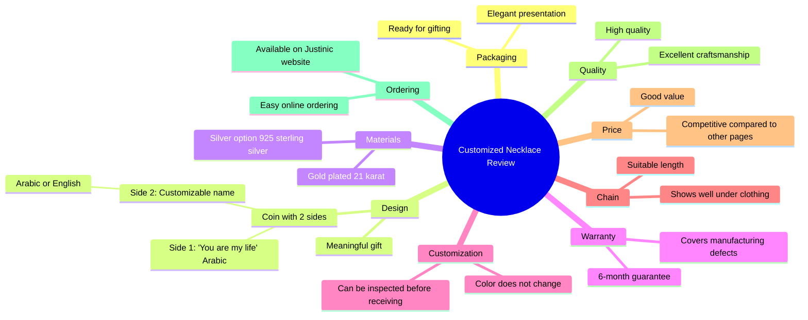

# Customized Necklace Gift With Two-Sided Coin Design

> 🌐 **Read this in:** **English** · [中文](../../zh-CN/2026-06/tiktok-transcript-video-6676.md)

> **Creator:** [@Just Uniques](https://www.tiktok.com/@Just Uniques) · **Views:** 337.3K · **Posted:** 2026-06-07 · **Niche:** other
>
> **TL;DR:** Opens with a strong superlative claim about the necklace being one of the best customized ones, immediately grabbing attention.

[Watch original video →](https://www.facebook.com/share/r/1HQ2H7of9d/)

## Why This Went Viral

Here is the viral breakdown of the provided Arabic transcript.

## Hook (first 3 seconds)
- **Verbatim:** "دي تقريبا من أحلى النكلس الـ Customized اللي عملتها في حياته" (This is probably one of the most beautiful customized necklaces I have ever made in my life).
- **Hook Pattern:** **Bold Claim** (Superlative: "one of the most beautiful").
- **Why it stops scrolling:** The speaker makes a definitive, high-stakes claim about quality. Viewers immediately want to see the object that earned this extreme praise, creating instant visual curiosity.

## Emotional Rhythm
- **Beat 1: Curiosity (0–3s):** The bold claim about the necklace’s beauty.
- **Beat 2: Anticipation (3–8s):** Unboxing/packaging reveal ("لم بتيجي في الـ Packaging ده").
- **Beat 3: Emotional Resonance (8–15s):** The "Coin 2 Sides" design is revealed, one side says "You are my life" (انت عمري). This is the **twist**—it shifts from product review to sentimental value.
- **Beat 4: Trust & Relief (15–25s):** Technical specs (21k gold, 925 silver, 6-month warranty, adjustable). This calms the viewer’s fear of poor quality.
- **Beat 5: Validation & Call-to-Action (25–30s):** Price comparison to competitors, then final endorsement ("حلوة وده شجعني ان انا طلبها"). The **climax** is the emotional "انت عمري" reveal, not the price.

## Keyword Density
- **Strongest repeated words/phrases:**
    - **"دهب عيار 21" / "فضة عيار 925"** (Gold 21k / Silver 925): Drives **algorithmic reach** (high-intent search terms for luxury buyers).
    - **"Customized" / "الاسم"** (Customized / Name): Drives **emotional pull** (personalization = high value).
    - **"هدية meaningful"** (Meaningful gift): Drives **emotional pull** (gifting context).
    - **"جودة" / "الحفرة تحفة"** (Quality / Masterpiece): Drives **trust** (reduces purchase anxiety).
    - **"سايد" / "Coin 2 Sides"** (Side / Coin 2 Sides): Drives **visual uniqueness** (the specific design feature).
    - **"Price" / "comparing"** (Price / Comparing): Drives **algorithmic reach** (comparison shopping queries).

## Why It Spreads
- **1. The "Satisfying Unboxing" + Emotional Payoff:** The video starts with a standard unboxing (high retention for ASMR/satisfaction viewers) but then reveals a personalized message ("انت عمري"). This hybrid format appeals to both *aesthetic* and *sentimental* audiences.
- **2. The "Gift-Ready" Framing:** The line "عشان لو عايزك يبيع ديه لحد بقى جاهزة على التقديم على طول" (so if you want to sell it to someone, it’s ready to present immediately) directly targets viewers who are *looking for a gift*. This makes the video a solution to a problem, not just a product showcase.
- **3. Price Comparison as Social Proof:** "الـ price بتاعها حلو قوي comparing لـ pages تانية كتير" (The price is very good compared to many other pages). This is a classic **value-hacking** tactic. It reduces the "should I buy this?" friction by explicitly stating it’s cheaper than competitors.
- **4. The "Trust Stack":** The speaker layers multiple trust signals in a short time: warranty (6 months), material purity (21k/925), customization (name), and adjustable length. This removes all objections before the viewer can think of them.
- **5. The "You Are My Life" Twist:** The most viral moment is the specific engraving "انت عمري". This is a highly shareable, romantic line. Viewers will tag their partners in the comments, triggering the algorithm.

## What You Can Steal
- **1. Lead with a Superlative:** Start your video with "This is the most beautiful / best / unique [product] I have ever [action]." It forces the viewer to stay and verify your claim.
- **2. The "Gift-Ready" Script:** Explicitly state that the item is "ready to present" or "arrives in a gift box." This doubles your potential audience from "people who want it" to "people who need to give it."
- **3. The "Price Comparison" Close:** End your video by saying "And the price is great compared to [competitor type]." This is a direct, low-effort way to trigger a purchase decision by removing price anxiety.

## Mind Map

## Full Transcript (Generated by [TokTranscript.com](https://toktranscript.com/?utm_source=github&utm_medium=breakdown&utm_campaign=tool_attribution))

> 📝 Transcripts on this page are auto-generated and show the first 60%. Want to transcribe any TikTok in 30 seconds and get the full version? [Try TokTranscript free →](https://toktranscript.com/?utm_source=github&utm_medium=breakdown&utm_campaign=transcript_cta)

دي تقريبا من أحلى النكلس الـ Customized اللي عملتها في حياته ولم بتيجي في الـ Packaging ده عشان لو عايزك يبيع ديه لحد بقى جاهزة على التقديم على طول الـ Design بتاعها عجبني قوي عشان الـ Coin 2 Sides سايد بيهم مكتوب انت عمري والـ Sides التاني تقداري تكتب الاسم اللي انت عايزيه سواء بالعربي أو بالإنجلش فحسيتها بجده هتكون هدية meaningful جدا النكلس بكون مطلية دهب عيار 21 ومتاح كمان ان انت تطليها فضة عيار 925 احلى حاجة عندهم ان هما عندهم دمون 6 شهور ضد اي عيوب صنعها متاح كمان ان انت تعيني الح

*[Read the full transcript on TokTranscript →](https://toktranscript.com/plaza/tiktok-transcript-video-6676?utm_source=github&utm_medium=breakdown&utm_campaign=transcript_full)*

## Browse More

- All [other](../../by-niche/en/other.md) breakdowns
- All [Superlative + Specific](../../by-pattern/en/hook-superlative-specific.md) examples

## Video Info

| | |
|---|---|
| Creator | [@Just Uniques](https://www.tiktok.com/@Just Uniques) |
| Original video | [https://www.facebook.com/share/r/1HQ2H7of9d/](https://www.facebook.com/share/r/1HQ2H7of9d/) |
| Original title | سلسلتك انتي محدش تاني لابسها🥰 |
| Views | 337.3K (337301) |
| Posted | 2026-06-07 |
| Duration | 0s |
| Niche | `other` |
| Hook pattern | `Superlative + Specific` |
| Original language | `en` |
| Available languages | en, zh-CN |
| Generated | 2026-06-08 by [TokTranscript](https://toktranscript.com/) |

---

*This breakdown is for educational analysis under fair use. Original video © [@Just Uniques](https://www.tiktok.com/@Just Uniques). All transcripts are auto-generated and may contain errors.*

*Want to analyze your own TikToks like this? [TokTranscript.com →](https://toktranscript.com/viral-breakdown?utm_source=github&utm_medium=breakdown&utm_campaign=footer_cta)*